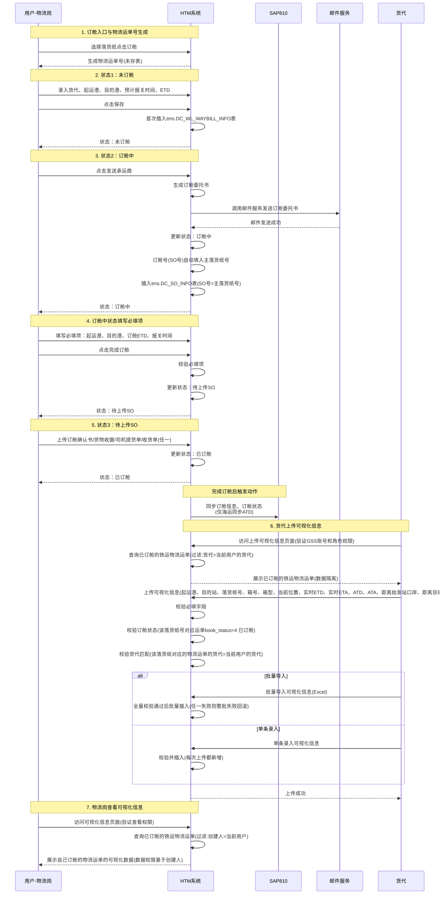
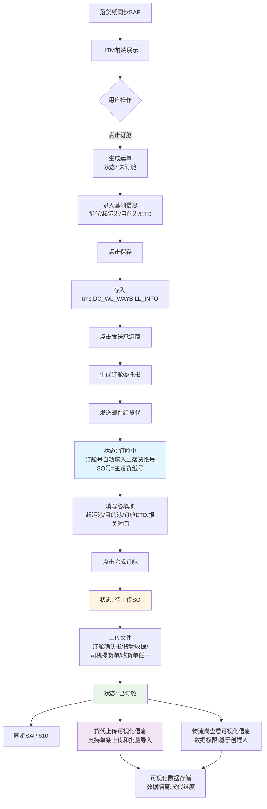
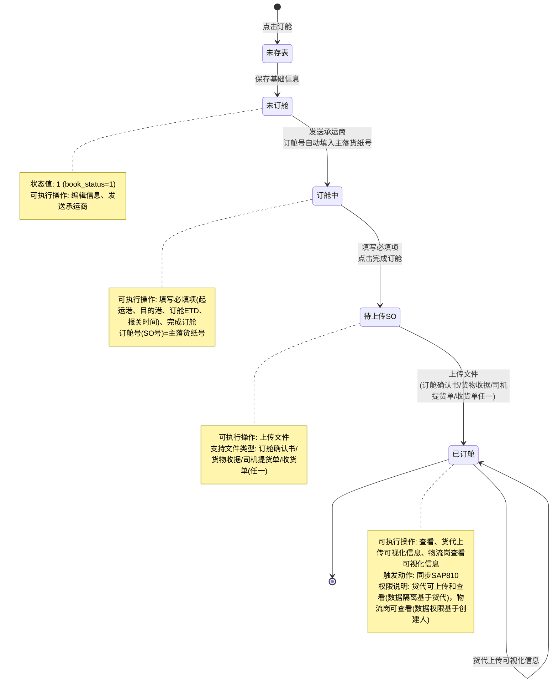
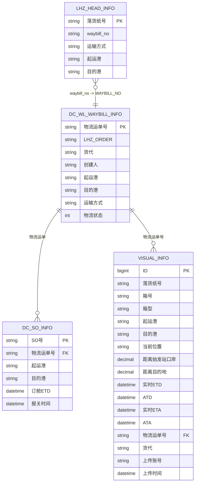

# 版块2：订舱管理-铁运订舱管理 功能说明

> **⚠️ 重要提示**：本文档为铁运订舱管理完整PRD，包含通用规则（所有运输方式）和铁运订舱的特殊规则。本文档可独立输出PRD，无需依赖主文档。

## 文档说明

- **业务版块**: 版块2-订舱管理（铁运专项）
- **文档性质**: 铁运订舱管理完整PRD，包含通用规则和铁运特殊规则
- **参考文档**：
  - `../00-背景知识库.md` - 系统架构、表结构、业务规则等通用知识
  - `../数据库 (1)_tms.docx` - 准确表名和字段定义
  - [`02-订舱管理.md`](./02-订舱管理.md) - 订舱管理主文档（可选参考，包含其他运输方式）
- **逻辑冲突处理**：以最新会议时间为准
- **整理原则**：只整理会议中明确提到的内容，不引申和创造

---

## 一、铁运订舱（包含通用和铁运订舱规则，物流岗订舱）

> **说明**：本节包含铁运订舱的通用规则和特殊规则，由物流岗执行订舱操作。

### 1.1 状态流转概览

**状态流转**：未存表 → 未订舱 → 订舱中 → 待上传SO → 已订舱

| 状态 | 状态值 | 说明 | 可执行操作 | 数据存储 |
| :--- | :--- | :--- | :--- | :--- |
| 未存表 | - | 点击订舱后生成物流运单号，但未存表 | 录入基础信息、保存 | `tms.DC_WL_WAYBILL_INFO`表无数据 |
| 未订舱 | 1 | 保存基础信息后首次存表 | 编辑信息、生成订舱委托书、发送承运商 | `tms.DC_WL_WAYBILL_INFO`表首次插入，`book_status=1` |
| 订舱中 | 2 | 发送承运商后 | 录入订舱信息、批量导入导出、相似创建 | `tms.DC_WL_WAYBILL_INFO`表已存，`book_status=2` |
| 待上传SO | 3 | 录入订舱信息并保存后 | 上传订舱确认书等文件 | `tms.DC_SO_INFO`表首次插入或更新，`book_status=3` |
| 已订舱 | 4 | 上传文件后 | 查看、关联订舱 | 触发同步SAP和订阅，`book_status=4` |

**说明**：`book_status` 字段存储在 `tms.DC_WL_WAYBILL_INFO` 表中，用于标识订舱状态。

**适用范围**：所有运输方式（海运、铁运、空运、快递、卡车、混合）

---

### 1.2 未订舱 → 订舱中（所有运输方式通用规则）

#### 1.2.1 基本信息必填项

| 字段名称 | 是否必填 | 说明 |
| :--- | :--- | :--- |
| 货代 | ✅ 必填 | 货代信息 |
| 预计报关日期 | ✅ 必填 | 预计报关日期 |
| ETD | ✅ 必填 | 预计离港时间 |
| 件数 | ✅ 必填 | 货物件数 |

#### 1.2.2 DR/CY港口城市校验规则

**适用范围**：订舱管理（所有运输方式）

**字段定义表**：

| 字段类型 | 字段名称 | 说明 |
| :--- | :--- | :--- |
| 运输方式字段 | 提货地运输方式 | 必填 |
| 运输方式字段 | 目的地运输方式 | 必填 |
| 港口字段 | 起运港 | 港口字段 |
| 港口字段 | 目的港 | 港口字段 |
| 城市字段 | 起运地城市 | 城市字段 |
| 城市字段 | 目的地城市 | 城市字段 |

**必填规则表**：

| 规则类型 | 字段 | 必填条件 | 说明 |
| :--- | :--- | :--- | :--- |
| 通用规则 | 起运港 | 任何时候 | 不区分DR/CY，所有情况必填 |
| 通用规则 | 目的港 | 任何时候 | 不区分DR/CY，所有情况必填 |
| 通用规则 | 提货地运输方式 | 任何时候 | 不区分DR/CY，所有情况必填 |
| 通用规则 | 目的地运输方式 | 任何时候 | 不区分DR/CY，所有情况必填 |
| 条件规则 | 起运地城市 | 提货地运输方式=DR时 | 仅在DR（Door，门到门）时必填 |
| 条件规则 | 目的地城市 | 目的地运输方式=DR时 | 仅在DR（Door，门到门）时必填 |
| 例外规则 | 起运地城市 | 货代=COSCO时 | 无论运输方式，城市与港口均必填 |
| 例外规则 | 目的地城市 | 货代=COSCO时 | 无论运输方式，城市与港口均必填 |

#### 1.2.3 状态变更触发

| 触发操作 | 状态变更 | 触发动作 | 适用范围 |
| :--- | :--- | :--- | :--- |
| 点击"发送承运商"按钮 | 未订舱 → 订舱中 | 1. 生成订舱委托书<br/>2. 发送承运商（如果生成托书没有问题，则调用邮件服务或接口发送给承运商） | 所有运输方式（海运、铁运、空运、快递、卡车、混合） |

---

### 1.3 订舱中 → 待上传SO（铁运特殊规则）

#### 1.3.1 订舱信息必填项与非必填项（铁运）

**必填项表**：

| 字段名称 | 是否必填 | 说明 |
| :--- | :--- | :--- |
| 起运港 | ✅ 必填 | 起运港口 |
| 目的港 | ✅ 必填 | 目的港口 |
| ETD（订舱ETD） | ✅ 必填 | 订舱预计离港时间 |
| 报关时间 | ✅ 必填 | 报关时间 |

**非必填项说明**：

| 字段类型 | 是否必填 | 示例字段 |
| :--- | :--- | :--- |
| 其他订舱信息字段 | ❌ 非必填 | ETA、船名、航次等 |

**校验与状态变更规则表**：

| 操作 | 校验时机 | 状态变更 | 说明 |
| :--- | :--- | :--- | :--- |
| 点击"完成订舱"按钮 | 点击时校验 | 订舱中 → 待上传SO | 校验必填项后变更状态 |

**订舱号规则表**：

| 字段名称 | 规则说明 | 生成时机 | 说明 |
| :--- | :--- | :--- | :--- |
| 订舱号 | 等于主落货纸号 | 发送承运商后自动填入 | 与SO号一致 |
| SO号 | 等于主落货纸号，**不带 (H) 后缀** | 发送承运商后自动填入 | 与订舱号一致 |

#### 1.3.6 发送承运商后的状态变更与字段继承规则（铁运）

**触发动作**：点击"发送承运商"按钮

**状态变更**：

- 物流状态从 **未订舱** 变为 **订舱中**

**字段继承与页面展示规则**：

发送承运商后，订舱信息区块的以下字段会从 `tms.DC_WL_WAYBILL_INFO` 表**回显到页面**，但**首次不写入 `tms.DC_SO_INFO` 表**（仅页面展示，用户确认后保存才入库）：

| 页面字段（订舱信息区块） | 来源表 | 来源字段 | 页面状态 | 说明 |
| :--- | :--- | :--- | :--- | :--- |
| 起运港 | `tms.DC_WL_WAYBILL_INFO` | `LOADING_PORT` | 回显、必填 | 继承自基本信息的起运港 |
| 目的港 | `tms.DC_WL_WAYBILL_INFO` | `DEST_PORT` | 回显、必填 | 继承自基本信息的目的港 |
| ETD（订舱ETD） | `tms.DC_WL_WAYBILL_INFO` | `ETD` | 回显、必填 | 继承自基本信息的ETD |
| 报关时间 | `tms.DC_WL_WAYBILL_INFO` | `CUSTOMS_DATE` | 回显、必填 | 继承自基本信息的预计报关时间 |
| SO号（订舱号） | 系统生成 | 主落货纸号（不带H） | 自动填入、**置灰不可修改** | 发送承运商后自动填入，不可编辑 |
| 箱型箱量 | `tms.DC_WL_WAYBILL_INFO` | `PLAN_BOX` | 回显 | 该物流运单下所有落货纸的计划箱型箱量之和 |

**特别说明**：

1. **SO号置灰规则**：发送承运商后，SO号（订舱号）字段自动填入主落货纸号（不带 `(H)` 后缀），该字段置灰不可修改
2. **不写入 DC_SO_INFO 的时机**：首次进入"订舱中"状态时，上述字段仅页面回显，`tms.DC_SO_INFO` 表尚未插入数据；用户填写完必填项并点击"完成订舱"后才会写入
3. **铁运不继承的字段**：ETA、船名、航次等海运特有字段，铁运不继承、不展示
4. **可视化数据**：铁运可视化数据由货代上传（见"二、铁运可视化信息上报（货代侧）"章节），箱型与 HTM 标准箱型一致

---

### 1.4 待上传SO → 已订舱（所有运输方式通用规则）

#### 1.4.1 文件上传要求与状态变更

**文件上传规则表**：

| 上传时机 | 支持文件类型 | 上传后状态变更 | 说明 |
| :--- | :--- | :--- | :--- |
| "待上传SO"状态时上传 | 订舱确认书、货物收据、司机提货单、收货单等（任一即可） | 待上传SO → 已订舱 | 不同运输方式可能有差异 |

**状态变更触发规则表**：

| 触发操作 | 状态变更 | 触发动作 | 运输方式说明 |
| :--- | :--- | :--- | :--- |
| 上传文件 | 待上传SO → 已订舱 | 1. 同步SAP810（订舱信息、订舱状态；仅海运同步ATD）<br/>2. 订阅可视化数据（仅海运） | **铁运说明**：铁运不订阅可视化数据，由货代上传可视化信息（见"二、铁运可视化信息上报（货代侧）"章节） |

---

### 1.5 已订舱状态（通用规则）

#### 1.5.1 通用规则

| 状态 | 可执行操作 | 触发动作 | 适用范围 |
| :--- | :--- | :--- | :--- |
| 已订舱 | 查看、关联订舱 | 同步SAP810（所有运输方式） | 所有运输方式 |

---

### 1.6 其他通用规则

#### 1.6.1 订舱入口与物流运单号生成

**订舱方式表**：

| 订舱方式 | 操作说明 | 生成状态 | 说明 |
| :--- | :--- | :--- | :--- |
| 单票订舱 | 选择一票落货纸点击订舱 | 未存表 | 生成物流运单号 |
| 合并订舱 | 选择多票落货纸合并订舱 | 未存表 | 生成物流运单号 |
| 线下订舱 | 选择落货纸点击"线下订舱" | 订舱中 | 直接生成"订舱中"状态 |

**物流运单号生成规则表**：

| 规则项 | 规则说明 | 数据存储状态 |
| :--- | :--- | :--- |
| 生成时机 | 用户点击订舱后，物流运单号已生成（页面上可见） | `tms.DC_WL_WAYBILL_INFO`表中无数据 |
| 唯一性要求 | 物流运单号作为订舱流程主键，必须唯一标识 | - |

#### 1.6.2 权限规则

| 角色/岗位 | 查看 | 新建订舱 | 编辑订舱信息 | 发送承运商 | 上传确认书 | 批量导入导出 |
| :--- | :--- | :--- | :--- | :--- | :--- | :--- |
| 物流岗 | ✓ | ✓ | ✓ | ✓ | ✓ | ✓ |
| 订单岗 | ✓ | ✗ | ✗ | ✗ | ✗ | ✗ |

#### 1.6.3 落货纸展示与订舱规则

| 阶段 | 展示条件 | 可订舱状态 | 说明 |
| :--- | :--- | :--- | :--- |
| 一期 | 海运、非LCL、价格条款非EXW | 区域经理审核、执行 | 仅支持海运非LCL非EXW |
| 二期 | 全量落货纸（所有运输方式、所有LCL状态、所有价格条款） | 提交审核、区域经理审核、执行 | 支持全量落货纸 |

#### 1.6.4 数据同步规则

**SAP同步规则表**（所有运输方式通用）：

| 同步项 | 同步时机 | 同步内容 | 运输方式说明 |
| :--- | :--- | :--- | :--- |
| SAP同步 | 完成订舱后（所有运输方式都有） | 1. 同步订舱信息（船运信息）<br/>2. 同步订舱状态<br/>3. **同步ATD**：仅海运需要同步ATD（如果有，海运场景下包括关联订舱触发的ATD同步） | **铁运说明**：铁运不需要同步ATD<br/>其他运输方式（铁运、空运、快递、卡车、混合）不需要同步ATD |

#### 1.6.5 件数修改规则

| 规则项 | 规则说明 | 数据来源 |
| :--- | :--- | :--- |
| 修改权限 | 件数可以修改，修改后只存表，不需要反向同步 | - |
| 单位规则 | 单位不可修改，数值可修改 | 单位（如`PCS`）应从`tms.DC_WL_WAYBILL_INFO`表中获取 |

#### 1.6.6 箱型箱量修改规则

| 价格条款/运输方式 | 是否可修改 | 修改位置 | 说明 |
| :--- | :--- | :--- | :--- |
| FOB价格条款（海运） | ✅ 可修改 | 落货纸管理模块 | 只有FOB价格条款可以在落货纸管理里修改箱型箱量 |
| 其他价格条款（ESW、FCA、CIF、CFR等） | ❌ 不可修改 | - | 其他价格条款都不可以在落货纸管理里修改箱型箱量 |
| 铁运 | ❌ 不可修改 | - | **铁运明确不可修改箱型箱量** |
| 空运 | ❌ 不可修改 | - | 除海运FOB外，其他运输方式都不可以修改箱型箱量 |
| 快递 | ❌ 不可修改 | - | 除海运FOB外，其他运输方式都不可以修改箱型箱量 |
| 卡车 | ❌ 不可修改 | - | 除海运FOB外，其他运输方式都不可以修改箱型箱量 |

**说明**：箱型箱量的修改在落货纸管理模块，不在订舱管理模块

#### 1.6.7 运输方式字段同步规则

| 字段名称 | 字段说明 | 同步来源 | 同步时机 | 适用范围 |
| :--- | :--- | :--- | :--- | :--- |
| `shipping_type` | 运输方式描述 | 主落货纸的 `tms.lhz_head_info.trans_type_desc` | 点击订舱后，在 `TMS.DC_WL_WAYBILL_INFO` 增加一条数据时同步 | 所有运输方式（海运、铁运、空运、快递、卡车、混合） |
| `shipping_type_code` | 运输方式代码（01=海运，02=空运，03=卡车，04=快递，05=铁运） | 主落货纸的 `tms.lhz_head_info.trans_type` | 点击订舱后，在 `TMS.DC_WL_WAYBILL_INFO` 增加一条数据时同步 | 所有运输方式（海运、铁运、空运、快递、卡车、混合） |

**数据来源**：主落货纸的 `tms.lhz_head_info` 表

#### 1.6.8 委托书生成与发送规则

| 规则项 | 规则说明 | 触发动作 | 适用范围 |
| :--- | :--- | :--- | :--- |
| 按钮合并 | 委托书生成与更新和发送承运商按钮合并为一个按钮（"发送承运商"） | 点击"发送承运商"按钮时，会完成委托书生成与发送 | 所有运输方式 |
| 触发动作 | 1. 生成订舱委托书<br/>2. 发送承运商（如果生成托书没有问题，则调用邮件服务或接口发送给承运商） | - | 所有运输方式 |

#### 1.6.9 主落货纸选取规则（合并订舱）

**适用范围**：所有运输方式（海运、铁运、空运、快递、卡车、混合）

**TEU计算规则表**：

| 箱型 | TEU系数 | 计算公式说明 |
| :--- | :--- | :--- |
| 20GP | 1TEU | `sum = 20GP箱量 + 40GP箱量*2 + 40HQ箱量*2 + 40NOR箱量*2` |
| 40GP | 2TEU | 将所有箱型箱量转换成TEU标准进行对比 |
| 40HQ | 2TEU | 将所有箱型箱量转换成TEU标准进行对比 |
| 40NOR | 2TEU | 将所有箱型箱量转换成TEU标准进行对比 |

**主落货纸选取逻辑表**：

| 场景 | 选取规则 | 说明 |
| :--- | :--- | :--- |
| 多个落货纸合并订舱 | 取TEU（sum值）最大的落货纸为主落货纸 | 优先按TEU值选取 |
| TEU最大的落货纸有两个（sum值相等） | 取落货纸号最大的为主落货纸 | 当TEU相等时，按落货纸号选取 |

**显示规则表**：

| 场景 | 显示规则 | 说明 |
| :--- | :--- | :--- |
| 多票合并订舱 | 主落货纸会加括号`(H)` | 标识主落货纸 |
| 单票点击订舱 | 不会加括号`(H)` | 单票不需要标识 |

#### 1.6.10 铁运特殊功能

##### 1.6.10.1 铁运字段要求

| 字段名称 | 是否必填 | 卡控逻辑 | 说明 |
| :--- | :--- | :--- | :--- |
| 提货地城市 | ✅ 必填 | 需根据提货地运输方式进行卡控 | 两端城市均为必填项 |
| 目的地城市 | ✅ 必填 | 需根据目的地运输方式进行卡控 | 两端城市均为必填项 |

##### 1.6.10.2 铁运运单号录入与追踪

| 规则项 | 规则说明 | 说明 |
| :--- | :--- | :--- |
| 铁运运单号 | 订仓前填主落货纸号，用于费用核对和与承运商对接 | - |
| 铁运追踪问题 | 目前HTM整体用SO number追踪可视化数据，但铁运提单号较晚出现，影响前期追踪 | - |

##### 1.6.10.3 箱型箱量规定

| 规则项 | 规则说明 | 说明 |
| :--- | :--- | :--- |
| 箱型箱量 | 铁路按实际情况填写，铁运和海运的通用箱型如HQGP可满足需求 | - |

##### 1.6.10.4 ETD和ETA必填规则

| 字段名称 | 必填规则 | 填写说明 | 说明 |
| :--- | :--- | :--- | :--- |
| ETD | ✅ 所有情况都必填 | EXW按预计提走时间填，集装箱离厂大门就算。铁路以出工厂时间作为上收入节点 | - |
| ETA | ⚠️ 条件必填 | CD条款下各种运输方式都必填，非CD条款非必填 | - |

---

## 二、铁运可视化信息上报（货代侧）

> **说明**：本节描述铁运可视化信息“上报”新页面功能。用户订舱完成后，货代在此页面上报可视化数据；物流岗对自己订舱的运单拥有查看权限。

### 2.1 功能概述

| 功能项 | 说明 |
| :--- | :--- |
| 功能描述 | 在已订舱状态后，提供新页面让货代上传可视化信息 |
| 功能入口 | 已订舱状态的铁运物流运单，提供"上传可视化信息"按钮或入口 |
| 触发时机 | 用户订舱完成后，货代会到这个新的页面上传可视化数据 |

### 2.2 账号与权限配置

#### 2.2.1 GSS账号配置

| 配置项 | 配置说明 |
| :--- | :--- |
| 账号配置 | 需要给各个货代配置GSS账号，每个货代可以有多个账号，账号与货代关联 |

#### 2.2.2 角色权限配置

| 角色 | 权限说明 |
| :--- | :--- |
| 货代角色 | 具有上传角色的货代可以访问上传页面并上传可视化数据 |
| 物流岗角色 | 具有查看权限的物流岗可以访问页面查看可视化数据 |

#### 2.2.3 数据隔离规则

| 隔离场景 | 隔离规则 | 说明 |
| :--- | :--- | :--- |
| 货代之间 | 货代之间的数据不可见（A货代看不到B货代的数据） | 数据隔离基于货代维度 |
| 同一货代内 | 同一个货代内，账号上传的数据可见（A货代的账号1和账号2可以看到彼此上传的数据） | 数据隔离基于货代维度 |

### 2.3 权限与数据访问规则

#### 2.3.1 角色权限配置

| 角色 | 页面访问 | 数据上传 | 数据查看 | 数据删除 | 说明 |
| :--- | :--- | :--- | :--- | :--- | :--- |
| 货代角色 | ✅ 具有上传角色可访问 | ✅ 可上传 | ✅ 可查看 | ✅ 可删除 | 具有上传角色的货代可以访问上传页面并上传可视化数据 |
| 物流岗角色 | ✅ 具有查看权限可访问 | ❌ 不可上传 | ✅ 可查看 | ❌ 不可删除 | 具有查看权限的物流岗可以访问页面查看可视化数据，不可上传数据 |
| 管理员角色 | ✅ 可访问 | ❌ 不可上传 | ✅ 可查看全部数据 | ✅ 可删除全部数据 | 管理员可以查看和删除全部数据，不可上传数据 |

#### 2.3.2 权限矩阵表

| 角色 | 页面访问 | 数据上传 | 数据查看 | 数据删除 | 数据权限说明 |
| :--- | :--- | :--- | :--- | :--- | :--- |
| **货代** | ✅ 具有上传角色可访问 | ✅ 可上传自己货代负责的物流运单数据 | ✅ 可查看自己货代上传的所有数据（同一货代内账号数据可见） | ✅ 可删除自己货代上传的数据 | 数据隔离基于货代维度 |
| **物流岗** | ✅ 具有查看权限可访问 | ❌ 不可上传 | ✅ 可查看自己订舱的物流运单的可视化数据（创建人=当前用户） | ❌ 不可删除 | 数据权限基于物流运单的创建人（订舱人） |
| **管理员** | ✅ 可访问 | ❌ 不可上传 | ✅ 可查看全部数据 | ✅ 可删除全部数据 | 无数据限制，可操作所有货代的数据 |

### 2.4 UI界面要求

#### 2.4.1 侧边栏导航结构

| 菜单层级 | 菜单名称 | 说明 |
| :--- | :--- | :--- |
| 一级菜单 | HTM | - |
| 二级菜单 | 业务操作模块 | - |
| 三级菜单 | 铁运可视化信息上报 | 当前选中项 |

#### 2.4.2 表格列固定要求

| 列名称 | 固定位置 | 说明 |
| :--- | :--- | :--- |
| 操作列 | 固定右侧 | - |

#### 2.4.3 表单字段与表格列要求

**表单字段要求表**：

| 字段名称 | 字段属性 | 数据来源 | 字段位置 | 说明 |
| :--- | :--- | :--- | :--- | :--- |
| 货代字段 | 只读，不可修改 | 自动带入当前用户所属货代 | 表单底部，在日期时间字段之后 | - |
| 上传人字段 | 只读，不可修改 | 自动带入当前登录用户姓名 | 表单底部，在日期时间字段之后 | - |
| 上传时间字段 | 只读，不可修改 | 自动带入当前系统时间 | 表单底部，在日期时间字段之后 | - |

**表格列要求表**：

| 列名称 | 列顺序 | 可见性 | 位置说明 |
| :--- | :--- | :--- | :--- |
| 订舱号 | 1 | 所有角色可见 | - |
| 箱号 | 2 | 所有角色可见 | - |
| 箱型 | 3 | 所有角色可见 | - |
| 起运港 | 4 | 所有角色可见 | - |
| 目的站 | 5 | 所有角色可见 | - |
| 当前状态 | 6 | 所有角色可见 | - |
| 当前位置 | 7 | 所有角色可见 | - |
| 实时ETD | 8 | 所有角色可见 | - |
| ATD | 9 | 所有角色可见 | - |
| 实时ETA | 10 | 所有角色可见 | - |
| ATA | 11 | 所有角色可见 | - |
| 距离始发站口岸(KM) | 12 | 所有角色可见 | - |
| 距离目的地(KM) | 13 | 所有角色可见 | - |
| 上传时间 | 14 | 所有角色可见 | - |
| 上传人 | 15 | 所有角色可见 | 显示在"上传时间"列之后，"所属货代"列之前 |
| 所属货代 | 16 | 所有角色可见（不再仅管理员可见） | 显示在"上传人"列之后，"操作"列之前 |
| 操作 | 17 | 所有角色可见 | 固定右侧 |

#### 2.4.5 页面按钮功能说明

##### 2.4.5.1 查询区域按钮

| 按钮名称 | 功能 | 触发动作 | 查询规则 | 适用角色 |
| :--- | :--- | :--- | :--- | :--- |
| 重置按钮 | 清空所有查询条件，恢复默认状态 | 将所有筛选条件重置为空值，并重新执行查询，显示全部数据 | - | 所有有权限访问页面的角色 |
| 查询按钮 | 根据设置的筛选条件查询可视化信息 | 执行查询逻辑，根据筛选条件过滤数据并更新列表 | 支持多条件组合查询，所有条件之间为"且"的关系 | 所有有权限访问页面的角色 |

##### 2.4.5.2 列表操作按钮

| 按钮名称 | 功能 | 权限要求 | 触发动作 | 文件要求/导入规则 | 数据权限 | 显示条件 |
| :--- | :--- | :--- | :--- | :--- | :--- | :--- |
| 新建按钮 | 打开新增可视化信息表单弹窗，用于单条录入数据 | 仅货代角色有权限 | 打开新增表单弹窗，清空表单数据，自动填充货代、上传人、上传时间等系统字段 | - | - | 当用户角色为货代时显示 |
| 批量导入按钮 | 打开批量导入弹窗，支持通过Excel文件批量导入可视化信息 | 仅货代角色有权限 | 打开批量导入弹窗，支持文件上传和拖拽上传 | 支持.xlsx、.xls格式，文件大小限制10MB；批量导入时，如果存在不符合要求的记录，所有记录都不会入库，需修正错误后重新导入 | - | 当用户角色为货代时显示 |
| 批量删除按钮 | 删除选中的多条可视化信息记录 | 需要具有删除权限（货代角色、管理员） | 打开删除确认弹窗，显示选中记录数量，确认后批量删除 | - | 货代只能删除自己货代上传的数据，管理员可删除所有数据 | 当选中记录数量大于0且用户具有删除权限时显示（已更新：始终显示，移除选中行条件限制） |
| 导出按钮 | 将当前查询结果导出为Excel文件 | 所有有权限访问页面的角色 | 根据当前筛选条件和分页设置，导出所有符合条件的数据（不受分页限制） | 导出字段：包含列表中的所有可见字段 | - | 所有角色可见 |

##### 2.4.5.3 表格行操作按钮

| 按钮名称 | 功能 | 权限要求 | 触发动作 | 数据权限 | 显示条件 |
| :--- | :--- | :--- | :--- | :--- | :--- |
| 删除按钮（表格行内） | 删除单条可视化信息记录 | 需要具有删除权限（货代角色、管理员） | 弹出确认对话框，显示要删除的落货纸号和箱号，确认后删除该条记录 | 货代只能删除自己货代上传的数据，管理员可删除所有数据 | 当用户具有删除权限时，在每行数据的操作列中显示 |

### 2.6 数据结构

**数据结构**（基于Track & Tracing Report截图）：

| 字段名称 | 字段英文名 | 字段说明 | 是否必填 | 数据来源 | 备注 |
| :--- | :--- | :--- | :--- | :--- | :--- |
| **订舱号** | Invoice NO. / PO号 | Invoice NO. / PO号 | ✅ 必填 | 货代上传 | 订舱号（等于主落货纸号） |
| **箱号** | container_no | Container Number | ✅ 必填 | 货代上传 | 一个订舱号可以有多个箱号 |
| **箱型** | Container Size | Container Size | ✅ 必填 | 货代上传 | 如：40HQ |
| **起运港** | POL | Origin Terminal | ✅ 必填 | 货代上传 | 与订舱时的起运港对应 |
| **目的站** | POD | Destination Terminal | ✅ 必填 | 货代上传 | 与订舱时的目的站对应 |
| **当前状态** | Current Status | 当前运输状态（枚举代码：00、10、20、30、40、50，对应含义见下文“状态枚举表”） | ✅ 必填 | 货代上传 | 仅允许从下拉中选择上述 6 个标准值，不支持手动输入其他内容 |
| **当前位置** | Current Location | Current Location | ✅ 必填 | 货代上传 | 当前所在位置 |
| **实时ETD** | Estimated Time of Departure | Estimated Time of Departure | ⭕ 可选 | 货代上传 | 实时预计离港时间 |
| **ATD** | ATD | Actual Time of Departure | ⭕ 可选 | 货代上传 | 实际离港时间 |
| **实时ETA** | Estimated Time of Arrival | Estimated Time of Arrival | ⭕ 可选 | 货代上传 | 实时预计到港时间 |
| **ATA** | ATA | Actual Time of Arrival | ⭕ 可选 | 货代上传 | 实际到港时间 |
| **距离始发站口岸** | KM to Border | KM to Border | ⭕ 可选 | 货代上传 | 距离始发站口岸的公里数 |
| **距离目的地** | KM to Destination | KM to Destination | ⭕ 可选 | 货代上传 | 距离目的地的公里数 |
| **上传时间** | Updated date | Updated date | ✅ 必填 | 系统自动 | 根据货代上传时间自动带入 |
| **上传人** | Upload User | 上传人姓名 | ✅ 必填 | 系统自动 | 根据当前登录用户自动带入，只读不可修改 |
| **货代** | Carrier | 当前用户所属货代 | ✅ 必填 | 系统自动 | 根据当前登录用户自动带入，只读不可修改 |

### 2.7 校验与业务规则

#### 2.7.1 必填字段校验

**字段必填性规则表**：

| 字段类型 | 字段列表 | 校验时机 | 校验失败处理 |
| :--- | :--- | :--- | :--- |
| 必填字段 | 起运港、目的站、订舱号、箱号、箱型、当前状态、当前位置 | 单条上传时点击保存按钮；批量上传时导入文件后 | 提示用户哪些字段未填写，阻止保存操作 |
| 非必填字段 | 实时ETD、ATD、实时ETA、ATA、距离始发站口岸、距离目的地 | - | - |

#### 2.7.2 订舱状态校验（必须已订舱）

| 校验项 | 校验点 | 校验口径 | 校验失败处理 |
| :--- | :--- | :--- | :--- |
| 订舱状态校验 | 上传的订舱号（即SO号/主落货纸号）所对应的订舱状态必须为 **已订舱** | `tms.DC_WL_WAYBILL_INFO.book_status = 4` | 提示用户"该SO未处于已订舱状态，无法上传可视化信息"，阻止保存/导入 |

**校验逻辑（示例）**：

```sql
SELECT WAYBILL_NO, book_status
FROM DC_WL_WAYBILL_INFO
WHERE LHZ_ORDER = '订舱号/主落货纸号'
```

#### 2.7.3 货代匹配校验（订舱号关联的货代=当前用户货代）

| 校验项 | 校验逻辑 | 校验条件 | 校验失败处理 |
| :--- | :--- | :--- | :--- |
| 货代匹配校验 | 上传时需要校验：该订舱号对应的物流运单的货代 = 当前用户的货代 | 1. book_status = 4（已订舱）<br/>2. 货代 = 当前用户的货代 | 提示用户"该订舱号不属于当前货代，无法上传"，阻止保存操作 |

**查询逻辑**：

```text
1. 根据订舱号查询物流运单
   SELECT WAYBILL_NO, 货代, book_status
   FROM DC_WL_WAYBILL_INFO
   WHERE LHZ_ORDER = '订舱号'

2. 校验：
   - book_status = 4（已订舱）
   - 货代 = 当前用户的货代
```

#### 2.7.4 批量导入规则（有一条失败则整批失败）

| 规则项 | 规则说明 | 实现建议 |
| :--- | :--- | :--- |
| 批量导入规则 | 批量上传时，只要任意一条记录校验失败，则整批导入失败，**全部回滚**，不落库任何一条 | 批量导入需事务包裹；校验阶段先全量校验，通过后再统一入库 |

##### 2.7.4.1 文件格式要求

- **支持格式**：Excel格式（.xlsx、.xls）
- **文件大小限制**：10MB
- **上传方式**：支持点击选择文件和拖拽上传

##### 2.7.4.2 批量导入弹窗说明

- **说明文字**：在批量导入弹窗中明确说明规则
  - 支持Excel格式（.xlsx、.xls）
  - 文件大小限制：10MB
  - **批量导入规则**：如果存在不符合要求的记录，所有记录都不会入库，请修正错误后重新导入（建议使用红色加粗文字突出显示，避免用户误解）
  - **唯一性规则**：同一 Excel 文件中，**同一"订舱号 + 箱号"组合只能出现一次**，如存在重复组合则视为错误

##### 2.7.4.3 导入进度展示

- **进度显示**：导入过程中显示进度条和"正在导入，请稍候..."提示
- **按钮状态**：导入过程中禁用"开始导入"按钮，防止重复提交

##### 2.7.4.4 导入结果展示

- **全部成功**：
  - 显示绿色成功提示框（背景色#F0FDF4，边框#BBF7D0，文字颜色#166534）
  - 显示成功图标（✓）
  - 提示文字："导入成功：成功 X 条记录"
  
- **存在失败**：
  - 显示红色错误提示框（背景色#FEF2F2，边框#FECACA，文字颜色#991B1B）
  - 显示错误图标（⚠）
  - 提示文字："导入失败"
  - 详细说明："本次导入共 X 条记录，其中 Y 条记录不符合要求，已全部回滚，未入库任何数据。请修正错误后重新导入。"
  - 通过Toast提示："导入失败：存在不符合要求的记录，已全部回滚，未入库任何数据"

##### 2.7.4.5 错误明细展示

- **展示时机**：当存在失败的记录时，在导入结果弹窗中展示"不符合要求的记录明细"
- **标题和说明**：
  - 标题："不符合要求的记录明细"
  - 说明文字："以下 Y 条记录不符合要求，请修正后重新导入："
- **错误明细表格字段**：
  - **行号**：Excel文件中的行号（从第2行开始，第1行是表头）
  - **落货纸号**：该行数据中的落货纸号（如无则显示"-"）
  - **箱号**：该行数据中的箱号（如无则显示"-"）
  - **错误原因**：具体的错误描述，使用红色文字显示
    - 必填字段校验失败："请填写[字段名]"（如"请填写起运港"）
    - 订舱状态校验失败："该SO未处于已订舱状态，无法上传可视化信息"
    - 货代匹配校验失败："该落货纸不属于当前货代，无法上传"
    - 订舱号+箱号唯一性校验失败："同一文件中存在重复的'订舱号+箱号'组合，请合并后再上传"
- **表格样式**：使用标准表格样式，支持横向滚动（如字段较多）
- **关闭按钮**：导入结果弹窗底部提供"关闭"按钮，关闭后返回列表页

#### 2.7.5 上传方式

| 上传方式 | 操作说明 | 文件要求 | 校验规则 | 进度提示 |
| :--- | :--- | :--- | :--- | :--- |
| 单条上传 | 用户手动填写表单，点击保存按钮，实时校验和保存 | - | 实时校验 | - |
| 批量上传 | 通过Excel文件批量导入可视化信息 | 支持Excel格式（.xlsx、.xls），文件大小限制10MB | 导入后先全量校验，校验通过后批量保存；若存在任一错误，则整批失败并提示错误明细 | 导入过程中显示进度条和"正在导入，请稍候..."提示，禁用"开始导入"按钮 |

#### 2.7.6 入库规则（不更新，每次上传都新增）

| 规则项 | 规则说明 | 结果影响 |
| :--- | :--- | :--- |
| 入库规则 | 上传不做"更新覆盖/去重"，每次上传都作为**新记录插入** | 同一落货纸号+箱号可存在多条历史记录；列表默认可按上传时间倒序展示 |

#### 2.7.7 数据删除

| 角色 | 删除权限 | 删除方式 |
| :--- | :--- | :--- |
| 货代 | 只能删除自己货代上传的数据，不能删除其他货代的数据 | 支持单条删除和批量删除 |
| 管理员 | 可以删除任何数据（所有货代的数据） | 支持单条删除和批量删除 |

#### 2.7.8 当前状态（Current Status）字段与状态机规则

##### 2.7.8.1 枚举值定义

- **字段含义**：表示当前该箱所在的运输阶段，使用标准枚举值，便于前后端统一处理。
- **可选枚举值（代码即入库值）**如下表：

| 状态代码 | 中文名称 | 英文名称 | 业务含义 / 典型场景 |
| :--- | :--- | :--- | :--- |
| `00` | 已提柜 / 待发运 | Gate In | 箱已提柜或进场，尚未实际发车，等待装车或发运 |
| `10` | 已发车 / 国内已出发 | Departed / Domestic Transit | 已从始发站发车，处于国内区段运输途中 |
| `20` | 抵达国内口岸 / 排队 | Arrived Border CN | 已到达国内边境口岸，可能在排队等待出境或办理通关手续 |
| `30` | 境外换装中 | Overseas Reloading | 已出境并到达境外中转站，正在进行换装、转运等操作 |
| `40` | 境外在途 | Overseas Transit | 离开境外中转站后，继续在境外区段运输途中 |
| `50` | 已抵达目的站 | Arrived Destination | 已到达最终目的站 / 交付站，运输完成 |

- **输入方式**：Excel 模板中通过下拉菜单选择上述 6 个值之一，不支持自由输入其他文本。

##### 2.7.8.2 状态与时间的关联校验

- **规则 A1（发车后必须有实际发车时间）**：
  - 逻辑：`IF Current Status ≥ 10 THEN ATD 必填。`
  - 含义：只要状态代码达到 10 及之后任一阶段（已发车/国内已出发及以后），就必须有实际发车时间 ATD。
  - 错误提示示例：`第 {row} 行数据错误：当前状态为已发车及以后，ATD（实际发车时间）不能为空。`
- **规则 A2（已抵达必须有实际到站时间）**：
  - 逻辑：`IF Current Status = 50 THEN ATA 必填。`
  - 含义：当状态代码为 50（已抵达目的站）时，必须有实际到站时间 ATA。
  - 错误提示示例：`第 {row} 行数据错误：当前状态为已抵达目的站，ATA（实际到站时间）不能为空。`
- **补充说明**：
  - 本节不对 ETA 做强制必填要求，ETA 可根据业务需要填写或留空，**不影响上传是否通过**。

- **按状态拆分的字段可填/禁止规则**（在满足 A1、A2 的前提下）：

| Current Status 代码 | 场景说明 | ATD | ATA | 实时ETD / 实时ETA |
| :--- | :--- | :--- | :--- | :--- |
| `00` | 已提柜 / 待发运 | **禁止填写**（必须为空） | **禁止填写**（必须为空） | 可选填（预测时间，可空） |
| `10` / `20` / `30` / `40` | 已发车 / 国内已出发 / 抵达国内口岸 / 境外段在途 | **必填** | **禁止填写**（必须为空） | 可选填（预测时间，可空） |
| `50` | 已抵达目的站 | **必填** | **必填** | 可选填（预测时间，可空） |

##### 2.7.8.3 时间先后关系校验

- **规则 T1：实际发车时间 < 实际到站时间**：
  - 适用前提：同一条记录中 **同时填写了 ATD 和 ATA**。
  - 校验逻辑：`ATD < ATA`（如为同一天，则比较到时分秒）。
  - 失败提示示例：`第 {row} 行数据错误：ATD（实际发车时间）必须早于 ATA（实际到站时间）。`
- **规则 T2：实时发车时间 < 实时到达时间**：
  - 适用前提：同一条记录中 **同时填写了 实时ETD 和 实时ETA**。
  - 校验逻辑：`实时ETD < 实时ETA`。
  - 失败提示示例：`第 {row} 行数据错误：实时ETD 必须早于实时ETA。`
 - **规则 T3：实际发车时间 < 预计到达时间**：
   - 适用前提：同一条记录中 **同时填写了 ATD 和 实时ETA**。
   - 校验逻辑：`ATD < 实时ETA`。
   - 失败提示示例：`第 {row} 行数据错误：ATD（实际发车时间）必须早于实时ETA（预计到达时间）。`
 - **规则 T4：预计发车时间 < 实际到达时间**：
   - 适用前提：同一条记录中 **同时填写了 实时ETD 和 ATA**。
   - 校验逻辑：`实时ETD < ATA`。
   - 失败提示示例：`第 {row} 行数据错误：实时ETD（预计发车时间）必须早于 ATA（实际到达时间）。`

##### 2.7.8.4 状态机防回退规则

- **原则**：铁路运输是单向流动过程，状态只能向前推进，不能回退。
- **判定逻辑**：
  - 对于同一“订舱号 + 箱号”组合，查询数据库中已存在记录的最新 `Current Status` 代码值（记为 `db_status_id`）。
  - 本次上传记录中的 `Current Status` 代码值记为 `new_status_id`。
  - 若 `new_status_id < db_status_id`，则认为状态发生回退，**本条记录上传失败**。
- **错误提示示例**：
  - `第 {row} 行数据错误：当前状态不可从 {oldStatusName} 回退到 {newStatusName}，请确认数据是否正确。`
- **状态修正机制（允许纠错，不允许回退）**：
  - 如果货代历史上误报了某个状态（例如误把“境外在途”录成了“已抵达目的站”），**不能通过再上传一个更早状态来覆盖**，否则会触发上述“状态不可回退”的拦截。
  - 如需纠正此类错误，由运营/数据管理员在后台**删除错误的那一条/多条状态记录**；删除后，以“删除后剩余记录中的最新状态”作为新的 `db_status_id`。
  - 删除完成后，货代可以基于新的最新状态，**继续上传同级或更往后的状态**（例如从“境外在途”继续报“已抵达目的站”），既保证轨迹“只进不退”，又保留人工纠错能力。

### 2.8 数据查询过滤规则

#### 2.8.1 货代查询

- **查询物流运单时**，过滤条件：`DC_WL_WAYBILL_INFO.货代 = 当前用户的货代` 且 `book_status = 4`（已订舱）且 `运输方式 = 铁运`
- **查询可视化信息时**，过滤条件：`可视化信息表.货代 = 当前用户的货代`

#### 2.8.3 筛选功能

- **筛选字段**：支持以下字段筛选
  - **落货纸号**（多行输入框，支持批量输入）
    - 支持批量输入，逗号/换行分隔
    - 查询逻辑：匹配任意一个输入的落货纸号即可
  - **箱号**（多行输入框，支持批量输入）
    - 支持批量输入，逗号/换行分隔
    - 查询逻辑：匹配任意一个输入的箱号即可
  - **起运港**（多选下拉，枚举值）
    - 支持多选，从枚举值列表中选择（如：CNTAO、CNSHA、CNDLC等）
    - 查询逻辑：匹配任意一个选中的起运港即可
    - 显示已选择的港口列表
  - **目的港**（多选下拉，枚举值）
    - 支持多选，从枚举值列表中选择（如：DEHAM、DEBRV等）
    - 查询逻辑：匹配任意一个选中的目的港即可
    - 显示已选择的港口列表
  - **箱型**（多选下拉）
    - 支持多选，从箱型列表中选择（20GP、40GP、40HQ、40NOR等）
    - 查询逻辑：匹配任意一个选中的箱型即可
    - 显示已选择的箱型列表
  - **当前状态**（单选下拉）
    - 下拉枚举值与“当前状态”字段完全一致（00、10、20、30、40、50 六个状态）
    - 仅支持选择其中一个状态，不支持多选
    - 查询逻辑：仅返回“当前状态 = 所选状态代码”的记录
  - **上传时间**（日期范围输入框）
    - 格式：YYYY-MM-DD - YYYY-MM-DD
    - 查询逻辑：查询上传时间在指定时间范围内的记录
    - 支持时间范围查询
  - **货代**（输入框，支持模糊搜索）
    - 所有角色可见
    - 支持输入搜索，模糊匹配货代名称
    - **数据权限隔离**：货代A输入搜索时，只能搜索到自己货代（货代A）上传的数据，不能搜索到货代B上传的数据
    - 查询逻辑：根据当前用户角色和数据权限进行过滤
  - **上传人**（输入框，支持模糊搜索）
    - 所有角色可见
    - 支持输入搜索，模糊匹配上传人姓名
    - **数据权限隔离**：货代A输入搜索时，只能搜索到自己货代内用户上传的数据，不能搜索到货代B内用户上传的数据
    - 查询逻辑：根据当前用户角色和数据权限进行过滤

#### 2.8.4 查询逻辑说明

- **多条件组合**：所有筛选条件之间为"且"（AND）的关系，必须同时满足所有条件
- **批量输入逻辑**：落货纸号和箱号支持批量输入，多个值之间为"或"（OR）的关系，匹配任意一个即可
- **多选逻辑**：起运港、目的港、箱型支持多选，多个选中值之间为"或"（OR）的关系，匹配任意一个即可
- **数据权限隔离**：
  - **货代角色**：只能查询到自己货代上传的数据，即使输入其他货代名称也无法搜索到
  - **物流岗角色**：只能查询到自己订舱的物流运单对应的可视化数据
  - **管理员角色**：可以查询所有数据，无数据权限限制

#### 2.8.2 物流岗查询

- **查询物流运单时**，过滤条件：`DC_WL_WAYBILL_INFO.创建人 = 当前用户` 且 `book_status = 4`（已订舱）且 `运输方式 = 铁运`
- **查询可视化信息时**，过滤条件：`可视化信息表.物流运单号 IN (SELECT WAYBILL_NO FROM DC_WL_WAYBILL_INFO WHERE 创建人 = 当前用户)`
- **权限说明**：物流岗只能看到自己订舱的物流运单的可视化数据，物流岗具有上传和查看权限

### 2.9 数据存储

- **数据存储**：待确认存储表（表结构稍后提供）
- **与可视化模块关系**：上传的数据用于可视化追踪和展示

### 2.10 动态时间节点数据同步与展示

#### 2.10.1 功能概述

当货代完成可视化信息上传后，系统需要将关键时间节点（ATD、实时ETD、ATA、实时ETA）的动态时间同步到相关台账表和查询模块，确保这些时间信息能够在多个业务场景中实时查看和使用。

#### 2.10.2 同步范围

货代上传以下时间节点后，系统需要同步这些动态时间：

- **ATD**（Actual Time of Departure）：实际离港/发车时间
- **实时ETD**（Estimated Time of Departure）：实时预计离港/发车时间
- **ATA**（Actual Time of Arrival）：实际到港/到达时间
- **实时ETA**（Estimated Time of Arrival）：实时预计到港/到达时间

#### 2.10.3 数据同步目标

上述动态时间节点需要同步到以下数据表和查询模块：

1. **落货纸台账表**（`tms.TZ_LHZ`）
   - 同步字段：ATD、实时ETD、ATA、实时ETA
   - 同步时机：货代上传可视化信息后实时同步
   - 同步规则：取最新上传的时间节点数据

2. **节点监控台账表**（`tms.TZ_NODE_MONITOR`，简称NODE monitor表）
   - 同步字段：ATD、实时ETD、ATA、实时ETA
   - 同步时机：货代上传可视化信息后实时同步
   - 同步规则：与落货纸台账表同步逻辑保持一致

3. **可视化查询模块**
   - 展示字段：ATD、实时ETD、ATA、实时ETA
   - 数据来源：从可视化信息表实时查询最新数据
   - 展示规则：在可视化查询页面中展示这四个时间节点及其详细信息

4. **可视化导出功能**
   - 导出字段：ATD、实时ETD、ATA、实时ETA
   - 数据来源：与可视化查询模块保持一致
   - 导出规则：导出Excel时包含这四个时间节点字段

#### 2.10.4 同步逻辑说明

- **实时同步**：货代上传可视化信息后，系统立即将时间节点数据同步到落货纸台账表和NODE monitor表
- **数据更新**：当货代多次上传同一落货纸的可视化信息时，系统取最新上传的时间节点数据更新台账表
- **查询展示**：可视化查询和导出功能直接从可视化信息表查询最新数据，确保展示的时间节点信息与货代最新上传的数据一致

#### 2.10.5 业务价值

通过将动态时间节点同步到台账表和查询模块，实现以下业务价值：

- **数据一致性**：确保落货纸台账、节点监控台账、可视化查询和导出功能中的时间节点数据保持一致
- **实时追踪**：用户可以在多个业务场景中实时查看货物的动态时间节点，提升物流追踪效率
- **数据完整性**：台账表和查询模块能够完整展示货物的全生命周期时间节点信息

---

## 三、铁运可视化查询

> **说明**：本节规则参考 `07-可视化-规则整理.md`，用于定义铁运可视化查询的入口、搜索口径、展示内容、导出与权限过滤。铁运可视化数据来源于“二、铁运可视化信息上报（货代侧）”的上传数据。

### 3.1 使用场景与目标

- **使用人群**：总部供应链管理岗、海丰/中外运物流岗、海外用户
- **核心目标**：用户输入落货纸号/订舱号（与主落货纸一致）/箱号等条件后，查询并展示铁运可视化信息（4节点）
- **架构说明**：复用目前海运可视化的架构和页面

### 3.2 查询入口与搜索条件

#### 3.2.1 查询入口

- **入口**：复用目前海运可视化的架构和页面
- **展示对象**：已订舱（`book_status=4`）且运输方式为铁运（`shipping_type_code=05`）的物流运单

#### 3.2.2 搜索条件

- **支持输入**：落货纸号、订舱号（与主落货纸一致）、箱号等
- **查询逻辑**：根据搜索条件查询可视化信息

#### 3.2.3 运输方式自动判断逻辑（开发侧）

1. 根据 SO号/落货纸号/物流运单号 查询 `TMS.DC_WL_WAYBILL_INFO` 或 `TMS.LHZ_HEAD_INFO`
2. 获取运输方式字段：`shipping_type_code` 或 `trans_type`
3. 自动判断：
   - `01`（海运）→ 展示海运可视化（不在本章展开）
   - `05`（铁运）→ 展示铁运可视化（本章）
   - `02/03/04/06`（空运/卡车/快递/混合）→ 提示“**不在订阅范围**”，不展示节点

### 3.3 铁运可视化展示规则（仅四个节点）

#### 3.3.1 展示节点范围

- **仅展示四个节点**：
  - **实时ETD**（Estimated Time of Departure）：预计离港/发车时间
  - **ATD**（Actual Time of Departure）：实际离港/发车时间
  - **实时ETA**（Estimated Time of Arrival）：预计到港/到达时间
  - **ATA**（Actual Time of Arrival）：实际到港/到达时间

#### 3.3.2 展示内容

- **基本信息（Basic information）**：
  - 基础字段：物流运单号、SO号（订舱号）、货代、起运港、目的站、订舱ETD、订舱ETA、实时ETD、ATD、实时ETA、ATA、当前状态等
  - **运输方式**：新增展示运输方式字段（海运/铁运），取值以系统运输方式判断结果为准（参考 `3.2.3 运输方式自动判断逻辑`）
  - **订阅方（Subscription Status 横条）**：
    - 海运：逻辑不变（沿用现有“船公司订阅”展示与状态流转）
    - 铁运：
      - 订阅方取值：展示**具体货代名称**（从 `tms.DC_WL_WAYBILL_INFO.CARRIER_DESC` 获取）
      - 订阅状态：当该票完成订舱（`book_status=4`）后，默认展示为"订阅成功"
- **当前状态可视化（Current Status Visualization）**：
  - **数据聚合规则**：按订舱号聚合展示，每个箱子取最新上传状态（按上传时间降序，每个箱号取第一条）
  - **进度条展示**：展示6个状态节点的进度条，每个节点显示该状态下的箱子数量（格式：X/Y，X为该状态箱数，Y为总箱数）
    - **节点对齐规则**：所有6个节点的logo图标必须对齐，即使某些节点有时间显示框而其他节点没有，也要保持统一的高度和对齐方式
    - 节点1：已提柜（状态代码00）
    - 节点2：国内已出发（状态代码10）
      - **时间显示**：在节点下方显示时间信息
        - **如果有ATD或实时ETD**：
          - 优先取ATD（实际发车时间），从订舱信息（`qBasic.atd`）或容器数据中获取
          - 如果没有ATD，则展示实时ETD（预计发车时间），从容器数据的`realEtd`字段中取最早的一个
          - 显示格式：标签"实际发车" + 时间值（仅显示年月日，格式：YYYY-MM-DD）
        - **如果ATD和实时ETD都没有**：显示格式：标签"预计发车" + "-"
    - 节点3：抵达口岸（状态代码20）
    - 节点4：境外换装（状态代码30）
    - 节点5：境外在途（状态代码40）
    - 节点6：已抵达（状态代码50）
      - **时间显示**：在节点下方显示时间信息
        - **如果节点已激活（最高状态≥50）**：
          - **如果有ATA**：优先取ATA（实际到站时间），从订舱信息（`qBasic.ata`）或容器数据中获取，显示格式：标签"实际到站" + 时间值（仅显示年月日，格式：YYYY-MM-DD）
          - **如果没有ATA**：显示格式：标签"实际到站" + "-"
        - **如果节点未激活（最高状态<50，节点显示为灰色）**：
          - **如果有实时ETA**：展示实时ETA（预计到站时间），从容器数据的`realEta`字段中取最晚的一个，显示格式：标签"预计到站" + 时间值（仅显示年月日，格式：YYYY-MM-DD）
          - **如果没有实时ETA**：显示格式：标签"预计到站" + "-"
  - **进度条状态逻辑**：
    - **业务规则**：货代可能不会上传所有节点，可能直接从某个节点开始上传（例如直接上传"抵达口岸"）
    - **状态推断规则**：如果某个订舱号有箱子传了某个状态（例如"抵达口岸"），则系统认为前面的所有节点（00已提柜、10国内已出发）也已经完成
    - **多箱子规则**：如果有多个箱子，只要有一个箱子到达了某个节点（例如境外在途40），则所有前面的节点（00-40）都应该显示为已完成
    - **节点状态显示规则**：
      - 找到所有箱子中的最高状态（最大状态码）
      - 所有小于等于最高状态的节点：显示为已完成/激活状态（统一为绿色，status-completed或status-active）
      - 大于最高状态的节点：显示为未到达（灰色，status-pending）
    - **连接线样式规则**：
      - 已完成/激活状态的连接线：显示为绿色实线
      - 未到达状态的连接线：显示为灰色虚线
  - **颜色说明（Color Legend）**：在进度条下方显示颜色图例，帮助用户理解节点颜色含义
    - **绿色**：已完成/当前激活节点（Completed/Active）- 表示该节点及之前的所有节点已经完成，当前激活节点也显示为绿色
    - **灰色**：未到达节点（Pending）- 表示尚未到达的节点，连接线为虚线
  - **业务逻辑说明（Business Logic）**：在颜色说明下方显示业务逻辑说明，帮助用户理解状态推断规则
    - **状态推断规则**：如果某个订舱号有箱子传了某个状态，系统认为前面的所有节点也已经完成
    - **多箱子规则**：只要有一个箱子到达了某个节点，所有前面的节点都应该显示为已完成（绿色），当前最高节点也显示为绿色（不再区分蓝色）
    - **示例说明**：如果6个箱子中，有1个箱子在"境外换装"（30），则00、10、20、30节点都显示为已完成/激活（绿色），40、50节点显示为未到达（灰色，虚线连接）
  - **状态分布展示**：显示有箱子的状态列表，包括状态代码、状态名称、箱子数量（格式：`状态代码-状态名称: X箱`，例如：`10-国内已出发: 1箱`），不显示位置信息
- **节点图**：展示铁运的节点流程图（仅四个节点）
- **节点明细**：展示节点事件的详细信息
- **说明**：展示内容与海运可视化一致

#### 3.3.3 数据源显示规则（铁运）

- **数据源字段显示**：具体货代名称
- **数据源取值**：从订舱信息（`TMS.DC_WL_WAYBILL_INFO`）获取（如 `CARRIER` / `CARRIER_DESC`）
- **说明**：铁运不显示“中远海/海丰/亿海蓝”等海运船公司数据源

### 3.4 权限与数据过滤

#### 3.4.1 权限规则

- **权限说明**：权限与海运可视化一致，复用目前海运可视化的架构和页面
- **使用人群**：
  - **总部供应链管理岗**：具备可视化查询权限
  - **海丰/中外运物流岗**：具备可视化查询权限
  - **海外用户**：按角色授权查看（与海运一致）
- **其他岗位**：按角色授权查看（与海运一致）
- **货代**：货代无权限查看可视化查询页面（货代主要在第二章上报数据）

#### 3.4.2 数据过滤规则

- **过滤条件**（与海运一致）：
  - `DC_WL_WAYBILL_INFO.book_status = 4`（已订舱）
  - `DC_WL_WAYBILL_INFO.shipping_type_code IN ('01', '05')`（海运或铁运）
  - 其他运输方式（空运/卡车/快递/混合）不展示可视化数据

### 3.5 导出规则

- **导出规则**：与海运可视化导出一致
- **导出入口**：可视化查询页导出按钮
- **导出口径**：用户无需选择运输方式，系统自动判断运输方式（海运or铁运）后导出对应数据
- **筛选条件**（用户无感）：
  - 系统自动判断运输方式：根据SO号/落货纸号/物流运单号自动查询运输方式
  - 仅导出海运（01）和铁运（05）的可视化数据
  - 其他运输方式（空运/卡车/快递/混合）导出为空
- **导出字段**（与海运一致，增加运输方式字段）：
  - **运输方式**：显示"海运"或"铁运"（从 `DC_WL_WAYBILL_INFO.shipping_type` 或 `shipping_type_code` 获取）
  - 物流运单号、SO号、货代、起运港、目的站、订舱ETD、订舱ETA、实时ETD、ATD、实时ETA、ATA、当前状态等（与海运导出字段一致）
  - 铁运特有字段：当前位置、距离境外始发站、距离目的站、上传时间（如适用；距离字段取货代最新上传记录）

---

## 四、预警（货代没有上传可视化信息，给货代发邮件）

> **说明**：本节描述铁运可视化信息缺失预警功能，用于预防货代没有上传可视化信息。

### 4.1 功能概述

- **功能描述**：根据校验逻辑，如果货代没有上传可视化信息，则给货代发送预警邮件
- **预警对象**：货代
- **预警方式**：邮件通知

### 4.2 校验逻辑

#### 4.2.1 缺失判断规则

**规则1：实时ETD缺失判断**

- **校验条件**：`当前时间 - 订舱ETD > 3天` 且 `没有实时ETD`
- **判断逻辑**：
  - 计算时间差：当前时间减去订舱ETD（从 `tms.DC_SO_INFO.ETD` 获取）
  - 如果时间差 > 3天，且该物流运单/箱号的可视化信息中没有实时ETD数据，则判定为缺失

**规则2：ATD缺失判断**

- **校验条件1**：`当前时间 - 订舱ETD > 5天` 且 `没有ATD`
- **校验条件2**：`当前时间 - 实时ETD > 5天` 且 `没有ATD`
- **判断逻辑**：
  - 条件1：计算时间差：当前时间减去订舱ETD（从 `tms.DC_SO_INFO.ETD` 获取）
  - 条件2：计算时间差：当前时间减去实时ETD（从可视化信息表中获取 `实时ETD` 字段）
  - 如果满足条件1或条件2任一条件，且该物流运单/箱号的可视化信息中没有ATD数据，则判定为缺失

**规则3：实时ETA缺失判断**

- **校验条件**：`当前时间 - 订舱ETA < 3天` 且 `没有实时ETA`
- **判断逻辑**：
  - 计算时间差：当前时间减去订舱ETA（从 `tms.DC_SO_INFO.ETA` 获取）
  - 如果时间差 < 3天（即距离订舱ETA还有不到3天），且该物流运单/箱号的可视化信息中没有实时ETA数据，则判定为缺失

**规则4：ATA缺失判断**

- **校验条件**：`当前时间 - 实时ETA > 5天` 且 `没有ATA`
- **判断逻辑**：
  - 计算时间差：当前时间减去实时ETA（从可视化信息表中获取 `实时ETA` 字段）
  - 如果时间差 > 5天，且该物流运单/箱号的可视化信息中没有ATA数据，则判定为缺失

**数据来源说明**：
- **订舱ETD、订舱ETA**：均从 `tms.DC_SO_INFO` 表获取
- **实时ETD、ATD、实时ETA、ATA**：从货代上传的可视化信息表获取

**说明**：
- 实时ETD缺失：订舱ETD超过3天未上传实时ETD时触发预警
- ATD缺失：满足以下任一条件时触发预警：1) 订舱ETD超过5天未上传ATD；2) 实时ETD超过5天未上传ATD
- 实时ETA缺失：距离订舱ETA还有不到3天时，如果尚未上传实时ETA，则触发预警
- ATA缺失：实时ETA超过5天未上传ATA时触发预警

#### 4.2.2 校验范围

- **运输方式**：仅铁运（`shipping_type_code = '05'`）
- **订舱状态**：已订舱（`book_status = 4`）
- **数据来源**：第二章"铁运可视化信息上报（货代侧）"的上传数据

### 4.3 预警发送规则

#### 4.3.1 货代维度汇总

- **汇总方式**：按货代维度汇总可视化数据缺失情况
- **发送对象**：每个货代
- **发送内容**：该货代负责的所有物流运单的可视化数据缺失明细
- **发送频率**：待确认（建议每日或每周）

#### 4.3.2 预警邮件模板

##### 4.3.2.1 邮件主题

**标准格式**：
```
【HTM系统预警】铁运可视化信息缺失提醒 - [货代名称] - [缺失数量]条待补充
```

**示例**：
```
【HTM系统预警】铁运可视化信息缺失提醒 - 中外运物流 - 5条待补充
```

##### 4.3.2.2 邮件正文模板

```html
尊敬的[货代名称]：

您好！

根据HTM系统监控，您负责的部分铁运物流运单存在可视化信息缺失情况，请及时补充相关时间节点信息。

【缺失数据汇总】
- ATD缺失：X条运单
- ATA缺失：Y条运单
- 实时ETD缺失：Z条运单
- 实时ETA缺失：W条运单
- 合计：N条运单需要补充

【预警说明】
根据系统规则，以下情况将触发预警：
1. 实时ETD缺失：订舱ETD已超过3天，但尚未上传实时预计离港时间（实时ETD）
2. ATD缺失：订舱ETD已超过5天或实时ETD已超过5天，但尚未上传实际离港时间（ATD）
3. 实时ETA缺失：距离订舱ETA还有不到3天，但尚未上传实时预计到港时间（实时ETA）
4. ATA缺失：实时ETA已超过5天，但尚未上传实际到港时间（ATA）

**特别提醒**：如果订舱ETD或订舱ETA有问题，请联系相应的物流岗处理。

【处理要求】
请尽快登录HTM系统，在"铁运可视化信息上报"页面补充以下缺失的时间节点信息：
- 实时ETD（Estimated Time of Departure）：实时预计离港/发车时间
- ATD（Actual Time of Departure）：实际离港/发车时间
- 实时ETA（Estimated Time of Arrival）：实时预计到港/到达时间
- ATA（Actual Time of Arrival）：实际到港/到达时间

【缺失明细】
详细的缺失明细请查看附件Excel文件。

【系统入口】
HTM系统 → 业务操作模块 → 铁运可视化信息上报

【注意事项】
1. 上传数据时请确保时间格式正确（YYYY-MM-DD HH:mm:ss）
2. 如果订舱ETD或订舱ETA有问题，请联系相应的物流岗处理
3. 如有其他疑问，请联系HTM系统管理员

感谢您的配合！

此致
敬礼

HTM系统
[发送日期]
```

##### 4.3.2.3 明细Excel模板

**文件名格式**：
```
铁运可视化信息缺失明细_[货代名称]_[YYYYMMDD].xlsx
```

**示例**：
```
铁运可视化信息缺失明细_中外运物流_20250128.xlsx
```

**Excel表格字段设计**：

| 列序号 | 字段名称 | 字段说明 | 数据类型 | 必填 | 备注 |
|:---:|:---|:---|:---|:---|:---|
| 1 | 序号 | 行号 | 数字 | 是 | 从1开始递增 |
| 2 | 落货纸号/订舱号 | 订舱号（SO号） | 文本 | 是 | 从`tms.DC_SO_INFO.SO_NO`或`tms.DC_SO_INFO.SO_NUMBER`获取（具体字段名待确认） |
| 3 | 箱号 | 集装箱号 | 文本 | 否 | 从货代上传的可视化信息表获取，如果一个SO一个箱子都没传，则箱号显示为空；一个订舱号可能对应多个箱号，每个箱号占一行 |
| 4 | 缺失类型 | 缺失的时间节点类型 | 文本 | 是 | 实时ETD缺失/ATD缺失/实时ETA缺失/ATA缺失，如有多个缺失类型，用逗号分隔显示 |
| 5 | 订舱ETD | 订舱预计离港时间 | 日期 | 是 | 从`tms.DC_SO_INFO.ETD`获取，格式：YYYY-MM-DD |
| 6 | 订舱ETA | 订舱预计到港时间 | 日期 | 是 | 从`tms.DC_SO_INFO.ETA`获取，格式：YYYY-MM-DD |
| 7 | 实时ETD | 实时预计离港时间 | 日期 | 否 | 从可视化信息表获取，格式：YYYY-MM-DD，如未上传则显示"-" |
| 8 | ATD | 实际离港时间 | 日期 | 否 | 从可视化信息表获取，格式：YYYY-MM-DD，如未上传则显示"-" |
| 9 | 实时ETA | 实时预计到港时间 | 日期 | 否 | 从可视化信息表获取，格式：YYYY-MM-DD，如未上传则显示"-" |
| 10 | ATA | 实际到港时间 | 日期 | 否 | 从可视化信息表获取，格式：YYYY-MM-DD，如未上传则显示"-" |
| 11 | 货代 | 货代名称 | 文本 | 是 | 从`tms.DC_WL_WAYBILL_INFO.CARRIER_DESC`获取 |
| 12 | 物流岗 | 物流岗人员姓名 | 文本 | 是 | 从`tms.DC_WL_WAYBILL_INFO.创建人`或`tms.DC_WL_WAYBILL_INFO.物流岗`获取（具体字段名待确认） |

**数据展示规则**：
- **订舱号来源**：订舱号来自`tms.DC_SO_INFO`表
- **箱号展示规则**：
  - 箱号来自货代上传的可视化信息表
  - 如果一个SO一个箱子都没传，则箱号显示为空（该SO仍会显示一行，但箱号列为空）
  - 如果一个订舱号对应多个箱号，每个箱号占一行，其他字段（订舱号、订舱ETD、订舱ETA、货代、物流岗）在相同订舱号的多行中保持一致
- **缺失类型多值展示**：如果一个箱号存在多个缺失类型（如同时缺失实时ETD和ATD），在缺失类型字段中用逗号分隔显示，例如："实时ETD缺失,ATD缺失"
- **时间格式**：实时ETD、ATD、实时ETA、ATA四个时间字段只显示日期（YYYY-MM-DD），不显示时分秒

**数据来源说明**：
- **订舱ETD、订舱ETA**：从`tms.DC_SO_INFO`表获取
- **实时ETD、ATD、实时ETA、ATA**：从货代上传的可视化信息表获取（可能全为空，至少有一个缺失才会出现在预警明细中）
- **货代、物流岗**：从`tms.DC_WL_WAYBILL_INFO`表获取
- **说明**：邮件明细行中，实时ETD、ATD、实时ETA、ATA这四个字段可能全为空（如果货代一个都没上传），但至少有一个缺失才会出现在预警明细中

**Excel表格样式要求**：

1. **表头样式**：
   - 背景色：#4472C4（蓝色）
   - 字体颜色：白色
   - 字体：微软雅黑，11号，加粗
   - 对齐方式：水平居中，垂直居中
   - 行高：25

2. **数据行样式**：
   - 字体：微软雅黑，10号
   - 对齐方式：文本左对齐，数字右对齐，日期居中
   - 行高：20
   - 交替行背景色：#F2F2F2（浅灰色）

3. **列宽设置**：
   - 序号：8
   - 落货纸号/订舱号：20
   - 箱号：18
   - 缺失类型：25
   - 订舱ETD：15
   - 订舱ETA：15
   - 实时ETD：18
   - ATD：18
   - 实时ETA：18
   - ATA：18
   - 货代：20
   - 物流岗：15

4. **数据格式**：
   - 日期字段（订舱ETD、订舱ETA、实时ETD、ATD、实时ETA、ATA）：日期格式 YYYY-MM-DD（不显示时分秒）
   - 缺失类型：文本格式，多个缺失类型用逗号分隔

**Excel示例数据**：

| 序号 | 落货纸号/订舱号 | 箱号 | 缺失类型 | 订舱ETD | 订舱ETA | 实时ETD | ATD | 实时ETA | ATA | 货代 | 物流岗 |
|:---:|:---|:---|:---|:---|:---|:---|:---|:---|:---|:---|:---|
| 1 | LR250101001 | CONT001 | ATD缺失 | 2025-01-20 | 2025-02-05 | 2025-01-22 | - | 2025-02-08 | - | 中外运物流 | 张三 |
| 2 | LR250101001 | CONT002 | 实时ETD缺失,ATD缺失 | 2025-01-20 | 2025-02-05 | - | - | 2025-02-08 | - | 中外运物流 | 张三 |
| 3 | LR250101002 | CONT003 | 实时ETA缺失 | 2025-01-22 | 2025-02-10 | 2025-01-24 | 2025-01-25 | - | - | 中外运物流 | 李四 |
| 4 | LR250101003 | CONT004 | ATA缺失 | 2025-01-15 | 2025-02-01 | 2025-01-17 | 2025-01-18 | 2025-02-03 | - | 中外运物流 | 王五 |
| 5 | LR250101004 | - | 实时ETD缺失 | 2025-01-25 | 2025-02-12 | - | - | - | - | 中外运物流 | 赵六 |

##### 4.3.2.4 邮件发送规则

- **发送频率**：建议每日发送一次（可在系统配置中调整）
- **发送时间**：建议每日上午9:00发送
- **发送对象**：每个货代发送一封邮件，包含该货代负责的所有缺失明细
- **附件要求**：每个货代的邮件附件包含该货代的缺失明细Excel文件
- **抄送规则**：可抄送给该货代的主要联系人（需在系统中配置）
- **邮件优先级**：普通优先级（Normal）

### 4.4 总权限查看

#### 4.4.1 总权限说明

- **权限角色**：具有总权限的用户（如管理员、总部供应链管理岗等）
- **查看范围**：可以获取所有货代的可视化数据缺失汇总
- **查看内容**：
  - 所有货代的缺失数据汇总
  - 按货代分组的缺失明细
  - 缺失数据统计（总缺失数量、按缺失类型统计等）

#### 4.4.2 查看入口

- **入口位置**：待确认（建议在可视化查询页面或预警管理页面）
- **展示方式**：列表或报表形式展示所有货代的缺失数据

### 4.5 数据查询逻辑

#### 4.5.1 实时ETD缺失查询（示例）

```sql
-- 查询实时ETD缺失的物流运单
-- 注意：如果一个SO一个箱子都没传，箱号显示为空，但仍会显示一行
SELECT 
    s.SO_NO as 落货纸号_订舱号,  -- 订舱号来自DC_SO_INFO（具体字段名待确认）
    v.container_no as 箱号,  -- 箱号来自货代上传的可视化信息表，如无则显示为空
    CAST(s.ETD as DATE) as 订舱ETD,  -- 订舱ETD来自DC_SO_INFO，格式：YYYY-MM-DD
    CAST(s.ETA as DATE) as 订舱ETA,  -- 订舱ETA来自DC_SO_INFO，格式：YYYY-MM-DD
    CAST(v.实时ETD as DATE) as 实时ETD,  -- 实时ETD来自可视化信息表，格式：YYYY-MM-DD（不显示时分秒）
    CAST(v.ATD as DATE) as ATD,
    CAST(v.实时ETA as DATE) as 实时ETA,
    CAST(v.ATA as DATE) as ATA,
    w.CARRIER_DESC as 货代,
    s.创建人 as 物流岗  -- 物流岗来自DC_SO_INFO（具体字段名待确认）
FROM tms.DC_SO_INFO s
INNER JOIN tms.DC_WL_WAYBILL_INFO w ON s.WAYBILL_NO = w.WAYBILL_NO
LEFT JOIN VISUAL_INFO v ON s.SO_NO = v.落货纸号  -- 关联可视化信息表（具体关联字段待确认）
WHERE w.book_status = 4
  AND w.shipping_type_code = '05'
  AND DATEDIFF(DAY, s.ETD, GETDATE()) > 3
  AND (v.实时ETD IS NULL OR v.实时ETD = '')
```

#### 4.5.2 ATD缺失查询（示例）

```sql
-- 查询ATD缺失的物流运单（满足条件1：订舱ETD超过5天 或 条件2：实时ETD超过5天）
SELECT 
    s.SO_NO as 落货纸号_订舱号,  -- 订舱号来自DC_SO_INFO
    v.container_no as 箱号,  -- 箱号来自货代上传的可视化信息表，如无则显示为空
    CAST(s.ETD as DATE) as 订舱ETD,  -- 订舱ETD来自DC_SO_INFO，格式：YYYY-MM-DD
    CAST(s.ETA as DATE) as 订舱ETA,  -- 订舱ETA来自DC_SO_INFO，格式：YYYY-MM-DD
    CAST(v.实时ETD as DATE) as 实时ETD,  -- 格式：YYYY-MM-DD（不显示时分秒）
    CAST(v.ATD as DATE) as ATD,
    CAST(v.实时ETA as DATE) as 实时ETA,
    CAST(v.ATA as DATE) as ATA,
    w.CARRIER_DESC as 货代,
    s.创建人 as 物流岗  -- 物流岗来自DC_SO_INFO
FROM tms.DC_SO_INFO s
INNER JOIN tms.DC_WL_WAYBILL_INFO w ON s.WAYBILL_NO = w.WAYBILL_NO
LEFT JOIN VISUAL_INFO v ON s.SO_NO = v.落货纸号
WHERE w.book_status = 4
  AND w.shipping_type_code = '05'
  AND (
    (DATEDIFF(DAY, s.ETD, GETDATE()) > 5 AND (v.ATD IS NULL OR v.ATD = ''))
    OR
    (v.实时ETD IS NOT NULL AND DATEDIFF(DAY, CAST(v.实时ETD as DATE), GETDATE()) > 5 AND (v.ATD IS NULL OR v.ATD = ''))
  )
```

#### 4.5.3 实时ETA缺失查询（示例）

```sql
-- 查询实时ETA缺失的物流运单（距离订舱ETA还有不到3天）
SELECT 
    s.SO_NO as 落货纸号_订舱号,  -- 订舱号来自DC_SO_INFO
    v.container_no as 箱号,  -- 箱号来自货代上传的可视化信息表，如无则显示为空
    CAST(s.ETD as DATE) as 订舱ETD,  -- 订舱ETD来自DC_SO_INFO，格式：YYYY-MM-DD
    CAST(s.ETA as DATE) as 订舱ETA,  -- 订舱ETA来自DC_SO_INFO，格式：YYYY-MM-DD
    CAST(v.实时ETD as DATE) as 实时ETD,  -- 格式：YYYY-MM-DD（不显示时分秒）
    CAST(v.ATD as DATE) as ATD,
    CAST(v.实时ETA as DATE) as 实时ETA,
    CAST(v.ATA as DATE) as ATA,
    w.CARRIER_DESC as 货代,
    s.创建人 as 物流岗  -- 物流岗来自DC_SO_INFO
FROM tms.DC_SO_INFO s
INNER JOIN tms.DC_WL_WAYBILL_INFO w ON s.WAYBILL_NO = w.WAYBILL_NO
LEFT JOIN VISUAL_INFO v ON s.SO_NO = v.落货纸号
WHERE w.book_status = 4
  AND w.shipping_type_code = '05'
  AND s.ETA IS NOT NULL
  AND DATEDIFF(DAY, GETDATE(), s.ETA) < 3
  AND (v.实时ETA IS NULL OR v.实时ETA = '')
```

#### 4.5.4 ATA缺失查询（示例）

```sql
-- 查询ATA缺失的物流运单
SELECT 
    s.SO_NO as 落货纸号_订舱号,  -- 订舱号来自DC_SO_INFO
    v.container_no as 箱号,  -- 箱号来自货代上传的可视化信息表，如无则显示为空
    CAST(s.ETD as DATE) as 订舱ETD,  -- 订舱ETD来自DC_SO_INFO，格式：YYYY-MM-DD
    CAST(s.ETA as DATE) as 订舱ETA,  -- 订舱ETA来自DC_SO_INFO，格式：YYYY-MM-DD
    CAST(v.实时ETD as DATE) as 实时ETD,  -- 格式：YYYY-MM-DD（不显示时分秒）
    CAST(v.ATD as DATE) as ATD,
    CAST(v.实时ETA as DATE) as 实时ETA,
    CAST(v.ATA as DATE) as ATA,
    w.CARRIER_DESC as 货代,
    s.创建人 as 物流岗  -- 物流岗来自DC_SO_INFO
FROM tms.DC_SO_INFO s
INNER JOIN tms.DC_WL_WAYBILL_INFO w ON s.WAYBILL_NO = w.WAYBILL_NO
LEFT JOIN VISUAL_INFO v ON s.SO_NO = v.落货纸号
WHERE w.book_status = 4
  AND w.shipping_type_code = '05'
  AND v.实时ETA IS NOT NULL
  AND DATEDIFF(DAY, CAST(v.实时ETA as DATE), GETDATE()) > 5
  AND (v.ATA IS NULL OR v.ATA = '')
```

**SQL查询说明**：
- **数据来源**：订舱号、订舱ETD、订舱ETA、物流岗均来自`tms.DC_SO_INFO`表
- **箱号处理**：箱号来自货代上传的可视化信息表，如果一个SO一个箱子都没传，则箱号显示为空（但仍会显示一行数据）
- **时间格式**：实时ETD、ATD、实时ETA、ATA四个时间字段使用`CAST(字段 as DATE)`转换为日期格式，只显示YYYY-MM-DD，不显示时分秒
- **关联关系**：通过`DC_SO_INFO.WAYBILL_NO`关联`DC_WL_WAYBILL_INFO`，通过`DC_SO_INFO.SO_NO`关联可视化信息表（具体关联字段名需根据实际表结构确认）

### 4.6 业务规则表

| 规则项 | 规则说明 | 校验条件 | 预警对象 | 备注 |
| :--- | :--- | :--- | :--- | :--- |
| **实时ETD缺失预警** | 当前时间 - 订舱ETD > 3天，且没有实时ETD | `DATEDIFF(DAY, 订舱ETD, 当前时间) > 3` 且 `实时ETD IS NULL` | 货代 | 按货代维度汇总发送 |
| **ATD缺失预警** | (当前时间 - 订舱ETD > 5天 或 当前时间 - 实时ETD > 5天) 且没有ATD | `(DATEDIFF(DAY, 订舱ETD, 当前时间) > 5 OR DATEDIFF(DAY, 实时ETD, 当前时间) > 5)` 且 `ATD IS NULL` | 货代 | 按货代维度汇总发送 |
| **实时ETA缺失预警** | 当前时间 - 订舱ETA < 3天，且没有实时ETA | `DATEDIFF(DAY, 当前时间, 订舱ETA) < 3` 且 `实时ETA IS NULL` | 货代 | 按货代维度汇总发送 |
| **ATA缺失预警** | 当前时间 - 实时ETA > 5天，且没有ATA | `DATEDIFF(DAY, 实时ETA, 当前时间) > 5` 且 `ATA IS NULL` | 货代 | 按货代维度汇总发送，需先有实时ETA |
| **总权限查看** | 具有总权限的用户可查看所有货代的缺失汇总 | 角色权限 = 总权限 | 管理员/总部供应链管理岗等 | 可查看所有货代的缺失数据 |

---

## 五、流程类需求固定输出（四件套）

### 5.1 时序图（Mermaid格式）



### 5.2 业务流程图（状态流转概览）



**说明**：

- 本图展示铁运订舱的整体状态流转过程
- **状态说明**：
  - `未订舱`：生成运单并保存基础信息后，尚未发送承运商
  - `订舱中`：已发送承运商，订舱号自动填入主落货纸号，需要填写必填项后点击"完成订舱"
  - `待上传SO`：已完成必填项填写，等待上传订舱确认书等文件
  - `已订舱`：已完成订舱流程，可进行货代上传可视化信息操作
- **后置动作**：完成订舱后自动触发同步SAP810

### 5.3 单据流转表

| 步骤 | 触发系统/角色 | 目标系统/模块 | 单据类型 | 关键字段 | 状态变化 | 备注 |
| :--- | :--- | :--- | :--- | :--- | :--- | :--- |
| 1. 生成物流运单号 | 用户-物流岗 | HTM-订舱管理 | 物流运单号 | 物流运单号 | - | 未存表，仅页面展示 |
| 2. 保存基础信息 | 用户-物流岗 | HTM-订舱管理 | 物流运单 | 物流运单号、货代、起运港、目的港、ETD、预计报关时间 | 未存表 → 未订舱 | 首次插入`tms.DC_WL_WAYBILL_INFO`表 |
| 3. 发送承运商 | 用户-物流岗 | HTM-订舱管理 | 订舱委托书 | 物流运单号 | 未订舱 → 订舱中 | 点击"发送承运商"按钮，触发两个动作：1)生成订舱委托书；2)发送承运商 |
| 3.1 生成订舱委托书 | HTM-订舱管理 | HTM-订舱管理 | 订舱委托书 | 物流运单号 | - | 系统自动生成订舱委托书文档 |
| 3.2 发送邮件 | HTM-订舱管理 | 邮件服务 | 订舱委托书邮件 | 物流运单号 | - | 调用邮件服务发送给货代 |
| 3.3 订舱号自动填入 | HTM-订舱管理 | HTM-订舱管理 | 订舱号(SO号) | 主落货纸号 | - | 发送承运商后，订舱号(SO号)自动填入主落货纸号，插入`tms.DC_SO_INFO`表 |
| 4. 填写订舱信息 | 用户-物流岗 | HTM-订舱管理 | 订舱信息 | 起运港、目的港、ETD、报关日期（必填）；其他订舱信息字段（非必填） | 订舱中 | 在订舱中状态录入订舱信息，仅铁运：起运港、目的港、ETD、报关日期必填，其他非必填 |
| 5. 完成订舱 | 用户-物流岗 | HTM-订舱管理 | - | 起运港、目的港、ETD、报关日期（必填） | 订舱中 → 待上传SO | 点击"完成订舱"按钮，校验必填项后状态变为待上传SO（仅铁运） |
| 6. 上传文件 | 用户-物流岗 | HTM-订舱管理 | 订舱确认书/货物收据/司机提货单/收货单 | 物流运单号 | 待上传SO → 已订舱 | 上传任一文件后，状态变为已订舱，订舱流程完结 |
| 7. 同步SAP810 | HTM-订舱管理 | SAP810 | 订舱信息、订舱状态（仅海运同步ATD） | 物流运单号、SO号 | - | 完成订舱后自动触发 |
| 8. 货代上传可视化信息 | 货代 | HTM-订舱管理 | 可视化信息 | 起运港、目的站、落货纸号、箱号、箱型、当前位置、实时ETD、实时ETA、ATD、ATA、距离始发站口岸、距离目的地、上传时间 | - | 已订舱状态后，货代可上传可视化信息；校验必填/订舱状态=已订舱/货代匹配；支持单条与批量导入（批量任一失败整批失败）；上传不更新，每次上传都新增 |
| 9. 物流岗查看可视化信息 | 物流岗 | HTM-订舱管理 | 可视化信息查看 | 物流运单号 | - | 已订舱状态后，物流岗可查看自己订舱的物流运单的可视化数据，数据权限基于物流运单的创建人（订舱人） |

### 5.4 关键节点文字解析

#### 节点1：生成物流运单号

- **业务含义**：用户选择落货纸点击订舱后，系统生成唯一的物流运单号，作为后续订舱流程的主键
- **前置条件**：用户已选择落货纸（单票或多票），落货纸状态满足可订舱条件
- **后置影响**：物流运单号生成后，用户可以进行后续的订舱操作
- **风险与注意事项**：物流运单号生成时未存表，只有页面展示，如果用户不保存就关闭页面，物流运单号会丢失

#### 节点2：保存基础信息（未订舱状态）

- **业务含义**：用户录入订舱基本信息（货代、预计报关日期、ETD等）后，点击保存，首次将数据存入`tms.DC_WL_WAYBILL_INFO`表
- **前置条件**：必填字段已填写完整（货代、预计报关日期、ETD），DR/CY校验规则通过
- **后置影响**：物流运单状态仍为"未订舱"（状态不变），用户可以点击"发送承运商"按钮
- **风险与注意事项**：保存后数据已存表，如果用户需要修改，需要确保数据一致性

#### 节点3：发送承运商（订舱中状态）

- **业务含义**：用户点击"发送承运商"按钮，系统会触发两个动作：1) 生成订舱委托书；2) 发送承运商（调用邮件服务发送给货代）。同时，订舱号（SO号）自动填入主落货纸号
- **前置条件**：物流运单状态为"未订舱"，必填信息已保存
- **后置影响**：
  - 系统生成订舱委托书，调用邮件服务发送邮件给货代
  - 邮件发送成功后，状态变为"订舱中"
  - 订舱号（SO号）自动填入主落货纸号，`tms.DC_SO_INFO`表插入数据（SO号=主落货纸号）
- **风险与注意事项**：
  - 如果生成订舱委托书失败，需要提示用户并阻止发送
  - 邮件发送失败需要重试机制
  - 订舱号自动填入后，用户需要填写必填项才能继续

#### 节点4：填写必填项并完成订舱（待上传SO状态）

- **业务含义**：物流岗在"订舱中"状态时，录入订舱信息，其中必填项为起运港、目的港、ETD、报关日期，其他订舱信息字段均为非必填。填写完成后点击"完成订舱"按钮，状态从"订舱中"变为"待上传SO"
- **前置条件**：物流运单状态为"订舱中"，必填项已填写完整
- **后置影响**：`tms.DC_SO_INFO`表更新数据，物流运单状态从"订舱中"变为"待上传SO"
- **风险与注意事项**：
  - 必填项校验：起运港、目的港、ETD、报关日期必须填写（仅铁运）
  - 其他订舱信息字段（如ETA、船名、航次等）均为非必填
  - 如果必填项未填写完整，点击"完成订舱"时应提示并阻止状态变更

#### 节点5：上传文件（已订舱状态）

- **业务含义**：用户在"待上传SO"状态时，上传订舱确认书/货物收据/司机提货单/收货单等任一文件，完成订舱流程
- **前置条件**：物流运单状态为"待上传SO"
- **后置影响**：
  - 物流运单状态从"待上传SO"变为"已订舱"，订舱流程完结
  - 触发同步SAP810（订舱信息、订舱状态；仅海运同步ATD）
  - 货代可以开始上传可视化信息
- **风险与注意事项**：
  - 上传文件后订舱流程完结，后续修改需要谨慎
  - 同步SAP失败需要重试机制
  - 支持的文件类型：订舱确认书、货物收据、司机提货单、收货单等（任一即可）

#### 节点6：货代上传可视化信息

- **业务含义**：在已订舱状态后，货代通过页面上传可视化信息，包括起运港、目的站、落货纸号、箱号、箱型、当前位置、实时ETD、实时ETA、ATD、ATA、距离始发站口岸、距离目的地等信息
- **前置条件**：物流运单状态为"已订舱"，货代具有上传角色权限，已配置GSS账号
- **后置影响**：
  - 可视化信息存储到指定表（待确认表结构）
  - 数据用于可视化追踪和展示
  - 支持多箱号录入（一个落货纸可能多个箱子）
  - 上传不更新，每次上传都新增；允许同一落货纸号+箱号存在多条历史记录（可按上传时间查看）
- **风险与注意事项**：
  - 数据隔离：不同货代之间需要数据隔离，只能看到和上传自己负责的物流运单数据
  - 同一货代内账号数据可见
  - 支持单条上传和批量导入，需要校验数据格式和必填项
  - 必填字段：起运港、目的站、落货纸号、箱号、箱型、当前位置
  - 可选字段：实时ETD、实时ETA、ATD、ATA、距离始发站口岸、距离目的地
  - 需要校验落货纸号对应的物流运单的货代=当前用户的货代
  - 上传时间系统自动记录

#### 节点7：物流岗查看可视化信息

- **业务含义**：在已订舱状态后，物流岗可以查看自己订舱的物流运单的可视化数据
- **前置条件**：物流运单状态为"已订舱"，物流岗具有查看权限，该物流运单的创建人=当前用户
- **后置影响**：
  - 物流岗可以查看自己订舱的物流运单的可视化数据
  - 数据权限基于物流运单的创建人（订舱人）
- **风险与注意事项**：
  - 数据权限：只有创建该物流运单的物流岗才能看到对应的可视化数据
  - 物流岗只能查看，不能上传和删除
  - 如果物流运单不是当前用户创建的，则看不到对应的可视化数据

### 5.5 图形化四件套补充

#### 5.5.1 状态机图



#### 5.5.2 ER关系图



**说明**：

- `LHZ_HEAD_INFO`（落货纸头表）通过字段 `waybill_no` 关联 `DC_WL_WAYBILL_INFO.WAYBILL_NO`：一个物流运单可关联多票落货纸（合并订舱时，多票落货纸的 `waybill_no` 相同）
- `DC_WL_WAYBILL_INFO` 与 `DC_SO_INFO`（订舱SO表）通过物流运单号（`WAYBILL_NO`）关联（一个物流运单可有多个SO）
- `DC_WL_WAYBILL_INFO`与`VISUAL_INFO`（可视化信息表，待确认表名）通过物流运单号关联
- `VISUAL_INFO`支持一个落货纸多个箱号；上传不更新，每次上传新增（允许历史多条）
- `DC_WL_WAYBILL_INFO.创建人`字段用于物流岗的数据权限控制
- `DC_WL_WAYBILL_INFO.货代`字段用于货代的数据隔离

#### 5.5.3 业务规则表

#### 铁运订舱状态规则表

| 状态 | 状态值 | 说明 | 可执行操作 | 数据存储 |
| :--- | :--- | :--- | :--- | :--- |
| 未存表 | - | 点击订舱后生成物流运单号，但未存表 | 录入基础信息、保存 | `tms.DC_WL_WAYBILL_INFO`表无数据 |
| 未订舱 | 1 | 保存基础信息后首次存表 | 编辑信息、生成订舱委托书、发送承运商 | `tms.DC_WL_WAYBILL_INFO`表首次插入，`book_status=1` |
| 订舱中 | 2 | 发送承运商后，订舱号自动填入主落货纸号 | 填写必填项（起运港、目的港、订舱ETD、报关时间）、完成订舱 | `tms.DC_WL_WAYBILL_INFO`表已存，`book_status=2`，`tms.DC_SO_INFO`表已插入（SO号=主落货纸号） |
| 待上传SO | 3 | 完成必填项填写后 | 上传订舱确认书/货物收据/司机提货单/收货单（任一） | `tms.DC_SO_INFO`表已更新，`book_status=3` |
| 已订舱 | 4 | 上传文件后 | 查看、货代上传可视化信息 | 触发同步SAP和货代上传可视化信息，`book_status=4` |

**说明**：`book_status` 字段存储在 `tms.DC_WL_WAYBILL_INFO` 表中，用于标识订舱状态。

#### 铁运订舱必填项规则表（与订舱状态绑定）

| 状态/状态流转 | 必填字段 | 校验时机 | 校验位置 | 说明 |
| :--- | :--- | :--- | :--- | :--- |
| 未订舱 → 订舱中（基本信息） | 货代、预计报关日期、ETD | 点击"发送承运商"按钮时 | 订舱管理的确认订舱界面和保存按钮处 | 所有运输方式通用，与状态流转绑定 |
| 未订舱 → 订舱中（DR/CY校验） | 提货地运输方式、起运港、起运地城市（仅DR时必填；COSCO例外时城市也必填） | 点击"发送承运商"按钮时 | 订舱管理的确认订舱界面和保存按钮处 | 港口任何时候必填；当提货地运输方式为DR时城市必填；货代为COSCO时城市亦必填 |
| 未订舱 → 订舱中（DR/CY校验） | 目的地运输方式、目的港、目的地城市（仅DR时必填；COSCO例外时城市也必填） | 点击"发送承运商"按钮时 | 订舱管理的确认订舱界面和保存按钮处 | 港口任何时候必填；当目的地运输方式为DR时城市必填；货代为COSCO时城市亦必填 |
| 订舱中 → 待上传SO（订舱信息） | 起运港、目的港、ETD、报关日期 | 点击"完成订舱"按钮时 | 订舱管理的完成订舱按钮处 | 仅铁运，其他订舱信息字段（如ETA、船名、航次等）均为非必填，与状态流转绑定 |
| 已订舱（货代上传） | 起运港、目的站、落货纸号、箱号、箱型、当前位置 | 货代上传可视化信息时 | 货代上传可视化信息页面 | 仅铁运，与已订舱状态绑定；距离始发站口岸、距离目的地为非必填 |

#### 铁运订舱文件上传规则表

| 文件类型 | 上传时机 | 上传后状态变更 | 是否必填 | 说明 |
| :--- | :--- | :--- | :--- | :--- |
| 订舱确认书 | 待上传SO状态 | 待上传SO → 已订舱 | 任一即可 | 支持多种文件类型，上传任一即可 |
| 货物收据 | 待上传SO状态 | 待上传SO → 已订舱 | 任一即可 | 支持多种文件类型，上传任一即可 |
| 司机提货单 | 待上传SO状态 | 待上传SO → 已订舱 | 任一即可 | 支持多种文件类型，上传任一即可 |
| 收货单 | 待上传SO状态 | 待上传SO → 已订舱 | 任一即可 | 支持多种文件类型，上传任一即可 |

#### 货代上传可视化信息规则表

| 字段 | 是否必填 | 数据类型 | 适用状态 | 校验时机 | 说明 | 备注 |
| :--- | :--- | :--- | :--- | :--- | :--- | :--- |
| 落货纸号 | 必填 | 字符串 | 已订舱 | 货代上传可视化信息时 | 主落货纸号，也是订舱号 | 与订舱状态绑定，需校验该落货纸对应的物流运单的货代=当前用户的货代 |
| 箱号 | 必填 | 字符串 | 已订舱 | 货代上传可视化信息时 | 集装箱号 | 一个落货纸可能多个箱子，支持多箱录入和批量导入；上传不更新，每次上传新增（允许历史多条） |
| 箱型 | 必填 | 字符串 | 已订舱 | 货代上传可视化信息时 | 集装箱类型，如40HQ | 与订舱状态绑定 |
| 起运港 | 必填 | 字符串 | 已订舱 | 货代上传可视化信息时 | 起运港口 | 与订舱状态绑定 |
| 目的站 | 必填 | 字符串 | 已订舱 | 货代上传可视化信息时 | 目的站 | 与订舱状态绑定 |
| 当前位置 | 必填 | 字符串 | 已订舱 | 货代上传可视化信息时 | 当前所在位置 | 与订舱状态绑定 |
| 实时ETD | 可选 | 日期时间 | 已订舱 | 货代上传可视化信息时 | 实时预计离港时间 | - |
| ATD | 可选 | 日期时间 | 已订舱 | 货代上传可视化信息时 | 实际离港时间 | - |
| 实时ETA | 可选 | 日期时间 | 已订舱 | 货代上传可视化信息时 | 实时预计到港时间 | - |
| ATA | 可选 | 日期时间 | 已订舱 | 货代上传可视化信息时 | 实际到港时间 | - |
| 距离始发站口岸 | 可选 | 数值 | 已订舱 | 货代上传可视化信息时 | 距离始发站口岸的公里数 | 非必填 |
| 距离目的地 | 可选 | 数值 | 已订舱 | 货代上传可视化信息时 | 距离目的地的公里数 | 非必填 |
| 上传时间 | 必填 | 日期时间 | 已订舱 | 系统自动 | 根据货代上传时间自动带入 | 系统自动记录 |
| 上传人 | 必填 | 字符串 | 已订舱 | 系统自动 | 根据当前登录用户自动带入 | 系统自动记录 |
| 货代 | 必填 | 字符串 | 已订舱 | 系统自动 | 当前用户所属货代 | 系统自动记录，只读不可修改 |

#### 货代上传可视化信息权限规则表

| 角色 | 页面访问 | 数据上传 | 数据查看 | 数据删除 | 数据权限说明 |
| :--- | :--- | :--- | :--- | :--- | :--- |
| **货代** | ✅ 具有上传角色可访问 | ✅ 可上传自己货代负责的物流运单数据 | ✅ 可查看自己货代上传的所有数据（同一货代内账号数据可见） | ✅ 可删除自己货代上传的数据 | 数据隔离基于货代维度，只能看到和上传自己负责的物流运单数据 |
| **物流岗** | ✅ 具有查看权限可访问 | ❌ 不可上传 | ✅ 可查看自己订舱的物流运单的可视化数据（创建人=当前用户） | ❌ 不可删除 | 数据权限基于物流运单的创建人（订舱人），只有创建该物流运单的物流岗才能看到对应的可视化数据 |
| **管理员** | ✅ 可访问 | ❌ 不可上传 | ✅ 可查看全部数据 | ✅ 可删除全部数据 | 无数据限制，可操作所有货代的数据 |

---

## 六、相关文档

- **背景知识库**：`../00-背景知识库.md` - 系统架构、表结构、业务规则等通用知识
- **数据库文档**：`../数据库 (1)_tms.docx` - 准确表名和字段定义
- **主文档（可选参考）**：[`02-订舱管理.md`](./02-订舱管理.md) - 订舱管理主文档，包含其他运输方式（海运、空运、快递、卡车等）

> **说明**：本文档为铁运订舱管理完整PRD，包含通用规则和铁运特殊规则，可独立使用。如需了解其他运输方式的订舱规则，可参考主文档。

---

**创建时间**：2025-01-21  
**最后更新**：2026-01-26（重组文档结构：一、铁运订舱；二、铁运可视化信息上报（货代侧）；三、铁运可视化查询；四、预警）
