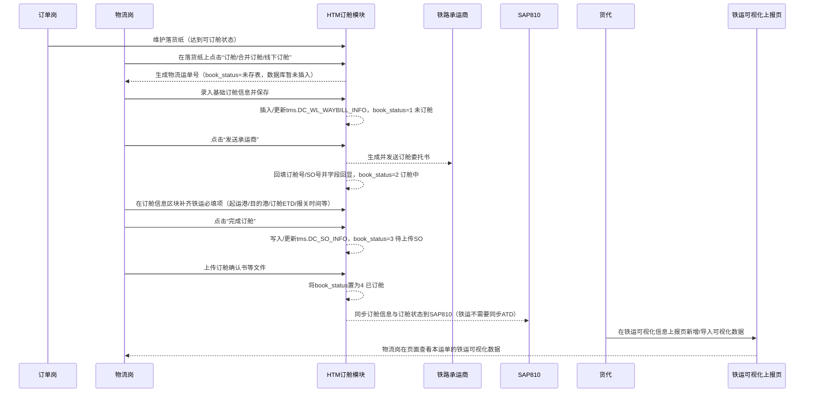
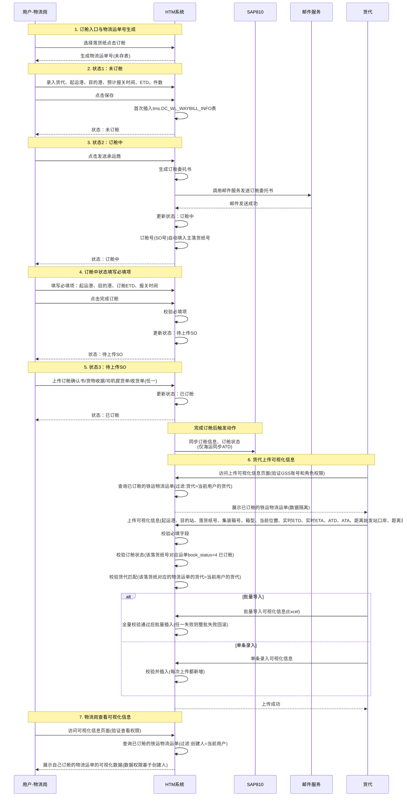
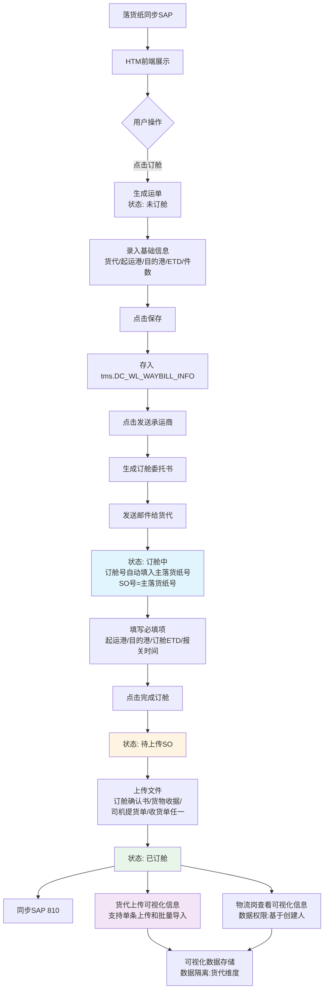
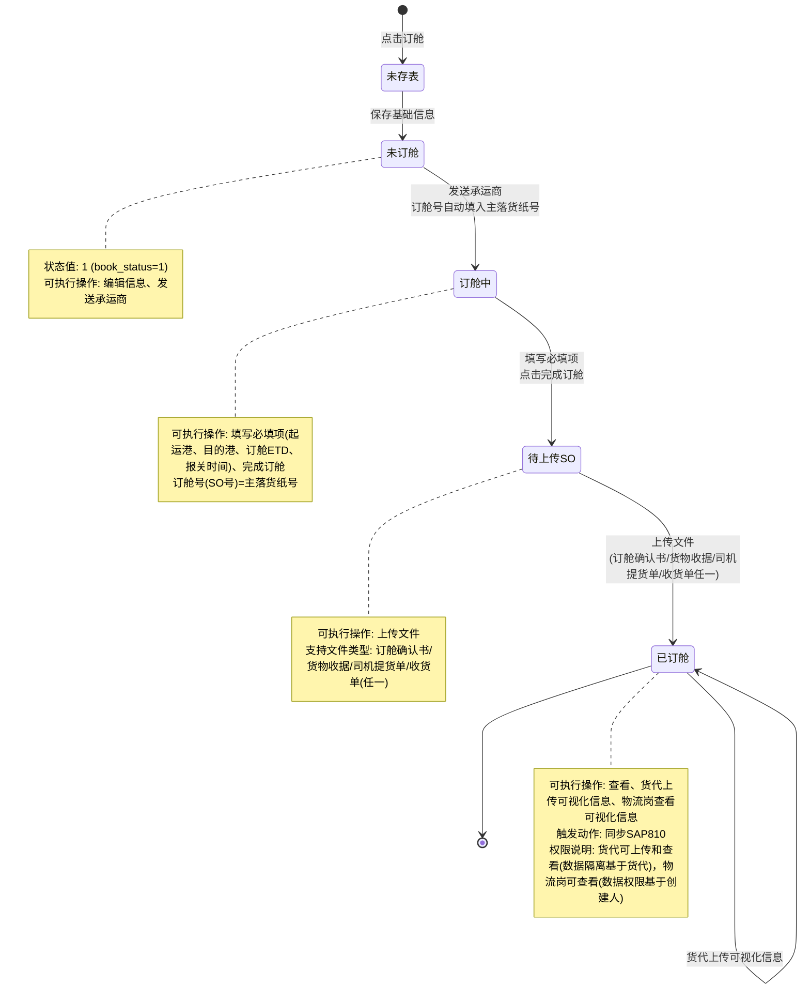
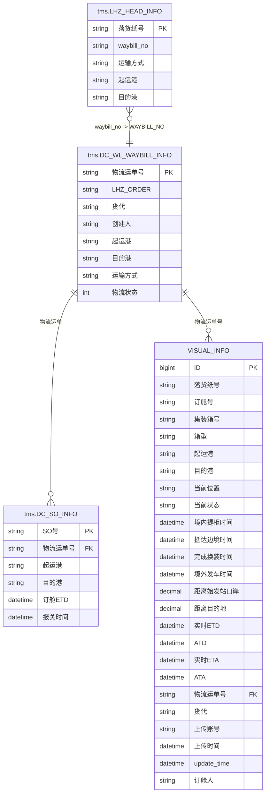

# 版块2：订舱管理-铁运订舱管理 功能说明

> **⚠️ 重要提示**：本文档为铁运订舱管理完整PRD，包含通用规则（所有运输方式）和铁运订舱的特殊规则。本文档可独立输出PRD，无需依赖主文档。

## 文档说明

- **业务版块**: 版块2-订舱管理（铁运专项）
- **文档性质**: 铁运订舱管理完整PRD，包含通用规则和铁运特殊规则
- **参考文档**：
  - `../00-背景知识库.md` - 系统架构、表结构、业务规则等通用知识
  - `../数据库 (1)_tms.docx` - 准确表名和字段定义
  - [`02-订舱管理.md`](./02-订舱管理.md) - 订舱管理主文档（可选参考，包含其他运输方式）
- **逻辑冲突处理**：以最新会议时间为准
- **整理原则**：只整理会议中明确提到的内容，不引申和创造

---

## 0. 文档信息（本次PRD梳理视角）

| 项目 | 内容 |
| :--- | :--- |
| 文档名称 | HTM-订舱管理-铁运订舱管理PRD |
| 业务版块 | 版块2-订舱管理（铁运专项） |
| 上游单据 | 落货纸（`tms.LHZ_HEAD_INFO`/`tms.LHZ_DETAIL_INFO`） |
| 下游单据 | 订舱SO信息（`tms.DC_SO_INFO`）与SAP810中的订舱状态 |
| 适用范围 | HTM中所有运输方式下的订舱通用规则+铁运专项规则，以及铁运可视化信息上报 |
| 主要参考 | `00-HTM功能汇总/02-订舱管理.md`、`00-背景知识库/00-背景知识库-业务版块整理.md`、数据库(1)_tms-表结构拆分.xlsx |
| 当前版本定位 | **在原始会议整理基础上，补充“五件套”视角（流程三件套 + UI两件套），不改变既有业务规则，仅做结构化与可开发化** |

> 本次梳理不会修改已确认的状态值、字段名与业务规则，只在文档中补充抽象视图（流程图、单据流转表、页面架构图等），并对缺失信息用「待确认」标注。

## 1. 业务背景与目标（含本次范围/非本次范围）

### 1.1 业务背景（结合功能汇总与背景知识库）

- 订舱管理在HTM中的定位（参考`00-背景知识库-业务版块整理.md`2. 订舱管理）：
  - 向选定的船公司/铁路公司发起订舱请求，提交基本货物与箱量信息；
  - 完成订舱后，将订舱信息与订舱状态回传到SAP810。
- 运输方式支持：
  - 一期：海运；
  - 二期：空运、铁运、快递、卡车（本文件聚焦铁运）。

### 1.2 本次范围

- **订舱通用规则（所有运输方式）**：
  - 订舱入口与物流运单号生成（单票订舱/合并订舱/线下订舱）；
  - `book_status`状态机：未存表→未订舱→订舱中→待上传SO→已订舱；
  - 基础信息必填规则、DR/CY港口城市校验规则；
  - 发送承运商→生成并发送订舱委托书；
  - 完成订舱→写入`tms.DC_SO_INFO`；
  - 上传SO/相关文件→已订舱→同步SAP810（铁运不含ATD）。

- **铁运专项规则**：
  - 铁运订舱信息必填/非必填、字段继承规则；
  - 铁运不修改箱型箱量（仅落货纸模块可改，且有价格条款限制）；
  - 铁运不订阅可视化数据，由货代在“铁运可视化信息上报”页面上传；
  - 铁运运单号录入与追踪的特殊说明。

- **铁运可视化信息上报页面**：
  - 账号与权限（货代/GSS账号、物流岗、管理员）；
  - 数据隔离规则（以货代维度隔离）；
  - 表单字段与表格列（订舱号、集装箱号、当前状态等）；
  - 操作与权限矩阵（新增/修改/删除/导入/导出/查看）。

### 1.3 非本次范围

- 海运/空运/快递/卡车等运输方式的订舱专项逻辑；
- 费用管理、单证管理、清关、报表等后续模块；
- 具体铁路承运商接口细节（目前更多为线下/GSS账号维度说明）。

---

## 2. 核心业务逻辑与流程（流程三件套）

### 2.1 时序图：铁运订舱+可视化全链路（Mermaid）


```mermaid
sequenceDiagram
    participant O as 订单岗
    participant L as 物流岗
    participant H as HTM订舱模块
    participant C as 铁路承运商
    participant S as SAP810
    participant F as 货代
    participant V as 铁运可视化上报页

    O->>H: 维护落货纸（达到可订舱状态）
    L->>H: 在落货纸上点击“订舱/合并订舱/线下订舱”
    H-->>L: 生成物流运单号（book_status=未存表，数据库暂未插入）

    L->>H: 录入基础订舱信息并保存
    H-->>H: 插入/更新tms.DC_WL_WAYBILL_INFO，book_status=1 未订舱

    L->>H: 点击“发送承运商”
    H-->>C: 生成并发送订舱委托书
    H-->>H: 回填订舱号/SO号并字段回显，book_status=2 订舱中

    L->>H: 在订舱信息区块补齐铁运必填项（起运港/目的港/订舱ETD/报关时间等）
    L->>H: 点击“完成订舱”
    H-->>H: 写入/更新tms.DC_SO_INFO，book_status=3 待上传SO

    L->>H: 上传订舱确认书等文件
    H-->>H: 将book_status置为4 已订舱
    H-->>S: 同步订舱信息与订舱状态到SAP810（铁运不需要同步ATD）

    F->>V: 在铁运可视化信息上报页新增/导入可视化数据
    V-->>L: 物流岗在页面查看本运单的铁运可视化数据
```

> 上图严格基于本文后续章节与背景知识库的状态定义（`book_status=1/2/3/4`），未增加新状态，只补充了参与方视角。

### 2.2 单据流转表（指定/通知/结果三层）

| 单据层 | 单据名称 | 载体/表结构 | 关键字段 | 说明 |
| :--- | :--- | :--- | :--- | :--- |
| 指定/申请单层 | 订舱申请（隐含在物流运单） | `tms.DC_WL_WAYBILL_INFO`（关联`LHZ_HEAD_INFO`） | `waybill_no`、`shipping_type`、`book_status`等 | 由落货纸发起订舱，生成物流运单，承载订舱申请信息 |
| 通知单层 | 订舱委托书（发送承运商） | 生成的托书PDF/邮件（无单独表） | 承运商、起运港/目的港、ETD、箱型箱量等 | 点击“发送承运商”时生成并发送，对外通知铁路承运商 |
| 结果单层 | 订舱结果（SO/订舱确认） | `tms.DC_SO_INFO` + 附件（订舱确认书等） | SO号、订舱确认信息等 | “完成订舱”后写入SO信息，“待上传SO→已订舱”时上传确认书并同步SAP810 |

### 2.3 关键节点文字解析（按状态机拆解）

1. **节点N0：生成物流运单号（未存表）**
   - 前置：落货纸达到订舱入口展示条件（详见1.6.3落货纸展示与订舱规则）。
   - 触发：在落货纸上点击“单票订舱/合并订舱/线下订舱”。
   - 后置：页面生成物流运单号，但`tms.DC_WL_WAYBILL_INFO`尚未插入记录（未存表态）。

2. **节点N1：保存基础信息（进入未订舱）**
   - 前置：物流岗在订舱页面填写基础信息（货代、预计报关日期、ETD、件数等必填）。
   - 触发：点击“保存”。
   - 后置：插入`tms.DC_WL_WAYBILL_INFO`首条记录，`book_status=1 未订舱`；可执行编辑、生成订舱委托书、发送承运商等操作。

3. **节点N2：发送承运商（未订舱→订舱中）**
   - 前置：`book_status=1 未订舱`，基础信息满足必填规则。
   - 触发：点击“发送承运商”按钮。
   - 后置：
     - 生成订舱委托书并通过邮件/接口发送给承运商；
     - 回填订舱号/SO号（等于主落货纸号、不带(H)后缀），并在页面置灰不可编辑；
     - `book_status`更新为2 订舱中；订舱信息区块字段从`tms.DC_WL_WAYBILL_INFO`回显。

4. **节点N3：完成订舱（订舱中→待上传SO）**
   - 前置：`book_status=2 订舱中`，铁运必填项（起运港、目的港、订舱ETD、报关时间等）通过校验。
   - 触发：点击“完成订舱”按钮。
   - 后置：
     - 将订舱信息写入`tms.DC_SO_INFO`（首次插入或更新）；
     - `book_status`更新为3 待上传SO。

5. **节点N4：上传SO/相关文件（待上传SO→已订舱）**
   - 前置：`book_status=3 待上传SO`。
   - 触发：上传至少一类规定文件（订舱确认书、货物收据、司机提货单、收货单等）。
   - 后置：
     - `book_status`更新为4 已订舱；
     - 触发统一的“完成订舱后同步SAP810”逻辑（订舱信息+订舱状态；铁运无需同步ATD）。

6. **节点N5：铁运可视化信息上报**
   - 前置：订舱状态为已订舱，且货代已配置GSS账号与上传角色。
   - 触发：货代在“铁运可视化信息上报”页面通过新增/导入操作录入可视化数据。
   - 后置：
     - 可视化数据写入铁运可视化相关表（具体表名在背景知识库中暂未完全确认，标记为「待确认」）；
     - 物流岗可按“自己订舱的物流运单”维度查询查看。

---

## 3. UI与交互说明（UI两件套）

### 3.1 页面架构图（概览）

```text
订舱管理
├── 订舱列表页
│   ├── 筛选区（按运输方式/状态/落货纸等）
│   ├── 操作按钮区（单票订舱/合并订舱/线下订舱等）
│   └── 数据表格区（展示物流运单号、book_status、运输方式等）
├── 铁运订舱详情/编辑页
│   ├── 基础信息区（货代、预计报关日期、ETD、件数等）
│   ├── 订舱信息区（起运港、目的港、订舱ETD、报关时间、SO号等）
│   └── 附件上传区（订舱确认书等）
└── 铁运可视化信息上报页
    ├── 筛选区（订舱号、集装箱号、当前状态等）
    ├── 操作按钮区（新增/导入/导出/修改/删除）
    └── 数据表格区（可视化记录列表）
```

### 3.2 页面与操作交互清单（概要）

| 操作 | 所在页面 | 说明 | 权限要求/状态限制 |
| :--- | :--- | :--- | :--- |
| 单票订舱 | 订舱列表页 | 选择一票落货纸点击“订舱”，生成单个物流运单号，进入未存表态 | 角色=物流岗；落货纸满足可订舱条件 |
| 合并订舱 | 订舱列表页 | 选择多票落货纸合并订舱，生成1个物流运单号 | 角色=物流岗；主落货纸按TEU规则选取 |
| 线下订舱 | 订舱列表页 | 直接生成“订舱中”状态的物流运单，用于线下已订舱场景 | 角色=物流岗；适用已在线下完成订舱的运单 |
| 保存基础信息 | 铁运订舱详情页 | 录入并保存基础信息，首次写入`tms.DC_WL_WAYBILL_INFO`，book_status=1未订舱 | 角色=物流岗；必填项通过校验 |
| 发送承运商 | 铁运订舱详情页 | 生成并发送订舱委托书，同时设置订舱号/SO号，并将状态置为订舱中 | 角色=物流岗；当前状态=未订舱 |
| 完成订舱 | 铁运订舱详情页 | 对铁运订舱信息进行最终校验，通过后写入`tms.DC_SO_INFO`并将状态置为待上传SO | 角色=物流岗；当前状态=订舱中 |
| 上传订舱确认书等文件 | 附件上传区 | 在待上传SO状态上传至少一种规定文件，将状态置为已订舱 | 角色=物流岗；当前状态=待上传SO |
| 进入铁运可视化信息上报页 | 已订舱铁运运单 | 在已订舱状态的铁运物流运单上展示“上传可视化信息”入口 | 角色=货代/物流岗；当前运输方式=铁运且book_status=已订舱 |
| 新增/导入可视化信息 | 铁运可视化信息上报页 | 货代基于订舱号、集装箱号等录入或导入可视化记录 | 角色=货代（具有上传角色） |
| 查看可视化信息 | 铁运可视化信息上报页 | 物流岗查看自己订舱运单的可视化数据；货代查看本货代的全部上传数据 | 角色=物流岗/货代/管理员；范围按权限矩阵控制 |

---

## 4. 涉及表结构与关键字段（汇总视图）

> 详细字段类型、长度、索引等以《数据库(1)_tms-表结构拆分.xlsx》为准，本节只从业务视角汇总“这一份铁运订舱PRD真正用到的字段”和“它们在文档中的角色”。

### 4.1 核心业务表总览

| 表名 | 所属库 | 角色定位 | 在本文中的主要作用 |
| :--- | :--- | :--- | :--- |
| `tms.LHZ_HEAD_INFO` | TMS | 落货纸头表 | 订舱入口上游单据；决定可订舱范围、主落货纸选取、运输方式等 |
| `tms.LHZ_DETAIL_INFO` | TMS | 落货纸明细表 | 箱型箱量、货物明细等来源；铁运不在订舱内改箱型箱量 |
| `tms.DC_WL_WAYBILL_INFO` | TMS | 物流运单信息表 | 承载订舱申请信息与订舱状态`book_status`，驱动整个状态机 |
| `tms.DC_SO_INFO` | TMS | 订舱SO信息表 | 承载订舱结果（SO号、订舱ETD/ETA等），作为与SAP和可视化的桥梁 |
| `VISUAL_INFO`（表名待最终确认） | TMS/BI | 铁运可视化信息表 | 存储货代上传的铁运可视化记录（SO号+集装箱号+时间节点等） |

### 4.2 `tms.DC_WL_WAYBILL_INFO`关键字段（和本PRD绑定最紧的那一批）

| 字段名 | 类型（略） | 必填 | 业务含义 | 在文档中的使用位置 |
| :--- | :--- | :--- | :--- | :--- |
| `WAYBILL_NO` | - | 是 | 物流运单号，订舱流程主键 | 0节文档信息、1.6.1订舱入口与生成规则、2.2单据流转表、2.3节点N0/N1等 |
| `book_status` | - | 是 | 订舱状态：1未订舱/2订舱中/3待上传SO/4已订舱 | 1.1状态流转概览表、1.2/1.3/1.4、2.3节点N1~N4、用作可视化上传校验条件 |
| `LOADING_PORT` | - | 通用必填 | 起运港 | 1.2.2字段定义表、1.3.6字段继承表、4.1/4.2表汇总 |
| `DEST_PORT` | - | 通用必填 | 目的港 | 同上 |
| `ETD` | - | 通用必填 | 预计离港时间（订舱ETD） | 1.2.1必填项、1.6.10.4必填规则、缺失预警计算条件 |
| `CUSTOMS_DATE` | - | 铁运必填 | 报关时间 | 1.3.1/1.3.6、节点N3“完成订舱”校验 |
| `PLAN_BOX` | - | 否 | 计划箱型箱量合计 | 1.3.6字段继承表、1.6.6箱型箱量规则说明 |
| `shipping_type` | - | 是 | 运输方式描述 | 1.6.8/1.6.10.4、可视化导出“运输方式”展示 |
| `shipping_type_code` | - | 是 | 运输方式代码（01海运/05铁运等） | 1.6.8运输方式字段同步规则、可视化过滤条件 |
| `CARRIER_DESC` 等 | - | 是 | 货代名称 | 铁运可视化、预警邮件中“货代”字段来源 |

### 4.3 `tms.DC_SO_INFO`关键字段（和可视化/预警强相关）

| 字段名 | 类型（略） | 必填 | 业务含义 | 本文使用说明 |
| :--- | :--- | :--- | :--- | :--- |
| `SO_NO`（实际字段名待数据库确认） | - | 是 | 订舱号（等于主落货纸号、不带(H)），同时是货代/可视化侧的Booking No | 1.3.1/1.3.6、2.2单据流转表、可视化导入“订舱号”字段说明 |
| `WAYBILL_NO` | - | 是 | 关联物流运单号 | ER图、4.6业务规则表中的关联关系说明 |
| `ETD` | - | 是 | 订舱预计离港时间 | 2.x缺失预警逻辑、预警明细“订舱ETD”字段 |
| `ETA` | - | 条件必填 | 订舱预计到港时间 | 同上，“订舱ETA”字段 |
| 创建人/订舱人字段 | - | 是 | 物流岗订舱人 | 货代可视化上传表里的“订舱人”自动带出逻辑 |

> 更细粒度的字段（如箱型、班列号、航次等），本文档只在具体章节中点到，不再在汇总视图重复罗列。

### 4.4 可视化相关表与字段（抽象版）

| 表/视图 | 核心字段 | 说明 |
| :--- | :--- | :--- |
| `VISUAL_INFO`（待确认） | 订舱号(SO)、集装箱号、实时ETD、ATD、实时ETA、ATA、当前位置、上传时间、上传人、货代等 | “二、铁运可视化信息上报”中所有字段来源、模板字段、预警逻辑均围绕此表展开 |
| 报警明细视图/报表 | 订舱号、集装箱号、缺失类型、订舱ETD/ETA、实时ETD/ETA/ATD/ATA、货代、物流岗等 | 3.x“缺失预警场景”和SQL示例依赖的报表输出结构 |

---

## 5. 非功能需求与质量要求（摘要）

> 非功能这一块在原文中是分散在“预警规则、权限矩阵、数据隔离、时间格式要求”等小点里，这里把对开发/测试影响最大的几类抽出来，方便你做验收checklist。

### 5.1 性能与容量（铁运订舱+可视化）

- **订舱侧**：
  - 支持大批量合并订舱（多落货纸→一物流运单），页面操作需在可接受时间内完成（建议：保存/发送托书<3秒级，非硬性指标，可在实施阶段细化）。
- **可视化侧**：
  - 批量导入可视化信息（按订舱号+箱号多行），单次导入行数上限、超限反馈方式在详设中补“待确认”，但需提前为大批量上传预留索引设计。

### 5.2 权限、安全与数据隔离

- **权限模型**（对应原文2.2/2.3）：
  - 严格区分货代/物流岗/管理员的**访问、上传、修改、删除**权限，并按角色+数据范围控制；
  - 货代只能操作本货代维度的数据；物流岗只能看到自己订舱的运单；管理员可见/可删全部。
- **数据隔离**：
  - 以“货代”为强隔离维度，要求在SQL示例和接口层都不能出现“全表扫描+前端过滤”的实现方式；
  - 所有与`VISUAL_INFO`、`tms.DC_WL_WAYBILL_INFO`的查询，都应在where条件中带上货代/订舱人过滤。

### 5.3 可观测性与预警

- 缺失预警场景（实时ETD/ATD/ETA/ATA缺失）不仅要产出报表/邮件，还应预留：
  - 日志记录“本次预警扫描命中多少行/每类缺失多少行”；
  - 对极端场景（如可视化全量缺失、订舱表数据异常）的自我保护逻辑（避免一次异常造成预警邮件爆炸），此处在详设中标注为“待补充”。

### 5.4 兼容性与扩展性

- 本文所有规则在设计时默认：**海运和铁运共用一套订舱状态机+可视化底座**，扩展到空运/快递/卡车时：
  - 复用`book_status`状态机；
  - 通过`shipping_type_code`做场景分支，不新增一套状态字段。

---

## 6. 口径差异与后续工作

### 6.1 与主订舱文档/背景知识库的口径对齐

- **已对齐的点**：
  - 订舱状态机`book_status=1/2/3/4`及说明：以背景知识库订舱管理章节为准；
  - 表名口径：统一使用`tms.DC_WL_WAYBILL_INFO`、`tms.DC_SO_INFO`等带`tms.`前缀的写法；
  - “完成订舱后同步SAP810，但铁运不需要同步ATD”的规则，与主文档保持一致。
- **需要注意/容易混淆的点**：
  - 可视化数据源：海运来自船公司订阅，铁运来自货代上传（本文件“二、铁运可视化信息上报”）；不同运输方式的数据源不要混用。

### 6.2 当前文档中标注的“待确认”项（供你后面过会或评审用）

| 序号 | 位置 | 待确认内容 | 预期确认人 |
| :--- | :--- | :--- | :--- |
| 1 | 2.3节点N5/可视化相关表 | 铁运可视化信息真实表名是否为`VISUAL_INFO`，以及关键字段名 | 系统/DBA |
| 2 | 4.3 `tms.DC_SO_INFO`字段 | `SO_NO`、创建人/订舱人等精确字段名、类型 | 系统/DBA |
| 3 | 可视化导入模板 | 单次导入上限、失败行处理方式（整体回滚还是局部跳过） | 产品+开发 |
| 4 | 预警任务调度策略 | 预警任务运行频率（按日/按小时）、异常重试机制 | 产品+运维 |

### 6.3 后续建议动作

- 在评审时，可以直接拿本PRD前半部分（0~6节）做“总览页”，把“一、铁运订舱 / 二、铁运可视化信息上报”作为详细章节查阅；
- 等你把这些“待确认”项在会议里敲定后，我可以再帮你：
  - 更新本PRD中的字段名/表名口径；
  - 补一份基于当前规则的**验收用例清单**（按状态机+可视化预警拆测试用例）。

---

## 一、铁运订舱（包含通用和铁运订舱规则，物流岗订舱）

> **说明**：本节包含铁运订舱的通用规则和特殊规则，由物流岗执行订舱操作。

### 1.1 状态流转概览

**状态流转**：未存表 → 未订舱 → 订舱中 → 待上传SO → 已订舱

| 状态 | 状态值 | 说明 | 可执行操作 | 数据存储 |
| :--- | :--- | :--- | :--- | :--- |
| 未存表 | - | 点击订舱后生成物流运单号，但未存表 | 录入基础信息、保存 | `tms.DC_WL_WAYBILL_INFO`表无数据 |
| 未订舱 | 1 | 保存基础信息后首次存表 | 编辑信息、生成订舱委托书、发送承运商 | `tms.DC_WL_WAYBILL_INFO`表首次插入，`book_status=1` |
| 订舱中 | 2 | 发送承运商后 | 录入订舱信息、批量导入导出、相似创建 | `tms.DC_WL_WAYBILL_INFO`表已存，`book_status=2` |
| 待上传SO | 3 | 录入订舱信息并保存后 | 上传订舱确认书等文件 | `tms.DC_SO_INFO`表首次插入或更新，`book_status=3` |
| 已订舱 | 4 | 上传文件后 | 查看、关联订舱 | 触发同步SAP和订阅，`book_status=4` |

**说明**：`book_status` 字段存储在 `tms.DC_WL_WAYBILL_INFO` 表中，用于标识订舱状态。

**适用范围**：所有运输方式（海运、铁运、空运、快递、卡车、混合）

---

### 1.2 未订舱 → 订舱中（所有运输方式通用规则）

#### 1.2.1 基本信息必填项

| 字段名称 | 是否必填 | 说明 |
| :--- | :--- | :--- |
| 货代 | ✅ 必填 | 货代信息 |
| 预计报关日期 | ✅ 必填 | 预计报关日期 |
| ETD | ✅ 必填 | 预计离港时间 |
| 件数 | ✅ 必填 | 货物件数 |
| 起运港 | ✅ 必填 | 起运港口 |
| 目的港 | ✅ 必填 | 目的港口 |

#### 1.2.2 DR/CY港口城市校验规则

**适用范围**：订舱管理（所有运输方式）

**字段定义表**：

| 字段类型 | 字段名称 | 说明 |
| :--- | :--- | :--- |
| 运输方式字段 | 提货地运输方式 | 必填 |
| 运输方式字段 | 目的地运输方式 | 必填 |
| 港口字段 | 起运港 | 港口字段 |
| 港口字段 | 目的港 | 港口字段 |
| 城市字段 | 起运地城市 | 城市字段 |
| 城市字段 | 目的地城市 | 城市字段 |

**必填规则表**：

| 规则类型 | 字段 | 必填条件 | 说明 |
| :--- | :--- | :--- | :--- |
| 通用规则 | 起运港 | 任何时候 | 不区分DR/CY，所有情况必填 |
| 通用规则 | 目的港 | 任何时候 | 不区分DR/CY，所有情况必填 |
| 通用规则 | 提货地运输方式 | 任何时候 | 不区分DR/CY，所有情况必填 |
| 通用规则 | 目的地运输方式 | 任何时候 | 不区分DR/CY，所有情况必填 |
| 条件规则 | 起运地城市 | 提货地运输方式=DR时 | 仅在DR（Door，门到门）时必填 |
| 条件规则 | 目的地城市 | 目的地运输方式=DR时 | 仅在DR（Door，门到门）时必填 |
| 例外规则 | 起运地城市 | 货代=COSCO时 | 无论运输方式，城市与港口均必填 |
| 例外规则 | 目的地城市 | 货代=COSCO时 | 无论运输方式，城市与港口均必填 |

#### 1.2.3 状态变更触发

| 触发操作 | 状态变更 | 触发动作 | 适用范围 |
| :--- | :--- | :--- | :--- |
| 点击"发送承运商"按钮 | 未订舱 → 订舱中 | 1. 生成订舱委托书<br/>2. 发送承运商（如果生成托书没有问题，则调用邮件服务或接口发送给承运商） | 所有运输方式（海运、铁运、空运、快递、卡车、混合） |

---

### 1.3 订舱中 → 待上传SO（铁运特殊规则）

#### 1.3.1 订舱信息必填项与非必填项（铁运）

**必填项表**：

| 字段名称 | 是否必填 | 说明 |
| :--- | :--- | :--- |
| 起运港 | ✅ 必填 | 起运港口 |
| 目的港 | ✅ 必填 | 目的港口 |
| ETD（订舱ETD） | ✅ 必填 | 订舱预计离港时间 |
| 报关时间 | ✅ 必填 | 报关时间 |

**非必填项说明**：

| 字段类型 | 是否必填 | 示例字段 |
| :--- | :--- | :--- |
| 其他订舱信息字段 | ❌ 非必填 | ETA、船名、航次等 |

**校验与状态变更规则表**：

| 操作 | 校验时机 | 状态变更 | 说明 |
| :--- | :--- | :--- | :--- |
| 点击"完成订舱"按钮 | 点击时校验 | 订舱中 → 待上传SO | 校验必填项后变更状态 |

**订舱号规则表**：

| 字段名称 | 规则说明 | 生成时机 | 说明 |
| :--- | :--- | :--- | :--- |
| 订舱号 | 等于主落货纸号 | 发送承运商后自动填入 | 与SO号一致 |
| SO号 | 等于主落货纸号，**不带 (H) 后缀** | 发送承运商后自动填入 | 与订舱号一致 |

#### 1.3.6 发送承运商后的状态变更与字段继承规则（铁运）

**触发动作**：点击"发送承运商"按钮

**状态变更**：

- 物流状态从 **未订舱** 变为 **订舱中**

**字段继承与页面展示规则**：

发送承运商后，订舱信息区块的以下字段会从 `tms.DC_WL_WAYBILL_INFO` 表**回显到页面**，但**首次不写入 `tms.DC_SO_INFO` 表**（仅页面展示，用户确认后保存才入库）：

| 页面字段（订舱信息区块） | 来源表 | 来源字段 | 页面状态 | 说明 |
| :--- | :--- | :--- | :--- | :--- |
| 起运港 | `tms.DC_WL_WAYBILL_INFO` | `LOADING_PORT` | 回显、必填 | 继承自基本信息的起运港 |
| 目的港 | `tms.DC_WL_WAYBILL_INFO` | `DEST_PORT` | 回显、必填 | 继承自基本信息的目的港 |
| ETD（订舱ETD） | `tms.DC_WL_WAYBILL_INFO` | `ETD` | 回显、必填 | 继承自基本信息的ETD |
| 报关时间 | `tms.DC_WL_WAYBILL_INFO` | `CUSTOMS_DATE` | 回显、必填 | 继承自基本信息的预计报关时间 |
| SO号（订舱号） | 系统生成 | 主落货纸号（不带H） | 自动填入、**置灰不可修改** | 发送承运商后自动填入，不可编辑 |
| 箱型箱量 | `tms.DC_WL_WAYBILL_INFO` | `PLAN_BOX` | 回显 | 该物流运单下所有落货纸的计划箱型箱量之和 |

**特别说明**：

1. **SO号置灰规则**：发送承运商后，SO号（订舱号）字段自动填入主落货纸号（不带 `(H)` 后缀），该字段置灰不可修改
2. **不写入 DC_SO_INFO 的时机**：首次进入"订舱中"状态时，上述字段仅页面回显，`tms.DC_SO_INFO` 表尚未插入数据；用户填写完必填项并点击"完成订舱"后才会写入
3. **铁运不继承的字段**：ETA、船名、航次等海运特有字段，铁运不继承、不展示
4. **可视化数据**：铁运可视化数据由货代上传（见"二、铁运可视化信息上报（货代侧）"章节），箱型与 HTM 标准箱型一致

---

### 1.4 待上传SO → 已订舱（所有运输方式通用规则）

#### 1.4.1 文件上传要求与状态变更

**文件上传规则表**：

| 上传时机 | 支持文件类型 | 上传后状态变更 | 说明 |
| :--- | :--- | :--- | :--- |
| "待上传SO"状态时上传 | 订舱确认书、货物收据、司机提货单、收货单等（任一即可） | 待上传SO → 已订舱 | 不同运输方式可能有差异 |

**状态变更触发规则表**：

| 触发操作 | 状态变更 | 触发动作 | 运输方式说明 |
| :--- | :--- | :--- | :--- |
| 上传文件 | 待上传SO → 已订舱 | 1. 同步SAP810（订舱信息、订舱状态；仅海运同步ATD）<br/>2. 订阅可视化数据（仅海运） | **铁运说明**：铁运不订阅可视化数据，由货代上传可视化信息（见"二、铁运可视化信息上报（货代侧）"章节） |

---

### 1.5 已订舱状态（通用规则）

#### 1.5.1 通用规则

| 状态 | 可执行操作 | 触发动作 | 适用范围 |
| :--- | :--- | :--- | :--- |
| 已订舱 | 查看、关联订舱 | 同步SAP810（所有运输方式） | 所有运输方式 |

---

### 1.6 其他通用规则

#### 1.6.1 订舱入口与物流运单号生成

**订舱方式表**：

| 订舱方式 | 操作说明 | 生成状态 | 说明 |
| :--- | :--- | :--- | :--- |
| 单票订舱 | 选择一票落货纸点击订舱 | 未存表 | 生成物流运单号 |
| 合并订舱 | 选择多票落货纸合并订舱 | 未存表 | 生成物流运单号 |
| 线下订舱 | 选择落货纸点击"线下订舱" | 订舱中 | 直接生成"订舱中"状态 |

**物流运单号生成规则表**：

| 规则项 | 规则说明 | 数据存储状态 |
| :--- | :--- | :--- |
| 生成时机 | 用户点击订舱后，物流运单号已生成（页面上可见） | `tms.DC_WL_WAYBILL_INFO`表中无数据 |
| 唯一性要求 | 物流运单号作为订舱流程主键，必须唯一标识 | - |

#### 1.6.2 权限规则

| 角色/岗位 | 查看 | 新建订舱 | 编辑订舱信息 | 发送承运商 | 上传确认书 | 批量导入导出 |
| :--- | :--- | :--- | :--- | :--- | :--- | :--- |
| 物流岗 | ✓ | ✓ | ✓ | ✓ | ✓ | ✓ |
| 订单岗 | ✓ | ✗ | ✗ | ✗ | ✗ | ✗ |

#### 1.6.3 落货纸展示与订舱规则

| 阶段 | 展示条件 | 可订舱状态 | 说明 |
| :--- | :--- | :--- | :--- |
| 一期 | 海运、非LCL、价格条款非EXW | 区域经理审核、执行 | 仅支持海运非LCL非EXW |
| 二期 | 全量落货纸（所有运输方式、所有LCL状态、所有价格条款） | 提交审核、区域经理审核、执行 | 支持全量落货纸 |

#### 1.6.4 数据同步规则

**SAP同步规则表**（所有运输方式通用）：

| 同步项 | 同步时机 | 同步内容 | 运输方式说明 |
| :--- | :--- | :--- | :--- |
| SAP同步 | 完成订舱后（所有运输方式都有） | 1. 同步订舱信息（船运信息）<br/>2. 同步订舱状态<br/>3. **同步ATD**：仅海运需要同步ATD（如果有，海运场景下包括关联订舱触发的ATD同步） | **铁运说明**：铁运不需要同步ATD<br/>其他运输方式（铁运、空运、快递、卡车、混合）不需要同步ATD |

#### 1.6.5 件数修改规则

| 规则项 | 规则说明 | 数据来源 |
| :--- | :--- | :--- |
| 修改权限 | 件数可以修改，修改后只存表，不需要反向同步 | - |
| 单位规则 | 单位不可修改，数值可修改 | 单位（如`PCS`）应从`tms.DC_WL_WAYBILL_INFO`表中获取 |

#### 1.6.6 箱型箱量修改规则

| 价格条款/运输方式 | 是否可修改 | 修改位置 | 说明 |
| :--- | :--- | :--- | :--- |
| FOB价格条款（海运） | ✅ 可修改 | 落货纸管理模块 | 只有FOB价格条款可以在落货纸管理里修改箱型箱量 |
| 其他价格条款（ESW、FCA、CIF、CFR等） | ❌ 不可修改 | - | 其他价格条款都不可以在落货纸管理里修改箱型箱量 |
| 铁运 | ❌ 不可修改 | - | **铁运明确不可修改箱型箱量** |
| 空运 | ❌ 不可修改 | - | 除海运FOB外，其他运输方式都不可以修改箱型箱量 |
| 快递 | ❌ 不可修改 | - | 除海运FOB外，其他运输方式都不可以修改箱型箱量 |
| 卡车 | ❌ 不可修改 | - | 除海运FOB外，其他运输方式都不可以修改箱型箱量 |

**说明**：箱型箱量的修改在落货纸管理模块，不在订舱管理模块

#### 1.6.7 运输方式字段同步规则

| 字段名称 | 字段说明 | 同步来源 | 同步时机 | 适用范围 |
| :--- | :--- | :--- | :--- | :--- |
| `shipping_type` | 运输方式描述 | 主落货纸的 `tms.lhz_head_info.trans_type_desc` | 点击订舱后，在 `TMS.DC_WL_WAYBILL_INFO` 增加一条数据时同步 | 所有运输方式（海运、铁运、空运、快递、卡车、混合） |
| `shipping_type_code` | 运输方式代码（01=海运，02=空运，03=卡车，04=快递，05=铁运，06=混合） | 主落货纸的 `tms.lhz_head_info.trans_type` | 点击订舱后，在 `TMS.DC_WL_WAYBILL_INFO` 增加一条数据时同步 | 所有运输方式（海运、铁运、空运、快递、卡车、混合） |

**数据来源**：主落货纸的 `tms.lhz_head_info` 表

#### 1.6.8 委托书生成与发送规则

| 规则项 | 规则说明 | 触发动作 | 适用范围 |
| :--- | :--- | :--- | :--- |
| 按钮合并 | 委托书生成与更新和发送承运商按钮合并为一个按钮（"发送承运商"） | 点击"发送承运商"按钮时，会完成委托书生成与发送 | 所有运输方式 |
| 触发动作 | 1. 生成订舱委托书<br/>2. 发送承运商（如果生成托书没有问题，则调用邮件服务或接口发送给承运商） | - | 所有运输方式 |

#### 1.6.9 主落货纸选取规则（合并订舱）

**适用范围**：所有运输方式（海运、铁运、空运、快递、卡车、混合）

**TEU计算规则表**：

| 箱型 | TEU系数 | 计算公式说明 |
| :--- | :--- | :--- |
| 20GP | 1TEU | `sum = 20GP箱量 + 40GP箱量*2 + 40HQ箱量*2 + 40NOR箱量*2` |
| 40GP | 2TEU | 将所有箱型箱量转换成TEU标准进行对比 |
| 40HQ | 2TEU | 将所有箱型箱量转换成TEU标准进行对比 |
| 40NOR | 2TEU | 将所有箱型箱量转换成TEU标准进行对比 |

**主落货纸选取逻辑表**：

| 场景 | 选取规则 | 说明 |
| :--- | :--- | :--- |
| 多个落货纸合并订舱 | 取TEU（sum值）最大的落货纸为主落货纸 | 优先按TEU值选取 |
| TEU最大的落货纸有两个（sum值相等） | 取落货纸号最大的为主落货纸 | 当TEU相等时，按落货纸号选取 |

**显示规则表**：

| 场景 | 显示规则 | 说明 |
| :--- | :--- | :--- |
| 多票合并订舱 | 主落货纸会加括号`(H)` | 标识主落货纸 |
| 单票点击订舱 | 不会加括号`(H)` | 单票不需要标识 |

#### 1.6.10 铁运特殊功能

##### 1.6.10.1 铁运字段要求

| 字段名称 | 是否必填 | 卡控逻辑 | 说明 |
| :--- | :--- | :--- | :--- |
| 提货地城市 | ✅ 必填 | 遵循通用 DR/CY 规则（仅当对应端的运输方式为 DR 时必填；或当货代为 COSCO 时无条件必填） | 遵循通用 DR/CY 规则（仅当对应端的运输方式为 DR 时必填；或当货代为 COSCO 时无条件必填） |
| 目的地城市 | ✅ 必填 | 遵循通用 DR/CY 规则（仅当对应端的运输方式为 DR 时必填；或当货代为 COSCO 时无条件必填） | 遵循通用 DR/CY 规则（仅当对应端的运输方式为 DR 时必填；或当货代为 COSCO 时无条件必填） |

##### 1.6.10.2 铁运运单号录入与追踪

| 规则项 | 规则说明 | 说明 |
| :--- | :--- | :--- |
| 铁运运单号 | 订仓前填主落货纸号，用于费用核对和与承运商对接 | - |
| 铁运追踪问题 | 目前HTM整体用SO number追踪可视化数据，但铁运提单号较晚出现，影响前期追踪 | - |

##### 1.6.10.3 箱型箱量规定

| 规则项 | 规则说明 | 说明 |
| :--- | :--- | :--- |
| 箱型箱量 | 铁路按实际情况填写，铁运和海运的通用箱型如HQGP可满足需求 | - |

##### 1.6.10.4 ETD和ETA必填规则

| 字段名称 | 必填规则 | 填写说明 | 说明 |
| :--- | :--- | :--- | :--- |
| ETD | ✅ 所有情况都必填 | EXW按预计提走时间填，集装箱离厂大门就算。铁路以出工厂时间作为上收入节点 | - |
| ETA | ⚠️ 条件必填 | CD条款下各种运输方式都必填，非CD条款非必填 | - |

---

## 二、铁运可视化信息上报（货代侧）

> **说明**：本节描述铁运可视化信息“上报”新页面功能。用户订舱完成后，货代在此页面上报可视化数据；物流岗对自己订舱的运单拥有查看权限。

### 2.1 功能概述

| 功能项 | 说明 |
| :--- | :--- |
| 功能描述 | 在已订舱状态后，提供新页面让货代上传可视化信息 |
| 功能入口 | 已订舱状态的铁运物流运单，提供"上传可视化信息"按钮或入口 |
| 触发时机 | 用户订舱完成后，货代会到这个新的页面上传可视化数据 |

### 2.2 账号与权限配置

#### 2.2.1 GSS账号配置

| 配置项 | 配置说明 |
| :--- | :--- |
| 账号配置 | 需要给各个货代配置GSS账号，每个货代可以有多个账号，账号与货代关联 |

#### 2.2.2 角色权限配置

| 角色 | 权限说明 |
| :--- | :--- |
| 货代角色 | 具有上传角色的货代可以访问上传页面并上传可视化数据 |
| 物流岗角色 | 具有查看权限的物流岗可以访问页面查看可视化数据 |

#### 2.2.3 数据隔离规则

| 隔离场景 | 隔离规则 | 说明 |
| :--- | :--- | :--- |
| 货代之间 | 货代之间的数据不可见（A货代看不到B货代的数据） | 数据隔离基于货代维度 |
| 同一货代内 | 同一个货代内，账号上传的数据可见（A货代的账号1和账号2可以看到彼此上传的数据） | 数据隔离基于货代维度 |

### 2.3 权限与数据访问规则

#### 2.3.1 角色权限配置

| 角色 | 页面访问 | 数据上传 | 数据查看 | 数据删除 | 说明 |
| :--- | :--- | :--- | :--- | :--- | :--- |
| 货代角色 | ✅ 具有上传角色可访问 | ✅ 可上传 | ✅ 可查看 | ✅ 可删除 | 具有上传角色的货代可以访问上传页面并上传可视化数据 |
| 物流岗角色 | ✅ 具有查看权限可访问 | ❌ 不可上传 | ✅ 可查看 | ❌ 不可删除 | 具有查看权限的物流岗可以访问页面查看可视化数据，不可上传数据 |
| 管理员角色 | ✅ 可访问 | ❌ 不可上传 | ✅ 可查看全部数据 | ✅ 可删除全部数据 | 管理员可以查看和删除全部数据，不可上传数据 |

#### 2.3.2 权限矩阵表

| 角色 | 页面访问 | 数据上传 | 数据查看 | 数据删除 | 数据修改 | 数据权限说明 |
| :--- | :--- | :--- | :--- | :--- | :--- | :--- |
| **货代** | ✅ 具有上传角色可访问 | ✅ 可上传自己货代负责的物流运单数据 | ✅ 可查看自己货代上传的所有数据（同一货代内账号数据可见） | ✅ 可删除自己货代上传的数据 | ✅ 可修改自己货代上传的数据（仅支持通过“修改”按钮编辑业务字段，系统自动字段如货代/上传人/上传时间/订舱人不可修改） | 数据隔离基于货代维度 |
| **物流岗** | ✅ 具有查看权限可访问 | ❌ 不可上传 | ✅ 可查看自己订舱的物流运单的可视化数据（创建人=当前用户） | ❌ 不可删除 | ❌ 不可修改 | 数据权限基于物流运单的创建人（订舱人） |
| **管理员** | ✅ 可访问 | ❌ 不可上传 | ✅ 可查看全部数据 | ✅ 可删除全部数据 | ✅ 可修改全部数据（仅支持通过“修改”按钮编辑业务字段，系统自动字段不可修改） | 无数据限制，可操作所有货代的数据 |

### 2.4 UI界面要求

#### 2.4.1 侧边栏导航结构

| 菜单层级 | 菜单名称 | 说明 |
| :--- | :--- | :--- |
| 一级菜单 | HTM | - |
| 二级菜单 | 业务操作模块 | - |
| 三级菜单 | 铁运可视化信息上报 | 当前选中项 |

#### 2.4.2 表格列固定要求

| 列名称 | 固定位置 | 说明 |
| :--- | :--- | :--- |
| 操作列 | 固定右侧 | - |

#### 2.4.3 表单字段与表格列要求

**表单字段要求表**：

| 字段名称 | 字段属性 | 数据来源 | 字段位置 | 说明 |
| :--- | :--- | :--- | :--- | :--- |
| 货代字段 | 只读，不可修改 | 自动带入当前用户所属货代 | **不单独作为可编辑/可见字段出现在“新增可视化信息”表单中** | 系统在保存时自动写入，用于数据隔离与展示 |
| 上传人字段 | 只读，不可修改 | 自动带入当前登录用户姓名 | 同上 | 系统在保存时自动写入，用于追踪责任人 |
| 上传时间字段 | 只读，不可修改 | 自动带入当前系统时间 | 同上 | 系统在保存时自动写入，用于排序与审计，不需要在新增弹窗中占位展示 |
| 修改时间字段 | 只读，不可修改 | 自动带入当前系统时间 | 同上 | **新增：用于记录最近一次修改该条可视化记录的时间**。初始值=上传时间；当货代在页面上通过“修改”操作更新该行数据时，系统自动更新为当前时间；不支持通过页面或Excel模板人工修改 |

**表格列要求表**：

| 列名称 | 列顺序 | 可见性 | 位置说明 |
| :--- | :--- | :--- | :--- |
| 订舱号 | 1 | 所有角色可见 | - |
| 集装箱号 | 2 | 所有角色可见 | - |
| 箱型 | 3 | 所有角色可见 | - |
| 起运港 | 4 | 所有角色可见 | - |
| 目的站 | 5 | 所有角色可见 | - |
| 当前状态 | 6 | 所有角色可见 | - |
| 当前位置 | 7 | 所有角色可见 | - |
| 实时ETD | 8 | 所有角色可见 | - |
| ATD | 9 | 所有角色可见 | - |
| 实时ETA | 10 | 所有角色可见 | - |
| ATA | 11 | 所有角色可见 | - |
| 距离始发站口岸(KM) | 12 | 所有角色可见 | - |
| 距离目的地(KM) | 13 | 所有角色可见 | - |
| 境内提柜时间 | 14 | 所有角色可见 | 可选字段，对应状态**已提柜**；显示为日期（YYYY-MM-DD），若未填写则该列为空 |
| 抵达边境时间 | 15 | 所有角色可见 | 可选字段，对应状态**抵达口岸**；显示为日期（YYYY-MM-DD），若未填写则该列为空 |
| 完成换装时间 | 16 | 所有角色可见 | 可选字段，对应状态**境外换装**；显示为日期（YYYY-MM-DD），若未填写则该列为空 |
| 境外发车时间 | 17 | 所有角色可见 | 可选字段，对应状态**境外在途**；显示为日期（YYYY-MM-DD），若未填写则该列为空 |
| 上传时间 | 18 | 所有角色可见 | - |
| 修改时间 | 19 | 所有角色可见 | **新增列**：记录最近一次修改该条可视化记录的时间，初始值与上传时间一致，后续仅在页面“修改”操作后由系统自动更新 |
| 上传人 | 20 | 所有角色可见 | 显示在\"修改时间\"列之后，\"所属货代\"列之前 |
| 所属货代 | 21 | 所有角色可见（不再仅管理员可见） | 显示在\"上传人\"列之后，\"订舱人\"列之前 |
| 订舱人 | 22 | 所有角色可见 | **列表最后一列（紧挨操作列之前）**，只读列，不允许货代在页面或Excel中维护；由系统根据订舱号关联订舱信息（`tms.DC_WL_WAYBILL_INFO.创建人`或订舱人字段）自动带出 |
| 操作 | 23 | 所有角色可见 | 固定右侧 |

**表格列排序功能说明**：
- **支持排序的列**：时间字段和数量字段支持排序功能，包括：
  - 实时ETD（第8列）
  - ATD（第9列）
  - 实时ETA（第10列）
  - ATA（第11列）
  - 距离始发站口岸(KM)（第12列）
  - 距离目的地(KM)（第13列）
  - 上传时间（第18列）
  - 修改时间（第19列）
- **排序交互**：
  - 在支持排序的列的表头右侧显示排序图标（小点）
  - 点击排序图标可切换排序方式：正序（升序）↔ 倒序（降序）
  - 排序状态通过图标样式区分（如：向上箭头表示升序，向下箭头表示降序）
  - 每次点击切换排序方向，同一时间只能有一列处于排序状态
  - 点击其他列的排序图标时，取消当前列的排序，激活新列的排序
- **排序规则**：
  - 时间字段：按时间值排序（空值/null值排在最后）
  - 数量字段：按数值大小排序（空值/null值排在最后）
  - 排序后列表数据立即更新，保持当前分页设置

#### 2.4.5 页面按钮功能说明

##### 2.4.5.1 查询区域按钮

| 按钮名称 | 功能 | 触发动作 | 查询规则 | 适用角色 |
| :--- | :--- | :--- | :--- | :--- |
| 重置按钮 | 清空所有查询条件，恢复默认状态 | 将所有筛选条件重置为空值，并重新执行查询，显示全部数据 | - | 所有有权限访问页面的角色 |
| 查询按钮 | 根据设置的筛选条件查询可视化信息 | 执行查询逻辑，根据筛选条件过滤数据并更新列表 | 支持多条件组合查询，所有条件之间为"且"的关系 | 所有有权限访问页面的角色 |

##### 2.4.5.2 列表操作按钮

| 按钮名称 | 功能 | 权限要求 | 触发动作 | 文件要求/导入规则 | 数据权限 | 显示条件 |
| :--- | :--- | :--- | :--- | :--- | :--- | :--- |
| 新建按钮 | 打开新增可视化信息表单弹窗，用于单条录入数据 | 仅货代角色有权限 | 打开新增表单弹窗，清空表单数据，自动填充货代、上传人、上传时间等系统字段 | - | - | 当用户角色为货代时显示 |
| 批量导入按钮 | 打开批量导入弹窗，支持通过Excel文件批量导入可视化信息 | 仅货代角色有权限 | 打开批量导入弹窗，支持文件上传和拖拽上传 | 支持.xlsx、.xls格式，文件大小限制10MB；批量导入时，如果存在不符合要求的记录，所有记录都不会入库，需修正错误后重新导入 | - | 当用户角色为货代时显示 |
| 批量删除按钮 | 删除选中的多条可视化信息记录 | 需要具有删除权限（货代角色、管理员） | 打开删除确认弹窗，显示选中记录数量，确认后批量删除 | - | 货代只能删除自己货代上传的数据，管理员可删除所有数据 | 当用户角色为货代时显示（始终显示，不受是否已选中记录的限制） |
| 导出按钮 | 将当前查询结果导出为Excel文件 | 所有有权限访问页面的角色 | 根据当前筛选条件和分页设置，导出所有符合条件的数据（不受分页限制） | 导出字段：包含列表中的所有可见字段 | - | 所有角色可见 |

##### 2.4.5.3 表格行操作按钮

| 按钮名称 | 功能 | 权限要求 | 触发动作 | 数据权限 | 显示条件 |
| :--- | :--- | :--- | :--- | :--- | :--- |
| 修改按钮（表格行内） | 修改单条可视化信息记录 | 需要具有修改权限（货代角色、管理员） | 打开“修改可视化信息”弹窗，加载该条记录的业务字段（起运港、目的站、订舱号、集装箱号、箱型、当前状态、当前位置、境内提柜时间、抵达边境时间、完成换装时间、境外发车时间、距离始发站口岸、距离目的地、实时ETD、ATD、实时ETA、ATA）；用户编辑后点击保存，系统校验通过即更新该条记录，并自动更新“修改时间”字段为当前时间。系统自动字段（订舱人、货代、上传人、上传时间）在修改过程中保持只读，不可变更 | 货代只能修改自己货代上传的数据，管理员可修改所有数据 | 当用户具有修改权限时，在每行数据的操作列中显示 |
| 删除按钮（表格行内） | 删除单条可视化信息记录 | 需要具有删除权限（货代角色、管理员） | 弹出确认对话框，显示要删除的订舱号和集装箱号，确认后删除该条记录 | 货代只能删除自己货代上传的数据，管理员可删除所有数据 | 当用户具有删除权限时，在每行数据的操作列中显示 |

### 2.6 数据结构

**数据结构**（基于Track & Tracing Report截图）：

| 字段名称 | 字段英文名 | 字段说明 | 是否必填 | 数据来源 | 备注 |
| :--- | :--- | :--- | :--- | :--- | :--- |
| **订舱号** | Invoice NO. / PO号 | Invoice NO. / PO号 | ✅ 必填 | 货代上传 | 订舱号（等于主落货纸号） |
| **集装箱号** | container_no | Container Number | ✅ 必填 | 货代上传 | 一个订舱号可以有多个集装箱号 |
| **箱型** | Container Size | Container Size | ✅ 必填 | 货代上传 | 如：40HQ |
| **起运港** | POL | Origin Terminal | ✅ 必填 | 货代上传 | 与订舱时的起运港对应 |
| **目的站** | POD | Destination Terminal | ✅ 必填 | 货代上传 | 与订舱时的目的站对应 |
| **当前状态** | Current Status | 当前运输状态 | ✅ 必填 | 货代上传 | 仅允许从下拉中选择上述 6 个标准值，不支持手动输入其他内容。状态说明：00-已提柜（箱已提柜或进场，尚未实际发车，等待装车或发运）；10-国内已出发（已从始发站发车，处于国内区段运输途中）；20-抵达口岸（已到达国内边境口岸，可能在排队等待出境或办理通关手续）；30-境外换装（已出境并到达境外中转站，正在进行换装、转运等操作）；40-境外在途（离开境外中转站后，继续在境外区段运输途中）；50-已抵达（已到达最终目的站 / 交付站，运输完成） |
| **当前位置** | Current Location | Current Location | ✅ 必填 | 货代上传 | 当前所在位置 |
| **境内提柜时间** | Pickup Time (Domestic) | 境内提柜时间 | ⭕ 可选 | 货代上传 | 对应状态**已提柜**；**录入格式要求**：年月日（YYYY-MM-DD） |
| **实时ETD** | Estimated Time of Departure | Estimated Time of Departure | ✅ 必填 | 货代上传 | 实时预计离港时间，用于预警与可视化展示；**录入格式要求**：年月日（YYYY-MM-DD） |
| **ATD** | ATD | Actual Time of Departure | ⚠️ 条件必填 | 货代上传 | 实际离港时间；**录入格式要求**：年月日（YYYY-MM-DD）；（当状态≥10国内已出发时，本字段转为必填） |
| **实时ETA** | Estimated Time of Arrival | Estimated Time of Arrival | ✅ 必填 | 货代上传 | 实时预计到港时间，用于预警与可视化展示；**录入格式要求**：年月日（YYYY-MM-DD） |
| **ATA** | ATA | Actual Time of Arrival | ⚠️ 条件必填 | 货代上传 | 实际到港时间；**录入格式要求**：年月日（YYYY-MM-DD）；（当状态=50已抵达时，本字段转为必填） |
| **抵达边境时间** | Arrived Border Time | 抵达边境时间 | ⭕ 可选 | 货代上传 | 对应状态**抵达口岸**；**录入格式要求**：年月日（YYYY-MM-DD） |
| **完成换装时间** | Reloading Completed Time | 完成换装时间 | ⭕ 可选 | 货代上传 | 对应状态**境外换装**；**录入格式要求**：年月日（YYYY-MM-DD） |
| **境外发车时间** | Overseas Departure Time | 境外发车时间 | ⭕ 可选 | 货代上传 | 对应状态**境外在途**；**录入格式要求**：年月日（YYYY-MM-DD） |
| **距离始发站口岸** | KM to Border | KM to Border | ⭕ 可选 | 货代上传 | 距离始发站口岸的公里数；**录入格式要求**：数值类型，需大于等于0，可带小数点（如：123.45） |
| **距离目的地** | KM to Destination | KM to Destination | ⭕ 可选 | 货代上传 | 距离目的地的公里数；**录入格式要求**：数值类型，需大于等于0，可带小数点（如：123.45） |
| **创建时间** | create_time | Record Create Time | ✅ 必填 | 系统自动 | 记录该条可视化记录首次入库时间；在页面上以"上传时间"字段展示；用户不可修改；**显示格式要求**：年月日时分秒（YYYY-MM-DD HH:mm:ss） |
| **更新时间** | update_time | Last Updated Time | ✅ 必填 | 系统自动 | 新建时初始值=创建时间；当货代在页面上通过"修改"操作更新该行数据时，系统自动更新为当前时间；在页面上以"修改时间"字段展示；不支持通过页面或Excel模板人工修改；**显示格式要求**：年月日时分秒（YYYY-MM-DD HH:mm:ss） |
| **上传人** | Upload User | 上传人姓名 | ✅ 必填 | 系统自动 | 根据当前登录用户自动带入，只读不可修改 |
| **订舱人** | Booking Operator | 订舱人姓名（物流岗订舱人） | ✅ 必填 | 系统自动 | **不出现在Excel模板和页面表单中**，在货代上传或导入成功后，系统根据订舱号关联订舱信息（如 `DC_WL_WAYBILL_INFO.创建人`/订舱人字段）自动带入，只读不可修改 |
| **货代** | Carrier | 当前用户所属货代 | ✅ 必填 | 系统自动 | 根据当前登录用户自动带入，只读不可修改 |

### 2.7 校验与业务规则

#### 2.7.1 必填字段校验

**字段必填性规则表**：

| 字段类型 | 字段列表 | 校验时机 | 校验失败处理 |
| :--- | :--- | :--- | :--- |
| 必填字段 | 起运港、目的站、订舱号、集装箱号、箱型、当前状态、当前位置、实时ETD、实时ETA | 单条上传时点击保存按钮；批量上传时导入文件后 | 提示用户哪些字段未填写，阻止保存操作 |
| 非必填字段 | 境内提柜时间、抵达边境时间、完成换装时间、境外发车时间、ATD、ATA、距离始发站口岸、距离目的地 | - | - |

#### 2.7.2 订舱状态校验（必须已订舱）

| 校验项 | 校验点 | 校验口径 | 校验失败处理 |
| :--- | :--- | :--- | :--- |
| 订舱状态校验 | 上传的订舱号（即SO号/主落货纸号）所对应的订舱状态必须为 **已订舱** | `tms.DC_WL_WAYBILL_INFO.book_status = 4` | 提示用户"该订舱号未处于已订舱状态，无法上传可视化信息，如有问题请联系海信物流岗（订舱人）"，阻止保存/导入 |

#### 2.7.3 货代匹配校验（订舱号关联的货代=当前用户货代）

| 校验项 | 校验逻辑 | 校验条件 | 校验失败处理 |
| :--- | :--- | :--- | :--- |
| 货代匹配校验 | 上传时需要校验：该订舱号对应的物流运单的货代 = 当前用户的货代 | 1. book_status = 4（已订舱）<br/>2. 货代 = 当前用户的货代 | 提示用户"该订舱号不属于当前货代，无法上传，如有问题请联系海信物流岗（订舱人）"，阻止保存操作 |

**查询逻辑**：

```text
1. 根据订舱号查询物流运单
   SELECT WAYBILL_NO, 货代, book_status
   FROM tms.DC_WL_WAYBILL_INFO
   WHERE LHZ_ORDER = '订舱号'

2. 校验：
   - book_status = 4（已订舱）
   - 货代 = 当前用户的货代
```

#### 2.7.4 批量导入规则（有一条失败则整批失败）

| 规则项 | 规则说明 | 实现建议 |
| :--- | :--- | :--- |
| 批量导入规则 | 批量上传时，只要任意一条记录校验失败，则整批导入失败，**全部回滚**，不落库任何一条 | 批量导入需事务包裹；校验阶段先全量校验，通过后再统一入库 |

##### 2.7.4.1 文件格式要求

- **支持格式**：Excel格式（.xlsx、.xls）
- **文件大小限制**：10MB
- **上传方式**：支持点击选择文件和拖拽上传

##### 2.7.4.2 批量导入弹窗说明

- **说明文字**：在批量导入弹窗中明确说明规则
  - 支持Excel格式（.xlsx、.xls）
  - 文件大小限制：10MB
  - **批量导入规则**：如果存在不符合要求的记录，所有记录都不会入库，请修正错误后重新导入（建议使用红色加粗文字突出显示，避免用户误解）
  - **唯一性规则**：同一 Excel 文件中，**同一"订舱号 + 集装箱号"组合只能出现一次**，如存在重复组合则视为错误

##### 2.7.4.3 导入进度展示

- **进度显示**：导入过程中显示进度条和"正在导入，请稍候..."提示
- **按钮状态**：导入过程中禁用"开始导入"按钮，防止重复提交

##### 2.7.4.4 导入结果展示

- **全部成功**：
  - 显示绿色成功提示框（背景色#F0FDF4，边框#BBF7D0，文字颜色#166534）
  - 显示成功图标（✓）
  - 提示文字："导入成功：成功 X 条记录"
  
- **存在失败**：
  - 显示红色错误提示框（背景色#FEF2F2，边框#FECACA，文字颜色#991B1B）
  - 显示错误图标（⚠）
  - 提示文字："导入失败"
  - 详细说明："本次导入共 X 条记录，其中 Y 条记录不符合要求，已全部回滚，未入库任何数据。请修正错误后重新导入。"
  - 通过Toast提示："导入失败：存在不符合要求的记录，已全部回滚，未入库任何数据"

##### 2.7.4.5 错误明细展示

- **展示时机**：当存在失败的记录时，在导入结果弹窗中展示"不符合要求的记录明细"
- **标题和说明**：
  - 标题："不符合要求的记录明细"
  - 说明文字："以下 Y 条记录不符合要求，请修正后重新导入："
- **错误明细表格字段**：
  - **行号**：Excel文件中的行号（从第2行开始，第1行是表头）
- **订舱号**：该行数据中的订舱号（如无则显示"-"）
  - **集装箱号**：该行数据中的集装箱号（如无则显示"-"）
  - **错误原因**：具体的错误描述，使用红色文字显示
    - 必填字段校验失败："请填写[字段名]"（如"请填写起运港"）
    - 订舱状态校验失败："该订舱号未处于已订舱状态，无法上传可视化信息"
    - 货代匹配校验失败："该订舱号不属于当前货代，无法上传"
    - 订舱号+集装箱号唯一性校验失败："同一文件中存在重复的'订舱号+集装箱号'组合，请合并后再上传"
- **表格样式**：使用标准表格样式，支持横向滚动（如字段较多）
- **关闭按钮**：导入结果弹窗底部提供"关闭"按钮，关闭后返回列表页

##### 2.7.4.6 可视化导入Excel模板字段规范（铁运）

> 说明：本节用于规范“铁运可视化信息上报”批量导入模板的字段顺序、字段名称及必填标记，确保与2.6 数据结构及2.7.1 必填规则保持一致。

| 列序号 | 字段名称 | 英文字段名（模板表头建议） | 是否必填 | 说明 |
| :---: | :--- | :--- | :--- | :--- |
| 1 | 订舱号 | Booking No. | ✅ 必填 | 等于主落货纸号，用于关联订舱信息（`tms.DC_WL_WAYBILL_INFO` / `tms.DC_SO_INFO`） |
| 2 | 集装箱号 | Container No. | ✅ 必填 | 单箱唯一标识，一个订舱号可对应多个集装箱号 |
| 3 | 箱型 | Container Size | ✅ 必填 | 如：20GP/40GP/40HQ/40NOR |
| 4 | 起运港 | POL | ✅ 必填 | 起运港口，需与订舱信息一致 |
| 5 | 目的站 | POD | ✅ 必填 | 目的站，需与订舱信息一致 |
| 6 | 当前状态 | Current Status | ✅ 必填 | 仅允许 00/10/20/30/40/50 六个枚举值之一 |
| 7 | 当前位置 | Current Location | ✅ 必填 | 当前所在位置，文本说明 |
| 8 | 境内提柜时间 | Pickup Time (Domestic) | ⭕ 可选 | 对应状态**已提柜**；**录入格式要求**：年月日（YYYY-MM-DD） |
| 9 | 实时ETD | Estimated Time of Departure | ✅ 必填 | 实时预计离港/发车时间；**录入格式要求**：年月日（YYYY-MM-DD） |
| 10 | ATD | Actual Time of Departure | ⭕ 可选 | 实际离港/发车时间；**录入格式要求**：年月日（YYYY-MM-DD） |
| 11 | 实时ETA | Estimated Time of Arrival | ✅ 必填 | 实时预计到港/到达时间；**录入格式要求**：年月日（YYYY-MM-DD） |
| 12 | ATA | Actual Time of Arrival | ⭕ 可选 | 实际到港/到达时间；**录入格式要求**：年月日（YYYY-MM-DD） |
| 13 | 抵达边境时间 | Arrived Border Time | ⭕ 可选 | 对应状态**抵达口岸**；**录入格式要求**：年月日（YYYY-MM-DD） |
| 14 | 完成换装时间 | Reloading Completed Time | ⭕ 可选 | 对应状态**境外换装**；**录入格式要求**：年月日（YYYY-MM-DD） |
| 15 | 境外发车时间 | Overseas Departure Time | ⭕ 可选 | 对应状态**境外在途**；**录入格式要求**：年月日（YYYY-MM-DD） |
| 16 | 距离始发站口岸(KM) | KM to Border | ⭕ 可选 | 数值字段，单位km；**录入格式要求**：需大于等于0，可带小数点（如：123.45） |
| 17 | 距离目的地(KM) | KM to Destination | ⭕ 可选 | 数值字段，单位km；**录入格式要求**：需大于等于0，可带小数点（如：123.45） |

**模板使用约束**：

1. 模板中**不包含**上传时间、修改时间、上传人、订舱人、货代等系统字段，这些字段均由系统根据当前登录用户与系统时间自动填充。上传时间和修改时间在系统中显示为年月日时分秒格式（YYYY-MM-DD HH:mm:ss）。  
2. 对于时间字段（境内提柜时间、实时ETD、ATD、实时ETA、ATA、抵达边境时间、完成换装时间、境外发车时间），**如填写则必须使用年月日格式（YYYY-MM-DD）**，不支持时分秒；导入时后端需做容错解析，但建议统一使用标准格式。  
3. 对于距离字段（距离始发站口岸、距离目的地），**必须为数值类型，需大于等于0，可带小数点**（如：123.45、0、100.5等），不支持负数。  
4. 当前状态字段必须通过下拉枚举选择（00/10/20/30/40/50），不允许自由输入其他值。  
5. 导入时按本表"是否必填"列进行必填校验，缺失时需在错误明细中返回对应字段名。

#### 2.7.5 上传方式

| 上传方式 | 操作说明 | 文件要求 | 校验规则 | 进度提示 |
| :--- | :--- | :--- | :--- | :--- |
| 单条上传 | 用户手动填写表单，点击保存按钮，实时校验和保存 | - | 实时校验 | - |
| 批量上传 | 通过Excel文件批量导入可视化信息 | 支持Excel格式（.xlsx、.xls），文件大小限制10MB | 导入后先全量校验，校验通过后批量保存；若存在任一错误，则整批失败并提示错误明细 | 导入过程中显示进度条和"正在导入，请稍候..."提示，禁用"开始导入"按钮 |

#### 2.7.6 入库规则（不更新，每次上传都新增）

| 规则项 | 规则说明 | 结果影响 |
| :--- | :--- | :--- |
| 上传入库规则 | 上传不做"更新覆盖/去重"，每次上传都作为**新记录插入** | 同一订舱号+集装箱号可存在多条历史记录；每条记录入库时同时写入`create_time`和`update_time`，初始值相同 |
| 修改入库规则 | 对已有记录进行"修改"操作时，不新增新记录，仅在原记录上更新业务字段和**`update_time`（更新时间）** | 首次上传时，`create_time` = `update_time`；后续每次修改仅更新`update_time`，`create_time`保持不变，便于区分"首传时间"与"最近修改时间" |
| 列表排序规则 | 上传页面（铁运可视化信息上报列表）默认排序规则：**先按`update_time`倒序，其次在`update_time`相同的情况下按`create_time`倒序** | 确保最近有变更的记录优先展示，其次在同一更新时间内按最晚创建的记录在前 |

#### 2.7.7 数据删除

| 角色 | 删除权限 | 删除方式 |
| :--- | :--- | :--- |
| 货代 | 只能删除自己货代上传的数据，不能删除其他货代的数据 | 支持单条删除和批量删除 |
| 管理员 | 可以删除任何数据（所有货代的数据） | 支持单条删除和批量删除 |

#### 2.7.8 当前状态（Current Status）字段与状态机规则

##### 2.7.8.1 枚举值定义

- **字段含义**：表示当前该箱所在的运输阶段，使用标准枚举值，便于前后端统一处理。
- **可选枚举值（代码即入库值）**如下表：

| 状态代码 | 中文名称 | 英文名称 | 业务含义 / 典型场景 |
| :--- | :--- | :--- | :--- |
| `00` | 已提柜 | Gate In | 箱已提柜或进场，尚未实际发车，等待装车或发运 |
| `10` | 国内已出发 | Departed / Domestic Transit | 已从始发站发车，处于国内区段运输途中 |
| `20` | 抵达口岸 | Arrived Border CN | 已到达国内边境口岸，可能在排队等待出境或办理通关手续 |
| `30` | 境外换装 | Overseas Reloading | 已出境并到达境外中转站，正在进行换装、转运等操作 |
| `40` | 境外在途 | Overseas Transit | 离开境外中转站后，继续在境外区段运输途中 |
| `50` | 已抵达 | Arrived Destination | 已到达最终目的站 / 交付站，运输完成 |

- **输入方式**：Excel 模板中通过下拉菜单选择上述 6 个值之一，不支持自由输入其他文本。

##### 2.7.8.2 数据校验规则汇总（货代必读）

> **说明**：本节汇总了所有数据校验规则，货代在上传可视化信息前请仔细阅读，确保数据符合要求。

**一、基础字段校验**

| 校验类型 | 校验规则 | 错误提示示例 |
| :--- | :--- | :--- |
| 必填字段校验 | 起运港、目的站、订舱号、集装箱号、箱型、当前状态、当前位置、实时ETD、实时ETA为必填字段 | `请填写[字段名]`（如"请填写起运港"、"请填写实时ETD"、"请填写实时ETA"） |
| 订舱状态校验 | 上传的订舱号（即SO号/主落货纸号）所对应的订舱状态必须为 **已订舱**（`book_status = 4`） | `该订舱号未处于已订舱状态，无法上传可视化信息，如有问题请联系海信物流岗（订舱人）` |
| 货代匹配校验 | 该订舱号对应的物流运单的货代 = 当前用户的货代 | `该订舱号不属于当前货代，无法上传，如有问题请联系海信物流岗（订舱人）` |
| 唯一性校验 | 同一 Excel 文件中，**同一"订舱号 + 集装箱号"组合只能出现一次** | `同一文件中存在重复的'订舱号+集装箱号'组合，请合并后再上传` |
| 时间格式校验 | 境内提柜时间、实时ETD、ATD、实时ETA、ATA、抵达边境时间、完成换装时间、境外发车时间**如填写则必须为年月日格式（YYYY-MM-DD）**，不支持时分秒 | `[字段名]格式错误，请使用年月日格式（YYYY-MM-DD）`（如"实时ETD格式错误，请使用年月日格式（YYYY-MM-DD）"） |
| 距离字段格式校验 | 距离始发站口岸、距离目的地必须为数值类型，需大于等于0，可带小数点，不支持负数 | `[字段名]格式错误，需为大于等于0的数值，可带小数点`（如"距离始发站口岸格式错误，需为大于等于0的数值，可带小数点"） |
| 修改场景复用上述校验 | 通过页面"修改"按钮编辑已有记录时，沿用本表中所有必填/状态/时间/唯一性/格式等校验规则，不因是修改而放宽 | 任一必填字段缺失或业务规则不满足时，同样提示对应错误并阻止保存 |

**二、状态与时间的关联校验**

| 规则编号 | 规则名称 | 校验逻辑 | 错误提示示例 |
| :--- | :--- | :--- | :--- |
| A1 | 发车后必须有实际发车时间 | `IF Current Status ≥ 10 THEN ATD 必填` | `第 {row} 行数据错误：当前状态为已发车及以后，ATD（实际发车时间）不能为空。` |
| A2 | 已抵达必须有实际到站时间 | `IF Current Status = 50 THEN ATA 必填` | `第 {row} 行数据错误：当前状态为已抵达，ATA（实际到站时间）不能为空。` |

**按状态拆分的字段可填/禁止规则表**（在满足 A1、A2 的前提下）：

| Current Status 代码 | 场景说明 | ATD | ATA | 实时ETD / 实时ETA |
| :--- | :--- | :--- | :--- | :--- |
| `00` | 已提柜 | **禁止填写**（强校验：若货代填写了ATD，系统提示"已提柜状态下不应有ATD，请检查数据"，阻止保存） | **禁止填写**（必须为空） | **必填**（预测时间，必须提供，作为后续预警与展示基准） |
| `10` / `20` / `30` / `40` | 国内已出发 / 抵达口岸 / 境外在途 | **必填** | **禁止填写**（必须为空） | **必填**（实时预计时间，必须提供） |
| `50` | 已抵达 | **必填** | **必填** | **必填**（实时预计时间，必须提供，用于对比实际到站时间） |

**状态与时间字段对应关系（Status–Time Mapping）**：

| Current Status 代码 | 中文状态名称 | English Status | 对应时间字段（中文） | Time Field (English) |
| :--- | :--- | :--- | :--- | :--- |
| `00` | 已提柜 | Gate In | 境内提柜时间 | Pickup Time (Domestic) |
| `10` | 国内已出发 | Departed / Domestic Transit | ATD（实际发车时间） | Actual Time of Departure (ATD) |
| `20` | 抵达口岸 | Arrived Border CN | 抵达边境时间 | Arrived Border Time |
| `30` | 境外换装 | Overseas Reloading | 完成换装时间 | Reloading Completed Time |
| `40` | 境外在途 | Overseas Transit | 境外发车时间 | Overseas Departure Time |
| `50` | 已抵达 | Arrived Destination | ATA（实际到站时间） | Actual Time of Arrival (ATA) |

**补充说明**：实时ETD和实时ETA为**强制必填字段**，无论是**新建上传**还是**修改已有记录**，都必须填写；缺失时按“必填字段校验”规则阻止保存或导入。

**三、时间先后关系校验**

| 规则编号 | 规则名称 | 适用前提 | 校验逻辑 | 错误提示示例 |
| :--- | :--- | :--- | :--- | :--- |
| T1 | 实际发车时间 < 实际到站时间 | 同一条记录中 **同时填写了 ATD 和 ATA** | `ATD < ATA` | `第 {row} 行数据错误：ATD（实际发车时间）必须早于 ATA（实际到站时间）。` |
| T2 | 实时发车时间 < 实时到达时间 | 同一条记录中 **同时填写了 实时ETD 和 实时ETA** | `实时ETD < 实时ETA` | `第 {row} 行数据错误：实时ETD 必须早于实时ETA。` |
| T3 | 实际发车时间 < 预计到达时间 | 同一条记录中 **同时填写了 ATD 和 实时ETA** | `ATD < 实时ETA` | `第 {row} 行数据错误：ATD（实际发车时间）必须早于实时ETA（预计到达时间）。` |
| T4 | 预计发车时间 < 实际到达时间 | 同一条记录中 **同时填写了 实时ETD 和 ATA** | `实时ETD < ATA` | `第 {row} 行数据错误：实时ETD（预计发车时间）必须早于 ATA（实际到达时间）。` |

**四、状态机防回退规则**

| 规则项 | 规则说明 | 错误提示示例 |
| :--- | :--- | :--- |
| 基本原则 | 铁路运输是单向流动过程，状态只能向前推进，不能回退 | `第 {row} 行数据错误：当前状态不能回退，如需更改，请先删除之前录入错误的状态记录，再上传新的状态。` |
| 判定逻辑 | 对于同一"订舱号 + 集装箱号"组合，系统会先看当前这票在历史上最新的一次状态记录（例如最新一次是"境外在途"）。如果本次上传的状态在业务流程上比这条最新状态**更早**（例如之前已经到"境外在途"，这次却上传成"国内已出发"），则视为状态回退，**本条记录上传失败，不予入库** | - |
| 状态修正机制 | 如果货代历史上误报了某个状态（例如误把"境外在途"录成了"已抵达"），**不能通过再上传一个更早状态来覆盖**，否则会被系统识别为"状态回退"而拦截。如需纠正此类错误，需要由运营/数据管理员在后台**删除错误的那一条或多条状态记录**；删除后，以剩余记录中最新的一条状态作为当前有效状态。之后，货代可以在此基础上**继续上传同级或之后的状态**（例如从"境外在途"继续报"已抵达"），既保证轨迹"只进不退"，又保留人工纠错能力 | - |

**五、批量导入规则**

| 规则项 | 规则说明 |
| :--- | :--- |
| 批量导入规则 | 批量上传时，只要任意一条记录校验失败，则整批导入失败，**全部回滚**，不落库任何一条。需修正错误后重新导入。 |
| 错误明细展示 | 当存在失败的记录时，系统会在导入结果弹窗中展示"不符合要求的记录明细"，包括行号、落货纸号、集装箱号、错误原因等信息，方便货代修正后重新导入。 |

### 2.8 数据查询过滤规则

#### 2.8.1 货代查询

- **查询物流运单时**，过滤条件：`tms.DC_WL_WAYBILL_INFO.货代 = 当前用户的货代` 且 `book_status = 4`（已订舱）且 `运输方式 = 铁运`
- **查询可视化信息时**，过滤条件：`可视化信息表.货代 = 当前用户的货代`

#### 2.8.2 筛选功能

- **筛选字段**：支持以下字段筛选
  - **落货纸号**（多行输入框，支持批量输入）
    - 支持批量输入，逗号/换行分隔
    - 查询逻辑：匹配任意一个输入的落货纸号即可
  - **集装箱号**（多行输入框，支持批量输入）
    - 支持批量输入，逗号/换行分隔
    - 查询逻辑：匹配任意一个输入的集装箱号即可
  - **起运港**（多选下拉，枚举值）
    - 支持多选，从枚举值列表中选择（如：CNTAO、CNSHA、CNDLC等）
    - 查询逻辑：匹配任意一个选中的起运港即可
    - 显示已选择的港口列表
  - **目的站**（多选下拉，枚举值）
    - 支持多选，从枚举值列表中选择（如：DEHAM、DEBRV等）
    - 查询逻辑：匹配任意一个选中的目的站即可
    - 显示已选择的目的站列表
  - **箱型**（多选下拉）
    - 支持多选，从箱型列表中选择（20GP、40GP、40HQ、40NOR等）
    - 查询逻辑：匹配任意一个选中的箱型即可
    - 显示已选择的箱型列表
  - **当前状态**（单选下拉）
    - 下拉枚举值与“当前状态”字段完全一致（00、10、20、30、40、50 六个状态）
    - 仅支持选择其中一个状态，不支持多选
    - 查询逻辑：仅返回“当前状态 = 所选状态代码”的记录
  - **上传时间**（日期范围输入框）
    - 格式：YYYY-MM-DD - YYYY-MM-DD
    - 查询逻辑：查询上传时间在指定时间范围内的记录
    - 支持时间范围查询
  - **货代**（输入框，支持模糊搜索）
    - 所有角色可见
    - 支持输入搜索，模糊匹配货代名称
    - **数据权限隔离**：货代A输入搜索时，只能搜索到自己货代（货代A）上传的数据，不能搜索到货代B上传的数据
    - 查询逻辑：根据当前用户角色和数据权限进行过滤
  - **上传人**（输入框，支持模糊搜索）
    - 所有角色可见
    - 支持输入搜索，模糊匹配上传人姓名
    - **数据权限隔离**：货代A输入搜索时，只能搜索到自己货代内用户上传的数据，不能搜索到货代B内用户上传的数据
    - 查询逻辑：根据当前用户角色和数据权限进行过滤

#### 2.8.3 查询逻辑说明

- **多条件组合**：所有筛选条件之间为"且"（AND）的关系，必须同时满足所有条件
- **批量输入逻辑**：落货纸号和集装箱号支持批量输入，多个值之间为"或"（OR）的关系，匹配任意一个即可
  - **多选逻辑**：起运港、目的站、箱型支持多选，多个选中值之间为"或"（OR）的关系，匹配任意一个即可
- **数据权限隔离**：
  - **货代角色**：只能查询到自己货代上传的数据，即使输入其他货代名称也无法搜索到
  - **物流岗角色**：只能查询到自己订舱的物流运单对应的可视化数据
  - **管理员角色**：可以查询所有数据，无数据权限限制

#### 2.8.4 物流岗查询

- **查询物流运单时**，过滤条件：`tms.DC_WL_WAYBILL_INFO.创建人 = 当前用户` 且 `book_status = 4`（已订舱）且 `运输方式 = 铁运`
- **查询可视化信息时**，过滤条件：`可视化信息表.物流运单号 IN (SELECT WAYBILL_NO FROM tms.DC_WL_WAYBILL_INFO WHERE 创建人 = 当前用户)`
- **权限说明**：物流岗只能看到自己订舱的物流运单的可视化数据，物流岗仅具有查看权限，不具有上传权限

### 2.9 数据存储

- **数据存储**：待确认存储表（表结构稍后提供）
- **与可视化模块关系**：上传的数据用于可视化追踪和展示

### 2.10 动态时间节点数据同步与展示

#### 2.10.1 功能概述

当货代完成可视化信息上传后，系统需要将关键时间节点（ATD、实时ETD、ATA、实时ETA）的动态时间同步到相关台账表和查询模块，确保这些时间信息能够在多个业务场景中实时查看和使用。

#### 2.10.2 同步范围

货代上传以下时间节点后，系统需要同步这些动态时间：

- **ATD**（Actual Time of Departure）：实际离港/发车时间
- **实时ETD**（Estimated Time of Departure）：实时预计离港/发车时间
- **ATA**（Actual Time of Arrival）：实际到港/到达时间
- **实时ETA**（Estimated Time of Arrival）：实时预计到港/到达时间

#### 2.10.3 数据同步目标

上述动态时间节点需要同步到以下数据表和查询模块：

1. **落货纸台账表**（`tms.TZ_LHZ`）
   - 同步字段：ATD、实时ETD、ATA、实时ETA
   - 同步时机：货代上传可视化信息后实时同步
   - 同步规则：取最新上传的时间节点数据

2. **节点监控台账表**（`tms.TZ_NODE_MONITOR`，简称NODE monitor表）
   - 同步字段：ATD、实时ETD、ATA、实时ETA
   - 同步时机：货代上传可视化信息后实时同步
   - 同步规则：与落货纸台账表同步逻辑保持一致

3. **可视化查询模块**
   - 展示字段：ATD、实时ETD、ATA、实时ETA
   - 数据来源：从可视化信息表实时查询最新数据
   - 展示规则：在可视化查询页面中展示这四个时间节点及其详细信息

4. **可视化导出功能**
   - 导出字段：ATD、实时ETD、ATA、实时ETA
   - 数据来源：与可视化查询模块保持一致
   - 导出规则：导出Excel时包含这四个时间节点字段

#### 2.10.4 同步逻辑说明

- **实时同步**：货代上传可视化信息后，系统立即将时间节点数据同步到落货纸台账表和NODE monitor表
- **数据更新**：当货代多次上传或修改同一订舱号+集装箱号的可视化信息时，台账及后续查询均以**`update_time`（更新时间）最大的一条记录**为准，取其时间节点数据更新台账表（即始终以"最近一次变更"为准）
- **修改行为对台账的影响**：当货代通过页面"修改"功能调整某条可视化记录的时间或位置等业务字段时，不新增新记录，仅更新该条记录本身及其`update_time`；台账与可视化查询继续以这条记录为准
- **查询展示**：可视化查询和导出功能在订舱号+SO维度聚合时，按`update_time`最大的一条记录作为当前有效记录，确保展示和导出的时间节点信息与货代最近一次变更保持一致

#### 2.10.5 业务价值

通过将动态时间节点同步到台账表和查询模块，实现以下业务价值：

- **数据一致性**：确保落货纸台账、节点监控台账、可视化查询和导出功能中的时间节点数据保持一致
- **实时追踪**：用户可以在多个业务场景中实时查看货物的动态时间节点，提升物流追踪效率
- **数据完整性**：台账表和查询模块能够完整展示货物的全生命周期时间节点信息

---

## 三、铁运可视化查询

> **说明**：本节规则参考 `07-可视化-规则整理.md`，用于定义铁运可视化查询的入口、搜索口径、展示内容、导出与权限过滤。铁运可视化数据来源于“二、铁运可视化信息上报（货代侧）”的上传数据。

### 3.1 使用场景与目标

- **使用人群**：总部供应链管理岗、海丰/中外运物流岗、海外用户
- **核心目标**：用户输入落货纸号/订舱号（与主落货纸一致）/集装箱号等条件后，查询并展示铁运可视化信息（4节点）
- **架构说明**：复用目前海运可视化的架构和页面

### 3.2 查询入口与搜索条件

#### 3.2.1 查询入口

- **入口**：复用目前海运可视化的架构和页面
- **展示对象**：已订舱（`book_status=4`）且运输方式为铁运（`shipping_type_code=05`）的物流运单

#### 3.2.2 搜索条件

- **支持输入**：落货纸号、订舱号（与主落货纸一致）、集装箱号等
- **查询逻辑**：根据搜索条件查询可视化信息

#### 3.2.3 运输方式自动判断逻辑（开发侧）

1. 根据 SO号/落货纸号/物流运单号 查询 `tms.DC_WL_WAYBILL_INFO` 或 `tms.LHZ_HEAD_INFO`
2. 获取运输方式字段：`shipping_type_code` 或 `trans_type`
3. 自动判断：
   - `01`（海运）→ 展示海运可视化（不在本章展开）
   - `05`（铁运）→ 展示铁运可视化（本章）
   - `02/03/04/06`（空运/卡车/快递/混合）→ 提示“**不在订阅范围**”，不展示节点

### 3.3 铁运可视化展示规则（仅四个节点）

#### 3.3.1 展示节点范围

- **仅展示四个节点**：
  - **实时ETD**（Estimated Time of Departure）：预计离港/发车时间
  - **ATD**（Actual Time of Departure）：实际离港/发车时间
  - **实时ETA**（Estimated Time of Arrival）：预计到港/到达时间
  - **ATA**（Actual Time of Arrival）：实际到港/到达时间

#### 3.3.2 展示内容

- **基本信息（Basic information）**：
  - 基础字段：物流运单号、SO号（订舱号）、货代、起运港、目的站、订舱ETD、订舱ETA、实时ETD、ATD、实时ETA、ATA、当前状态等
  - **距离字段展示**：
    - 字段：**距离始发站口岸(KM)**、**距离目的地(KM)**（仅铁运）
    - 取值逻辑：在可视化明细表中，以【订舱号 + 集装箱号】为维度，按`update_time`（更新时间）倒序、`create_time`（创建时间）倒序排序，取**第一条记录**作为该 SO 当前有效记录；上述两个距离字段均取自该条记录对应的距离字段
    - 场景说明：当前状态可视化卡片右上角展示本 SO 的最新距离信息，用于快速判断列车距口岸/目的地的剩余公里数
  - **运输方式**：新增展示运输方式字段（海运/铁运），取值以系统运输方式判断结果为准（参考 `3.2.3 运输方式自动判断逻辑`）
  - **订阅方（Subscription Status 横条）**：
    - 海运：逻辑不变（沿用现有“船公司订阅”展示与状态流转）
    - 铁运：
      - 订阅方取值：展示**具体货代名称**（从 `tms.DC_WL_WAYBILL_INFO.CARRIER_DESC` 获取）
      - 订阅状态：当该票完成订舱（`book_status=4`）后，默认展示为"订阅成功"
- **当前状态可视化（Current Status Visualization）**：
  - **数据聚合规则**：按订舱号聚合展示，每个箱子取**最新一条有效状态记录**：以`订舱号 + 集装箱号`为维度，按`update_time`（更新时间）倒序、`create_time`（创建时间）倒序排序，取第一条作为该箱当前状态
  - **进度条展示**：展示6个状态节点的进度条，每个节点显示该状态下的箱子数量（格式：X/Y，X为该状态箱数，Y为总箱数）
    - **节点对齐规则**：所有6个节点的logo图标必须对齐，即使某些节点有时间显示框而其他节点没有，也要保持统一的高度和对齐方式
    - 节点1：已提柜（状态代码00）
    - 节点2：国内已出发（状态代码10）
      - **时间显示**：在节点下方显示时间信息
        - **如果有ATD或实时ETD**：
          - 优先取ATD（实际发车时间），从订舱信息（`qBasic.atd`）或容器数据中获取
          - 如果没有ATD，则展示实时ETD（预计发车时间），从容器数据的`realEtd`字段中取最早的一个
          - 显示格式：标签"实际发车" + 时间值（仅显示年月日，格式：YYYY-MM-DD）
        - **如果ATD和实时ETD都没有**：显示格式：标签"预计发车" + "-"
    - 节点3：抵达口岸（状态代码20）
      - **示例时间展示**：当部分箱子已上传“抵达边境时间”字段时，例如两个箱子的时间分别为`2025-11-02`、`2025-11-03`，则节点下方展示时间为`2025-11-03`（取所有箱中该字段的**最大值**）；若该SO下所有箱的“抵达边境时间”均为空，则该节点仅展示状态名称与箱数，时间留空。
    - 节点4：境外换装（状态代码30）
      - **示例时间展示**：当部分箱子已上传“完成换装时间”字段时，例如最近一次时间为`2025-11-05`，则节点下方展示时间为`2025-11-05`（取所有箱中该字段的**最大值**）；若该SO下所有箱的“完成换装时间”均为空，则该节点仅展示状态名称与箱数，时间留空。
    - 节点5：境外在途（状态代码40）
      - **示例时间展示**：当部分箱子已上传“境外发车时间”字段时，例如多个箱子的时间分别为`2025-11-08`、`2025-11-10`，则节点下方展示时间为`2025-11-10`（取所有箱中该字段的**最大值**）；若该SO下所有箱的“境外发车时间”均为空，则该节点仅展示状态名称与箱数，时间留空。
    - 节点6：已抵达（状态代码50）
      - **时间显示**：在节点下方显示时间信息
        - **如果节点已激活（最高状态≥50）**：
          - **如果有ATA**：优先取ATA（实际到站时间），从订舱信息（`qBasic.ata`）或容器数据中获取，显示格式：标签"实际到站" + 时间值（仅显示年月日，格式：YYYY-MM-DD）
          - **如果没有ATA**：显示格式：标签"实际到站" + "-"
        - **如果节点未激活（最高状态<50，节点显示为灰色）**：
          - **如果有实时ETA**：展示实时ETA（预计到站时间），从容器数据的`realEta`字段中取最晚的一个，显示格式：标签"预计到站" + 时间值（仅显示年月日，格式：YYYY-MM-DD）
          - **如果没有实时ETA**：显示格式：标签"预计到站" + "-"
  - **进度条状态逻辑**：
    - **业务规则**：货代可能不会上传所有节点，可能直接从某个节点开始上传（例如直接上传"抵达口岸"）
    - **状态推断规则**：如果某个订舱号有箱子传了某个状态（例如"抵达口岸"），则系统认为前面的所有节点（00已提柜、10国内已出发）也已经完成
    - **多箱子规则**：如果有多个箱子，只要有一个箱子到达了某个节点（例如境外在途40），则所有前面的节点（00-40）都应该显示为已完成
    - **节点状态显示规则**：
      - 找到所有箱子中的最高状态（最大状态码）
      - 所有小于等于最高状态的节点：显示为已完成/激活状态（统一为绿色，status-completed或status-active）
      - 大于最高状态的节点：显示为未到达（灰色，status-pending）
    - **连接线样式规则**：
      - 已完成/激活状态的连接线：显示为绿色实线
      - 未到达状态的连接线：显示为灰色虚线
  - **颜色说明（Color Legend）**：在进度条下方显示颜色图例，帮助用户理解节点颜色含义
    - **绿色**：已完成/当前激活节点（Completed/Active）- 表示该节点及之前的所有节点已经完成，当前激活节点也显示为绿色
    - **灰色**：未到达节点（Pending）- 表示尚未到达的节点，连接线为虚线
  - **业务逻辑说明（Business Logic）**：在颜色说明下方显示业务逻辑说明，帮助用户理解状态推断规则
    - **状态推断规则**：如果某个订舱号有箱子传了某个状态，系统认为前面的所有节点也已经完成
    - **多箱子规则**：只要有一个箱子到达了某个节点，所有前面的节点都应该显示为已完成（绿色），当前最高节点也显示为绿色（不再区分蓝色）
    - **示例说明**：如果6个箱子中，有1个箱子在"境外换装"（30），则00、10、20、30节点都显示为已完成/激活（绿色），40、50节点显示为未到达（灰色，虚线连接）
  - **状态分布展示**：显示有箱子的状态列表，包括状态名称、箱子数量（格式：`状态名称: X箱`，例如：`国内已出发: 1箱`），不显示位置信息
- **节点图**：展示铁运的节点流程图（仅四个节点）
- **节点明细**：展示节点事件的详细信息
- **说明**：展示内容与海运可视化一致

##### 3.3.2.1 节点与时间标签中英文文案对照（仅前端展示）

> 说明：本表仅用于前端在“铁运可视化查询-当前状态可视化”区域做中英文展示切换，**不影响字段编码和数据库入库值**。

**（1）节点名称 Node Labels**

| 版块 | 中文文案 | 对应英文文案 |
| :--- | :--- | :--- |
| 当前状态可视化-节点 | 已提柜 | Gate In |
| 当前状态可视化-节点 | 国内已出发 | Domestic Departure |
| 当前状态可视化-节点 | 抵达口岸 | Arrived at Border |
| 当前状态可视化-节点 | 境外换装 | Overseas Reloading |
| 当前状态可视化-节点 | 境外在途 | Overseas Transit |
| 当前状态可视化-节点 | 已抵达 | Arrived at Destination |

**（2）节点时间标签 Time Labels**

| 版块 | 中文文案 | 对应英文文案 |
| :--- | :--- | :--- |
| 当前状态可视化-时间标签 | 实际发车 | Actual Departure |
| 当前状态可视化-时间标签 | 预计发车 | Estimated Departure |
| 当前状态可视化-时间标签 | 抵达边境时间 | Arrived Border Time |
| 当前状态可视化-时间标签 | 完成换装时间 | Reloading Completed Time |
| 当前状态可视化-时间标签 | 预计到站 | Estimated Arrival |
| 当前状态可视化-时间标签 | 实际到站 | Actual Arrival |

**（3）状态分布 Status Distribution**

| 版块 | 中文文案 | 对应英文文案 |
| :--- | :--- | :--- |
| 状态分布-标题 | 状态分布 | Status Distribution |
| 状态分布-项模板（示例） | 国内已出发: 1箱 | Domestic Departure: 1 container |
| 状态分布-项模板（示例） | 抵达口岸: 2箱 | Arrived at Border: 2 containers |
| 状态分布-项模板（示例） | 境外换装: 3箱 | Overseas Reloading: 3 containers |

**（4）订阅说明与运输方式标题 Subscription & Transport Mode**

| 版块 | 中文文案 | 对应英文文案 |
| :--- | :--- | :--- |
| 可视化订阅说明 | 海运：订阅方显示船公司/数据源，逻辑不变；铁运：订阅方显示具体货代名称，完成订舱后默认订阅成功。 | Sea: the subscriber shows the ocean carrier / data source, logic unchanged. Rail: the subscriber shows the actual forwarding agent; once the booking is confirmed, the subscription is treated as successful by default. |
| 基本信息-运输方式标题 | 运输方式： | Transport mode: |
| 基本信息-运输方式取值 | 铁运 | Rail |

**（5）距离字段标题 Distance Labels**

| 版块 | 中文文案 | 对应英文文案 |
| :--- | :--- | :--- |
| 当前状态可视化-距离标题 | 距离始发站口岸(KM) | Distance from origin border (KM) |
| 当前状态可视化-距离标题 | 距离目的地(KM) | Distance to destination (KM) |

**（6）颜色说明与业务逻辑说明 Color Legend & Business Logic**

| 版块 | 中文文案 | 对应英文文案 |
| :--- | :--- | :--- |
| 颜色说明-标题 | 颜色说明 | Color Legend |
| 颜色说明-绿色 | 绿色：已完成/当前激活节点 | Green: completed / active node |
| 颜色说明-灰色 | 灰色：未到达节点（虚线连接） | Gray: not reached (dashed connection) |
| 业务逻辑说明-标题 | 业务逻辑说明 | Business Logic |
| 业务逻辑说明-状态推断规则 | 状态推断规则：如果某个订舱号有箱子传了某个状态，系统认为前面的所有节点也已经完成。 | Status inference rule: if any container under a booking has reported a given status, the system assumes that all previous nodes have already been completed. |
| 业务逻辑说明-多箱子规则 | 多箱子规则：只要有一个箱子到达了某个节点，所有前面的节点都应该显示为已完成（绿色），当前最高节点也显示为绿色。 | Multi-container rule: as long as one container has reached a node, all previous nodes are marked as completed (green), and the highest node reached is also shown as green. |
| 业务逻辑说明-示例 | 示例：如果6个箱子中，有1个箱子在“境外换装”节点，则已提柜、国内已出发、抵达口岸、境外换装节点都显示为已完成/激活（绿色），境外在途、已抵达节点显示为未到达（灰色，虚线连接）。 | Example: if 1 out of 6 containers is at “Overseas Reloading”, the nodes Gate In, Domestic Departure, Arrived at Border and Overseas Reloading are shown as completed / active (green), while the nodes Overseas Transit and Arrived at Destination are shown as not reached (gray with dashed connections). |

#### 3.3.4 后台取数示例（开发侧参考）

> **用途**：规范可视化查询/导出在"订舱号 + 集装箱号"维度上如何选取"当前有效记录"，确保与 2.6 数据结构、2.7.6 入库规则、2.10.4 同步逻辑保持一致。

示例 SQL（仅示意核心口径，实际字段/表名以落地设计为准）：

```sql
-- 1) 在可视化明细表中，先按订舱号 + 集装箱号分组，取最近一次变更的那条记录
WITH latest_visual AS (
    SELECT *
    FROM (
        SELECT
            v.*,
            ROW_NUMBER() OVER (
                PARTITION BY v.booking_no, v.container_no
                ORDER BY v.update_time DESC, v.create_time DESC
            ) AS rn
        FROM VISUAL_INFO v
        WHERE v.booking_no = :bookingNo      -- 订舱号（与主落货纸号一致）
          AND v.transport_mode = 'RAIL'      -- 运输方式 = 铁运
    ) t
    WHERE t.rn = 1      -- 每个"订舱号 + 集装箱号"只保留一条：最近一次变更
)
SELECT
    booking_no,
    container_no,
    current_status,
    real_etd,
    atd,
    real_eta,
    ata,
    update_time
FROM latest_visual;
```

> **说明**：
> - 列表页排序规则：在 latest\_visual 的结果集上再次按 `update_time DESC, create_time DESC` 排序展示；
> - 可视化查询/导出在"订舱号 + SO"维度聚合时，均以上述 latest\_visual 结果为准，保证看到的是**最近一次变更后的状态**。

#### 3.3.3 数据源显示规则（铁运）

- **数据源字段显示**：具体货代名称
- **数据源取值**：从订舱信息（`tms.DC_WL_WAYBILL_INFO`）获取（如 `CARRIER` / `CARRIER_DESC`）
- **说明**：铁运不显示“中远海/海丰/亿海蓝”等海运船公司数据源

### 3.4 权限与数据过滤

#### 3.4.1 权限规则

- **权限说明**：权限与海运可视化一致，复用目前海运可视化的架构和页面
- **使用人群**：
  - **总部供应链管理岗**：具备可视化查询权限
  - **海丰/中外运物流岗**：具备可视化查询权限
  - **海外用户**：按角色授权查看（与海运一致）
- **其他岗位**：按角色授权查看（与海运一致）
- **货代**：货代无权限查看可视化查询页面（货代主要在第二章上报数据）

#### 3.4.2 数据过滤规则

- **过滤条件**（与海运一致）：
  - `tms.DC_WL_WAYBILL_INFO.book_status = 4`（已订舱）
  - `tms.DC_WL_WAYBILL_INFO.shipping_type_code IN ('01', '05')`（海运或铁运）
  - 其他运输方式（空运/卡车/快递/混合）不展示可视化数据

### 3.5 导出规则

- **导出规则**：与海运可视化导出一致
- **导出入口**：可视化查询页导出按钮
- **导出口径**：用户无需选择运输方式，系统自动判断运输方式（海运or铁运）后导出对应数据
- **筛选条件**（用户无感）：
  - 系统自动判断运输方式：根据SO号/落货纸号/物流运单号自动查询运输方式
  - 仅导出海运（01）和铁运（05）的可视化数据
  - 其他运输方式（空运/卡车/快递/混合）导出为空
- **导出字段**（与海运一致，增加运输方式字段）：
  - **运输方式**：显示"海运"或"铁运"（从 `DC_WL_WAYBILL_INFO.shipping_type` 或 `shipping_type_code` 获取）
  - 物流运单号、SO号、货代、起运港、目的站、订舱ETD、订舱ETA、实时ETD、ATD、实时ETA、ATA、当前状态等（与海运导出字段一致）
  - 铁运特有字段：当前位置、距离境外始发站、距离目的站、上传时间（如适用；距离字段取货代最新上传记录）

### 3.6 UI交互功能

#### 3.6.1 折叠功能

**功能说明**：为提升页面可读性和用户体验，可视化查询页面支持对主要信息区块进行折叠/展开操作。

**支持折叠的区块**：

1. **基本信息（Basic information）**
   - **折叠控制**：点击"基本信息"标题栏可折叠/展开该区块
   - **折叠状态指示**：标题栏显示向上/向下箭头图标，指示当前折叠状态
   - **默认状态**：默认展开，用户可手动折叠
   - **交互方式**：点击标题栏任意位置即可切换折叠状态

2. **当前状态可视化（Current Status Visualization）**
   - **折叠控制**：点击"当前状态可视化"标题栏可折叠/展开该区块
   - **折叠状态指示**：标题栏显示向上/向下箭头图标，指示当前折叠状态
   - **默认状态**：默认展开，用户可手动折叠
   - **交互方式**：点击标题栏任意位置即可切换折叠状态

#### 3.6.2 集装箱维度最新动态明细表格位置

**功能说明**：为优化页面布局和信息组织，将"集装箱维度最新动态明细"表格从页面底部移动到"当前状态可视化"区块的"业务逻辑说明"下方。

**位置变更**：
- **原位置**：页面底部，作为独立的"集装箱最新动态"区块展示
- **新位置**：位于"当前状态可视化"区块内，"业务逻辑说明"下方
- **布局关系**：作为"当前状态可视化"区块的子内容，与进度条、状态分布、颜色说明、业务逻辑说明等共同组成完整的可视化展示

**表格功能**：
- **表格标题**：集装箱维度最新动态明细
- **搜索功能**：支持按集装箱号进行搜索过滤
  - 搜索输入框：支持输入集装箱号进行实时过滤
  - 查询按钮：点击"查询 QUERY"按钮执行搜索
  - 过滤逻辑：根据输入的集装箱号模糊匹配，实时更新表格显示结果
- **表格字段**：
  - 序号（NO.）
  - 集装箱号（Container No.）
  - 实时ETD（ETD Pol Updates）
  - 实时ETA（Last Pod Updates）
  - 最新节点（Current Status）
  - 更新时间（Update time of Current Time）（数据来源于可视化信息表的`update_time`字段）
  - 最新地点（Current Location）
  - 操作（查看按钮）

**业务价值**：
- **信息整合**：将集装箱明细信息与状态可视化信息整合在同一区块，便于用户查看和对比
- **页面优化**：减少页面滚动，提升信息查找效率
- **逻辑关联**：集装箱明细与状态可视化逻辑关联，放在一起更符合用户认知

---

## 四、预警（铁运可视化节点状态缺失预警）

> **说明**：本节描述铁运可视化信息缺失预警功能，用于预防货代没有上传可视化信息。

### 4.1 功能概述

- **功能描述**：系统按“节点状态是否到达”规则生成**缺失数据总表**（订舱号+集装箱号粒度，仅保留“下一个缺失节点”），并按不同维度聚合后发送预警邮件/提供查看汇总。
- **预警对象**：货代、订舱人、分公司业务、总部物流、总部领导（共5类；不同维度互相隔离，接收方只能看到自己维度内的数据）
- **预警方式**：邮件通知（统一正文模板；附件按维度聚合）

### 4.2 预警逻辑与规则

> **核心原则**：所有预警逻辑只基于**节点状态是否已到达**，不强制要求对应时间字段有值。预警要求的是：在指定时间点前，货代必须上传对应节点状态（如"已提柜""抵达口岸"等），即使时间字段为空也不影响预警判断。

#### 4.2.1 新增约束融合进预警整体口径

| 条目 | 内容 | 预警是否基于该项 | 备注 |
| :--- | :--- | :---: | :--- |
| 4个新增时间字段 | 境内提柜时间、抵达边境时间、完成换装时间、境外发车时间 | 否 | 仅用于展示与后续分析；无必填要求、无直接基于时间字段的预警要求 |
| 预警触发条件（总原则） | 只看“节点状态是否已到达/已上传”，不强制要求对应时间字段有值 | 是 | **PRD明确规则**：所有预警逻辑只基于状态是否到达，不强制要求对应时间字段有值 |
| 节点信息的两类口径 | 状态字段→用于预警；时间字段→仅用于展示/统计 | 部分 | 状态缺失才触发预警；时间缺失不预警（见4.2.2） |

**节点链路（用于预警）与时间字段（用于展示）对应表**

| 顺序 | 节点（状态名称） | 用于预警的判断口径 | 对应时间字段（可选，仅展示） |
| :---: | :--- | :--- | :--- |
| 1 | 已提柜 | 是否已上传“已提柜”状态 | 境内提柜时间 |
| 2 | 国内已出发 | 是否已上传“国内已出发”状态 | ATD |
| 3 | 抵达口岸 | 是否已上传“抵达口岸”状态 | 抵达边境时间 |
| 4 | 境外换装 | 是否已上传“境外换装”状态 | 完成换装时间 |
| 5 | 境外在途 | 是否已上传“境外在途”状态 | 境外发车时间 |
| 6 | 已抵达 | 是否已上传“已抵达”状态 | ATA |

#### 4.2.2 "缺状态/缺时间"的预警豁免规则

| 规则ID | 规则名称 | 适用场景 | 判定条件（概要） | 处理结果 | 示例 | 备注 |
| :---: | :--- | :--- | :--- | :--- | :--- | :--- |
| EX-01 | 节点缺时间不预警 | 节点状态已上传，但时间字段为空 | 状态存在 && 时间字段为空 | **不触发预警** | 已上传“已提柜”，但“境内提柜时间”为空 | 时间字段仅用于展示，不作为触发条件 |
| EX-02 | 前序缺失但后续已存在不预警（节点补偿） | 前序节点未上传，但后续节点已上传 | 后续节点状态存在 | 前序节点**不再单独预警** | 没有“国内已出发”，但已有“抵达口岸/境外换装” | **PRD明确规则**：后续节点视为包含前序节点，避免重复/伪预警 |

#### 4.2.3 目的地范围与继承规则

为便于业务确认与后续系统可配置化，预警时间要求按“**规则集**”拆分管理（而非每个目的地单独写死）：

- **规则集1：莫斯科规则集**：作为默认规则集（含新目的地默认继承）
- **规则集2：非莫斯科规则集**：当前用于圣彼得堡（未来若其他站点需要不同时间要求，也可映射到该规则集或新增规则集）

**目的地→规则集映射（规划，可配置）**

| 目的地 | 使用规则集 | 说明 |
| :--- | :--- | :--- |
| 莫斯科 | 莫斯科规则集 | 明确配置 |
| 圣彼得堡 | 非莫斯科规则集 | 明确配置（当前仅“已抵达”目标时间与莫斯科不同） |
| 克拉斯诺亚尔斯克 | 莫斯科规则集 | 默认继承莫斯科配置（可在配置页面覆盖） |
| 新西伯利亚 | 莫斯科规则集 | 默认继承莫斯科配置（可在配置页面覆盖） |
| 叶卡捷琳堡 | 莫斯科规则集 | 默认继承莫斯科配置（可在配置页面覆盖） |

#### 4.2.3.1 预警规则配置表（规划/待确认，用于和用户确认&和开发对齐）

> **说明**：本表为业务规划口径，用于和用户逐条确认，也作为开发实现与后续“前端配置N±X”的基础。若后续发生口径调整，应以本表的最终确认版为准。

**字母含义（预警范围）**

- **货代**：作为默认预警接收方，必定收到预警。
- **升级阶梯范围**：
  - **A**：海丰、顺德外运订单岗
  - **B**：分公司业务
  - **C**：总部物流
  - **D**：各部门领导（待定）

⚠️ **特别说明（开发与测试必读）**：

- 货代作为数据上传的绝对第一责任人，不在 ABCD 的升级字母代号中。表格中的预警范围（如 A、ABC、ABCD）仅代表**海信内部的升级抄送范围**。
- 实际发送时，**任何阶梯的预警都会默认发送给对应的货代**。  
  即：**实际预警通知对象 = 对应的货代 + 表格中列出的内部字母范围**。

**基准时间**

- **N**=订舱ETD（Booking ETD，来自`tms.DC_SO_INFO.ETD`）
- 对每个节点，先计算“节点目标时间Tnode（N±X）”，再计算“超出要求天数”用于预警升级。

**节点目标时间&预警升级阈值（按规则集区分；目标时间偏移可配置；升级阈值为系统内置固定策略）**

> **判定口径（单箱维度）**：若截至Tnode仍未上传该节点状态，则从“超出要求天数”开始触发预警，并按阈值升级预警范围。  
> **最近缺失节点机制**：若多个后续节点都满足缺失条件，仅提醒“下一个缺失节点”，并按该节点这一行的阈值/范围执行升级。
> **配置化口径**：将“节点目标时间（N±X）”抽象为`targetOffsetDays`（相对N的天数偏移，单位=天，可为负数/0/正数）。  
> 例如：N-7 ⇒ `targetOffsetDays=-7`；N+5 ⇒ `targetOffsetDays=+5`；N ⇒ `targetOffsetDays=0`。该偏移量做成前端可配置参数（配置页面维护）。

| 规则集 | 运输节点（状态） | 目标偏移（展示） | targetOffsetDays（天，前端可配置） | 预警标准1（超出要求天数） | 预警范围1 | 预警标准2（超出要求天数） | 预警范围2 | 预警标准3（超出要求天数） | 预警范围3 | 备注 |
| :--- | :--- | :--- | :---: | :---: | :--- | :---: | :--- | :---: | :--- | :--- |
| 莫斯科规则集 | 已提柜 | N-7 | -7 | 2 | A | 4 | ABC | - | - | 要求ETD-7天前完成装柜、制单 |
| 莫斯科规则集 | 国内已出发 | N | 0 | 3 | A | 7 | ABC | 14 | ABCD | 车站发车，ETD=N |
| 莫斯科规则集 | 抵达口岸 | N+5 | +5 | 3 | ABC | 6 | ABC | 10 | ABCD | 要求5天内到达边境口岸 |
| 莫斯科规则集 | 境外换装 | N+10 | +10 | 3 | ABC | 7 | ABC | 14 | BCD | 要求5天内换装 |
| 莫斯科规则集 | 境外在途 | N+12 | +12 | 3 | ABC | 7 | ABC | 14 | BCD | 要求2天内发车 |
| 莫斯科规则集 | 已抵达 | N+22 | +22 | 3 | BC | 7 | BC | 14 | BCD | 要求10-12天内到站 |
| 非莫斯科规则集 | 已提柜 | N-7 | -7 | 2 | A | 4 | ABC | - | - | 默认同莫斯科 |
| 非莫斯科规则集 | 国内已出发 | N | 0 | 3 | A | 7 | ABC | 14 | ABCD | 默认同莫斯科 |
| 非莫斯科规则集 | 抵达口岸 | N+5 | +5 | 3 | ABC | 6 | ABC | 10 | ABCD | 默认同莫斯科 |
| 非莫斯科规则集 | 境外换装 | N+10 | +10 | 3 | ABC | 7 | ABC | 14 | BCD | 默认同莫斯科 |
| 非莫斯科规则集 | 境外在途 | N+12 | +12 | 3 | ABC | 7 | ABC | 14 | BCD | 默认同莫斯科 |
| 非莫斯科规则集 | 已抵达 | N+24 | +24 | 3 | BC | 7 | BC | 14 | BCD | 圣彼得堡要求更长（当前仅此节点不同） |

#### 4.2.3.2 预警规则可配置化方案（规划：如何配置N-7/N/N+5等）

为兼顾系统易用性与开发成本，系统底层保留**规则集（Rule Set）**以适应不同目的地的时效差异。但预警升级阶梯（超期天数及通知范围）以及任务全局参数（执行日、执行时间、扫描窗口）**均作为固定的系统业务策略**写死在后端逻辑或后端配置文件中，不开放前端UI配置。用户仅需在前端配置各节点的目标时间偏移量（N±X）。

- **生效口径**：不做草稿；点击“保存并生效”即写库并立即生效（同时记录审计日志：谁、何时、改了什么）。
- **目标时间公式**：$T_{node}=N+targetOffsetDays$（N=Booking ETD）。

**A. 规则集主数据与目的地挂载（Rule Set & Destination）**

| 配置项 | 含义 | 示例/说明 | 校验/约束 |
| :--- | :--- | :--- | :--- |
| rulesetCode | 规则集编码 | MOSCOW / NON_MOSCOW | 系统唯一标识 |
| rulesetName | 规则集名称 | 莫斯科规则集 | 必填 |
| isDefault | 是否为默认兜底规则 | 是/否 | 全局只能有1个默认规则集；未明确挂载规则集的新目的地自动适用默认规则集 |
| destinations | 适用目的地列表 | [AJMAN-AE/AE1548, COTONOU-BJ/BJ1590] | 采用标准多选下拉（支持搜索，已选Tag可删除）；目的地冲突在“选中时”提示并阻断选中（不置灰） |
| enabled | 是否启用 | 是/否 | - |

**B. 节点目标偏移矩阵（Node Target Matrix）**

| 配置项 | 含义 | 示例 | 校验/约束 |
| :--- | :--- | :--- | :--- |
| nodeCode/Name | 节点 | 10（国内已出发） | 必填 |
| targetOffsetDays | 目标偏移（天） | -7/0/+5/+22 | 整数；允许负数。公式：Tnode=N+targetOffsetDays |
| enabled | 节点启用开关 | 是/否 | 关闭后该节点不参与预警判定 |

> （注：原“阶梯阈值配置”与“全局任务参数配置”取消，相关逻辑在系统后台固定实现；固定预警策略明细以4.2.3.1为准，用于业务确认与开发对齐。）

#### 4.2.3.4 配置页面线框图与交互（标准 CRUD 版）

**设计理念**

放弃双 Tab 与右侧滑出抽屉，全面对齐现有系统标准 CRUD 交互规范。主页面采用“顶部搜索区 + 数据列表区”布局，新建与编辑统一使用宽体居中弹窗（1000px）。弹窗内部纵向三段式：**基础配置 → 节点规则表 → 规则测算预览**。预警升级策略与定时任务参数作为系统固有规则不开放配置，用户只需维护各节点的时间偏移量（N±X）。

---

**A. 主列表页（预警配置中心）**

- **布局结构**：顶部搜索区 + 按钮区 + 数据表格区  
- **搜索条件**：
  - 规则集名称：文本框
  - 状态：下拉（全部 / 启用 / 停用）
- **按钮区**：
  - 【搜索】
  - 【+ 新建规则集】
- **表格列定义**：
  - **规则集编码**：只读，系统唯一标识
  - **规则集名称**：只读展示
  - **适用目的地**：文本展示，超长省略+Tooltip
  - **更新时间**：只读
  - **状态**：Switch 滑块，点击即时生效，无需二次确认弹窗。**方案A：仅变更启用/停用状态，不更新“更新时间”字段**，避免列表因默认排序（按更新时间倒序）出现行跳动；**更新时间仅在“保存并生效/编辑保存”时更新**。
  - **操作**：【查看】【编辑】【复制】
- **分页**：
  - 列表底部提供分页条，样式对齐系统标准列表（参考“铁运可视化信息上报”列表区）；
  - 展示：`显示第X到Y条，共Z条`；
  - 支持选择每页条数：10/20/50/100；
  - 支持：首页/上一页/下一页/末页/跳至页。

---

**B. 弹窗交互（新建 / 查看 / 编辑 / 复制）**

- **容器**：宽体居中弹窗，宽 1000px，支持弹窗内纵向滚动，底部固定【取消】【保存并生效】按钮。
- **弹窗标题规则**：
  - 新建：`新建规则集`
  - 编辑：`编辑规则集：{规则集名称}`
  - 查看：`查看规则集：{规则集名称}`
  - 复制：`新建规则集（复制自：{源规则集名称})`
- **查看态特例**：
  - 弹窗内所有字段只读
  - 底部只保留【关闭】按钮，不显示【保存并生效】

【上段】基础配置

- **规则集编码**：只读文本。新建时系统自动生成，创建后不可修改。
- **规则集名称**：输入框，必填。
- **适用目的地**：标准多选下拉（Select Multiple，支持搜索过滤）。点击输入框展开选项列表；已选目的地以Tag形式展示在输入框内，可单独点击×移除。  
  - **选项展示格式（对齐系统港口下拉）**：`港口名称-国家/代码`（示例：`AJMAN-AE/AE1548`）。**不使用中文、不重复显示编码**。  
  - **防冲突（选中时拦截）**：当用户选中某个已被其他规则集绑定的目的地时，阻止选中，并在选项列表下方显示行内提示：`该目的地已被「XX规则集」绑定，请先在对应规则集中移除后再操作。`（不使用置灰方案）。
- **默认规则集**：Switch 开关。开启后未明确绑定的目的地自动适用本规则集。
  - **唯一性约束**：系统允许存在多个规则集，但**全局只允许有一个默认规则集**。当用户将某个规则集的"设为默认"开关从关闭切为开启时：
    - 如当前已有其他默认规则集（如：`欧洲班列默认规则集`），系统弹出二次确认对话框（Modal/Popconfirm），提示文案：`当前已有默认规则集：{XX}，确认替换？`
    - 用户点击"确认替换"后，原默认规则集自动取消默认状态，当前规则集设为默认；点击"取消"则保持原状态不变。
    - 如当前没有其他默认规则集，则直接切换，无需确认。
- **状态**：Switch 开关（启用 / 停用）。

**特别注意（防冲突 - 方案A：停用不释放绑定）**：

**业务规则**：任意时刻，同一目的地只能挂在一个规则集上，与规则集的启用/停用状态无关。只有在原规则集中显式移除该目的地时，该目的地才视为“释放”，可以被其他规则集绑定。

**三种典型场景**：

| 场景 | 结论 |
| :--- | :--- |
| 规则1启用，绑定BJ1590 | 规则2可以在下拉中选BJ1590，但**保存并生效时会报错，不能绑定** |
| 规则1停用，仍绑定BJ1590 | 规则2行为同上：可以选、**保存仍报错，不能绑定** |
| 规则1中删除BJ1590后 | BJ1590释放，规则2**可以保存成功并绑定BJ1590** |

**前端交互设计**：

1. **选中时提示（不阻断）**：适用目的地多选下拉中，用户选中某个已被其他规则集绑定的目的地时，仍允许选中（Tag会出现在输入框），但在下拉列表区域底部显示行内提示：`BJ1590 已被「规则1」绑定（当前状态：停用），如需移入本规则集，请先在规则1中移除该目的地`。若对方规则是启用状态，则显示`（当前状态：启用）`。
2. **保存时强校验（阻断）**：点击【保存并生效】时，后端（原型中为前端模拟）做全量目的地唯一性校验。若发现当前规则集提交的目的地列表中，有任意一个已被其他规则集占用（不论启用/停用），则阻断保存，不写库，前端以Message/Toast展示错误：`目的地 BJ1590 已被规则集「规则1」绑定，请先解绑后再操作`。用户需到提示中的规则集中移除该目的地，或在当前规则集中手动删除该目的地后再重新保存。

【中段】节点规则配置表

- **标题**：节点规则配置（基准时间 N = Booking ETD）
- **展现形式**：标准 Table 组件，输入框内嵌在表格单元格中。
- **表头列**：
  - 节点名称：只读文本，固定6个节点，顺序不可调整。
  - 是否启用：Switch 开关，关闭后该节点不参与预警判定。
  - 目标偏移（N±X 天）：`InputNumber`，支持负数/0/正数整数，必填。
  - 固定预警策略：只读文本，展示系统内置升级策略，不可修改。
- **填写说明**：
  - 目标偏移支持负数（如 -7 表示 ETD 前 7 天）。
  - 预警接收范围：A = 订单岗，B = 分公司业务，C = 总部物流，D = 总部领导。
  - 货代默认收到所有阶梯预警，不计入字母代号。

【下段】规则测算预览

- **标题**：规则测算预览
- **元素说明**：
  - 假设 ETD：日期选择框，用户手动输入
  - 当前系统日期：日期选择框，可修改，默认值为当天日期（用户可手动调整用于模拟不同时间点的测算场景）
  - 【运行测算】按钮：点击后基于当前表单中填写的 `targetOffsetDays` 实时计算，不依赖已保存数据
- **测算结果区**：
  - 采用表格形式展示6个节点的测算结果，包含以下列：
    - **节点名称**：固定6个节点（已提柜、国内已出发、抵达口岸、境外换装、境外在途、已抵达）
    - **应达日期**：根据假设ETD和目标偏移天数计算得出（N + targetOffsetDays），格式为 YYYY-MM-DD
    - **已超天数**：当前系统日期与应达日期的差值（正数表示已超期，负数表示未到期），格式为 +X 或 -X 天
    - **触发预警范围**：根据已超天数和PRD 4.2.3.1表格中的阶梯阈值计算得出（如 A、ABC、ABCD 等），未触发时显示“未触发”
- **说明**：
  - 测算结果仅为预览，不影响任何已保存配置；
  - 用于帮助用户在保存前验证偏移量是否符合预期；
  - 支持用户修改当前系统日期，便于模拟不同时间点的预警触发情况。

---

**C. 各操作行为说明**

- **新建**：
  - 点击【+ 新建规则集】，打开空白弹窗；
  - 规则集编码由系统自动生成，所有字段可编辑。
- **查看**：
  - 点击【查看】，打开只读弹窗；
  - 所有字段不可编辑，底部仅显示【关闭】按钮。
- **编辑**：
  - 点击【编辑】，打开可编辑弹窗；
  - 规则集编码只读，其余字段可修改。
- **复制**：
  - 点击【复制】，打开新建弹窗；
  - 标题显示：`新建规则集（复制自：{源规则集名称})`
  - 节点偏移量预填为源规则集的值；
  - 规则集名称清空待填；
  - 适用目的地清空为空（防止目的地冲突）；
  - 其余字段预填源规则集的值。
  - 用户填写完毕点击【保存并生效】后才入库，期间不生成任何草稿记录。
- **保存并生效**：
  - 前端校验通过后提交；
  - 后端完成目的地冲突二次校验；
  - 校验通过则覆盖写库、立即生效，同时写入审计日志（系统后台记录，不在前端展示）。
- **状态 Switch（列表行内）**：
  - 点击即时生效，无二次确认弹窗。

#### 4.2.4 多节点缺失仅提醒"下一个缺失节点"的机制（Nearest Missing Node）

| 条目 | 内容 |
| :--- | :--- |
| 机制目标 | 避免同一箱子多节点同时满足缺失条件时产生重复/轰炸预警 |
| 适用粒度 | 订舱号 + 集装箱号（单箱维度） |
| 适用场景 | 存在一个或多个“应到未到”的节点（`expectedMaxNode > maxReachedNode`） |
| 输出规则 | 仅输出离`maxReachedNode`最近的**下一个缺失节点**作为本次预警的“缺失节点”；后续节点即使也满足缺失条件，也不单独重复提醒 |
| 示例 | 当前应到“境外在途”，实际停留在“国内已出发” → 只提醒“抵达口岸缺失/未更新” |

#### 4.2.5 最近缺失节点判定（订舱号 + 集装箱号粒度）

| 概念/步骤 | 定义/规则 | 数据来源/计算口径 | 输出字段（用于缺失数据总表） |
| :--- | :--- | :--- | :--- |
| 基准时间N | N=订舱ETD（Booking ETD） | `tms.DC_SO_INFO.ETD` | Booking ETD |
| maxReachedNode | 单箱已到达的最高节点 | 该订舱号+箱号下，按可视化记录的“当前状态”取最高节点；无记录则=无 | 当前最高节点 |
| expectedMaxNode | 单箱在当前时刻理论上应到达的最高节点 | 结合目的地、N与“节点目标时间”表，推算当前日期下应到达的最高节点 | 应到节点 |
| 缺失判定 | 是否存在“应到未到”节点 | `expectedMaxNode > maxReachedNode`则存在缺失；否则无缺失 | 是否缺失（Y/N） |
| 缺失节点（下一个） | 仅提醒下一个缺失节点 | 在`maxReachedNode`之后取最近的下一个节点作为缺失节点（Nearest Missing Node机制） | 缺失节点 |
| 示例 | 应到“境外在途”，实际停留“国内已出发” | 缺失节点=“抵达口岸”（不再输出后续缺失） | - |

**开发视角的节点序号定义与推算逻辑（Index口径）**

为便于后端实现`maxReachedNode`/`expectedMaxNode`/“下一个缺失节点”，节点状态按固定业务序号Index定义如下：

| 节点（状态） | Index |
| :--- | :---: |
| 已提柜 | 1 |
| 国内已出发 | 2 |
| 抵达口岸 | 3 |
| 境外换装 | 4 |
| 境外在途 | 5 |
| 已抵达 | 6 |

- **空状态处理**：若`maxReachedNode=无`（即该箱还未上传过任何状态），则`maxReachedNodeIndex=0`。若当前日期已超过“已提柜”的`Tnode`，则“下一个缺失节点”直接取Index=1（已提柜）。
- **“下一个”推导**：当`expectedMaxNodeIndex > maxReachedNodeIndex`时，缺失节点Index=`maxReachedNodeIndex + 1`；再由Index反查对应节点名称/编码用于输出与邮件展示。

#### 4.2.6 预警颗粒度与对象范围

| 项目 | 规则/说明 | 备注 |
| :--- | :--- | :--- |
| 预警计算粒度 | 订舱号 + 集装箱号（单箱维度） | 正常情况下预警计算粒度为【订舱号 + 集装箱号】单箱维度，同一订舱号下多箱可产生多条预警记录。**无数据退化机制**：特殊兜底场景下（即该订舱号在可视化表中没有任何记录，货代一条都未上传），预警粒度退化为【订舱号】维度，系统直接针对该订舱号生成一条统一的预警记录。 |

| 接收对象维度 | 聚合口径 | 数据隔离/可见性 |
| :--- | :--- | :--- |
| 货代（默认兜底） | 按货代聚合 | 不同货代互不可见 |
| 订单岗维度（A） | 按海丰、顺德外运订单岗聚合 | 不同订单岗互不可见 |
| 分公司业务维度（B） | 按分公司业务聚合 | 各分公司互不可见 |
| 总部物流维度（C） | 全量 + 多维汇总 | 可见全量 |
| 总部领导维度（D） | 汇总视图（目的地/节点/责任主体等） | 可见全量汇总 |

#### 4.2.7 预警频率与时间范围配置

| 项目 | 默认值 | 口径说明 | 是否开放前端配置 |
| :--- | :--- | :--- | :---: |
| 执行频率 | 每周2次（周一、周三） | 执行预警扫描与发送 | ❌ |
| 扫描时间窗口 | 90天+30天（ETD基准） | 以订舱ETD（基准时间N）为准，仅扫描ETD在[当前日期-90天, 当前日期+30天]范围内的已订舱记录。无需以“货代有更新”为前提，确保彻底无动作的单据也能被扫描并发出缺失预警。 | ❌ |
| 目的地继承规则 | 启用 | 新目的地默认继承莫斯科规则（见4.2.3） | ❌ |

设计依据：

1. 抛弃更新时间改用ETD：强制以业务基准时间扫描，防止货代完全不上传数据导致单据隐身漏报。
2. 向前推90天（当前日期-90天）：覆盖铁运极值生命周期（铁运SLA通常为22-24天，90天提供充分的异常延迟缓冲），同时切断沉寂老单，保障数据库查询性能。
3. 向后推30天（当前日期+30天）：提前将未来将要发车的运单纳入监控雷达，确保能在前置节点（如ETD-7已提柜）准时触发预警。

**预警任务参数表**（系统内置，后端配置文件/代码维护，不开放前端配置）

| 参数名称 | 参数说明 | 默认值 | 是否开放前端配置 |
| :--- | :--- | :--- | :--- |
| 预警执行日 | 每周执行预警的日期 | 周一、周三 | ❌ |
| 执行时间 | 预警任务执行的具体时间 | 09:00 | ❌ |
| 扫描时间窗口 | 以订舱ETD（基准时间N）为准，仅扫描ETD在[当前日期-90天, 当前日期+30天]范围内的已订舱记录；无需以“货代有更新”为前提 | 90天+30天（ETD基准） | ❌ |
| 目的地继承规则 | 是否启用新目的地继承莫斯科规则 | 启用 | ❌ |

#### 4.2.8 校验范围

- **运输方式**：仅铁运（`shipping_type_code = '05'`）
- **订舱状态**：已订舱（`book_status = 4`）
- **预警颗粒度**：正常为【订舱号+集装箱号】单箱维度，逐箱计算`maxReachedNode`与`expectedMaxNode`；若触发无数据退化机制（即该订舱号在可视化表中没有任何记录，货代一条都未上传），则退化为【订舱号】唯一粒度，仅输出一条预警记录，且集装箱号字段固定输出为"未录入"
- **数据来源**：
  - 订舱ETD/ETA等：`tms.DC_SO_INFO`表
  - 节点状态与时间：第二章"铁运可视化信息上报（货代侧）"的上传数据
  - 新增节点时间字段（境内提柜时间、抵达边境时间、完成换装时间、境外发车时间）仅用于展示，不参与必填与缺失判断

### 4.3 预警发送规则

#### 4.3.1 汇总视角与接收对象

- **预警口径**：本章节所有预警均基于**运输节点状态缺失 / 长期未更新**的规则，不再针对单纯时间字段缺失（如仅缺少某个时间值）发送预警。
- **汇总方式**：
  - 系统先生成一张**缺失数据总表**（订舱号 + 集装箱号粒度，记录最近一个应到未到的节点），再按不同视角做分类聚合。
- **接收对象维度（共5类）**：
  1. **货代维度（默认兜底）**：按货代聚合；每个货代只能看到自己负责的记录（相同货代内部账号共享视图，不同货代之间互不可见）。
  2. **订单岗维度（A）**：按海丰、顺德外运订单岗聚合；每个订单岗只能看到自己负责的订舱记录。
  3. **分公司业务维度（B）**：按分公司业务聚合；按落货纸上的"销售协调"字段聚合，供分公司业务团队查看本分公司的缺失情况。
  4. **总部物流维度（C）**：总部物流可查看全量总表及各类聚合视图，用于整体监控与跟进。
  5. **总部领导维度（D）**：总部领导可查看汇总视图（按目的地、节点、责任主体等维度聚合），用于管理决策。
- **发送频率**：
  - **每周2次，固定在每周一、每周三发送**（系统内置固定策略）。
  - 如需调整执行日/扫描窗口/阈值，走后端配置文件或发版流程；默认值见4.2.7。

#### 4.3.2 预警邮件模板

##### 4.3.2.1 邮件主题

**标准格式**（统一格式，不包含货代名称和数量）：

```text
【HTM系统预警】铁运可视化信息缺失提醒
```

**说明**：邮件主题统一使用上述格式，不区分接收对象类型，不包含货代名称和缺失数量。

##### 4.3.2.2 邮件正文模板（统一模板，按维度聚合）

```html
尊敬的[收件人]：

您好！

根据HTM系统监控，您负责/关注的部分铁运物流运单存在运输节点状态缺失情况，请及时补充或跟进相关节点状态信息。

【缺失数据汇总】
- [节点名称]缺失：X条运单
- [节点名称]缺失：Y条运单
- 合计：N条运单需要补充

【预警说明】
根据系统规则，以下情况将触发预警：
1. **节点状态缺失预警**：在指定时间点前，必须上传对应节点状态（如"已提柜""国内已出发""抵达口岸"等），即使对应时间字段为空也不影响预警判断。
2. **最近缺失节点规则**：若一个箱子可能触发多个状态缺失，系统只提示最近的一个缺失节点（例如：当前应到"境外在途"，实际停留在"国内已出发"，则只预警"抵达口岸缺失"，不再分别预警"境外换装缺失""境外在途缺失"）。
3. **节点补偿规则**：若前序节点缺失，但后续节点已存在记录（如"国内已出发"缺失，但已有"抵达口岸"记录），则不再对前序节点单独预警。

**特别提醒**：
- 预警判断只看节点状态是否已到达，不强制要求对应时间字段有值。
- 异常变更处理：如果由于客观业务变更（如：铁路班列延期发车、边境口岸严重拥堵、海关查验导致排位延后等）导致实际运输进度与原计划脱节，请及时联系海信对应的物流岗（订舱人）修改【订舱ETD】。系统将自动以修改后的最新ETD重新作为基准时间（N）推算各预警节点，以避免产生无效的预警催办。

【处理要求】
请尽快登录HTM系统，结合附件明细补充/跟进以下缺失的节点状态信息：
- 若您为货代：请在"铁运可视化信息上报"页面根据运输进度及时上传对应的节点状态（已提柜、国内已出发、抵达口岸、境外换装、境外在途、已抵达）
- 若您为内部角色：请跟进对应货代尽快补充上述节点状态
- 节点对应的时间字段（如境内提柜时间、ATD、抵达边境时间等）为可选字段，建议填写但非必填

同时，请在每周一和每周三前，确保所有在途运单的节点状态已经根据最新运输进度完成更新，以保障总部及客户可以及时查看最新状态。

【缺失明细】
详细的缺失明细请查看附件Excel文件。

【系统入口】
HTM系统 → 业务操作模块 → 铁运可视化查询/铁运可视化信息上报

【注意事项】
1. 上传节点状态时，请确保状态值从下拉列表中选择，不支持手动输入
2. 若因班列延期或口岸拥堵等客观原因导致计划变更，请及时联系对应物流岗修改订舱ETD，以更新预警基准时间
3. 如有其他疑问，请联系HTM系统管理员

感谢您的配合！

此致
敬礼

HTM系统
[发送日期]
```

##### 4.3.2.3 明细Excel模板

**文件名格式**（按接收对象类型区分）：

```text
铁运可视化信息缺失明细_[接收对象类型]_[YYYYMMDD].xlsx
```

**示例**：
- 货代维度：`铁运可视化信息缺失明细_货代_20250128.xlsx`
- 订单岗维度：`铁运可视化信息缺失明细_订单岗_20250128.xlsx`
- 分公司业务维度：`铁运可视化信息缺失明细_分公司业务_20250128.xlsx`
- 总部物流维度：`铁运可视化信息缺失明细_总部物流_20250128.xlsx`
- 总部领导维度：`铁运可视化信息缺失明细_总部领导_20250128.xlsx`

**Excel表格字段设计**：

| 列序号 | 字段名称 | 字段说明 | 数据类型 | 必填 | 备注 |
|:---:|:---|:---|:---|:---|:---|
| 1 | 序号 | 行号 | 数字 | 是 | 从1开始递增 |
| 2 | 落货纸号/订舱号 | 订舱号（SO号） | 文本 | 是 | 从`tms.DC_SO_INFO.SO_NO`或`tms.DC_SO_INFO.SO_NUMBER`获取（具体字段名待确认） |
| 3 | 集装箱号 | 集装箱号 | 文本 | 是 | 从货代上传的可视化信息表获取；一个订舱号可能对应多个集装箱号，每个集装箱号占一行。**若货代从未上传过任何可视化数据，导致系统无集装箱号，则该列固定显示为“未录入”。** |
| 4 | 缺失节点 | 缺失的节点状态名称 | 文本 | 是 | 已提柜/国内已出发/抵达口岸/境外换装/境外在途/已抵达（根据最近缺失节点规则，每个箱子只显示一个缺失节点） |
| 5 | 当前最高节点 | 当前实际达到的最高节点 | 文本 | 是 | 已提柜/国内已出发/抵达口岸/境外换装/境外在途/已抵达/无（若没有任何节点记录，显示"无"） |
| 6 | 应到节点 | 理论上应到达的最高节点 | 文本 | 是 | 已提柜/国内已出发/抵达口岸/境外换装/境外在途/已抵达 |
| 7 | 订舱ETD | 订舱预计离港时间（基准时间N） | 日期 | 是 | 从`tms.DC_SO_INFO.ETD`获取，格式：YYYY-MM-DD |
| 8 | 目的地 | 目的站 | 文本 | 是 | 从`tms.DC_SO_INFO`或`tms.DC_WL_WAYBILL_INFO`获取 |
| 9 | 货代 | 货代名称 | 文本 | 是 | 从`tms.DC_WL_WAYBILL_INFO.CARRIER_DESC`获取 |
| 10 | 订舱人 | 订舱人姓名（物流岗） | 文本 | 是 | 从`tms.DC_WL_WAYBILL_INFO.创建人`或`tms.DC_WL_WAYBILL_INFO.物流岗`获取（具体字段名待确认） |
| 11 | 销售协调 | 分公司业务（落货纸销售协调字段） | 文本 | 否 | 从落货纸表获取，用于分公司业务维度聚合 |
| 12 | 最后更新时间 | 货代最后上传/更新可视化信息的时间 | 日期时间 | 否 | 从可视化信息表的`update_time`获取，格式：YYYY-MM-DD HH:mm:ss |

**数据展示规则**：
- **订舱号来源**：订舱号来自`tms.DC_SO_INFO`表
- **集装箱号展示规则**：
  - 集装箱号来自货代上传的可视化信息表
  - 一个订舱号可能对应多个集装箱号，每个集装箱号占一行
  - 其他字段（订舱号、订舱ETD、目的地、货代、订舱人、销售协调）在相同订舱号的多行中保持一致
- **缺失节点展示规则**：
  - 根据"最近缺失节点优先规则"，每个箱子只显示一个缺失节点（离`maxReachedNode`最近的下一个节点）
  - 缺失节点字段显示节点中文名称（如"抵达口岸"）
- **当前最高节点展示规则**：
  - 根据货代上传的可视化记录，找出链路中已到达的最高节点
  - 若没有任何节点记录，显示"无"
- **应到节点展示规则**：
  - 根据目的地、基准时间N以及节点时间要求，结合当前日期，推算出理论上应该已经到达的最高节点

**数据来源说明**：
- **订舱ETD、目的地**：从`tms.DC_SO_INFO`表获取
- **节点状态**：从货代上传的可视化信息表获取（当前状态字段）
- **货代、订舱人**：从`tms.DC_WL_WAYBILL_INFO`表获取
- **销售协调**：从落货纸表获取
- **最后更新时间**：从可视化信息表的`update_time`字段获取

**Excel表格样式要求**：

1. **表头样式**：
   - 背景色：#4472C4（蓝色）
   - 字体颜色：白色
   - 字体：微软雅黑，11号，加粗
   - 对齐方式：水平居中，垂直居中
   - 行高：25

2. **数据行样式**：
   - 字体：微软雅黑，10号
   - 对齐方式：文本左对齐，数字右对齐，日期居中
   - 行高：20
   - 交替行背景色：#F2F2F2（浅灰色）

3. **列宽设置**：
   - 序号：8
   - 落货纸号/订舱号：20
   - 集装箱号：18
   - 缺失节点：15
   - 当前最高节点：15
   - 应到节点：15
   - 订舱ETD：15
   - 目的地：20
   - 货代：20
   - 订舱人：15
   - 销售协调：20
   - 最后更新时间：20

4. **数据格式**：
   - 日期字段（订舱ETD）：日期格式 YYYY-MM-DD（不显示时分秒）
   - 日期时间字段（最后更新时间）：日期时间格式 YYYY-MM-DD HH:mm:ss
   - 节点名称：文本格式

**Excel示例数据**：

| 序号 | 落货纸号/订舱号 | 集装箱号 | 缺失节点 | 当前最高节点 | 应到节点 | 订舱ETD | 目的地 | 货代 | 订舱人 | 销售协调 | 最后更新时间 |
|:---:|:---|:---|:---|:---|:---|:---|:---|:---|:---|:---|:---|
| 1 | LR250101001 | CONT001 | 抵达口岸 | 国内已出发 | 境外在途 | 2025-01-20 | 莫斯科 | 中外运物流 | 张三 | 北京分公司 | 2025-01-25 10:30:00 |
| 2 | LR250101001 | CONT002 | 国内已出发 | 已提柜 | 抵达口岸 | 2025-01-20 | 莫斯科 | 中外运物流 | 张三 | 北京分公司 | 2025-01-22 14:20:00 |
| 3 | LR250101002 | CONT003 | 境外换装 | 抵达口岸 | 境外在途 | 2025-01-22 | 圣彼得堡 | 中外运物流 | 李四 | 上海分公司 | 2025-01-28 09:15:00 |
| 4 | LR250101003 | CONT004 | 已抵达 | 境外在途 | 已抵达 | 2025-01-15 | 莫斯科 | 中外运物流 | 王五 | 广州分公司 | 2025-02-01 16:45:00 |
| 5 | LR250101004 | CONT005 | 国内已出发 | 无 | 国内已出发 | 2025-01-25 | 克拉斯诺亚尔斯克 | 中外运物流 | 赵六 | 深圳分公司 | - |

**说明**：
- 示例数据第5行：当前最高节点=无、应到节点=国内已出发，因此缺失节点=国内已出发（仅提醒“下一个缺失节点”，不重复提醒后续节点）。

##### 4.3.2.4 邮件发送规则

- **发送频率**：每周发送两次，默认每周一、每周三发送（系统内置固定策略）
- **发送时间**：默认每次发送时间为当日上午9:00（系统内置固定策略）
- **发送对象**：按5类接收对象维度分别发送邮件
  - 货代维度：每个货代发送一封邮件，包含该货代负责的所有缺失明细
  - 订舱人维度：每个订舱人发送一封邮件，包含该订舱人负责的所有缺失明细
  - 分公司业务维度：每个分公司业务发送一封邮件，包含该分公司负责的所有缺失明细
  - 总部物流维度：总部物流发送一封邮件，包含全量缺失明细及各类聚合视图
  - 总部领导维度：总部领导发送一封邮件，包含汇总视图及明细数据
- **附件要求**：每封邮件的附件包含对应维度的缺失明细Excel文件
- **空数据防骚扰（兜底）逻辑**：预警发送前置判断——若系统在预警执行日计算后，某个接收对象维度下命中的缺失记录数为0（例如某个货代/某个订舱人/某个分公司业务），则**不发送**该维度的预警邮件，避免发送空数据Excel造成视觉疲劳与预警敏感度下降。
- **抄送规则**：可抄送给相关联系人（需在系统中配置）
- **邮件优先级**：普通优先级（Normal）

### 4.4 总权限查看

#### 4.4.1 总权限说明

- **权限角色**：具有总权限的用户（如管理员、总部供应链管理岗等）
- **查看范围**：可以获取所有货代的可视化数据缺失汇总
- **查看内容**：
  - 所有货代的缺失数据汇总
  - 按货代分组的缺失明细
  - 缺失数据统计（总缺失数量、按缺失类型统计等）

#### 4.4.2 查看入口

- **入口位置**：待确认（建议在可视化查询页面或预警管理页面）
- **展示方式**：列表或报表形式展示所有货代的缺失数据

### 4.5 数据查询逻辑

> 本节废弃原先基于“ATD/实时ETA是否为空”的缺失查询SQL示例（4.5.1~4.5.4）。  
> 因4.2.1已明确：**预警只基于节点状态是否到达**，因此数据查询逻辑的核心是：后端如何计算每个“订舱号+集装箱号”粒度的`maxReachedNode`、`expectedMaxNode`以及“缺失节点（下一个缺失节点）”。

#### 4.5.1 数据查询逻辑（后端计算口径，伪代码/业务步骤）

> **输入依赖**（表名/字段名以背景知识库最终确认版为准）：  
>
> - 订舱信息（含N=Booking ETD）：`tms.DC_SO_INFO`（`ETD`、订舱号等）  
> - 运单状态/运输方式：`tms.DC_WL_WAYBILL_INFO`（`book_status`、`shipping_type_code`、货代、订舱人等）  
> - 可视化上传记录：可视化信息表（本文抽象为`VISUAL_INFO`，至少包含：订舱号、集装箱号、Current Status、更新时间等）  
> - 目标偏移矩阵：配置中心维护的`targetOffsetDays`（按“规则集+节点”）

##### 步骤一：取基础数据（限定预警范围与基准时间N）

- 过滤条件：
  - `book_status = 4`（已订舱）
  - `shipping_type_code = '05'`（铁运）
  - 扫描时间窗口过滤：`tms.DC_SO_INFO.ETD >= (当前日期 - 90天)`且`tms.DC_SO_INFO.ETD <= (当前日期 + 30天)`
- 数据取数方式（兜底关键口径）：
  - 以`tms.DC_SO_INFO`（订舱表）为主表，去`LEFT JOIN`可视化信息表`VISUAL_INFO`（确保“货代一条都未上传”的订舱号也能被扫描到）
- 对每条记录计算基准时间：
  - `N = BookingETD = DC_SO_INFO.ETD`
- 输出最小必备主键粒度（用于后续逐箱计算）：
  - `bookingNo`（订舱号/落货纸号口径）
  - `containerNo`（集装箱号；若无可视化记录则为空，后续按兜底规则输出为“未录入”）

##### 步骤二：计算单箱当前最高节点`maxReachedNode`（仅看已上传的Current Status）

- 数据来源：
  - 若`LEFT JOIN`匹配到了可视化数据：同一`bookingNo + containerNo`下，取可视化表里已上传的`Current Status`
  - 若`LEFT JOIN`后发现可视化数据为空（即该订舱号在可视化表中无任何记录，货代从未上传过任何数据）：直接判定该订舱号的`maxReachedNodeIndex = 0`
- 口径：
  - 若该箱**从未上传任何状态**：`maxReachedNodeIndex = 0`（显示可用“无”）
  - 若已上传多个状态：将状态映射为节点序号Index后，取最大值

##### 步骤三：计算理论应到节点`expectedMaxNode`（根据目标偏移矩阵推算）

- 先确定该票/该箱所属规则集（Rule Set）：
  - 基于目的地→规则集映射；未命中则走默认规则集（见4.2.3）
- 获取该规则集的节点目标偏移矩阵：
  - 每个节点有`targetOffsetDays`，计算`Tnode = N + targetOffsetDays`
- 遍历所有节点，找出满足`Tnode <= today`的最大节点Index：
  - `expectedMaxNodeIndex = max(nodeIndex where Tnode <= today and nodeEnabled = true)`
  - 若没有任何节点满足（例如today早于“已提柜”的Tnode）：`expectedMaxNodeIndex = 0`

##### 步骤四：对比并输出缺失节点（Nearest Missing Node）

- 若`expectedMaxNodeIndex <= maxReachedNodeIndex`：无缺失（本箱不进入缺失总表）
- 若`expectedMaxNodeIndex > maxReachedNodeIndex`：
  - 缺失节点Index取：`missingNodeIndex = maxReachedNodeIndex + 1`
  - 缺失节点名称/编码取节点Index对应的节点（见4.2.4/4.2.5）
- 无箱号兜底输出规则（严重漏洞修复）：
  - 当`maxReachedNodeIndex = 0`且`expectedMaxNodeIndex >= 1`时，说明已满足“已提柜”缺失条件
  - 此时生成预警记录：缺失节点固定为“已提柜”，缺失数据总表中的【集装箱号】字段固定输出为“未录入”

#### 4.5.2 输出字段（缺失数据总表口径）

缺失数据总表正常以“订舱号+集装箱号”为粒度；当触发“无数据退化机制”（该订舱号在可视化表中无任何记录）时，粒度退化为“订舱号”，并按兜底规则输出集装箱号。

- `bookingNo`：订舱号/落货纸号
- `containerNo`：集装箱号（无可视化记录时固定输出“未录入”）
- `N`：Booking ETD（订舱ETD）
- `destination`：目的地（用于规则集映射追溯）
- `rulesetCode`：规则集编码（MOSCOW/NON_MOSCOW等）
- `maxReachedNode`：当前最高节点（名称）
- `expectedMaxNode`：应到节点（名称）
- `missingNode`：缺失节点（名称，且仅输出“下一个缺失节点”）
- `lastUpdateTime`：该箱可视化最后更新时间（若货代从未上传则为空。仅用于展示或辅助排查，不再作为扫描窗口的限制条件）

### 4.6 业务规则表

| 规则项 | 规则说明 | 校验条件 | 预警对象 | 备注 |
| :--- | :--- | :--- | :--- | :--- |
| **节点状态缺失预警** | 在指定时间点前，必须上传对应节点状态，即使对应时间字段为空也不影响预警判断 | `expectedMaxNode > maxReachedNode`（根据目的地、基准时间N、节点时间要求计算） | A/B/C/D/总部领导 | 按5类接收对象维度分别发送；预警粒度正常为【订舱号+集装箱号】；无可视化数据时退化为【订舱号】维度 |
| **最近缺失节点优先规则** | 若一个箱子可能触发多个状态缺失，只提示最近的一个缺失节点 | 在`maxReachedNode`之后、`expectedMaxNode`之前，只取离`maxReachedNode`最近的下一个节点 | A/B/C/D/总部领导 | 避免多节点重复告警 |
| **节点补偿规则** | 若前序节点缺失，但后续节点已存在记录，则不再对前序节点单独预警 | 后续节点状态存在 → 前序节点视为已完成 | A/B/C/D/总部领导 | 避免重复/伪预警 |
| **时间字段缺失不预警** | 某节点已上传状态，但对应时间字段为空，不视为预警条件 | 节点状态已存在 且 对应时间字段为空 → 不预警 | - | 时间字段仅用于展示，不作为预警触发条件 |
| **预警频率** | 每周2次，周一+周三执行预警扫描与发送 | 系统内置固定策略 | - | 默认：周一、周三 09:00；扫描窗口：[当前日期-90天, 当前日期+30天] |
| **目的地继承规则** | 克拉斯诺亚尔斯克、新西伯利亚、叶卡捷琳堡默认继承莫斯科的预警配置 | 目的地∈{克拉斯诺亚尔斯克、新西伯利亚、叶卡捷琳堡} → 使用"莫斯科规则" | - | 可在配置页面中单独覆盖 |

---

## 五、流程类需求固定输出（四件套）

### 5.1 时序图（Mermaid格式）


```mermaid
sequenceDiagram
    participant U as 用户-物流岗
    participant HTM as HTM系统
    participant SAP as SAP810
    participant Mail as 邮件服务
    participant Carrier as 货代

    Note over U,HTM: 1. 订舱入口与物流运单号生成
    U->>HTM: 选择落货纸点击订舱
    HTM-->>U: 生成物流运单号(未存表)
    
    Note over U,HTM: 2. 状态1：未订舱
    U->>HTM: 录入货代、起运港、目的港、预计报关时间、ETD、件数
    U->>HTM: 点击保存
    HTM->>HTM: 首次插入tms.DC_WL_WAYBILL_INFO表
    HTM-->>U: 状态：未订舱
    
    Note over U,HTM: 3. 状态2：订舱中
    U->>HTM: 点击发送承运商
    HTM->>HTM: 生成订舱委托书
    HTM->>Mail: 调用邮件服务发送订舱委托书
    Mail-->>HTM: 邮件发送成功
    HTM->>HTM: 更新状态：订舱中
    HTM->>HTM: 订舱号(SO号)自动填入主落货纸号
    HTM-->>U: 状态：订舱中
    
    Note over U,HTM: 4. 订舱中状态填写必填项
    U->>HTM: 填写必填项：起运港、目的港、订舱ETD、报关时间
    U->>HTM: 点击完成订舱
    HTM->>HTM: 校验必填项
    HTM->>HTM: 更新状态：待上传SO
    HTM-->>U: 状态：待上传SO
    
    Note over U,HTM: 5. 状态3：待上传SO
    U->>HTM: 上传订舱确认书/货物收据/司机提货单/收货单(任一)
    HTM->>HTM: 更新状态：已订舱
    HTM-->>U: 状态：已订舱
    
    Note over HTM,SAP: 完成订舱后触发动作
    HTM->>SAP: 同步订舱信息、订舱状态<br/>(仅海运同步ATD)
    
    Note over Carrier,HTM: 6. 货代上传可视化信息
    Carrier->>HTM: 访问上传可视化信息页面(验证GSS账号和角色权限)
    HTM->>HTM: 查询已订舱的铁运物流运单(过滤:货代=当前用户的货代)
    HTM-->>Carrier: 展示已订舱的铁运物流运单(数据隔离)
    Carrier->>HTM: 上传可视化信息(起运港、目的站、落货纸号、集装箱号、箱型、当前位置、实时ETD、实时ETA、ATD、ATA、距离始发站口岸、距离目的地)
    HTM->>HTM: 校验必填字段
    HTM->>HTM: 校验订舱状态(该落货纸号对应运单book_status=4 已订舱)
    HTM->>HTM: 校验货代匹配(该落货纸对应的物流运单的货代=当前用户的货代)
        alt 批量导入
            Carrier->>HTM: 批量导入可视化信息(Excel)
            HTM->>HTM: 全量校验通过后批量插入(任一失败则整批失败回滚)
    else 单条录入
        Carrier->>HTM: 单条录入可视化信息
        HTM->>HTM: 校验并插入(每次上传都新增)
    end
    HTM-->>Carrier: 上传成功
    
    Note over U,HTM: 7. 物流岗查看可视化信息
    U->>HTM: 访问可视化信息页面(验证查看权限)
    HTM->>HTM: 查询已订舱的铁运物流运单(过滤:创建人=当前用户)
    HTM-->>U: 展示自己订舱的物流运单的可视化数据(数据权限基于创建人)
```

### 5.2 业务流程图（状态流转概览）


```mermaid
graph TD
    Start["落货纸同步SAP"] --> Display["HTM前端展示"]
    
    Display --> UserAction{"用户操作"}
    
    UserAction -->|点击订舱| GenWaybill["生成运单<br/>状态: 未订舱"]
    GenWaybill --> InputBasic["录入基础信息<br/>货代/起运港/目的港/ETD/件数"]
    InputBasic --> SaveBasic["点击保存"]
    SaveBasic --> DB_Waybill["存入 tms.DC_WL_WAYBILL_INFO"]
    
    DB_Waybill --> SendCarrier["点击发送承运商"]
    SendCarrier --> GenBooking["生成订舱委托书"]
    GenBooking --> SendMail["发送邮件给货代"]
    SendMail --> StatusInProgress["状态: 订舱中<br/>订舱号自动填入主落货纸号<br/>SO号=主落货纸号"]
    
    StatusInProgress --> InputRequired["填写必填项<br/>起运港/目的港/订舱ETD/报关时间"]
    InputRequired --> ClickComplete["点击完成订舱"]
    ClickComplete --> StatusPendingSO["状态: 待上传SO"]
    
    StatusPendingSO --> UploadFile["上传文件<br/>订舱确认书/货物收据/<br/>司机提货单/收货单任一"]
    UploadFile --> StatusBooked["状态: 已订舱"]
    
    StatusBooked --> SyncSAP["同步SAP 810"]
    
    StatusBooked --> CarrierUpload["货代上传可视化信息<br/>支持单条上传和批量导入"]
    CarrierUpload --> VisualData["可视化数据存储<br/>数据隔离:货代维度"]
    
    StatusBooked --> LogisticsView["物流岗查看可视化信息<br/>数据权限:基于创建人"]
    LogisticsView --> VisualData
    
    style StatusInProgress fill:#e1f5ff
    style StatusPendingSO fill:#fff4e1
    style StatusBooked fill:#e8f5e9
    style CarrierUpload fill:#f3e5f5
```

**说明**：

- 本图展示铁运订舱的整体状态流转过程
- **状态说明**：
  - `未订舱`：生成运单并保存基础信息后，尚未发送承运商
  - `订舱中`：已发送承运商，订舱号自动填入主落货纸号，需要填写必填项后点击"完成订舱"
  - `待上传SO`：已完成必填项填写，等待上传订舱确认书等文件
  - `已订舱`：已完成订舱流程，可进行货代上传可视化信息操作
- **后置动作**：完成订舱后自动触发同步SAP810

### 5.3 单据流转表

| 步骤 | 触发系统/角色 | 目标系统/模块 | 单据类型 | 关键字段 | 状态变化 | 备注 |
| :--- | :--- | :--- | :--- | :--- | :--- | :--- |
| 1. 生成物流运单号 | 用户-物流岗 | HTM-订舱管理 | 物流运单号 | 物流运单号 | - | 未存表，仅页面展示 |
| 2. 保存基础信息 | 用户-物流岗 | HTM-订舱管理 | 物流运单 | 物流运单号、货代、起运港、目的港、ETD、预计报关时间 | 未存表 → 未订舱 | 首次插入`tms.DC_WL_WAYBILL_INFO`表 |
| 3. 发送承运商 | 用户-物流岗 | HTM-订舱管理 | 订舱委托书 | 物流运单号 | 未订舱 → 订舱中 | 点击"发送承运商"按钮，触发两个动作：1)生成订舱委托书；2)发送承运商 |
| 3.1 生成订舱委托书 | HTM-订舱管理 | HTM-订舱管理 | 订舱委托书 | 物流运单号 | - | 系统自动生成订舱委托书文档 |
| 3.2 发送邮件 | HTM-订舱管理 | 邮件服务 | 订舱委托书邮件 | 物流运单号 | - | 调用邮件服务发送给货代 |
| 3.3 订舱号自动填入 | HTM-订舱管理 | HTM-订舱管理 | 订舱号(SO号) | 主落货纸号 | - | 发送承运商后，订舱号(SO号)自动填入主落货纸号（仅页面回显，不写入数据库） |
| 4. 填写订舱信息 | 用户-物流岗 | HTM-订舱管理 | 订舱信息 | 起运港、目的港、ETD、报关日期（必填）；其他订舱信息字段（非必填） | 订舱中 | 在订舱中状态录入订舱信息，仅铁运：起运港、目的港、ETD、报关日期必填，其他非必填 |
| 5. 完成订舱 | 用户-物流岗 | HTM-订舱管理 | - | 起运港、目的港、ETD、报关日期（必填） | 订舱中 → 待上传SO | 点击"完成订舱"按钮，校验必填项后状态变为待上传SO（仅铁运）；插入/更新`tms.DC_SO_INFO`表 |
| 6. 上传文件 | 用户-物流岗 | HTM-订舱管理 | 订舱确认书/货物收据/司机提货单/收货单 | 物流运单号 | 待上传SO → 已订舱 | 上传任一文件后，状态变为已订舱，订舱流程完结 |
| 7. 同步SAP810 | HTM-订舱管理 | SAP810 | 订舱信息、订舱状态（仅海运同步ATD） | 物流运单号、SO号 | - | 完成订舱后自动触发 |
| 8. 货代上传可视化信息 | 货代 | HTM-订舱管理 | 可视化信息 | 起运港、目的站、落货纸号、集装箱号、箱型、当前位置、实时ETD、实时ETA、ATD、ATA、距离始发站口岸、距离目的地、上传时间 | - | 已订舱状态后，货代可上传可视化信息；校验必填/订舱状态=已订舱/货代匹配；支持单条与批量导入（批量任一失败整批失败）；上传不更新，每次上传都新增 |
| 9. 物流岗查看可视化信息 | 物流岗 | HTM-订舱管理 | 可视化信息查看 | 物流运单号 | - | 已订舱状态后，物流岗可查看自己订舱的物流运单的可视化数据，数据权限基于物流运单的创建人（订舱人） |

### 5.4 关键节点文字解析

#### 节点1：生成物流运单号

- **业务含义**：用户选择落货纸点击订舱后，系统生成唯一的物流运单号，作为后续订舱流程的主键
- **前置条件**：用户已选择落货纸（单票或多票），落货纸状态满足可订舱条件
- **后置影响**：物流运单号生成后，用户可以进行后续的订舱操作
- **风险与注意事项**：物流运单号生成时未存表，只有页面展示，如果用户不保存就关闭页面，物流运单号会丢失

#### 节点2：保存基础信息（未订舱状态）

- **业务含义**：用户录入订舱基本信息（货代、预计报关日期、ETD等）后，点击保存，首次将数据存入`tms.DC_WL_WAYBILL_INFO`表
- **前置条件**：必填字段已填写完整（货代、预计报关日期、ETD），DR/CY校验规则通过
- **后置影响**：物流运单状态仍为"未订舱"（状态不变），用户可以点击"发送承运商"按钮
- **风险与注意事项**：保存后数据已存表，如果用户需要修改，需要确保数据一致性

#### 节点3：发送承运商（订舱中状态）

- **业务含义**：用户点击"发送承运商"按钮，系统会触发两个动作：1) 生成订舱委托书；2) 发送承运商（调用邮件服务发送给货代）。同时，订舱号（SO号）自动填入主落货纸号
- **前置条件**：物流运单状态为"未订舱"，必填信息已保存
- **后置影响**：
  - 系统生成订舱委托书，调用邮件服务发送邮件给货代
  - 邮件发送成功后，状态变为"订舱中"
  - 订舱号（SO号）自动填入主落货纸号（仅页面回显，不写入数据库）
- **风险与注意事项**：
  - 如果生成订舱委托书失败，需要提示用户并阻止发送
  - 邮件发送失败需要重试机制
  - 订舱号自动填入后，用户需要填写必填项才能继续

#### 节点4：填写必填项并完成订舱（待上传SO状态）

- **业务含义**：物流岗在"订舱中"状态时，录入订舱信息，其中必填项为起运港、目的港、ETD、报关日期，其他订舱信息字段均为非必填。填写完成后点击"完成订舱"按钮，状态从"订舱中"变为"待上传SO"
- **前置条件**：物流运单状态为"订舱中"，必填项已填写完整
- **后置影响**：`tms.DC_SO_INFO`表更新数据，物流运单状态从"订舱中"变为"待上传SO"
- **风险与注意事项**：
  - 必填项校验：起运港、目的港、ETD、报关日期必须填写（仅铁运）
  - 其他订舱信息字段（如ETA、船名、航次等）均为非必填
  - 如果必填项未填写完整，点击"完成订舱"时应提示并阻止状态变更

#### 节点5：上传文件（已订舱状态）

- **业务含义**：用户在"待上传SO"状态时，上传订舱确认书/货物收据/司机提货单/收货单等任一文件，完成订舱流程
- **前置条件**：物流运单状态为"待上传SO"
- **后置影响**：
  - 物流运单状态从"待上传SO"变为"已订舱"，订舱流程完结
  - 触发同步SAP810（订舱信息、订舱状态；仅海运同步ATD）
  - 货代可以开始上传可视化信息
- **风险与注意事项**：
  - 上传文件后订舱流程完结，后续修改需要谨慎
  - 同步SAP失败需要重试机制
  - 支持的文件类型：订舱确认书、货物收据、司机提货单、收货单等（任一即可）

#### 节点6：货代上传可视化信息

- **业务含义**：在已订舱状态后，货代通过页面上传可视化信息，包括起运港、目的站、落货纸号、集装箱号、箱型、当前位置、实时ETD、实时ETA、ATD、ATA、距离始发站口岸、距离目的地等信息
- **前置条件**：物流运单状态为"已订舱"，货代具有上传角色权限，已配置GSS账号
- **后置影响**：
  - 可视化信息存储到指定表（待确认表结构）
  - 数据用于可视化追踪和展示
  - 支持多集装箱号录入（一个落货纸可能多个箱子）
  - 上传不更新，每次上传都新增；允许同一落货纸号+集装箱号存在多条历史记录（可按上传时间查看）
- **风险与注意事项**：
  - 数据隔离：不同货代之间需要数据隔离，只能看到和上传自己负责的物流运单数据
  - 同一货代内账号数据可见
  - 支持单条上传和批量导入，需要校验数据格式和必填项
  - 必填字段：起运港、目的站、落货纸号、集装箱号、箱型、当前状态、当前位置、实时ETD、实时ETA
  - 可选字段：ATD、ATA、距离始发站口岸、距离目的地
  - 需要校验落货纸号对应的物流运单的货代=当前用户的货代
  - 上传时间系统自动记录

#### 节点7：物流岗查看可视化信息

- **业务含义**：在已订舱状态后，物流岗可以查看自己订舱的物流运单的可视化数据
- **前置条件**：物流运单状态为"已订舱"，物流岗具有查看权限，该物流运单的创建人=当前用户
- **后置影响**：
  - 物流岗可以查看自己订舱的物流运单的可视化数据
  - 数据权限基于物流运单的创建人（订舱人）
- **风险与注意事项**：
  - 数据权限：只有创建该物流运单的物流岗才能看到对应的可视化数据
  - 物流岗只能查看，不能上传和删除
  - 如果物流运单不是当前用户创建的，则看不到对应的可视化数据

### 5.5 图形化四件套补充

#### 5.5.1 状态机图


```mermaid
stateDiagram-v2
    [*] --> 未存表: 点击订舱
    未存表 --> 未订舱: 保存基础信息
    未订舱 --> 订舱中: 发送承运商<br/>订舱号自动填入主落货纸号
    订舱中 --> 待上传SO: 填写必填项<br/>点击完成订舱
    待上传SO --> 已订舱: 上传文件<br/>(订舱确认书/货物收据/司机提货单/收货单任一)
    已订舱 --> 已订舱: 货代上传可视化信息
    已订舱 --> [*]
    
    note right of 未订舱
        状态值: 1 (book_status=1)
        可执行操作: 编辑信息、发送承运商
    end note
    
    note right of 订舱中
        可执行操作: 填写必填项(起运港、目的港、订舱ETD、报关时间)、完成订舱
        订舱号(SO号)=主落货纸号
    end note
    
    note right of 待上传SO
        可执行操作: 上传文件
        支持文件类型: 订舱确认书/货物收据/司机提货单/收货单(任一)
    end note
    
    note right of 已订舱
        可执行操作: 查看、货代上传可视化信息、物流岗查看可视化信息
        触发动作: 同步SAP810
        权限说明: 货代可上传和查看(数据隔离基于货代)，物流岗可查看(数据权限基于创建人)
    end note
```

#### 5.5.2 ER关系图


```mermaid
erDiagram
    tms.LHZ_HEAD_INFO }o--|| tms.DC_WL_WAYBILL_INFO : "waybill_no -> WAYBILL_NO"
    tms.DC_WL_WAYBILL_INFO ||--o{ tms.DC_SO_INFO : "物流运单"
    tms.DC_WL_WAYBILL_INFO ||--o{ VISUAL_INFO : "物流运单号"
    
    tms.LHZ_HEAD_INFO {
        string 落货纸号 PK
        string waybill_no
        string 运输方式
        string 起运港
        string 目的港
    }
    
    tms.DC_WL_WAYBILL_INFO {
        string 物流运单号 PK
        string LHZ_ORDER
        string 货代
        string 创建人
        string 起运港
        string 目的港
        string 运输方式
        int 物流状态
    }
    
    tms.DC_SO_INFO {
        string SO号 PK
        string 物流运单号 FK
        string 起运港
        string 目的港
        datetime 订舱ETD
        datetime 报关时间
    }
    
    VISUAL_INFO {
        bigint ID PK
        string 落货纸号
        string 订舱号
        string 集装箱号
        string 箱型
        string 起运港
        string 目的港
        string 当前位置
        string 当前状态
        datetime 境内提柜时间
        datetime 抵达边境时间
        datetime 完成换装时间
        datetime 境外发车时间
        decimal 距离始发站口岸
        decimal 距离目的地
        datetime 实时ETD
        datetime ATD
        datetime 实时ETA
        datetime ATA
        string 物流运单号 FK
        string 货代
        string 上传账号
        datetime 上传时间
        datetime update_time
        string 订舱人
    }
```

**说明**：

- `tms.LHZ_HEAD_INFO`（落货纸头表）通过字段 `waybill_no` 关联 `tms.DC_WL_WAYBILL_INFO.WAYBILL_NO`：一个物流运单可关联多票落货纸（合并订舱时，多票落货纸的 `waybill_no` 相同）
- `tms.DC_WL_WAYBILL_INFO` 与 `tms.DC_SO_INFO`（订舱SO表）通过物流运单号（`WAYBILL_NO`）关联（一个物流运单可有多个SO）
- `tms.DC_WL_WAYBILL_INFO`与`VISUAL_INFO`（可视化信息表，待确认表名）通过物流运单号关联
- `VISUAL_INFO`支持一个落货纸多个集装箱号；上传不更新，每次上传新增（允许历史多条）
- `DC_WL_WAYBILL_INFO.创建人`字段用于物流岗的数据权限控制
- `DC_WL_WAYBILL_INFO.货代`字段用于货代的数据隔离

#### 5.5.3 业务规则表

#### 铁运订舱状态规则表

| 状态 | 状态值 | 说明 | 可执行操作 | 数据存储 |
| :--- | :--- | :--- | :--- | :--- |
| 未存表 | - | 点击订舱后生成物流运单号，但未存表 | 录入基础信息、保存 | `tms.DC_WL_WAYBILL_INFO`表无数据 |
| 未订舱 | 1 | 保存基础信息后首次存表 | 编辑信息、生成订舱委托书、发送承运商 | `tms.DC_WL_WAYBILL_INFO`表首次插入，`book_status=1` |
| 订舱中 | 2 | 发送承运商后，订舱号自动填入主落货纸号 | 填写必填项（起运港、目的港、订舱ETD、报关时间）、完成订舱 | `tms.DC_WL_WAYBILL_INFO`表已存，`book_status=2`；`tms.DC_SO_INFO`表尚未插入，需点击"完成订舱"后才写入 |
| 待上传SO | 3 | 完成必填项填写后 | 上传订舱确认书/货物收据/司机提货单/收货单（任一） | `tms.DC_SO_INFO`表已更新，`book_status=3` |
| 已订舱 | 4 | 上传文件后 | 查看、货代上传可视化信息 | 触发同步SAP和货代上传可视化信息，`book_status=4` |

**说明**：`book_status` 字段存储在 `tms.DC_WL_WAYBILL_INFO` 表中，用于标识订舱状态。

#### 铁运订舱必填项规则表（与订舱状态绑定）

| 状态/状态流转 | 必填字段 | 校验时机 | 校验位置 | 说明 |
| :--- | :--- | :--- | :--- | :--- |
| 未订舱 → 订舱中（基本信息） | 货代、预计报关日期、ETD、件数、起运港、目的港 | 点击"发送承运商"按钮时 | 订舱管理的确认订舱界面和保存按钮处 | 所有运输方式通用，与状态流转绑定 |
| 未订舱 → 订舱中（DR/CY校验） | 提货地运输方式、起运港、起运地城市（仅DR时必填；COSCO例外时城市也必填） | 点击"发送承运商"按钮时 | 订舱管理的确认订舱界面和保存按钮处 | 港口任何时候必填；当提货地运输方式为DR时城市必填；货代为COSCO时城市亦必填 |
| 未订舱 → 订舱中（DR/CY校验） | 目的地运输方式、目的港、目的地城市（仅DR时必填；COSCO例外时城市也必填） | 点击"发送承运商"按钮时 | 订舱管理的确认订舱界面和保存按钮处 | 港口任何时候必填；当目的地运输方式为DR时城市必填；货代为COSCO时城市亦必填 |
| 订舱中 → 待上传SO（订舱信息） | 起运港、目的港、ETD、报关日期 | 点击"完成订舱"按钮时 | 订舱管理的完成订舱按钮处 | 仅铁运，其他订舱信息字段（如ETA、船名、航次等）均为非必填，与状态流转绑定 |
| 已订舱（货代上传） | 起运港、目的站、落货纸号、集装箱号、箱型、当前状态、当前位置、实时ETD、实时ETA | 货代上传可视化信息时 | 货代上传可视化信息页面 | 仅铁运，与已订舱状态绑定；距离始发站口岸、距离目的地为非必填 |

#### 铁运订舱文件上传规则表

| 文件类型 | 上传时机 | 上传后状态变更 | 是否必填 | 说明 |
| :--- | :--- | :--- | :--- | :--- |
| 订舱确认书 | 待上传SO状态 | 待上传SO → 已订舱 | 任一即可 | 支持多种文件类型，上传任一即可 |
| 货物收据 | 待上传SO状态 | 待上传SO → 已订舱 | 任一即可 | 支持多种文件类型，上传任一即可 |
| 司机提货单 | 待上传SO状态 | 待上传SO → 已订舱 | 任一即可 | 支持多种文件类型，上传任一即可 |
| 收货单 | 待上传SO状态 | 待上传SO → 已订舱 | 任一即可 | 支持多种文件类型，上传任一即可 |

#### 货代上传可视化信息规则表

| 字段 | 是否必填 | 数据类型 | 适用状态 | 校验时机 | 说明 | 备注 |
| :--- | :--- | :--- | :--- | :--- | :--- | :--- |
| 落货纸号 | 必填 | 字符串 | 已订舱 | 货代上传可视化信息时 | 主落货纸号，也是订舱号 | 与订舱状态绑定，需校验该落货纸对应的物流运单的货代=当前用户的货代 |
| 集装箱号 | 必填 | 字符串 | 已订舱 | 货代上传可视化信息时 | 集装集装箱号 | 一个落货纸可能多个箱子，支持多箱录入和批量导入；上传不更新，每次上传新增（允许历史多条） |
| 箱型 | 必填 | 字符串 | 已订舱 | 货代上传可视化信息时 | 集装箱类型，如40HQ | 与订舱状态绑定 |
| 起运港 | 必填 | 字符串 | 已订舱 | 货代上传可视化信息时 | 起运港口 | 与订舱状态绑定 |
| 目的站 | 必填 | 字符串 | 已订舱 | 货代上传可视化信息时 | 目的站 | 与订舱状态绑定 |
| 当前位置 | 必填 | 字符串 | 已订舱 | 货代上传可视化信息时 | 当前所在位置 | 与订舱状态绑定 |
| 实时ETD | 必填 | 日期时间 | 已订舱 | 货代上传可视化信息时 | 实时预计离港时间 | 与必填字段规则一致，用于预警与可视化展示 |
| ATD | 可选 | 日期时间 | 已订舱 | 货代上传可视化信息时 | 实际离港时间 | - |
| 实时ETA | 必填 | 日期时间 | 已订舱 | 货代上传可视化信息时 | 实时预计到港时间 | 与必填字段规则一致，用于预警与可视化展示 |
| ATA | 可选 | 日期时间 | 已订舱 | 货代上传可视化信息时 | 实际到港时间 | - |
| 距离始发站口岸 | 可选 | 数值 | 已订舱 | 货代上传可视化信息时 | 距离始发站口岸的公里数 | 非必填 |
| 距离目的地 | 可选 | 数值 | 已订舱 | 货代上传可视化信息时 | 距离目的地的公里数 | 非必填 |
| 上传时间 | 必填 | 日期时间 | 已订舱 | 系统自动 | 根据货代上传时间自动带入 | 系统自动记录 |
| 上传人 | 必填 | 字符串 | 已订舱 | 系统自动 | 根据当前登录用户自动带入 | 系统自动记录 |
| 货代 | 必填 | 字符串 | 已订舱 | 系统自动 | 当前用户所属货代 | 系统自动记录，只读不可修改 |

#### 货代上传可视化信息权限规则表

| 角色 | 页面访问 | 数据上传 | 数据查看 | 数据删除 | 数据修改 | 数据权限说明 |
| :--- | :--- | :--- | :--- | :--- | :--- | :--- |
| **货代** | ✅ 具有上传角色可访问 | ✅ 可上传自己货代负责的物流运单数据 | ✅ 可查看自己货代上传的所有数据（同一货代内账号数据可见） | ✅ 可删除自己货代上传的数据 | ✅ 可修改自己货代上传的数据 | 数据隔离基于货代维度，只能看到和上传自己负责的物流运单数据 |
| **物流岗** | ✅ 具有查看权限可访问 | ❌ 不可上传 | ✅ 可查看自己订舱的物流运单的可视化数据（创建人=当前用户） | ❌ 不可删除 | ❌ 不可修改 | 数据权限基于物流运单的创建人（订舱人），只有创建该物流运单的物流岗才能看到对应的可视化数据 |
| **管理员** | ✅ 可访问 | ❌ 不可上传 | ✅ 可查看全部数据 | ✅ 可删除全部数据 | ✅ 可修改全部数据 | 无数据限制，可操作所有货代的数据 |

### 5.6 验收测试标准（测试用例表）

> 💡 **说明**：为了确保"图上画的逻辑"最终能被代码实现且被测试覆盖，本节提供验收测试标准。这是连接"业务逻辑"与"自动化测试"的关键桥梁。

**要求**：
- **必须覆盖**：流程图中的每一个分支（Yes/No）、状态机图中的每一次流转、业务规则表中的每一条校验。
- **格式**：测试用例表，包含用例ID、对应流程路径/场景、前置条件、输入数据、预期结果、优先级。

#### 5.6.1 铁运订舱流程测试用例

| 用例ID | 对应流程路径/场景 | 前置条件 | 输入数据 | 预期结果 (State/DB/Interface) | 优先级 |
| :--- | :--- | :--- | :--- | :--- | :--- |
| TC01 | Start -> 点击订舱 -> 生成物流运单号 | 落货纸状态满足可订舱条件 | 选择一票落货纸，点击"订舱"按钮 | 生成物流运单号，页面展示（未存表）；状态：未存表 | P0 |
| TC02 | Start -> 点击订舱(合并) -> 生成物流运单号 | 多票落货纸状态满足可订舱条件 | 选择多票落货纸，点击"订舱"按钮 | 生成物流运单号，主落货纸加(H)标识；状态：未存表 | P0 |
| TC03 | 未存表 -> 保存基础信息 -> 未订舱 | 已生成物流运单号 | 填写货代、预计报关日期、ETD、起运港、目的港，点击"保存" | `tms.DC_WL_WAYBILL_INFO`表首次插入，`book_status=1`；状态：未订舱 | P0 |
| TC04 | 未存表 -> 保存基础信息(必填项缺失) -> 阻止保存 | 已生成物流运单号 | 未填写货代，点击"保存" | 提示"请填写货代"；状态保持：未存表；未插入数据库 | P0 |
| TC05 | 未订舱 -> 发送承运商 -> 订舱中 | 状态为未订舱，必填信息已保存 | 点击"发送承运商"按钮 | 生成订舱委托书；调用邮件服务发送；`book_status=2`；订舱号(SO号)自动填入主落货纸号（仅页面回显）；状态：订舱中 | P0 |
| TC06 | 订舱中 -> 填写必填项 -> 完成订舱 -> 待上传SO | 状态为订舱中 | 填写起运港、目的港、ETD、报关时间，点击"完成订舱" | `tms.DC_SO_INFO`表首次插入或更新；`book_status=3`；状态：待上传SO | P0 |
| TC07 | 订舱中 -> 完成订舱(必填项缺失) -> 阻止状态变更 | 状态为订舱中 | 未填写起运港，点击"完成订舱" | 提示"请填写起运港"；状态保持：订舱中；`book_status`不变 | P0 |
| TC08 | 待上传SO -> 上传文件 -> 已订舱 | 状态为待上传SO | 上传订舱确认书文件 | `book_status=4`；触发同步SAP810（订舱信息、订舱状态；铁运不同步ATD）；状态：已订舱 | P0 |
| TC09 | 待上传SO -> 上传文件(非支持格式) -> 阻止上传 | 状态为待上传SO | 上传不支持的文件格式 | 提示"不支持的文件格式"；状态保持：待上传SO | P1 |
| TC10 | 已订舱 -> 货代上传可视化信息(单条) -> 成功 | 状态为已订舱，货代具有上传权限，货代匹配 | 填写起运港、目的站、落货纸号、集装箱号、箱型、当前位置，点击"保存" | 校验通过；插入可视化信息表；状态：已订舱（不变） | P0 |
| TC11 | 已订舱 -> 货代上传可视化信息(必填项缺失) -> 阻止保存 | 状态为已订舱，货代具有上传权限 | 未填写集装箱号，点击"保存" | 提示"请填写集装箱号"；未插入数据库 | P0 |
| TC12 | 已订舱 -> 货代上传可视化信息(订舱状态非已订舱) -> 阻止保存 | 状态为已订舱，但该订舱号对应运单`book_status≠4` | 填写完整信息，点击"保存" | 提示"该订舱号未处于已订舱状态，无法上传可视化信息，如有问题请联系海信物流岗（订舱人）"；未插入数据库 | P0 |
| TC13 | 已订舱 -> 货代上传可视化信息(货代不匹配) -> 阻止保存 | 状态为已订舱，但该订舱号对应运单的货代≠当前用户货代 | 填写完整信息，点击"保存" | 提示"该订舱号不属于当前货代，无法上传，如有问题请联系海信物流岗（订舱人）"；未插入数据库 | P0 |
| TC14 | 已订舱 -> 货代批量导入可视化信息(全部成功) -> 成功 | 状态为已订舱，货代具有上传权限 | 上传Excel文件，所有记录校验通过 | 显示成功提示"导入成功：成功 X 条记录"；批量插入数据库 | P0 |
| TC15 | 已订舱 -> 货代批量导入可视化信息(部分失败) -> 整批失败 | 状态为已订舱，货代具有上传权限 | 上传Excel文件，其中1条记录校验失败 | 显示错误提示"导入失败"；详细说明"本次导入共 X 条记录，其中 Y 条记录不符合要求，已全部回滚，未入库任何数据"；展示错误明细表格；未插入任何数据 | P0 |
| TC16 | 已订舱 -> 物流岗查看可视化信息 -> 成功 | 状态为已订舱，物流岗具有查看权限，创建人=当前用户 | 访问可视化信息页面 | 展示该物流岗订舱的物流运单的可视化数据；数据权限基于创建人 | P0 |
| TC17 | 已订舱 -> 物流岗查看可视化信息(非创建人) -> 无数据 | 状态为已订舱，物流岗具有查看权限，但创建人≠当前用户 | 访问可视化信息页面 | 不展示该物流运单的可视化数据；数据权限隔离生效 | P0 |
| TC18 | 已订舱 -> 货代删除可视化信息 -> 成功 | 状态为已订舱，货代具有删除权限，数据属于当前货代 | 点击"删除"按钮，确认删除 | 删除成功；从可视化信息表中删除该条记录 | P0 |
| TC19 | 已订舱 -> 货代删除可视化信息(其他货代数据) -> 阻止删除 | 状态为已订舱，货代具有删除权限，但数据不属于当前货代 | 点击"删除"按钮 | 提示"无权限删除"或删除按钮不可见；数据未删除 | P0 |
| TC20 | 已订舱 -> 物流岗删除可视化信息 -> 阻止删除 | 状态为已订舱，物流岗具有查看权限，但无删除权限 | 尝试删除操作 | 删除按钮不可见或提示"无权限删除" | P0 |

#### 5.6.2 状态机流转测试用例

| 用例ID | 对应状态流转 | 前置条件 | 触发操作 | 预期结果 (State/DB) | 优先级 |
| :--- | :--- | :--- | :--- | :--- | :--- |
| TC21 | [*] -> 未存表 | 落货纸状态满足可订舱条件 | 点击订舱 | 生成物流运单号（未存表）；状态：未存表 | P0 |
| TC22 | 未存表 -> 未订舱 | 已生成物流运单号 | 保存基础信息 | `tms.DC_WL_WAYBILL_INFO`表插入，`book_status=1`；状态：未订舱 | P0 |
| TC23 | 未订舱 -> 订舱中 | 状态为未订舱，必填信息已保存 | 点击"发送承运商" | `book_status=2`；订舱号自动填入（仅页面回显）；状态：订舱中 | P0 |
| TC24 | 订舱中 -> 待上传SO | 状态为订舱中，必填项已填写 | 点击"完成订舱" | `book_status=3`；`tms.DC_SO_INFO`表插入/更新；状态：待上传SO | P0 |
| TC25 | 待上传SO -> 已订舱 | 状态为待上传SO | 上传文件（任一支持类型） | `book_status=4`；触发同步SAP810；状态：已订舱 | P0 |
| TC26 | 已订舱 -> 已订舱(货代上传) | 状态为已订舱 | 货代上传可视化信息 | `book_status=4`（不变）；可视化信息表插入新记录；状态：已订舱 | P0 |

#### 5.6.3 业务规则校验测试用例

| 用例ID | 对应业务规则 | 前置条件 | 输入数据 | 预期结果 | 优先级 |
| :--- | :--- | :--- | :--- | :--- | :--- |
| TC27 | DR/CY校验：提货地运输方式=DR时，起运地城市必填 | 状态为未订舱 | 提货地运输方式=DR，起运地城市为空，点击"发送承运商" | 提示"当提货地运输方式为DR时，起运地城市必填"；阻止状态变更 | P0 |
| TC28 | DR/CY校验：目的地运输方式=DR时，目的地城市必填 | 状态为未订舱 | 目的地运输方式=DR，目的地城市为空，点击"发送承运商" | 提示"当目的地运输方式为DR时，目的地城市必填"；阻止状态变更 | P0 |
| TC29 | DR/CY校验：货代=COSCO时，城市必填 | 状态为未订舱 | 货代=COSCO，起运地城市为空，点击"发送承运商" | 提示"货代为COSCO时，起运地城市必填"；阻止状态变更 | P0 |
| TC30 | 状态防回退：已上传"境外在途"，再上传"国内已出发" | 状态为已订舱，该订舱号+集装箱号最新状态为"境外在途"(40) | 上传可视化信息，当前状态=10（国内已出发） | 提示"当前状态不能回退，如需更改，请先删除之前录入错误的状态记录，再上传新的状态"；本条记录上传失败，不予入库 | P0 |
| TC31 | 时间校验：状态≥10时，ATD必填 | 状态为已订舱 | 上传可视化信息，当前状态=10，ATD为空 | 提示"第 {row} 行数据错误：当前状态为已发车及以后，ATD（实际发车时间）不能为空"；阻止保存 | P0 |
| TC32 | 时间校验：状态=50时，ATA必填 | 状态为已订舱 | 上传可视化信息，当前状态=50，ATA为空 | 提示"第 {row} 行数据错误：当前状态为已抵达，ATA（实际到站时间）不能为空"；阻止保存 | P0 |
| TC33 | 时间先后关系：ATD < ATA | 状态为已订舱 | 上传可视化信息，ATD=2025-02-01，ATA=2025-01-30 | 提示"第 {row} 行数据错误：ATD（实际发车时间）必须早于 ATA（实际到站时间）"；阻止保存 | P0 |
| TC34 | 批量导入唯一性：同一文件中"订舱号+集装箱号"重复 | 状态为已订舱 | 上传Excel文件，包含2行相同的"订舱号+集装箱号"组合 | 提示"同一文件中存在重复的'订舱号+集装箱号'组合，请合并后再上传"；整批导入失败，全部回滚 | P0 |
| TC35 | 实时ETD/实时ETA必填校验（单条上传） | 状态为已订舱，货代具有上传权限 | 在“新增可视化信息”弹窗中，填写起运港、目的站、订舱号、集装箱号、箱型、当前位置等其他必填项，但不填写实时ETD或实时ETA，点击"保存" | 前端在对应字段下方提示"请填写实时ETD"/"请填写实时ETA"，阻止保存；后端校验同样在缺失时返回错误，不入库任何数据 | P0 |
| TC36 | 修改后“修改时间”字段自动更新 | 已存在一条可视化记录，包含上传时间、修改时间（初始与上传时间一致） | 在列表行内点击"修改"，仅修改当前位置或距离字段，点击"保存" | 1）该条记录的业务字段按修改结果更新；2）上传时间保持不变；3）修改时间更新为当前系统时间；4）上传人、货代、订舱人等系统字段不变；5）列表中“修改时间”列显示新时间 | P0 |

#### 5.6.4 预警模块核心算法测试用例

| 用例ID | 对应业务规则/场景 | 前置条件 | 输入数据/模拟场景 | 预期结果 | 优先级 |
| :--- | :--- | :--- | :--- | :--- | :--- |
| TC-W01 | 扫描时间窗口验证 | 定时任务触发预警扫描 | 模拟三个运单的ETD：1. (当前日期-95天)；2. (当前日期-10天)；3. (当前日期+35天) | 仅单据2进入本次预警扫描范围计算，单据1和3被忽略 | P0 |
| TC-W02 | 无箱号退化兜底 (LEFT JOIN) | 运单在扫描窗口内，且货代从未上传过任何可视化数据 | 定时任务扫描该单，且当前时间已超过(ETD - 7) | 正常触发预警；缺失节点为“已提柜”；明细表中“集装箱号”输出为“未录入” | P0 |
| TC-W03 | 最近缺失节点优先 (Nearest Node) | 单个箱子已到达“国内已出发”，但根据时间推算，理论应到“境外在途” | 系统对比maxReachedNode与expectedMaxNode | 仅输出一个缺失节点：“抵达口岸”；不再重复输出后续的换装和在途缺失 | P0 |
| TC-W04 | 节点补偿防假警 | 某箱子没有“国内已出发”记录，但最新记录已达“抵达口岸” | 系统扫描该箱子历史状态 | 系统判定为不缺失“国内已出发”，不触发相关预警 | P0 |
| TC-W05 | 邮件防骚扰 (兜底逻辑) | 定时任务计算完毕 | 某分公司业务维度下，本次扫描命中缺失记录数为0 | 不生成空Excel，不向该分公司业务发送预警邮件 | P0 |

---

## 六、UI/交互需求固定输出（两件套）

> **说明**：本节按照PRD编写规范第5章要求，输出UI/交互需求固定输出（两件套），包括功能交互清单和页面架构图。这两份材料是连接"业务逻辑"与"开发实现"的关键桥梁。

### 6.1 功能交互清单（Excel表格）

**目的**：从UI/交互操作视角，梳理系统中所有页面功能点，生成可复制到Excel的详细需求表，供开发人员和测试人员直接使用。

| 一级模块 | 页面名称 | 操作角色 | 功能/按钮名称 | 触发位置 | 交互逻辑与规则 | 数据/状态变更 |
| :--- | :--- | :--- | :--- | :--- | :--- | :--- |
| 订舱管理 | 落货纸列表页 | 物流岗 | 订舱(单票/合并) | 选中落货纸后 | 触发订舱流程，支持单票或合并多票。生成物流运单号，但不存库，仅在页面展示 | 未存表 |
| 订舱管理 | 落货纸列表页 | 物流岗 | 线下订舱 | 选中落货纸后 | 跳过落货纸流程，直接生成状态为【订舱中】的物流运单 | 订舱中 |
| 订舱管理 | 订舱详情页 | 物流岗 | 保存 | 基础信息区 | 保存基础信息：货代、预计报关日期、ETD、件数、起运港、目的港等。校验必填项（货代、预计报关日期、ETD、件数、起运港、目的港）和DR/CY规则 | 未存表 → 未订舱 |
| 订舱管理 | 订舱详情页 | 物流岗 | 发送承运商 | 基础信息保存后 | 1.生成订舱委托书；2.调用邮件接口发送给货代；3.自动回填订舱号（SO号=主落货纸号，不带H后缀，仅页面回显） | 未订舱 → 订舱中 |
| 订舱管理 | 订舱详情页 | 物流岗 | 完成订舱 | 订舱信息区 | 校验必填项（起运港、目的港、ETD、报关时间）。仅铁运：其他订舱信息字段（如ETA、船名、航次等）均为非必填。校验通过后将订舱信息插入/更新至`tms.DC_SO_INFO`表 | 订舱中 → 待上传SO |
| 订舱管理 | 订舱详情页 | 物流岗 | 上传文件 | 待上传SO状态时 | 上传订舱确认书/货物收据/司机提货单/收货单（任一即可）。上传成功后触发同步SAP810（订舱信息、订舱状态；铁运不同步ATD） | 待上传SO → 已订舱 |
| 订舱管理 | 订舱详情页 | 物流岗 | 编辑信息 | 未订舱状态时 | 编辑基础信息，可修改已保存的字段 | 无状态变更 |
| 订舱管理 | 订舱详情页 | 物流岗 | 查看 | 已订舱状态时 | 查看订舱信息和可视化数据（仅自己订舱的运单） | 无状态变更 |
| 订舱管理 | 订舱详情页 | 物流岗 | 关联订舱 | 已订舱状态时 | 关联其他订舱信息 | 无状态变更 |
| 铁运可视化信息上报 | 铁运可视化信息上报列表页 | 货代 | 新建 | 列表页顶部 | 打开新增可视化信息表单弹窗，用于单条录入数据。自动填充货代、上传人、上传时间等系统字段（不在表单中显示） | 无状态变更（新增记录） |
| 铁运可视化信息上报 | 铁运可视化信息上报列表页 | 货代 | 批量导入 | 列表页顶部 | 打开批量导入弹窗，支持Excel文件上传和拖拽上传。支持.xlsx、.xls格式，文件大小限制10MB。批量导入时，如果存在不符合要求的记录，所有记录都不会入库，需修正错误后重新导入 | 无状态变更（批量新增记录） |
| 铁运可视化信息上报 | 铁运可视化信息上报列表页 | 货代 | 批量删除 | 列表页顶部 | 删除选中的多条可视化信息记录。货代只能删除自己货代上传的数据。打开删除确认弹窗，显示选中记录数量，确认后批量删除 | 删除记录 |
| 铁运可视化信息上报 | 铁运可视化信息上报列表页 | 货代/物流岗/管理员 | 导出 | 列表页顶部 | 将当前查询结果导出为Excel文件。根据当前筛选条件和分页设置，导出所有符合条件的数据（不受分页限制）。导出字段：包含列表中的所有可见字段 | 无状态变更 |
| 铁运可视化信息上报 | 铁运可视化信息上报列表页 | 货代/物流岗/管理员 | 查询 | 查询筛选区 | 根据设置的筛选条件查询可视化信息。支持多条件组合查询，所有条件之间为"且"的关系。筛选字段：落货纸号、集装箱号、起运港、目的站、箱型、当前状态、上传时间、货代、上传人等 | 无状态变更（更新列表数据） |
| 铁运可视化信息上报 | 铁运可视化信息上报列表页 | 货代/物流岗/管理员 | 重置 | 查询筛选区 | 清空所有查询条件，恢复默认状态。重新执行查询，显示全部数据 | 无状态变更（更新列表数据） |
| 铁运可视化信息上报 | 铁运可视化信息上报列表页 | 货代/管理员 | 删除 | 行内操作列 | 删除单条可视化信息记录。货代只能删除自己货代上传的数据，管理员可删除所有数据。弹出确认对话框，显示要删除的订舱号和集装箱号，确认后删除该条记录 | 删除记录 |
| 铁运可视化信息上报 | 新增可视化信息弹窗 | 货代 | 保存 | 表单底部 | 校验必填字段（起运港、目的站、订舱号、集装箱号、箱型、当前位置）；校验订舱状态（该订舱号对应运单`book_status=4`）；校验货代匹配（该订舱号对应运单的货代=当前用户的货代）；校验状态防回退规则；校验时间字段规则（ATD/ATA必填规则、时间先后关系等）。校验通过后插入可视化信息表，每次上传都新增（不更新） | 新增记录 |
| 铁运可视化信息上报 | 新增可视化信息弹窗 | 货代 | 取消 | 表单底部 | 关闭弹窗，不保存数据 | 无状态变更 |
| 铁运可视化信息上报 | 批量导入弹窗 | 货代 | 开始导入 | 弹窗底部 | 上传Excel文件后，点击"开始导入"。系统先全量校验所有记录，校验通过后批量插入；若存在任一错误，则整批失败并提示错误明细。导入过程中显示进度条和"正在导入，请稍候..."提示，禁用"开始导入"按钮 | 批量新增记录或全部回滚 |
| 铁运可视化信息上报 | 批量导入弹窗 | 货代 | 关闭 | 弹窗底部 | 关闭弹窗，不执行导入 | 无状态变更 |
| 铁运可视化查询 | 铁运可视化查询页 | 物流岗/总部供应链管理岗/海外用户 | 查询 | 查询输入框 | 输入落货纸号/订舱号/集装箱号等条件后，系统自动判断运输方式（根据SO号查询`tms.DC_WL_WAYBILL_INFO`或`tms.LHZ_HEAD_INFO`获取`shipping_type_code`）。如果运输方式=05（铁运），则展示铁运可视化（4节点：实时ETD、ATD、实时ETA、ATA） | 无状态变更（更新展示数据） |
| 铁运可视化查询 | 铁运可视化查询页 | 物流岗/总部供应链管理岗/海外用户 | 导出 | 查询结果区 | 导出当前查询结果。系统自动判断运输方式，仅导出海运（01）和铁运（05）的可视化数据。导出字段包含运输方式、物流运单号、SO号、货代、起运港、目的站、订舱ETD、订舱ETA、实时ETD、ATD、实时ETA、ATA、当前状态等 | 无状态变更 |
| 铁运可视化查询 | 铁运可视化查询页 | 物流岗/总部供应链管理岗/海外用户 | 折叠/展开(基本信息) | 基本信息标题栏 | 点击"基本信息"标题栏可折叠/展开该区块。标题栏显示向上/向下箭头图标，指示当前折叠状态。默认展开 | 无状态变更（UI交互） |
| 铁运可视化查询 | 铁运可视化查询页 | 物流岗/总部供应链管理岗/海外用户 | 折叠/展开(当前状态可视化) | 当前状态可视化标题栏 | 点击"当前状态可视化"标题栏可折叠/展开该区块。标题栏显示向上/向下箭头图标，指示当前折叠状态。默认展开 | 无状态变更（UI交互） |
| 铁运可视化查询 | 铁运可视化查询页 | 物流岗/总部供应链管理岗/海外用户 | 搜索集装箱 | 集装箱维度最新动态明细表格 | 在"集装箱维度最新动态明细"表格的搜索输入框中输入集装箱号，点击"查询 QUERY"按钮或实时过滤。根据输入的集装箱号模糊匹配，实时更新表格显示结果 | 无状态变更（更新表格数据） |
| 铁运可视化查询 | 铁运可视化查询页 | 物流岗/总部供应链管理岗/海外用户 | 查看详情 | 集装箱维度最新动态明细表格行内 | 点击"查看"按钮，查看该集装箱的详细信息 | 无状态变更（打开详情页） |
| 预警配置 | 预警规则配置页 | 管理员/运营 | 保存并生效 | 规则集编辑弹窗底部 | 校验必填项及目的地唯一性冲突；校验通过后覆盖保存并生效，后台记录审计日志 | 列表数据更新，底层预警基准更新 |
| 预警配置 | 预警规则配置页 | 管理员/运营 | 运行测算 | 弹窗底部规则测算预览区 | 结合输入的假设ETD与可修改的当前系统日期（默认当天，用户可手动调整），基于当前表单中填写的节点目标偏移天数实时计算各节点的应达日期、已超天数和触发预警范围，输出6节点业务表格结果 | 无状态变更（仅前端展示模拟结果） |

### 6.2 页面架构图（Mermaid）

**目的**：从信息架构视角，展示系统的页面层级结构，帮助UI设计师和产品经理理解系统的整体结构。


```mermaid
graph TD
    Root[HTM系统]
    
    %% 模块定义
    Root --> ModA[订舱管理]
    Root --> ModB[铁运可视化信息上报]
    Root --> ModC[铁运可视化查询]
    Root --> ModD[预警配置管理]
    
    %% 订舱管理模块页面
    ModA --> Page1[落货纸列表页]
    ModA --> Page2[订舱详情页]
    
    %% 落货纸列表页板块
    Page1 --> Sec1[查询筛选区]
    Page1 --> Sec2[数据列表区]
    Page1 --> Sec3[批量操作区]
    
    %% 订舱详情页板块
    Page2 --> Sec4[基础信息区]
    Page2 --> Sec5[订舱信息区]
    Page2 --> Sec6[文件上传区]
    Page2 --> Sec7[操作按钮区]
    
    %% 铁运可视化信息上报模块页面
    ModB --> Page3[铁运可视化信息上报列表页]
    ModB --> Page4[新增可视化信息弹窗]
    ModB --> Page5[批量导入弹窗]
    
    %% 铁运可视化信息上报列表页板块
    Page3 --> Sec8[查询筛选区]
    Page3 --> Sec9[批量操作区]
    Page3 --> Sec10[数据列表区]
    
    %% 新增可视化信息弹窗板块
    Page4 --> Sec11[表单字段区]
    Page4 --> Sec12[操作按钮区]
    
    %% 批量导入弹窗板块
    Page5 --> Sec13[文件上传区]
    Page5 --> Sec14[导入结果展示区]
    Page5 --> Sec15[错误明细展示区]
    Page5 --> Sec16[操作按钮区]
    
    %% 铁运可视化查询模块页面
    ModC --> Page6[铁运可视化查询页]
    
    %% 预警配置管理模块页面
    ModD --> Page7[预警规则配置单页]
    
    %% 铁运可视化查询页板块
    Page6 --> Sec17[查询输入区]
    Page6 --> Sec18[基本信息区]
    Page6 --> Sec19[当前状态可视化区]
    Page6 --> Sec20[节点图区]
    Page6 --> Sec21[节点明细区]
    Page6 --> Sec22[集装箱维度最新动态明细区]
    Page6 --> Sec23[导出操作区]
    
    %% 预警规则配置单页板块
    Page7 --> Sec28[规则集列表区]
    Page7 --> Sec29[新建与编辑弹窗区]
    
    %% 当前状态可视化区子板块
    Sec19 --> Sec24[进度条展示区]
    Sec19 --> Sec25[状态分布展示区]
    Sec19 --> Sec26[颜色说明区]
    Sec19 --> Sec27[业务逻辑说明区]
    
    %% 样式定义
    classDef rootStyle fill:#e1f5ff,stroke:#01579b,stroke-width:3px
    classDef moduleStyle fill:#fff3e0,stroke:#e65100,stroke-width:2px
    classDef pageStyle fill:#f3e5f5,stroke:#4a148c,stroke-width:2px
    classDef sectionStyle fill:#e8f5e9,stroke:#1b5e20,stroke-width:1px
    
    class Root rootStyle
    class ModA,ModB,ModC,ModD moduleStyle
    class Page1,Page2,Page3,Page4,Page5,Page6,Page7 pageStyle
    class Sec1,Sec2,Sec3,Sec4,Sec5,Sec6,Sec7,Sec8,Sec9,Sec10,Sec11,Sec12,Sec13,Sec14,Sec15,Sec16,Sec17,Sec18,Sec19,Sec20,Sec21,Sec22,Sec23,Sec24,Sec25,Sec26,Sec27,Sec28,Sec29 sectionStyle
```

**说明**：

- **HTM系统**：根节点，包含所有业务模块
- **订舱管理模块**：
  - 落货纸列表页：包含查询筛选区、数据列表区、批量操作区
  - 订舱详情页：包含基础信息区、订舱信息区、文件上传区、操作按钮区
- **铁运可视化信息上报模块**：
  - 铁运可视化信息上报列表页：包含查询筛选区、批量操作区、数据列表区
  - 新增可视化信息弹窗：包含表单字段区、操作按钮区
  - 批量导入弹窗：包含文件上传区、导入结果展示区、错误明细展示区、操作按钮区
- **铁运可视化查询模块**：
  - 铁运可视化查询页：包含查询输入区、基本信息区、当前状态可视化区（含进度条、状态分布、颜色说明、业务逻辑说明）、节点图区、节点明细区、集装箱维度最新动态明细区、导出操作区

---

## 七、相关文档

- **背景知识库**：`../00-背景知识库.md` - 系统架构、表结构、业务规则等通用知识
- **数据库文档**：`../数据库 (1)_tms.docx` - 准确表名和字段定义
- **主文档（可选参考）**：[`02-订舱管理.md`](./02-订舱管理.md) - 订舱管理主文档，包含其他运输方式（海运、空运、快递、卡车等）

> **说明**：本文档为铁运订舱管理完整PRD，包含通用规则和铁运特殊规则，可独立使用。如需了解其他运输方式的订舱规则，可参考主文档。

---

**创建时间**：2025-01-21  
**最后更新**：2026-01-26（重组文档结构：一、铁运订舱；二、铁运可视化信息上报（货代侧）；三、铁运可视化查询；四、预警）
