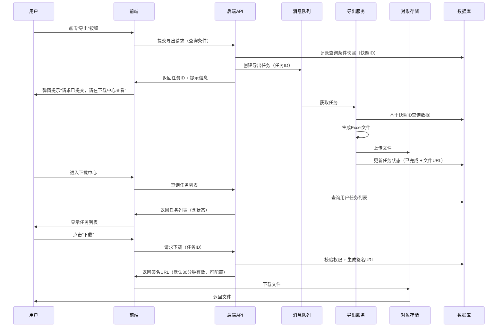

# 11. 其他功能

## 11.1 异步导出功能（下载中心）

> **功能背景**：HTM系统原有导出功能为同步导出，当数据量较大时会导致页面长时间等待、超时等问题。为提升用户体验和系统稳定性，将导出功能改造为异步导出模式，并建立统一的下载中心管理所有导出任务。

> **参考标准**：参考用友U8、金蝶EAS、SAP等知名ERP系统的异步导出设计规范。

---

## 一、产品评审意见（PM视角）

### 1.1 原PRD草案评审

#### ✅ 优点
1. **业务流程清晰**：将"生成文件"与"下载文件"解耦，符合异步任务设计原则
2. **技术方案合理**：使用消息队列处理高并发，符合分布式系统设计规范
3. **异常场景考虑**：覆盖了数据为空、系统崩溃等常见异常情况

#### ⚠️ 需要补充和完善的问题（已按最新决议调整）

**1. 触发阈值**  
- **最新决议**：预计导出行数 ≤ 1000 走同步；> 1000 走异步。同步需设置超时（建议10~15秒）和行数上限保护，避免长阻塞。

**2. 数据一致性**  
- **说明**：导出数据以“触发时刻”的查询快照为准，不保证后续数据更新自动同步；原因是异步处理期间可能有并发写入，不启用全量锁。

**3. 下载中心入口**  
- **最新决议**：入口放在租户下拉框左侧的独立“我的下载”按钮（参考原型），保持红点提醒可选。

**4. 权限与签名URL**  
- **产品说明**：文件生成后提供临时下载链接（签名URL或短时授权），默认有效期10~30分钟，可重新申请；仅任务所属用户/租户可用，并记录审计日志。

**5. 任务状态**  
- **最新决议**：精简为 排队中（含待处理/入队等待）、处理中、成功、失败、已过期，可保留已取消；不再使用“部分成功”。

**6. 进度显示**  
- **最新决议**：默认不展示进度条，仅显示状态；如后续需要，可在大数据量场景再打开。

**7. 与现有系统集成**  
- **原则**：≤1000 行走同步（带超时/上限保护），>1000 行走异步；所有模块逐步接入下载中心。

**8. 文件命名规范需要细化**
- **问题**：命名规则过于简单，未考虑多租户、多用户场景
- **建议**：
  - 格式：`{模块名}_{租户代码}_{日期}_{时间戳}_{随机后缀}.xlsx`
  - 示例：`物流台账_HGCC_20260205_085456_8829.xlsx`
  - 模块名统一使用中文，例如：`可视化查询`、`物流台账`、`订舱管理`、`落货纸管理` 等

**9. 频率限制**  
- **最新决议**：每人同时进行中的任务≤3，任务完成/失败/取消后立即释放；历史列表保留上限可按产品配置（如最近100条）。

**10. 存储策略需要明确成本控制**
- **问题**：仅提到"3~7天保留期"，未考虑存储成本
- **建议**：
  - **默认保留期**：7天
  - **可配置保留期**：管理员可在系统配置中调整（3-30天）
  - **存储成本预警**：当OSS存储使用量超过阈值时，系统自动提醒管理员
  - **自动清理机制**：每天凌晨2点执行过期文件清理任务

---

## 二、完整PRD设计（改进版）

### 2.1 功能概述

**功能名称**：异步导出功能（下载中心）

**功能描述**：
- 将HTM系统所有导出功能从同步模式改造为异步模式
- 建立统一的下载中心，集中管理所有导出任务和文件
- 支持大数据量导出、多任务并发、任务状态实时更新
- 提供文件下载、任务重试、任务删除等完整功能

**适用范围**：
- 所有HTM系统的导出功能（可视化查询、物流台账、订舱管理、落货纸管理等）
- 优先改造：可视化查询导出、物流台账导出（数据量大、使用频率高）

**参考标准**：
- 用友U8 ERP：异步导出任务管理
- 金蝶EAS：下载中心设计规范
- SAP：大数据量导出最佳实践

---

### 2.2 业务流程设计

#### 2.2.1 异步导出完整流程



#### 2.2.2 关键节点说明

| 节点 | 说明 | 技术实现 |
| :--- | :--- | :--- |
| **快照记录** | 点击导出时立即记录查询条件，生成快照ID | 在`tms.export_snapshot`表中记录查询条件JSON |
| **任务入队** | 将导出任务放入消息队列，返回任务ID | Redis Queue 或 RabbitMQ |
| **异步处理** | 后台服务从队列获取任务，生成文件 | 独立的导出Worker服务 |
| **文件存储** | 生成的文件上传至对象存储 | OSS/S3，返回文件URL |
| **状态更新** | 任务处理过程中实时更新状态 | 通过WebSocket或轮询更新前端 |
| **权限校验** | 下载前二次校验用户权限 | 校验用户ID、租户ID、数据权限 |
| **签名URL** | 生成临时下载链接，默认30分钟有效（可配置） | OSS签名URL机制 |

---

### 2.3 核心功能模块

#### 2.3.1 前端交互设计

##### A. 导出按钮交互

**触发场景**：用户点击任意页面的"导出"按钮

**交互流程**：

1. **点击导出按钮**
   - 按钮进入loading状态（禁用，显示"导出中..."）
   - 前端立即校验：
     - 查询条件是否为空
     - 数据量预估（调用后端接口获取预估数量）
     - 是否超过同步导出阈值（≤ 1000条：同步；> 1000条：异步）

2. **判断导出模式**
   - **同步导出**（预计导出行数 ≤ 1000条）：
     - 直接调用同步导出接口
     - 浏览器直接下载文件
     - 无需进入下载中心
   - **异步导出**（预计导出行数 > 1000条 或 强制异步）：
     - 调用异步导出接口
     - 弹窗提示："导出任务已提交，请在下载中心查看"
     - 弹窗提供两个按钮：
       - "前往下载中心"（跳转到下载中心页面）
       - "知道了"（关闭弹窗，继续当前操作）

3. **导航栏红点提醒**
   - 当有新的导出任务完成时，导航栏右上角显示红点
   - 红点显示未下载任务数量（如"3"）
   - 点击红点跳转到下载中心

##### B. 下载中心页面设计

**页面入口**：
- 入口1：导航栏右上角的独立按钮“我的下载”（位于租户下拉框左侧，参考原型）
- 入口2：导出按钮弹窗中的“前往下载中心”链接
- 入口3（可选）：若保留红点提醒，则点击红点跳转下载中心

**页面布局**：

```
┌─────────────────────────────────────────────────────────┐
│  下载中心 (Download Center)                              │
├─────────────────────────────────────────────────────────┤
│  [筛选条件]                                              │
│  任务状态: [全部 ▼]  模块: [全部 ▼]  时间: [最近7天 ▼]  │
│  [重置] [查询]                                          │
├─────────────────────────────────────────────────────────┤
│  [任务列表]                                              │
│  ┌───────────────────────────────────────────────────┐  │
│  │ ☑ 文件名             模块      状态    创建时间    │  │
│  ├───────────────────────────────────────────────────┤  │
│  │ ☑ Logistics_Orders_...  物流台账  已完成  2分钟前 │  │
│  │    [下载] [删除]                                    │  │
│  ├───────────────────────────────────────────────────┤  │
│  │ ☑ Visualization_...     可视化查询 处理中  5分钟前│  │
│  │    [取消]                                         │  │
│  ├───────────────────────────────────────────────────┤  │
│  │ ☑ Booking_Manage_...    订舱管理  失败   10分钟前│  │
│  │    错误: 数据查询超时 [重试] [删除]               │  │
│  └───────────────────────────────────────────────────┘  │
│  [批量操作] [批量删除] [清空已过期]                      │
│  共 15 条，当前页 1/2                                    │
└─────────────────────────────────────────────────────────┘
```

**任务列表字段**：

| 字段名称 | 说明 | 示例 |
| :--- | :--- | :--- |
| 复选框 | 支持批量选择 | ☑ |
| 文件名 | 文件完整名称（可点击查看详情） | `Logistics_Orders_HGCC_20260205_085456_8829.xlsx` |
| 模块 | 导出来源模块 | 物流台账、可视化查询、订舱管理 |
| 状态 | 任务当前状态（带颜色标识） | 已完成（绿色）、处理中（蓝色）、失败（红色） |
| 创建时间 | 任务创建时间 | 2分钟前、2026-02-05 08:54 |
| 文件大小 | 文件大小（仅已完成状态显示） | 2.5 MB |
| 操作 | 根据状态显示不同操作按钮 | 下载、重试、删除、取消 |

**状态标识颜色**：
- **已完成**：绿色（#10B981）
- **处理中**：蓝色（#3B82F6）
- **排队中**：灰色（#6B7280）
- **失败**：红色（#EF4444），显示错误原因
- **已过期**：浅灰色（#9CA3AF），不可下载

##### C. 任务详情弹窗

**触发**：点击任务列表中的文件名

**显示内容**：
- 任务基本信息：文件名、模块、创建时间、完成时间
- 导出条件：显示查询条件的JSON格式（可折叠）
- 文件信息：文件大小、文件类型、下载次数
- 处理日志：任务处理过程中的关键节点时间戳
- 错误信息：如果失败，显示详细错误原因

---

#### 2.3.2 后端任务管理

##### A. 任务队列设计

**队列选择**：
- **Redis Queue**（推荐）：轻量级，适合中小规模系统
- **RabbitMQ**：适合大规模、高并发场景
- **Kafka**：适合超大规模、需要消息持久化场景

**队列配置**：
- **队列名称**：`htm_export_queue`
- **优先级队列**：支持任务优先级（VIP用户、管理员任务优先）
- **死信队列**：处理失败的任务进入死信队列，支持人工处理

##### B. 频率限制规则

| 用户角色 | 同时进行中任务数上限 | 每小时任务数上限 | 说明 |
| :--- | :--- | :--- | :--- |
| 所有用户 | 3个 | 可配置（默认20） | 防止资源滥用 |
| 系统任务 | 3个（如需突破走单独白名单） | 可配置 | 系统自动触发任务按同样上限或白名单 |

**限制解除机制**：
- 任务完成后立即释放，无需等待文件下载
- 任务失败后立即释放
- 任务取消后立即释放

##### C. 任务状态流转

```
排队中 (Queued)  [含待处理/入队等待]
    ↓
处理中 (Processing)  [Worker正在生成文件]
    ↓
成功 (Completed)  [文件已生成，可下载]
    ↓
已过期 (Expired)  [文件已过期，已删除]

异常路径：
处理中 → 失败 (Failed)  [可重试]
排队中/处理中 → 已取消 (Cancelled)  [用户主动取消]
```

**状态说明**：

| 状态 | 状态码 | 说明 | 可执行操作 |
| :--- | :--- | :--- | :--- |
| 排队中 | `QUEUED` | 任务已创建/入队，等待Worker处理 | 取消 |
| 处理中 | `PROCESSING` | Worker正在生成文件 | 取消 |
| 成功 | `COMPLETED` | 文件已生成，可下载 | 下载、删除 |
| 失败 | `FAILED` | 导出失败 | 重试、删除 |
| 已取消 | `CANCELLED` | 用户主动取消 | 删除 |
| 已过期 | `EXPIRED` | 文件已过期，已删除 | 删除 |

##### D. 异常处理机制

**1. 数据为空**
- **场景**：查询条件无匹配数据
- **处理**：
  - 任务状态标记为"已完成（空数据）"
  - 下载中心显示："未搜寻到相关记录，导出文件为空"
  - 不生成文件，或生成空文件（仅表头）

**2. 系统崩溃/服务重启**
- **场景**：导出过程中服务重启
- **处理**：
  - **方案1（推荐）**：任务支持自动恢复
    - Worker重启后，从队列中重新获取未完成的任务
    - 检查任务状态，如果处理时间超过阈值（如30分钟），标记为失败
  - **方案2**：任务标记为失败，用户可手动重试

**3. 数据库查询超时**
- **场景**：数据量过大，查询超时
- **处理**：
  - 任务标记为失败
  - 错误信息："数据查询超时，请缩小查询范围后重试"
  - 提供"重试"按钮，用户可调整查询条件后重试

**4. 文件生成失败**
- **场景**：Excel文件生成过程中出错（内存不足、磁盘空间不足等）
- **处理**：
  - 任务标记为失败
  - 记录详细错误日志
  - 提供"重试"按钮

**5. 文件上传失败**
- **场景**：文件生成成功，但上传OSS失败
- **处理**：
  - 任务标记为失败
  - 本地临时文件保留24小时，支持重试上传
  - 24小时后自动清理临时文件

---

### 2.4 关键PRD要素（边界规则）

#### 2.4.1 触发阈值规则

**单一阈值（默认）**：

| 维度 | 阈值 | 说明 |
| :--- | :--- | :--- |
| 数据量 | ≤ 1000 行：同步；> 1000 行：异步 | 可配置 |

**同步导出保护**：
- 同步调用需设置超时（建议10~15秒）与最大行数保护（默认1000行），避免长时间阻塞。
- 导出当前页：始终同步。

**配置**：
- 阈值与保护参数支持配置（`tms.system_config`），模块可单独覆盖。

#### 2.4.2 文件命名规范

**命名格式**（使用中文模块名）：
```
{模块名}_{租户代码}_{日期}_{时间戳}_{随机后缀}.xlsx
```

**字段说明**：

| 字段 | 说明 | 示例 |
| :--- | :--- | :--- |
| 模块名 | 中文模块名 | `可视化查询`、`物流台账` |
| 租户代码 | 当前用户所属租户代码 | `HGCC`、`MXFCTR` |
| 日期 | YYYYMMDD格式 | `20260205` |
| 时间戳 | HHmmss格式 | `085456` |
| 随机后缀 | 4位随机数字 | `8829` |

**完整示例**：
- `物流台账_HGCC_20260205_085456_8829.xlsx`
- `可视化查询_MXFCTR_20260205_090123_4567.xlsx`

**模块名参考**：

| 中文模块名 | 说明 |
| :--- | :--- |
| 物流台账 | - |
| 可视化查询 | - |
| 订舱管理 | - |
| 落货纸管理 | - |
| 铁运可视化信息上报 | - |

#### 2.4.3 数据一致性规则

**快照机制**：
- **点击导出时**：系统立即记录当前查询条件，生成快照ID
- **快照存储**：在`tms.export_snapshot`表中记录查询条件JSON
- **后台处理**：Worker基于快照ID查询数据，确保导出的是"点击时刻"的数据
- **快照保留期**：7天（与文件保留期一致），过期自动删除
- **一致性声明**：导出文件反映的是触发时刻的数据快照，不保证后续业务更新会反映在该次导出结果中。

**快照表结构**：

| 字段名 | 类型 | 说明 |
| :--- | :--- | :--- |
| `snapshot_id` | VARCHAR(64) | 快照ID（主键） |
| `user_id` | VARCHAR(64) | 用户ID |
| `tenant_id` | VARCHAR(64) | 租户ID |
| `module` | VARCHAR(64) | 模块名 |
| `query_conditions` | TEXT | 查询条件JSON |
| `create_time` | DATETIME | 创建时间 |
| `expire_time` | DATETIME | 过期时间（创建时间+7天） |

#### 2.4.4 状态展示策略

- 默认仅展示任务状态（排队中/处理中/成功/失败/已过期/已取消），不展示百分比进度条。
- 如后续确需进度，可在大数据量场景开启百分比进度，推送方式优先WebSocket，备选轮询。

#### 2.4.5 存储策略

**文件保留期**：
- **默认保留期**：7天
- **可配置保留期**：系统管理员可在系统配置中调整（3-30天）
- **配置项**：`export_file_retention_days`（存储在`tms.system_config`表中）

**自动清理机制**：
- **清理时间**：每天凌晨2点执行
- **清理规则**：
  - 删除过期文件（`expire_time < 当前时间`）
  - 删除OSS中的物理文件
  - 更新任务状态为"已过期"
  - 记录清理日志

**存储成本控制**：
- **成本预警**：当OSS存储使用量超过阈值（如100GB）时，系统自动提醒管理员
- **成本统计**：每月生成存储成本报告，供管理员查看

#### 2.4.6 权限校验和安全设计

**下载前二次校验**：
1. **用户权限校验**：校验当前用户是否为任务创建人
2. **租户匹配校验**：校验当前用户租户是否与任务租户一致
3. **数据权限校验**：校验用户是否有权限查看导出数据（如：货代只能下载自己货代的数据）

**签名URL机制**：
- **有效期**：默认30分钟（可配置）
- **生成方式**：使用OSS签名URL机制
- **安全性**：URL包含签名，防止被篡改或外泄

**敏感字段脱敏**：
- **财务数据**：金额字段根据用户权限决定是否脱敏
- **客户信息**：客户名称、联系方式等根据数据权限决定是否显示
- **脱敏规则**：在导出时根据用户权限动态决定字段是否脱敏

**审计日志记录**：
- **记录内容**：
  - 操作人（用户ID、用户名）
  - 操作时间
  - 导出条件（查询条件JSON）
  - 文件大小
  - 下载次数
  - IP地址
- **存储位置**：`tms.export_audit_log`表
- **保留期**：1年（可配置）

---

### 2.5 数据库设计

#### 2.5.1 导出任务表（`tms.export_task`）

| 字段名 | 类型 | 说明 | 约束 |
| :--- | :--- | :--- | :--- |
| `task_id` | VARCHAR(64) | 任务ID（主键） | NOT NULL, UNIQUE |
| `user_id` | VARCHAR(64) | 用户ID | NOT NULL |
| `tenant_id` | VARCHAR(64) | 租户ID | NOT NULL |
| `module` | VARCHAR(64) | 模块名 | NOT NULL |
| `snapshot_id` | VARCHAR(64) | 快照ID（外键） | NOT NULL |
| `file_name` | VARCHAR(255) | 文件名 | NULL |
| `file_url` | VARCHAR(500) | 文件URL（OSS） | NULL |
| `file_size` | BIGINT | 文件大小（字节） | NULL |
| `status` | VARCHAR(32) | 任务状态 | NOT NULL |
| `progress` | INT | 处理进度（0-100） | DEFAULT 0 |
| `error_message` | TEXT | 错误信息 | NULL |
| `create_time` | DATETIME | 创建时间 | NOT NULL |
| `start_time` | DATETIME | 开始处理时间 | NULL |
| `complete_time` | DATETIME | 完成时间 | NULL |
| `expire_time` | DATETIME | 过期时间 | NOT NULL |
| `download_count` | INT | 下载次数 | DEFAULT 0 |

**索引**：
- `idx_user_id`：用户ID索引（查询用户任务列表）
- `idx_tenant_id`：租户ID索引（租户数据隔离）
- `idx_status`：状态索引（查询特定状态的任务）
- `idx_create_time`：创建时间索引（按时间排序）

#### 2.5.2 快照表（`tms.export_snapshot`）

| 字段名 | 类型 | 说明 | 约束 |
| :--- | :--- | :--- | :--- |
| `snapshot_id` | VARCHAR(64) | 快照ID（主键） | NOT NULL, UNIQUE |
| `user_id` | VARCHAR(64) | 用户ID | NOT NULL |
| `tenant_id` | VARCHAR(64) | 租户ID | NOT NULL |
| `module` | VARCHAR(64) | 模块名 | NOT NULL |
| `query_conditions` | TEXT | 查询条件JSON | NOT NULL |
| `create_time` | DATETIME | 创建时间 | NOT NULL |
| `expire_time` | DATETIME | 过期时间 | NOT NULL |

**索引**：
- `idx_expire_time`：过期时间索引（清理过期快照）

#### 2.5.3 审计日志表（`tms.export_audit_log`）

| 字段名 | 类型 | 说明 | 约束 |
| :--- | :--- | :--- | :--- |
| `log_id` | BIGINT | 日志ID（主键，自增） | NOT NULL |
| `task_id` | VARCHAR(64) | 任务ID | NOT NULL |
| `user_id` | VARCHAR(64) | 用户ID | NOT NULL |
| `tenant_id` | VARCHAR(64) | 租户ID | NOT NULL |
| `module` | VARCHAR(64) | 模块名 | NOT NULL |
| `operation` | VARCHAR(32) | 操作类型（CREATE/DOWNLOAD/DELETE） | NOT NULL |
| `query_conditions` | TEXT | 查询条件JSON | NULL |
| `file_size` | BIGINT | 文件大小（字节） | NULL |
| `ip_address` | VARCHAR(64) | IP地址 | NULL |
| `create_time` | DATETIME | 创建时间 | NOT NULL |

**索引**：
- `idx_task_id`：任务ID索引
- `idx_user_id`：用户ID索引
- `idx_create_time`：创建时间索引（按时间查询）

---

### 2.6 与现有系统集成

#### 2.6.1 兼容性设计

**同步导出保留**：
- 预计导出行数 ≤ 1000 条：仍使用同步导出（用户体验更好，需超时/上限保护）
- 导出当前页：始终同步导出（数据量小）
- 系统提供统一的导出接口，内部自动判断使用同步还是异步

**统一改造**：
- 所有导出功能统一接入下载中心
- 前端导出按钮统一调用`/api/export/create`接口
- 后端根据数据量自动判断使用同步还是异步模式

#### 2.6.2 渐进式迁移策略

**第一阶段（优先级高）**：
- 可视化查询导出（数据量大、使用频率高）
- 物流台账导出（数据量大、使用频率高）

**第二阶段**：
- 订舱管理导出
- 落货纸管理导出

**第三阶段**：
- 其他模块导出功能

#### 2.6.3 API接口设计

**1. 创建导出任务**
```
POST /api/export/create
Request:
{
  "module": "visualization_query",
  "query_conditions": {
    "so_no": "LHZ20250126001",
    "container_no": "CONT001"
  }
}
Response:
{
  "code": 200,
  "message": "导出任务已创建",
  "data": {
    "task_id": "task_20260205_085456_8829",
    "mode": "async",  // async: 异步, sync: 同步
    "download_url": "https://..."  // 如果是同步，直接返回下载URL
  }
}
```

**2. 查询任务列表**
```
GET /api/export/tasks?status=all&module=all&page=1&size=20
Response:
{
  "code": 200,
  "data": {
    "total": 15,
    "list": [
      {
        "task_id": "task_20260205_085456_8829",
        "file_name": "Logistics_Orders_HGCC_20260205_085456_8829.xlsx",
        "module": "物流台账",
        "status": "completed",
        "progress": 100,
        "file_size": 2621440,
        "create_time": "2026-02-05 08:54:56",
        "complete_time": "2026-02-05 08:55:12"
      }
    ]
  }
}
```

**3. 获取下载链接**
```
GET /api/export/download/{task_id}
Response:
{
  "code": 200,
  "data": {
    "download_url": "https://oss.example.com/file.xlsx?signature=...",
    "expire_time": "2026-02-06 08:54:56"
  }
}
```

**4. 重试任务**
```
POST /api/export/retry/{task_id}
Response:
{
  "code": 200,
  "message": "任务已重新提交"
}
```

**5. 删除任务**
```
DELETE /api/export/tasks/{task_id}
Response:
{
  "code": 200,
  "message": "任务已删除"
}
```

---

### 2.7 异常场景处理（补充）

#### 2.7.1 网络中断
- **场景**：下载过程中网络中断
- **处理**：签名URL在有效期内可重复使用，用户可重新下载

#### 2.7.2 文件损坏
- **场景**：文件生成过程中损坏
- **处理**：
  - 任务标记为失败
  - 提供"重试"按钮，重新生成文件

#### 2.7.3 并发导出冲突
- **场景**：同一用户同时发起多个相同条件的导出任务
- **处理**：
  - **方案1（推荐）**：检测到相同条件的任务正在处理中，提示用户"已有相同导出任务，请前往下载中心查看"
  - **方案2**：允许创建，但合并为同一个任务（共享文件）

#### 2.7.4 存储空间不足
- **场景**：OSS存储空间不足
- **处理**：
  - 任务标记为失败
  - 错误信息："存储空间不足，请联系管理员"
  - 系统自动发送告警通知给管理员

---

### 2.8 性能优化建议

#### 2.8.1 大数据量分批处理
- **场景**：数据量 > 10万条
- **处理**：
  - 分批查询数据（每批1万条）
  - 分批写入Excel（避免内存溢出）
  - 任务状态仍按“处理中→成功/失败”流转：全部批次成功后标记为成功；任一批失败则标记为失败并提示可重试/缩小范围

#### 2.8.2 缓存优化
- **场景**：相同查询条件的导出请求
- **处理**：
  - 检查是否有相同条件的已完成任务（7天内）
  - 如果有，直接复用文件，无需重新生成
  - 更新任务的`create_time`和`expire_time`

#### 2.8.3 压缩优化
- **场景**：文件过大（> 50MB）
- **处理**：
  - 自动压缩为ZIP格式
  - 文件名：`原文件名.zip`
  - 下载时提示用户文件已压缩

---

### 2.9 测试用例

#### 2.9.1 功能测试
- [ ] 同步导出（预计导出行数 ≤ 1000条）
- [ ] 异步导出（预计导出行数 > 1000条）
- [ ] 下载中心任务列表查询
- [ ] 文件下载（签名URL）
- [ ] 任务重试
- [ ] 任务删除
- [ ] 批量删除
- [ ] 过期文件清理

#### 2.9.2 异常测试
- [ ] 数据为空场景
- [ ] 查询超时场景
- [ ] 文件生成失败场景
- [ ] 文件上传失败场景
- [ ] 网络中断场景
- [ ] 并发导出冲突场景

#### 2.9.3 性能测试
- [ ] 大数据量导出（10万条）
- [ ] 高并发导出（100个用户同时导出）
- [ ] 文件下载性能（大文件下载）

#### 2.9.4 安全测试
- [ ] 权限校验（跨租户访问）
- [ ] 签名URL有效期
- [ ] 敏感字段脱敏
- [ ] 审计日志记录

---

### 2.10 上线计划

#### 2.10.1 开发阶段
- **Week 1-2**：后端任务管理模块开发
- **Week 3-4**：前端下载中心页面开发
- **Week 5**：集成测试、性能测试
- **Week 6**：UAT测试、修复问题

#### 2.10.2 上线阶段
- **灰度发布**：先上线给10%用户使用
- **全量发布**：1周后全量上线
- **监控告警**：上线后持续监控任务成功率、文件下载量等指标

---

## 2.11 原型设计确认清单（出原型前必看）

> **目的**：在出原型前，明确所有UI/UX细节，避免返工。以下问题需要产品经理和UI设计师共同确认。

### 2.11.1 UI布局和样式确认

#### ❓ 需要确认的问题

**1. 下载中心页面布局**
- [ ] **页面结构**：是否采用HTM系统统一的左右布局（左侧导航栏 + 右侧内容区）？
- [ ] **页面标题**：页面顶部是否需要显示面包屑导航？（如：首页 > 下载中心）
- [ ] **筛选区域**：筛选条件区域是否可折叠？（参考现有查询页面的筛选区域设计）
- [ ] **任务列表展示方式**：
  - 方案A：表格形式（推荐，便于批量操作）
  - 方案B：卡片形式（更美观，但批量操作不便）
  - **建议**：采用表格形式，与HTM系统其他列表页保持一致

**2. 任务列表表格设计**
- [ ] **表格列宽**：
  - 文件名列：固定宽度还是自适应？（文件名可能很长）
  - 模块列：建议固定宽度 120px
  - 状态列：建议固定宽度 100px
  - 创建时间列：建议固定宽度 150px
  - 文件大小列：建议固定宽度 100px
  - 进度列：建议固定宽度 120px
  - 操作列：建议固定宽度 150px
- [ ] **文件名显示规则**：
  - 方案A：完整显示，超出部分用省略号（`...`）
  - 方案B：显示前30个字符 + 省略号 + 文件扩展名
  - 方案C：鼠标悬停显示完整文件名（Tooltip）
  - **建议**：方案B + 方案C（悬停显示完整名称）
- [ ] **表格行高**：建议 48px（与HTM系统其他表格保持一致）
- [ ] **表格斑马纹**：是否需要隔行变色？（建议：是，提升可读性）

**3. 状态标识设计**
- [ ] **状态展示方式**：
  - 方案A：仅文字 + 颜色（如：已完成）
  - 方案B：图标 + 文字（如：✓ 已完成）
  - 方案C：徽章（Badge）样式
  - **建议**：方案B（图标 + 文字），提升视觉识别度
- [ ] **状态图标建议**：
  - 已完成：✓（绿色）
  - 处理中：⏳ 或 旋转的加载图标（蓝色）
  - 排队中：⏸（灰色）
  - 失败：✗（红色）
  - 已过期：⏰（浅灰色）
- [ ] **状态颜色确认**：
  - 已完成：绿色（#10B981）✓
  - 处理中：蓝色（#3B82F6）✓
  - 排队中：灰色（#6B7280）✓
  - 失败：红色（#EF4444）✓
  - 已过期：浅灰色（#9CA3AF）✓

**4. 进度条设计（可选，默认不做）**
- [ ] **进度条样式**：
  - 方案A：线性进度条（如启用，推荐）
  - 方案B：圆形进度条
  - **建议**：方案A，与HTM系统其他进度条保持一致
- [ ] **进度条颜色**：蓝色（#3B82F6）
- [ ] **进度条高度**：建议 6px
- [ ] **进度文字位置**：进度条右侧显示百分比（如：65%）
- [ ] **进度条动画**：是否需要平滑过渡动画？（建议：是）

**5. 操作按钮设计**
- [ ] **按钮样式**：
  - 方案A：文字链接（如：下载、删除）
  - 方案B：图标按钮（如：下载图标、删除图标）
  - 方案C：图标 + 文字（推荐）
  - **建议**：方案C，提升可识别性
- [ ] **按钮排列**：
  - 方案A：横向排列（下载 | 删除）
  - 方案B：下拉菜单（更多操作 ▼）
  - **建议**：方案A，操作按钮不超过3个时横向排列
- [ ] **按钮颜色**：
  - 下载：蓝色（#2563EB）
  - 重试：蓝色（#2563EB）
  - 删除：红色（#EF4444）
  - 取消：灰色（#6B7280）

**6. 筛选条件设计**
- [ ] **筛选字段布局**：
  - 方案A：单行排列（所有筛选条件在一行）
  - 方案B：多行排列（每行2-3个筛选条件）
  - **建议**：方案B，提升可读性
- [ ] **时间筛选器**：
  - 方案A：下拉选择（最近7天、最近30天、自定义）
  - 方案B：日期选择器（开始日期 + 结束日期）
  - **建议**：方案A（下拉选择），更简洁
- [ ] **筛选条件重置**：
  - 是否需要"一键重置"按钮？（建议：是）
  - 重置后是否自动刷新列表？（建议：是）

**7. 分页设计**
- [ ] **分页位置**：表格底部
- [ ] **分页样式**：与HTM系统其他列表页保持一致
- [ ] **每页条数**：默认20条，支持选择（10/20/50/100）
- [ ] **分页信息**：显示"共 X 条，当前第 Y/Z 页"

**8. 批量操作设计**
- [ ] **全选复选框位置**：表格表头第一列
- [ ] **批量操作按钮位置**：表格上方，筛选条件下方
- [ ] **批量操作按钮样式**：
  - 方案A：按钮组（批量删除 | 清空已过期）
  - 方案B：下拉菜单（批量操作 ▼）
  - **建议**：方案A，操作按钮不超过2个时直接显示
- [ ] **批量操作确认**：
  - 是否需要二次确认弹窗？（建议：是）
  - 弹窗显示选中任务数量（如："确定要删除选中的 3 个任务吗？"）

---

### 2.11.2 交互细节确认

#### ❓ 需要确认的问题

**1. 导出按钮交互**
- [ ] **点击导出按钮后的反馈**：
  - 按钮立即进入loading状态（禁用，显示"导出中..."）
  - 是否需要显示Toast提示？（建议：是，提示"正在提交导出任务..."）
- [ ] **数据量预估**：
  - 是否需要显示预估数据量？（如："预计导出 1,234 条数据"）
  - 预估数据量的显示位置：按钮下方提示文字？
- [ ] **同步/异步判断提示**：
  - 同步导出（≤ 1000条）：直接下载，无需提示
  - 异步导出（> 1000条）：弹窗提示
- [ ] **弹窗内容确认**：
  - 弹窗标题："导出任务已提交"
  - 弹窗内容："您的导出任务已提交，请在下载中心查看进度和下载文件。"
  - 弹窗按钮：
    - 主按钮："前往下载中心"（蓝色，跳转）
    - 次按钮："知道了"（灰色，关闭弹窗）

**2. 导航栏红点提醒**
- [ ] **红点位置**：导航栏右上角，用户头像/个人中心图标旁
- [ ] **红点样式**：
  - 方案A：纯红点（●）
  - 方案B：红点 + 数字（如：3）
  - **建议**：方案B，显示未下载任务数量
- [ ] **红点触发条件**：
  - 任务状态从"处理中"变为"已完成"时显示
  - 用户点击红点进入下载中心后，红点是否立即消失？（建议：是）
- [ ] **红点颜色**：红色（#EF4444）

**3. 任务详情弹窗**
- [ ] **弹窗触发方式**：点击任务列表中的文件名
- [ ] **弹窗尺寸**：建议宽度 600px，高度自适应（最大 80vh）
- [ ] **弹窗内容布局**：
  ```
  ┌─────────────────────────────────────┐
  │ 任务详情                              │
  ├─────────────────────────────────────┤
  │ 基本信息                              │
  │  文件名: xxx.xlsx                    │
  │  模块: 物流台账                       │
  │  创建时间: 2026-02-05 08:54:56      │
  │  完成时间: 2026-02-05 08:55:12      │
  ├─────────────────────────────────────┤
  │ 导出条件 [展开/折叠]                  │
  │  {JSON格式的查询条件}                │
  ├─────────────────────────────────────┤
  │ 文件信息                              │
  │  文件大小: 2.5 MB                    │
  │  文件类型: Excel                     │
  │  下载次数: 3                         │
  ├─────────────────────────────────────┤
  │ 处理日志 [展开/折叠]                  │
  │  08:54:56 - 任务已创建               │
  │  08:54:57 - 任务已入队               │
  │  08:55:00 - 开始处理                 │
  │  08:55:12 - 处理完成                 │
  ├─────────────────────────────────────┤
  │ 错误信息（仅失败时显示）              │
  │  数据查询超时，请缩小查询范围后重试   │
  └─────────────────────────────────────┘
  ```
- [ ] **可折叠区块**：
  - 导出条件：默认折叠
  - 处理日志：默认折叠
  - 错误信息：默认展开（如果存在）
- [ ] **弹窗关闭方式**：
  - 点击右上角"×"按钮
  - 点击弹窗外部区域（遮罩层）
  - 按ESC键

**4. 任务状态实时更新**
- [ ] **更新方式**：
  - 方案A：WebSocket实时推送（推荐，用户体验最好）
  - 方案B：前端轮询（每3秒查询一次）
  - **建议**：方案A（如果技术可行），否则方案B
- [ ] **更新范围**：
  - 仅更新当前页面的任务状态
  - 如果任务在当前页面，自动更新状态和进度
- [ ] **更新动画**：状态变化时是否需要过渡动画？（建议：是，提升用户体验）

**5. 文件下载交互**
- [ ] **下载触发**：点击"下载"按钮
- [ ] **下载前校验**：
  - 是否需要显示"正在获取下载链接..."的loading提示？（建议：是）
  - 如果签名URL已过期，是否需要自动刷新？（建议：是）
- [ ] **下载方式**：
  - 方案A：直接下载（浏览器下载）
  - 方案B：新窗口打开（预览）
  - **建议**：方案A，直接下载
- [ ] **下载失败处理**：
  - 如果下载失败，显示错误提示："下载失败，请重试"
  - 提供"重试"按钮

**6. 任务重试交互**
- [ ] **重试触发**：点击"重试"按钮（仅失败任务显示）
- [ ] **重试确认**：
  - 是否需要二次确认？（建议：否，直接重试）
  - 重试后任务状态立即变为"排队中"
- [ ] **重试限制**：
  - 是否需要限制重试次数？（建议：是，最多重试3次）
  - 超过重试次数后，是否隐藏"重试"按钮？（建议：是）

**7. 任务删除交互**
- [ ] **删除触发**：点击"删除"按钮
- [ ] **删除确认**：
  - 是否需要二次确认弹窗？（建议：是）
  - 弹窗内容："确定要删除该任务吗？删除后无法恢复。"
- [ ] **批量删除确认**：
  - 弹窗内容："确定要删除选中的 X 个任务吗？删除后无法恢复。"
- [ ] **删除后反馈**：
  - 显示Toast提示："已删除 X 个任务"
  - 自动刷新任务列表

**8. 空状态设计**
- [ ] **任务列表为空时**：
  - 显示空状态图标（如：📥）
  - 显示提示文字："暂无导出任务"
  - 显示引导文字："点击页面上的"导出"按钮创建导出任务"
- [ ] **筛选无结果时**：
  - 显示空状态图标
  - 显示提示文字："未找到符合条件的任务"
  - 显示"清除筛选条件"按钮

---

### 2.11.3 边界情况处理确认

#### ❓ 需要确认的问题

**1. 文件名过长**
- [ ] **显示规则**：
  - 方案A：截断显示（前30字符 + ... + 扩展名）
  - 方案B：完整显示，表格列自动换行
  - **建议**：方案A，保持表格整洁
- [ ] **完整文件名查看**：
  - 鼠标悬停显示Tooltip（完整文件名）
  - 点击文件名打开任务详情弹窗（详情中显示完整文件名）

**2. 错误信息过长**
- [ ] **显示规则**：
  - 方案A：截断显示（前50字符 + ...），点击查看完整信息
  - 方案B：完整显示，表格列自动换行
  - **建议**：方案A，保持表格整洁
- [ ] **完整错误信息查看**：
  - 点击错误信息打开任务详情弹窗（详情中显示完整错误信息）

**3. 文件大小显示**
- [ ] **显示格式**：
  - 方案A：自动转换（B/KB/MB/GB）
  - 方案B：统一显示为MB
  - **建议**：方案A，更直观
- [ ] **显示示例**：
  - < 1KB：显示为 "512 B"
  - < 1MB：显示为 "256 KB"
  - < 1GB：显示为 "2.5 MB"
  - ≥ 1GB：显示为 "1.2 GB"

**4. 时间显示格式**
- [ ] **统一使用绝对时间**：
  - 所有时间类字段（如创建时间、完成时间、过期时间等）在列表和详情中统一显示为绝对时间。
- [ ] **时间格式确认**：
  - 绝对时间格式：YYYY-MM-DD HH:mm:ss（如：2026-02-05 08:54:56）

**5. 任务数量限制提示**
- [ ] **达到任务上限时**：
  - 点击导出按钮，显示提示："您当前有 X 个任务正在处理中，已达到上限（3个），请等待任务完成后重试。"
  - 提示方式：Toast提示 + 弹窗提示（可选）

**6. 文件过期处理**
- [ ] **文件过期后**：
  - 任务状态显示为"已过期"（浅灰色）
  - "下载"按钮禁用或隐藏
  - 鼠标悬停显示提示："文件已过期，无法下载"

---

### 2.11.4 与现有系统集成确认

#### ❓ 需要确认的问题

**1. 导航栏集成**
- [ ] **下载中心入口位置**：
  - 入口1：个人中心/用户头像下拉菜单 → "我的下载"
  - 入口2：导航栏右上角红点 → 点击跳转
  - **需要确认**：个人中心下拉菜单的具体位置和样式（参考现有系统）
- [ ] **导航栏红点位置**：
  - 是否需要与现有通知中心红点区分？（建议：是，使用不同图标）
  - 红点图标：建议使用"下载"图标（📥）而非"通知"图标（🔔）

**2. 导出按钮样式统一**
- [ ] **现有导出按钮样式**：
  - 需要查看HTM系统现有导出按钮的样式
  - 确保新异步导出按钮与现有按钮样式一致
- [ ] **导出按钮位置**：
  - 与现有导出按钮位置保持一致（通常在页面顶部操作栏）

**3. 设计系统统一**
- [ ] **颜色规范**：
  - 使用HTM系统统一的设计系统颜色（参考`TYVISV0.1.html`）
- [ ] **字体规范**：
  - 使用HTM系统统一的字体大小和字重
- [ ] **间距规范**：
  - 使用HTM系统统一的间距规范（如：padding、margin）
- [ ] **组件规范**：
  - 按钮、输入框、下拉菜单等组件样式与现有系统保持一致

**4. 响应式设计**
- [ ] **移动端适配**：
  - 是否需要支持移动端访问？（建议：是，但优先级较低）
  - 移动端布局：筛选条件折叠、任务列表改为卡片形式

---

### 2.11.5 优化建议（非必须，但建议考虑）

#### 💡 可选的优化点

**1. 用户体验优化**
- [ ] **快捷操作**：
  - 任务列表支持键盘快捷键（如：Delete键删除选中任务）
  - 支持批量下载（选中多个已完成任务，一键下载）
- [ ] **智能提示**：
  - 如果用户频繁导出相同条件的数据，提示"您最近导出过相同条件的数据，是否直接下载？"
- [ ] **导出历史**：
  - 在导出按钮旁显示"最近导出"下拉菜单，快速访问最近3次导出任务

**2. 性能优化**
- [ ] **虚拟滚动**：
  - 如果任务列表超过100条，考虑使用虚拟滚动（仅渲染可见区域）
- [ ] **懒加载**：
  - 任务详情弹窗中的"导出条件"和"处理日志"采用懒加载（点击展开时再加载）

**3. 可访问性优化**
- [ ] **无障碍设计**：
  - 按钮添加`aria-label`属性
  - 状态标识添加`aria-describedby`属性
  - 支持键盘导航（Tab键切换焦点）

**4. 国际化支持**
- [ ] **多语言**：
  - 是否需要支持多语言？（如：中文、英文）
  - 如果需要，所有文案需要支持国际化

---

### 2.11.6 原型交付清单

#### ✅ 出原型前必须完成的事项

**1. 页面原型**
- [ ] 下载中心主页面（任务列表）
- [ ] 任务详情弹窗
- [ ] 导出按钮点击后的提示弹窗
- [ ] 删除确认弹窗
- [ ] 批量删除确认弹窗
- [ ] 空状态页面（无任务时）
- [ ] 空状态页面（筛选无结果时）

**2. 交互原型**
- [ ] 导出按钮点击流程（同步/异步判断）
- [ ] 任务状态实时更新动画
- [ ] 文件下载流程
- [ ] 任务重试流程
- [ ] 任务删除流程（单个/批量）
- [ ] 筛选条件交互
- [ ] 分页交互

**3. 状态展示**
- [ ] 所有任务状态的视觉样式（已完成、处理中、排队中、失败、已过期）
- [ ] 进度条样式（可选，默认不做）
- [ ] 红点提醒样式
- [ ] 错误信息展示样式

**4. 响应式设计**
- [ ] 桌面端布局（≥ 1920px）
- [ ] 桌面端布局（1280px - 1919px）
- [ ] 平板端布局（768px - 1279px）
- [ ] 移动端布局（< 768px，可选）

**5. 设计规范文档**
- [ ] 颜色规范（状态颜色、按钮颜色等）
- [ ] 字体规范（字号、字重、行高）
- [ ] 间距规范（padding、margin）
- [ ] 组件规范（按钮、输入框、下拉菜单等）

---

### 2.11.7 关键决策点总结

| 决策点 | 选项 | 推荐方案 | 备注 |
| :--- | :--- | :--- | :--- |
| 任务列表展示方式 | 表格 / 卡片 | 表格 | 便于批量操作 |
| 文件名显示 | 完整 / 截断 | 截断 + Tooltip | 保持表格整洁 |
| 状态展示 | 文字 / 图标+文字 | 图标+文字 | 提升识别度 |
| 进度条样式 | 线性 / 圆形 | 可选（默认不做） | 如后续需要再补充 |
| 操作按钮 | 文字 / 图标 / 图标+文字 | 图标+文字 | 提升可识别性 |
| 时间显示 | 相对 / 绝对 / 智能切换 | 智能切换 | 提升用户体验 |
| 状态更新 | WebSocket / 轮询 | WebSocket（优先） | 实时性更好 |
| 下载方式 | 直接下载 / 新窗口 | 直接下载 | 符合用户习惯 |

---

## 三、总结

### 3.1 核心改进点

1. **多维度阈值判断**：不仅考虑数据量，还考虑字段数量、查询复杂度
2. **快照机制**：确保数据一致性，导出的是"点击时刻"的数据
3. **下载中心入口设计**：明确三个入口，提升用户体验
4. **任务状态细化**：统一为 排队中、处理中、成功、失败、已过期（可保留已取消）
5. **权限校验和安全设计**：多租户隔离、敏感字段脱敏、审计日志
6. **存储成本控制**：自动清理、成本预警、成本统计
7. **与现有系统集成**：兼容性设计、渐进式迁移策略

### 3.2 参考标准

- **用友U8 ERP**：异步导出任务管理、下载中心设计
- **金蝶EAS**：任务状态流转、异常处理机制
- **SAP**：大数据量导出最佳实践、性能优化

### 3.3 后续优化方向

1. **智能推荐**：根据用户历史导出记录，推荐常用导出条件
2. **导出模板**：支持用户自定义导出字段、格式
3. **定时导出**：支持定时任务，自动导出数据并发送邮件
4. **导出分析**：统计导出使用情况，优化系统性能

---

**文档版本**：v1.0  
**最后更新**：2026-02-05  
**文档作者**：产品团队
