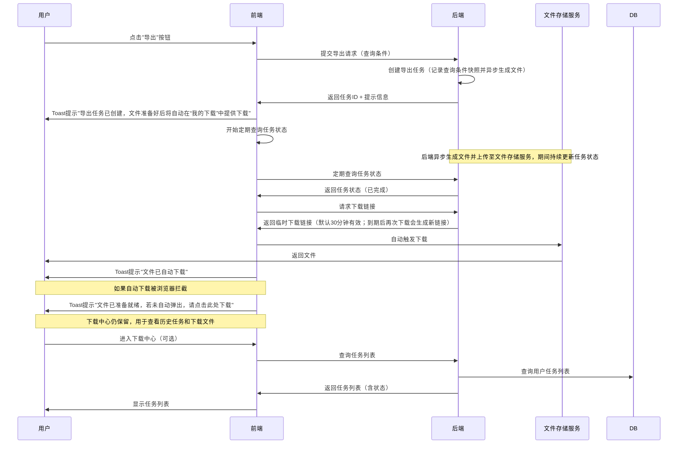
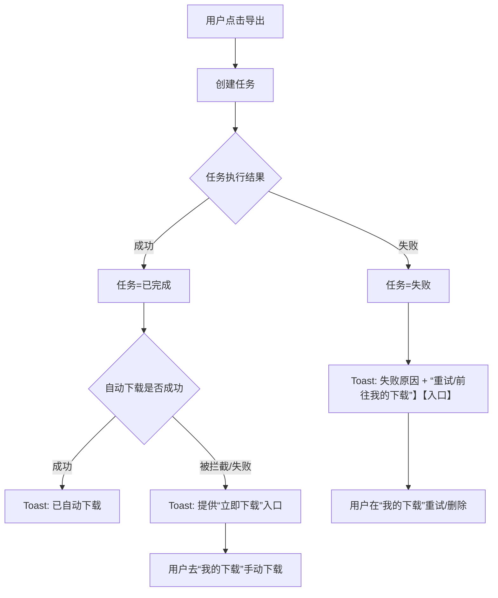

# 11. 其他功能

## 11.1 异步导出功能（下载中心）

> **功能背景**：HTM系统原有导出功能为同步导出，当数据量较大时会导致页面长时间等待、超时等问题。为提升用户体验和系统稳定性，将导出功能改造为异步导出模式，并建立统一的下载中心管理所有导出任务。

---

## 一、完整PRD设计

### 1.1 功能概述

**功能名称**：异步导出功能（下载中心）

**功能描述**：

- 将HTM系统所有导出功能从同步模式改造为异步模式
- 建立统一的下载中心，集中管理所有导出任务和文件
- 支持大数据量导出、多任务并发、任务状态实时更新
- 提供文件下载、任务重试、任务删除等完整功能

**适用范围**：

- **落货纸管理**：落货纸数据导出
- **订舱管理**：订舱数据导出
- **可视化查询**：可视化查询结果导出
- **物流台账**：物流台账数据导出

---

### 1.2 业务流程设计

#### 1.2.1 异步导出完整流程



#### 1.2.2 关键节点说明

| 节点 | 产品说明 |
| :--- | :--- |
| **快照记录** | 点击导出时立即记录用户在界面上勾选的查询条件（JSON格式），生成快照ID；任务执行时基于该条件读取系统最新数据 |
| **任务创建** | 创建导出任务并返回任务ID给前端 |
| **异步处理** | 系统在后台生成导出文件并更新任务状态 |
| **文件存储** | 生成的文件上传至文件存储服务，返回文件存储地址 |
| **状态查询** | 前端定期查询任务状态，检测任务是否完成 |
| **自动下载** | 任务完成时，前端自动获取下载链接并触发文件下载 |
| **浏览器拦截处理** | 如果自动下载被浏览器拦截，通过Toast提示提供手动下载链接 |
| **跨页面状态保持** | 页面刷新或切换后，前端能够继续查询任务状态 |
| **下载权限** | 导出文件仅对任务发起人可下载（多租户隔离），不支持跨用户分享下载 |
| **临时下载链接** | 下载时生成临时下载链接，有效期30分钟；链接过期不影响文件本身，用户再次点击“下载”时系统自动生成新链接（前提：文件仍在保留期内） |

---

### 1.3 业务规则设计

#### 1.3.1 触发阈值规则

**单一阈值（默认）**：

| 维度 | 阈值 | 说明 |
| :--- | :--- | :--- |
| 数据量 | ≤ 1000 行：同步；> 1000 行：异步 | 可配置 |

**同步导出保护**：

- 同步导出需设置超时与最大行数保护（默认1000行），避免长时间阻塞。
- 导出当前页：始终同步。

**配置**：

- 阈值与保护参数支持配置，模块可单独覆盖。

#### 1.3.2 文件命名规范

**命名格式**（使用中文模块名）：

```
{模块名}_{租户代码}_{日期}_{时间戳}_{随机后缀}.xlsx
```

**字段说明**：

| 字段 | 说明 | 示例 |
| :--- | :--- | :--- |
| 模块名 | 中文模块名 | `可视化查询`、`物流台账`、`订舱管理`、`落货纸管理` |
| 租户代码 | 当前用户所属租户代码 | `HGCC`、`MXFCTR` |
| 日期 | YYYYMMDD格式 | `20260205` |
| 时间戳 | HHmmss格式 | `085456` |
| 随机后缀 | 4位随机数字 | `8829` |

**完整示例**：

- `物流台账_HGCC_20260205_085456_8829.xlsx`
- `可视化查询_MXFCTR_20260205_090123_4567.xlsx`
- `落货纸管理_GORFAC_20260205_091234_5678.xlsx`

#### 1.3.3 任务状态流转

**正常流转路径**：

```
排队中 (Queued)  [含待处理/入队等待]
    ↓
处理中 (Processing)  [正在生成文件]
    ↓
已完成 (Completed)  [文件已生成，可下载]
    ↓
已过期 (Expired)  [文件已过期，已删除]
```

**异常路径**：

- 处理中 → 失败 (Failed)  [可重试]
- 排队中/处理中 → 已取消 (Cancelled)  [用户主动取消]

**状态说明（含状态流转）**：

| 状态 | 状态码 | 说明 | 可执行操作 | 典型流转结果 |
| :--- | :--- | :--- | :--- | :--- |
| 排队中 | `QUEUED` | 任务已创建/入队，等待处理 | 取消 | 正常：进入`PROCESSING`；取消：进入`CANCELLED` |
| 处理中 | `PROCESSING` | 正在生成文件 | 取消 | 正常：进入`COMPLETED`；取消：进入`CANCELLED`；异常：进入`FAILED` |
| 已完成 | `COMPLETED` | 文件已生成，可下载 | 下载、删除 | 下载：仍为`COMPLETED`（系统自动判断是否需要生成新链接）；删除：任务记录从列表移除 |
| 失败 | `FAILED` | 导出失败 | 重试、删除 | 重试：重新进入`QUEUED/PROCESSING`；删除：任务记录从列表移除 |
| 已取消 | `CANCELLED` | 用户主动取消 | 删除 | 删除：任务记录从列表移除 |
| 已过期 | `EXPIRED` | 文件已过期，已删除 | 删除 | 删除：任务记录从列表移除 |

> 列表中**所有状态**的任务，均支持通过点击“文件名”打开**任务详情弹窗**，在弹窗中查看导出条件快照、处理日志和错误信息等；列表仅展示简要状态，详细信息不在列表内铺开。

#### 1.3.4 频率限制规则

| 用户角色 | 同时进行中任务数上限 | 每小时任务数上限 | 说明 |
| :--- | :--- | :--- | :--- |
| 所有用户 | 3个 | 可配置（默认20） | 防止资源滥用 |
| 系统任务 | 3个（如需突破走单独白名单） | 可配置 | 系统自动触发任务按同样上限或白名单 |

**"进行中任务"定义**：

"同时进行中任务数上限"中的"进行中"，仅计算状态为 `QUEUED`（排队中）和 `PROCESSING`（处理中）的任务。任务一旦产生终态结果（成功/失败/取消/过期），即不再占用配额。各状态与配额占用关系如下：

| 状态 | 状态码 | 是否占用"进行中"配额 | 说明 |
| :--- | :--- | :--- | :--- |
| 排队中 | `QUEUED` | ✅ 占用 | 任务已入队，等待执行 |
| 处理中 | `PROCESSING` | ✅ 占用 | 任务正在生成文件 |
| 已完成 | `COMPLETED` | ❌ 不占用 | 完成后立即释放配额 |
| 失败 | `FAILED` | ❌ 不占用 | 失败后立即释放配额 |
| 已取消 | `CANCELLED` | ❌ 不占用 | 取消后立即释放配额 |
| 已过期 | `EXPIRED` | ❌ 不占用 | 文件已清理，不计入 |

**限制解除机制**：

- **说明**：当任务达到上限时，用户无法创建新任务。限制解除机制是指：当任务完成、失败或取消后，系统立即释放该任务占用的"同时进行中任务数"配额，用户即可创建新任务，无需等待文件下载完成。
- **释放时机**：
  - 任务完成后立即释放（无需等待用户下载文件）
  - 任务失败后立即释放
  - 任务取消后立即释放

**场景示例**：

> 假设用户已提交 3 个导出任务（2 个排队中 + 1 个处理中），此时 3 个配额已满：
>
> - ❌ 再点"导出"会被拦截，提示："您当前有 3 个任务正在处理中，已达到上限（3个），请等待任务完成后重试。"
> - 其中 1 个任务处理完成（状态变为 `COMPLETED`）→ 立即释放 1 个配额
> - ✅ 用户现在可以再提交 1 个新的导出任务

#### 1.3.5 数据一致性规则

**快照机制**：

- **点击导出时**：系统立即记录用户在界面上勾选的查询条件（JSON格式），生成快照ID
- **快照存储**：仅存储查询条件JSON（如时间段、网点、筛选条件等）
- **后台处理**：执行导出任务时，直接读取系统中的当前最新数据，基于快照中存储的查询条件进行数据筛选，无需进行数据版本回溯
- **快照保留期**：快照记录（查询条件JSON）保留7天（与文件保留期一致），过期后自动删除。保留期内，用户可查看导出时的查询条件；过期后，查询条件记录被清理，但已完成的任务记录仍保留。
- **业务价值**：
  - 既能满足用户对数据实时性的要求（导出的是当前最新数据）
  - 又能确保导出的范围（如时间段、网点）与用户点击时的意愿完全一致

#### 1.3.6 状态展示策略

- 仅展示任务状态（排队中/处理中/已完成/失败/已过期/已取消），使用中文显示。
- 不展示百分比进度条。

#### 1.3.7 存储策略

**文件保留期**：

- **默认保留期**：7天

**自动清理机制**：

- 系统定期自动清理超过保留期的文件，并将对应任务状态更新为“已过期”。
- 清理完成后任务不可继续下载；任务记录可用于列表回溯与追溯。

**存储成本控制（选做）**：

- **成本预警**：当文件存储使用量超过阈值（如100GB）时，系统自动提醒管理员
- **成本统计**：每月生成存储成本报告，供管理员查看

#### 1.3.8 权限校验和安全设计

**临时下载链接机制**：

- **有效期**：默认30分钟（可配置）。**链接过期不影响文件本身**：用户再次点击“下载”，系统会自动判断并生成新的临时下载链接（前提：文件仍在7天保留期内）
- **安全性**：
  - 链接具备防篡改与时效控制能力
  - 仅任务发起人（同租户隔离）可用，不支持跨用户转发分享下载
  - 记录审计留痕（操作人、操作时间、导出条件、文件信息、下载次数等）
- **下载中断处理**：
  - 如果用户网络卡顿，下载到一半时链接过期：
    - 浏览器会提示下载失败
    - 用户可在"我的下载"中再次点击“下载”（系统会自动生成新的临时下载链接）

**审计日志记录**：

- **记录内容**：
  - 操作人（用户ID、用户名）
  - 操作时间
  - 导出条件（查询条件JSON）
  - 文件大小
  - 下载次数（仅用于后台审计统计，不在前端任务详情中展示）
- **保留期**：默认1年

#### 1.3.9 异常场景处理

**展示与承接原则**：

- **优先展示**：Toast（即时提醒） + “我的下载”列表（可回溯与可操作）
- **用户心智**：用户只需要按提示操作（**下载**/**重试**/**前往我的下载**/**联系管理员**），无需理解技术细节（如文件上传、链接刷新等）

**图表展示建议**：本节以“矩阵表”作为 PRD 的图表表达，评审时可直接对齐“前端显示/用户操作/系统动作”。

**展示点位说明**：

| 点位 | 前端怎么显示 | 用户能做什么 |
| :--- | :--- | :--- |
| Toast（即时提醒） | 右上角或页面顶部短提示；必要时带按钮/链接 | 一键“立即下载/前往我的下载/重试” |
| “我的下载”列表（任务中心） | 状态 + 失败原因摘要（如有） + 操作按钮（**下载**/**重试**/**删除**/**取消**） | 回溯所有任务；完成后**下载**；失败后**重试**；异常时**联系管理员** |
| 错误详情（Tooltip等） | 鼠标悬停在失败状态或错误图标时展示完整错误信息 | 了解失败原因，决定是否**重试**/**联系管理员** |

**异常处理矩阵（前端展示 / 用户操作 / 系统动作）**：

| 场景 | “我的下载”列表展示（状态/按钮） | 错误详情展示（Tooltip等） | Toast提示（建议文案） | 用户应该怎么操作 | 系统动作/结果 |
| :--- | :--- | :--- | :--- | :--- | :--- |
| 数据为空 | **成功（空数据）**；可下载/删除 | 标注“空数据”；展示导出条件摘要 | 未搜寻到相关记录，导出文件为空 | 可下载空文件留痕或删除记录 | **必须生成空文件（仅表头）**，便于留痕和追溯 |
| 系统崩溃/服务重启 | **处理中**（自动恢复）或 **失败（超时）**；失败时可重试/删除 | 显示“处理中断/超时”原因与时间线 | 导出任务处理中断，可稍后在“我的下载”查看结果 | 前往“我的下载”等待；若失败点“重试” | 任务自动恢复；超过处理时限（如30分钟）标记失败 |
| 文件生成失败 | **失败**；可重试/删除 | 展示失败原因（可复制）与导出条件摘要 | 导出失败：文件生成失败，请重试 | 点击“重试”；多次失败联系管理员 | 记录失败原因；支持重试重新生成（包含文件生成和存储环节） |
| 自动下载被浏览器拦截 | **成功**；可下载 | 可选显示“可能被浏览器拦截”的提示图标 | 文件已准备就绪，若未自动弹出，请点击此处下载 | 点击 Toast 的“立即下载”或去“我的下载”点下载 | 自动下载失败时提供手动下载兜底入口 |
| 临时下载链接过期 / 下载中断 | **成功**；可下载 | 展示“上次下载失败/中断”（如有）及导出条件摘要 | 下载中断/链接已过期，请在“我的下载”下载 | 点击“下载”（系统自动刷新链接） | 再次下载时系统自动生成新的临时下载链接（文件仍在保留期内） |
| 并发导出冲突（同条件重复提交） | **不创建新任务**；原任务保持处理中/成功 | 可选展示“已存在相同任务”提示 | 已有相同导出任务处理中，请前往“我的下载”查看 | 进入“我的下载”复用已有任务结果 | 拦截重复创建；引导复用已有任务 |
| 存储空间不足 | **失败**；原因“存储空间不足”；可删除 | 展示错误原因，并提示联系管理员 | 系统资源不足，导出失败，请联系管理员 | 删除记录；联系管理员处理资源 | 触发告警；管理员处理后恢复 |

**异常处理流程图（可选，用于评审对齐）**：



---

### 1.4 前端交互设计

#### 1.4.1 导出按钮交互

**触发场景**：用户点击任意页面的"导出"按钮

**交互流程**：

1. **点击导出按钮**
   - 按钮进入loading状态（禁用，显示"导出中..."）
   - 前端立即校验：
     - 查询条件是否为空
     - 数据量预估（调用后端接口获取预估数量）
     - 是否超过同步导出阈值（≤ 1000条：同步；> 1000条：异步）

2. **判断导出模式**
   - **同步导出**（预计导出行数 ≤ 1000条）：
     - 直接调用同步导出接口
     - 浏览器直接下载文件
     - 无需进入下载中心
   - **异步导出**（预计导出行数 > 1000条 或 强制异步）：
     - 调用异步导出接口，创建异步任务
     - Toast提示："导出任务已创建，文件准备好后将自动在“我的下载”中提供下载"
     - 系统在后台持续更新任务状态（用户无感）
     - 任务完成时自动触发下载
     - 如果自动下载被浏览器拦截，Toast显示带手动下载链接的提示
     - "我的下载"托盘（右上角图标）负责管理所有导出任务，用户可随时查看历史任务和下载文件

3. **自动下载机制**
   - **任务状态更新**：
     - 系统在后台自动更新任务状态，直至完成/失败/超时
     - 若长时间未完成，Toast提示用户前往"我的下载"查看结果与后续操作
   - **跨页面状态保持**：
     - 页面刷新或切换后，前端能够继续查询任务状态
     - 确保用户不会因为切换页面而丢失导出任务
   - **浏览器拦截处理**：
     - 如果自动下载被拦截，Toast显示手动下载链接
     - 提供"我的下载"入口，用户可手动下载

4. **"我的下载"托盘**
   - 位置：导航栏右上角，租户下拉框左侧的独立按钮"我的下载"
   - 功能：集中管理所有导出任务，查看任务状态、下载文件、删除任务等
   - 红点提醒（可选）：当有新的导出任务完成时，显示红点提醒，红点显示未下载任务数量（如"3"）

#### 1.4.2 下载中心页面设计

**页面入口**：

- 入口：导航栏右上角的独立按钮“我的下载”（位于租户下拉框左侧，参考原型）

**页面布局**：

```
┌─────────────────────────────────────────────────────────┐
│  下载中心 (Download Center)                              │
├─────────────────────────────────────────────────────────┤
│  [筛选条件]                                              │
│  任务状态: [全部 ▼]  模块: [全部 ▼]  时间: [最近7天 ▼]  │
│  [重置] [查询]                                          │
├─────────────────────────────────────────────────────────┤
│  [任务列表]                                              │
│  ┌───────────────────────────────────────────────────┐  │
│  │ ☑ 文件名             模块      状态    创建时间    │  │
│  ├───────────────────────────────────────────────────┤  │
│  │ ☑ 物流台账_HGCC_...  物流台账  已完成  2026-02-05 08:54:56 │  │
│  │    [下载] [删除]                                    │  │
│  ├───────────────────────────────────────────────────┤  │
│  │ ☑ 可视化查询_MXFCTR_...     可视化查询 处理中  2026-02-05 08:50:12│  │
│  │    [取消]                                         │  │
│  ├───────────────────────────────────────────────────┤  │
│  │ ☑ 订舱管理_GORFAC_...    订舱管理  失败   2026-02-05 08:40:30│  │
│  │    错误: 数据查询超时 [重试] [删除]               │  │
│  └───────────────────────────────────────────────────┘  │
│  [批量操作] [批量删除] [清空已过期]                      │
│  共 15 条，当前页 1/2                                    │
└─────────────────────────────────────────────────────────┘
```

**任务列表字段**：

| 字段名称 | 说明 | 示例 |
| :--- | :--- | :--- |
| 复选框 | 支持批量选择 | ☑ |
| 文件名 | 文件完整名称（可点击查看详情） | `物流台账_HGCC_20260205_085456_8829.xlsx` |
| 模块 | 导出来源模块 | 落货纸管理、订舱管理、可视化查询、物流台账 |
| 状态 | 任务当前状态（带颜色标识，中文显示） | 排队中、处理中、已完成、失败、已取消、已过期 |
| 创建时间 | 任务创建时间（绝对时间） | 2026-02-05 08:54:56 |
| 文件大小 | 文件大小（仅已完成状态显示） | 2.5 MB |
| 操作 | 根据状态显示不同操作按钮 | 查看、下载、重试、删除、取消 |

**状态标识颜色**：

- **已完成**：绿色（#10B981）
- **处理中**：蓝色（#3B82F6）
- **排队中**：灰色（#6B7280）
- **失败**：红色（#EF4444），显示错误原因
- **已过期**：浅灰色（#9CA3AF），不可下载

> 列表中的状态列仅展示简要状态（如“失败”），**不展开完整错误文案**；失败的详细原因通过悬停 Tooltip 等方式查看，避免列表信息过载。

#### 1.4.3 自动下载优化设计

**功能目标**：用户点击"导出"后，文件准备好时自动下载，无需手动进入"我的下载"。

**核心流程**：

1. 用户点击"导出" → 创建异步任务 → 返回任务ID
2. 系统在后台持续更新任务状态（用户无感）
3. 任务状态变为"已完成" → 自动获取临时下载链接 → 自动触发下载
4. Toast提示："文件已自动下载"

**产品设计要点**：

**1. 状态自动更新（用户无感）**

- 任务创建后，系统自动更新任务状态；用户无需反复进入“我的下载”刷新。
- 当同一用户同时导出多个文件时，状态更新与提示会统一管理，避免信息打扰。

**2. 自动下载触发（一次点击闭环）**

- 触发条件：任务状态为“已完成”。
- 系统会自动拉起下载；若未自动弹出，Toast 提供“立即下载/前往我的下载”的兜底入口。

**3. 临时下载链接（时效 + 可重试）**

- 默认有效期30分钟（可配置）；链接过期不影响文件本身。
- 用户再次点击“下载”时，系统会自动判断并生成新的临时下载链接（前提：文件仍在保留期内）。
- 下载仅对任务发起人有效，不支持跨用户转发分享下载。

**4. 跨页面不中断**

- 用户切换页面或刷新后，任务仍在“我的下载”中可追踪与可操作；自动下载也会在任务完成时继续尝试触发。

**5. 失败/超时的承接**

- 失败：Toast 提示失败原因并引导去“我的下载”重试/删除。
- 超时：Toast 提示“稍后在我的下载查看”，避免用户卡在当前页面等待。

#### 1.4.4 Toast提示设计

**Toast定义**：Toast是一种轻量级的消息提示组件，通常显示在页面中间或显眼位置，几秒后自动消失，用于向用户传递操作结果或状态信息。

**Toast在下载中心的作用**：

- **信使角色**：Toast负责向用户传递导出任务的实时状态，用户无需频繁点击"我的下载"查看状态
- **与"我的下载"的分工**：
  - "我的下载"托盘（右上角图标）：负责**"名词"**，即集中管理所有导出任务，查看历史任务、下载文件、删除任务等
  - Toast：负责**"动词"**，即实时通知用户当前导出任务的状态变化（任务创建、下载成功、下载失败等）

**Toast使用场景**：

1. **任务创建时**
   - 触发：用户点击"导出"按钮，创建异步任务成功

- 显示内容："导出任务已创建，文件准备好后将自动在“我的下载”中提供下载"
- 显示时长：3秒
- 位置：页面中间或右上角

1. **文件自动下载成功**
   - 触发：任务完成，文件自动下载成功
   - 显示内容："文件 'xxx.xlsx' 已自动下载，请慢用"
   - 显示时长：3秒
   - 位置：页面中间或右上角

2. **自动下载被浏览器拦截**
   - 触发：任务完成，但自动下载被浏览器拦截
   - 显示内容："文件已准备就绪，由于浏览器设置未自动弹出，请[点击此处下载]"
   - 显示时长：10秒（用户需要时间点击链接）
   - 位置：页面中间或显眼位置
   - **特殊设计**：Toast中包含蓝色可点击链接，点击后直接触发下载

3. **任务失败**
   - 触发：任务处理失败
   - 显示内容："导出失败：错误信息（如：数据查询超时）"
   - 显示时长：5秒
   - 位置：页面中间或右上角
   - **特殊设计**：可提供"重试"按钮（可选）

4. **任务超时**
   - 触发：查询任务状态超过10分钟仍未完成
   - 显示内容："导出任务超时，请前往'我的下载'查看"
   - 显示时长：5秒
   - 位置：页面中间或右上角
   - **特殊设计**：可提供"前往我的下载"链接（可选）

**Toast设计规范**：

- **样式**：轻量级，不遮挡主要内容
  - 背景色：半透明背景（如：rgba(0, 0, 0, 0.8)）
  - 文字颜色：白色或浅色
  - 圆角：4-8px
  - 阴影：轻微阴影，增强层次感
  - 图标：根据状态显示不同图标（成功✓、失败✗、警告⚠、信息ℹ）
- **位置**：页面中间或右上角，显眼但不干扰用户操作
  - 默认位置：页面右上角（距离顶部和右侧各20-30px）
  - 多个Toast时：垂直堆叠，最新Toast在最上方
- **动画效果**：
  - 出现动画：从上方滑入或淡入（0.3秒）
  - 消失动画：淡出或向上滑出（0.3秒）
  - 悬停效果：鼠标悬停时暂停自动消失计时
- **自动消失**：3-10秒后自动消失（根据内容重要性调整）
  - 成功提示：3秒
  - 失败提示：5秒
  - 需要用户操作的提示（如手动下载链接）：10秒
- **手动关闭**：提供关闭按钮（×），用户可手动关闭
  - 关闭按钮位置：Toast右上角
  - 关闭按钮样式：浅色，悬停时高亮
- **多Toast管理**：如果同时有多个Toast，按时间顺序堆叠显示
  - 最多显示3-5个Toast，超出部分自动移除最早的
  - 每个Toast之间间距：10-15px
- **交互行为**：
  - 点击Toast内容区域：不关闭Toast（除非是链接或按钮）
  - 点击链接/按钮：执行对应操作（如下载、重试、前往"我的下载"）
  - 点击关闭按钮：立即关闭Toast
- **移动端适配**：移动端Toast显示在屏幕底部，避免遮挡操作按钮
  - 宽度：屏幕宽度的80-90%
  - 位置：距离底部20-30px

**Toast与"我的下载"的配合**：

- **正常流程**：用户点击导出 → Toast提示任务创建 → 文件准备好后自动下载 → Toast提示下载成功 → 用户无需进入"我的下载"
- **异常流程**：
  - 如果自动下载被拦截 → Toast显示手动下载链接 → 用户点击链接下载
  - 如果用户关闭了Toast → 用户可前往"我的下载"手动下载
  - 如果用户想看历史任务 → 用户可前往"我的下载"查看

---

### 1.5 待确认事项（可选）

#### 1.5.1 需要确认的问题

**1. 下载中心页面布局**

- [ ] **页面结构**：是否采用HTM系统统一的左右布局（左侧导航栏 + 右侧内容区）？
- [ ] **页面标题**：页面顶部是否需要显示面包屑导航？（如：首页 > 下载中心）
- [ ] **筛选区域**：筛选条件区域是否可折叠？（参考现有查询页面的筛选区域设计）
- [ ] **任务列表展示方式**：
  - 方案A：表格形式（推荐，便于批量操作）
  - 方案B：卡片形式（更美观，但批量操作不便）
  - **建议**：采用表格形式，与HTM系统其他列表页保持一致

**2. 任务列表表格设计**

- [ ] **表格列宽**：
  - 文件名列：固定宽度还是自适应？（文件名可能很长）
  - 模块列：建议固定宽度 120px
  - 状态列：建议固定宽度 100px
  - 创建时间列：建议固定宽度 150px
  - 文件大小列：建议固定宽度 100px
  - 操作列：建议固定宽度 150px
- [ ] **文件名显示规则**：
  - 方案A：完整显示，超出部分用省略号（`...`）
  - 方案B：显示前30个字符 + 省略号 + 文件扩展名
  - 方案C：鼠标悬停显示完整文件名（Tooltip）
  - **建议**：方案B + 方案C（悬停显示完整名称）
- [ ] **表格行高**：建议 48px（与HTM系统其他表格保持一致）
- [ ] **表格斑马纹**：是否需要隔行变色？（建议：是，提升可读性）

**3. 状态标识设计**

- [ ] **状态展示方式**：
  - 方案A：仅文字 + 颜色（如：已完成）
  - 方案B：图标 + 文字（如：✓ 已完成）
  - 方案C：徽章（Badge）样式
  - **建议**：方案B（图标 + 文字），提升视觉识别度
- [ ] **状态图标建议**：
  - 已完成：✓（绿色）
  - 处理中：⏳ 或 旋转的加载图标（蓝色）
  - 排队中：⏸（灰色）
  - 失败：✗（红色）
  - 已过期：⏰（浅灰色）
- [ ] **状态颜色确认**：
  - 已完成：绿色（#10B981）✓
  - 处理中：蓝色（#3B82F6）✓
  - 排队中：灰色（#6B7280）✓
  - 失败：红色（#EF4444）✓
  - 已过期：浅灰色（#9CA3AF）✓

**4. 操作按钮设计**

- [ ] **按钮样式**：
  - 方案A：文字链接（如：下载、删除）
  - 方案B：图标按钮（如：下载图标、删除图标）
  - 方案C：图标 + 文字（推荐）
  - **建议**：方案C，提升可识别性
- [ ] **按钮排列**：
  - 方案A：横向排列（下载 | 删除）
  - 方案B：下拉菜单（更多操作 ▼）
  - **建议**：方案A，操作按钮不超过3个时横向排列
- [ ] **按钮颜色**：
  - 下载：蓝色（#2563EB）
  - 重试：蓝色（#2563EB）
  - 删除：红色（#EF4444）
  - 取消：灰色（#6B7280）

**6. 筛选条件设计**

- [ ] **筛选字段布局**：
  - 方案A：单行排列（所有筛选条件在一行）
  - 方案B：多行排列（每行2-3个筛选条件）
  - **建议**：方案B，提升可读性
- [ ] **时间筛选器**：
  - 方案A：下拉选择（最近7天、最近30天、自定义）
  - 方案B：日期选择器（开始日期 + 结束日期）
  - **建议**：方案A（下拉选择），更简洁
- [ ] **筛选条件重置**：
  - 是否需要"一键重置"按钮？（建议：是）
  - 重置后是否自动刷新列表？（建议：是）

**7. 分页设计**

- [ ] **分页位置**：表格底部
- [ ] **分页样式**：与HTM系统其他列表页保持一致
- [ ] **每页条数**：默认20条，支持选择（10/20/50/100）
- [ ] **分页信息**：显示"共 X 条，当前第 Y/Z 页"

**8. 批量操作设计**

- [ ] **全选复选框位置**：表格表头第一列
- [ ] **批量操作按钮位置**：表格上方，筛选条件下方
- [ ] **批量操作按钮样式**：
  - 方案A：按钮组（批量删除 | 清空已过期）
  - 方案B：下拉菜单（批量操作 ▼）
  - **建议**：方案A，操作按钮不超过2个时直接显示
- [ ] **批量操作确认**：
  - 是否需要二次确认弹窗？（建议：是）
  - 弹窗显示选中任务数量（如："确定要删除选中的 3 个任务吗？"）

---

#### 1.5.2 交互细节确认（可选）

##### 需要确认的问题

**1. 导出按钮交互**

- [ ] **点击导出按钮后的反馈**：
  - 按钮立即进入loading状态（禁用，显示"导出中..."）
  - 是否需要显示Toast提示？（建议：是，提示"正在提交导出任务..."）
- [ ] **数据量预估**：
  - 是否需要显示预估数据量？（如："预计导出 1,234 条数据"）
  - 预估数据量的显示位置：按钮下方提示文字？
- [ ] **同步/异步判断提示**：
  - 同步导出（≤ 1000条）：直接下载，无需提示
  - 异步导出（> 1000条）：Toast提示"导出任务已创建，文件准备好后将自动下载"
- [ ] **自动下载功能确认**：
  - 是否启用自动下载功能？（建议：是，作为标准流程）
  - 状态更新：系统自动更新任务状态（用户无感）；若长时间未完成，提示用户前往“我的下载”查看
  - 浏览器拦截兜底：自动下载失败时显示手动下载链接的Toast
  - 跨页面状态保持：页面刷新或切换后是否自动恢复任务状态查询？（建议：是）
- [ ] **"我的下载"托盘确认**：
  - 位置：导航栏右上角，租户下拉框左侧的独立按钮"我的下载"
  - 功能：集中管理所有导出任务，查看历史任务和下载文件
  - 红点提醒（可选）：当有新的导出任务完成时，显示红点提醒

**2. "我的下载"托盘红点提醒**（可选）

- [ ] **红点位置**：导航栏右上角"我的下载"按钮上
- [ ] **红点样式**：
  - 方案A：纯红点（●）
  - 方案B：红点 + 数字（如：3）
  - **建议**：方案B，显示未下载任务数量
- [ ] **红点触发条件**：
  - 任务状态从"处理中"变为"已完成"时显示
  - 用户点击红点进入下载中心后，红点是否立即消失？（建议：是）
- [ ] **红点颜色**：红色（#EF4444）

**3. 任务详情弹窗（交互参考，原型已实现，PRD不作为强制开发项）**

- [ ] **弹窗触发方式**：点击任务列表中的文件名或`详情`列
- [ ] **弹窗尺寸**：建议宽度 600-700px，高度自适应（最大 80vh）
- [ ] **导出条件展示规则**（对应原型中的“导出条件”区块）：
  - 展示用户在发起导出时使用的**关键筛选条件快照**，用于事后还原当时的查询场景
  - 建议采用「标签式 Key-Value」形式，而不是纯 JSON 文本，示例：
    - SO号：`LHZ20250205001`
    - 箱号：`CONT001`、`CONT005`、`CONT006`
    - 国家：`DE`
    - 时间范围：`2026-02-01 ~ 2026-02-05`
  - 支持多值字段（如多个箱号、多个国家）以多个小标签的方式横向展示
  - 当没有额外筛选条件时，可展示占位文案：**“无额外筛选条件（等同于当前列表筛选条件）”**
- [ ] **其他区块**：
  - 基本信息：文件名、模块、创建时间、完成时间、文件大小（下载次数仅用于后台审计日志，不在弹窗中展示）
  - 处理日志：以时间轴形式展示任务生命周期关键节点
  - 错误信息：仅在失败时展示，突出失败原因和重试建议
- [ ] **弹窗关闭方式**：
  - 点击右上角"×"按钮
  - 点击弹窗外部区域（遮罩层）
  - 按ESC键

**4. 任务状态实时更新**

- [ ] **更新方式**：
  - 默认：系统自动刷新任务状态（用户无感），并在关键节点通过 Toast 提示承接
  - 说明：如后续需要更高实时性，可再评估更实时的更新方式（选做）
- [ ] **更新范围**：
  - 仅更新当前页面的任务状态
  - 如果任务在当前页面，自动更新状态
- [ ] **更新动画**：状态变化时是否需要过渡动画？（建议：是，提升用户体验）

**5. 文件下载交互**

- [ ] **下载触发**：点击"下载"按钮
- [ ] **下载前校验**：
  - 是否需要显示"正在获取下载链接..."的loading提示？（建议：是）
  - 如果临时下载链接已过期，是否需要自动刷新？（建议：是）
- [ ] **下载方式**：
  - 方案A：直接下载（浏览器下载）
  - 方案B：新窗口打开（预览）
  - **建议**：方案A，直接下载
- [ ] **下载失败处理**：
  - 如果下载失败，显示错误提示："下载失败，请重试"
  - 提供"重试"按钮

**6. 任务重试交互**

- [ ] **重试触发**：点击"重试"按钮（仅失败任务显示）
- [ ] **重试确认**：
  - 是否需要二次确认？（建议：否，直接重试）
  - 重试后任务状态立即变为"排队中"
- [ ] **重试限制**：
  - 是否需要限制重试次数？（建议：是，最多重试3次）
  - 超过重试次数后，是否隐藏"重试"按钮？（建议：是）

**7. 任务删除交互**

- [ ] **删除触发**：点击"删除"按钮
- [ ] **删除确认**：
  - 是否需要二次确认弹窗？（建议：是）
  - 弹窗内容："确定要删除该任务吗？删除后无法恢复。"
- [ ] **批量删除确认**：
  - 弹窗内容："确定要删除选中的 X 个任务吗？删除后无法恢复。"
- [ ] **删除后反馈**：
  - 显示Toast提示："已删除 X 个任务"
  - 自动刷新任务列表

**8. 空状态设计**

- [ ] **任务列表为空时**：
  - 显示空状态图标（如：📥）
  - 显示提示文字："暂无导出任务"
  - 显示引导文字："点击页面上的"导出"按钮创建导出任务"
- [ ] **筛选无结果时**：
  - 显示空状态图标
  - 显示提示文字："未找到符合条件的任务"
  - 显示"清除筛选条件"按钮

---

#### 1.10.3 边界情况处理确认

#### ❓ 需要确认的问题

**1. 文件名过长**

- [ ] **显示规则**：
  - 方案A：截断显示（前30字符 + ... + 扩展名）
  - 方案B：完整显示，表格列自动换行
  - **建议**：方案A，保持表格整洁
- [ ] **完整文件名查看**：
  - 鼠标悬停显示Tooltip（完整文件名）

**2. 错误信息过长**

- [ ] **显示规则**：
  - 方案A：截断显示（前50字符 + ...），悬停查看完整信息
  - 方案B：完整显示，表格列自动换行
  - **建议**：方案A，保持表格整洁
- [ ] **完整错误信息查看**：
  - 鼠标悬停失败状态/错误图标时，使用Tooltip展示完整错误信息

**3. 文件大小显示**

- [ ] **显示格式**：
  - 方案A：自动转换（B/KB/MB/GB）
  - 方案B：统一显示为MB
  - **建议**：方案A，更直观
- [ ] **显示示例**：
  - < 1KB：显示为 "512 B"
  - < 1MB：显示为 "256 KB"
  - < 1GB：显示为 "2.5 MB"
  - ≥ 1GB：显示为 "1.2 GB"

**4. 时间显示格式**

- [ ] **统一使用绝对时间**：
  - 所有时间类字段（如创建时间、完成时间、过期时间等）在列表和详情中统一显示为绝对时间。
- [ ] **时间格式确认**：
  - 绝对时间格式：YYYY-MM-DD HH:mm:ss（如：2026-02-05 08:54:56）

**5. 任务数量限制提示**

- [ ] **达到任务上限时**：
  - 点击导出按钮，显示提示："您当前有 X 个任务正在处理中，已达到上限（3个），请等待任务完成后重试。"
  - 提示方式：Toast提示 + 弹窗提示（可选）

**6. 文件过期处理**

- [ ] **文件过期后**：
  - 任务状态显示为"已过期"（浅灰色）
  - "下载"按钮禁用或隐藏
  - 鼠标悬停显示提示："文件已过期，无法下载"

---

#### 1.5.3 与现有系统集成确认（可选）

##### 需要确认的问题

**1. 导航栏集成**

- [ ] **"我的下载"入口位置**：
  - 入口1：导航栏右上角，租户下拉框左侧的独立按钮"我的下载"
  - 入口2（可选）：导航栏右上角"我的下载"按钮上的红点 → 点击跳转
- [ ] **"我的下载"按钮红点提醒**（可选）：
  - 是否需要与现有通知中心红点区分？（建议：是，使用不同图标）
  - 红点图标：建议使用“下载”相关图标，而非“通知”图标，避免用户混淆

**2. 导出按钮样式统一**

- [ ] **现有导出按钮样式**：
  - 需要查看HTM系统现有导出按钮的样式
  - 确保新异步导出按钮与现有按钮样式一致
- [ ] **导出按钮位置**：
  - 与现有导出按钮位置保持一致（通常在页面顶部操作栏）

**3. 设计系统统一**

- [ ] **颜色规范**：
  - 使用HTM系统统一的设计系统颜色（参考`TYVISV0.1.html`）
- [ ] **字体规范**：
  - 使用HTM系统统一的字体大小和字重
- [ ] **间距规范**：
  - 使用HTM系统统一的间距规范（如：padding、margin）
- [ ] **组件规范**：
  - 按钮、输入框、下拉菜单等组件样式与现有系统保持一致

**4. 响应式设计**

- [ ] **移动端适配**：
  - 是否需要支持移动端访问？（建议：是，但优先级较低）
  - 移动端布局：筛选条件折叠、任务列表改为卡片形式

---

## 二、总结

### 2.1 核心改进点

1. **多维度阈值判断**：不仅考虑数据量，还考虑字段数量、查询复杂度
2. **快照机制**：仅记录查询条件JSON，执行时读取当前最新数据，既能满足数据实时性要求，又能确保导出范围与用户意愿一致
3. **下载中心入口设计**：明确入口位置（导航栏右上角"我的下载"按钮），提升用户体验
4. **任务状态细化**：统一为 排队中、处理中、已完成、失败、已过期（可保留已取消）
5. **权限校验和安全设计**：多租户隔离、下载权限控制、审计留痕
6. **存储成本控制**：自动清理、成本预警、成本统计
7. **与现有系统集成**：兼容性设计、渐进式迁移策略
8. **自动下载优化**：用户只需点击一次导出，文件准备好后自动下载，极大提升用户体验
   - 状态自动更新：任务创建后自动更新状态（用户无感）
   - 浏览器拦截兜底：自动下载失败时提供手动下载链接
   - 跨页面状态保持：页面刷新/切换后继续查询任务状态
   - 多任务统一管理：多个任务的状态更新与提示统一承接，减少打扰并保护系统压力
9. **Toast提示设计**：轻量级消息提示，实时通知用户导出任务状态变化
10. **"我的下载"托盘**：集中管理所有导出任务，查看历史任务和下载文件

### 2.2 后续优化方向

1. **智能推荐**：根据用户历史导出记录，推荐常用导出条件
2. **导出模板**：支持用户自定义导出字段、格式
3. **定时导出**：支持定时任务，自动导出数据并发送邮件
4. **导出分析**：统计导出使用情况，优化系统性能
5. **更实时的状态更新方式（选做）**：如后续需要更高实时性，可评估更实时的状态更新方式
6. **全局任务通知托盘**：在页面右上角添加任务托盘，类似Chrome下载，让用户随时了解导出状态

---

**文档版本**：v1.1  
**最后更新**：2026-02-06  
**文档作者**：产品团队

**更新日志**：

- v1.1 (2026-02-06)：
  - 融合自动下载优化方案，将自动下载作为标准流程
  - 更新业务流程设计，补充状态自动更新与自动下载流程
  - 新增"自动下载优化设计"章节（2.3.1 D）
  - 更新导出按钮交互，增加自动下载说明
  - 更新待确认事项，增加自动下载相关确认项
  - 统一文件名示例使用中文模块名（如：物流台账、可视化查询、订舱管理、落货纸管理）
