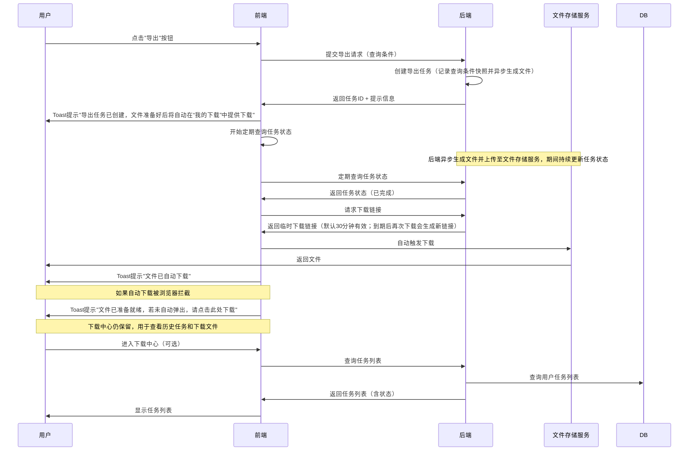
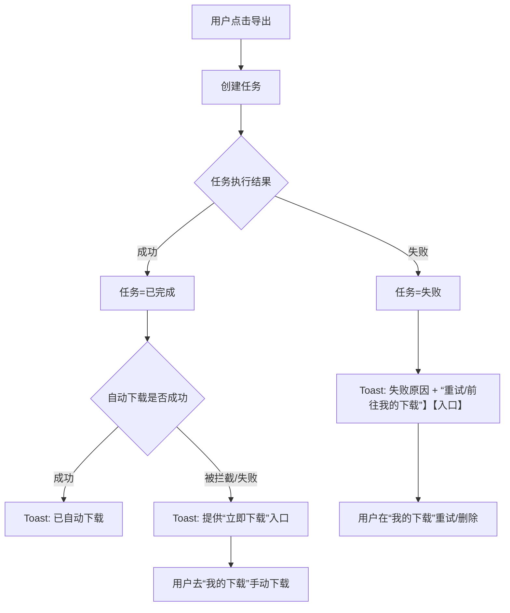

# 11. 其他功能

## 11.1 异步导出功能（下载中心）

> **功能背景**：HTM系统原有导出功能为同步导出，当数据量较大时会导致页面长时间等待、超时等问题。为提升用户体验和系统稳定性，将导出功能改造为异步导出模式，并建立统一的下载中心管理所有导出任务。

---

## 一、完整PRD设计

### 1.1 功能概述

**功能名称**：异步导出功能（下载中心）

**功能描述**：

- 将HTM系统所有导出功能从同步模式改造为异步模式
- 建立统一的下载中心，集中管理所有导出任务和文件
- 支持大数据量导出、多任务并发、任务状态实时更新
- 提供文件下载、任务重试、任务删除等完整功能

**适用范围**：

- **落货纸管理**：落货纸数据导出
- **订舱管理**：订舱数据导出
- **可视化查询**：可视化查询结果导出
- **物流台账**：物流台账数据导出

---

### 1.2 业务流程设计

#### 1.2.1 异步导出完整流程



#### 1.2.2 关键节点说明

| 节点 | 产品说明 |
| :--- | :--- |
| **快照记录** | 点击导出时立即记录用户在界面上勾选的查询条件（JSON格式），生成快照ID；任务执行时基于该条件读取系统最新数据 |
| **任务创建** | 创建导出任务并返回任务ID给前端 |
| **异步处理** | 系统在后台生成导出文件并更新任务状态 |
| **文件存储** | 生成的文件上传至文件存储服务，返回文件存储地址 |
| **状态查询** | 前端定期查询任务状态，检测任务是否完成 |
| **自动下载** | 任务完成时，前端自动获取下载链接并触发文件下载 |
| **浏览器拦截处理** | 如果自动下载被浏览器拦截，通过Toast提示提供手动下载链接 |
| **跨页面状态保持** | 页面刷新或切换后，前端能够继续查询任务状态 |
| **下载权限** | 导出文件仅对任务发起人可下载（多租户隔离），不支持跨用户分享下载 |
| **临时下载链接** | 下载时生成临时下载链接，有效期30分钟；链接过期不影响文件本身，用户再次点击“下载”时系统自动生成新链接（前提：文件仍在保留期内） |

---

### 1.3 业务规则设计

#### 1.3.1 触发阈值规则

**单一阈值（默认）**：

| 维度 | 阈值 | 说明 |
| :--- | :--- | :--- |
| 数据量 | ≤ 1000 行：同步；> 1000 行：异步 | 可配置 |

**同步导出保护**：

- 同步导出需设置超时与最大行数保护（默认1000行），避免长时间阻塞。
- 导出当前页：始终同步。

**配置**：

- 阈值与保护参数支持配置，模块可单独覆盖。

#### 1.3.2 文件命名规范

**命名格式**（使用中文模块名）：

```text
{模块名}_{租户代码}_{日期}_{时间戳}_{随机后缀}.xlsx
```

**字段说明**：

| 字段 | 说明 | 示例 |
| :--- | :--- | :--- |
| 模块名 | 中文模块名 | `可视化查询`、`物流台账`、`订舱管理`、`落货纸管理` |
| 租户代码 | 当前用户所属租户代码 | `HGCC`、`MXFCTR` |
| 日期 | YYYYMMDD格式 | `20260205` |
| 时间戳 | HHmmss格式 | `085456` |
| 随机后缀 | 4位随机数字 | `8829` |

**完整示例**：

- `物流台账_HGCC_20260205_085456_8829.xlsx`
- `可视化查询_MXFCTR_20260205_090123_4567.xlsx`
- `落货纸管理_GORFAC_20260205_091234_5678.xlsx`

#### 1.3.3 任务状态流转

**正常流转路径**：

```text
排队中 (Queued)  [含待处理/入队等待]
    ↓
处理中 (Processing)  [正在生成文件]
    ↓
已完成 (Completed)  [文件已生成，可下载]
    ↓
已过期 (Expired)  [文件已过期，已删除]
```

**异常路径**：

- 处理中 → 失败 (Failed)  [可重试]
- 排队中/处理中 → 已取消 (Cancelled)  [用户主动取消]

**状态说明（含状态流转）**：

| 状态 | 状态码 | 说明 | 可执行操作 | 典型流转结果 |
| :--- | :--- | :--- | :--- | :--- |
| 排队中 | `QUEUED` | 任务已创建/入队，等待处理 | 取消 | 正常：进入`PROCESSING`；取消：进入`CANCELLED` |
| 处理中 | `PROCESSING` | 正在生成文件 | 取消 | 正常：进入`COMPLETED`；取消：进入`CANCELLED`；异常：进入`FAILED` |
| 已完成 | `COMPLETED` | 文件已生成，可下载 | 下载、删除 | 下载：仍为`COMPLETED`（系统自动判断是否需要生成新链接）；删除：任务记录从列表移除 |
| 失败 | `FAILED` | 导出失败 | 重试、删除 | 重试：重新进入`QUEUED/PROCESSING`；删除：任务记录从列表移除 |
| 已取消 | `CANCELLED` | 用户主动取消 | 删除 | 删除：任务记录从列表移除 |
| 已过期 | `EXPIRED` | 文件已过期，已删除 | 删除 | 删除：任务记录从列表移除 |

> 列表中**所有状态**的任务，均支持通过点击“文件名”打开**任务详情弹窗**，在弹窗中查看导出条件快照、处理日志和错误信息等；列表仅展示简要状态，详细信息不在列表内铺开。

#### 1.3.4 频率限制规则

| 用户角色 | 同时进行中任务数上限 | 每小时任务数上限 | 说明 |
| :--- | :--- | :--- | :--- |
| 所有用户 | 3个 | 可配置（默认20） | 防止资源滥用 |
| 系统任务 | 3个（如需突破走单独白名单） | 可配置 | 系统自动触发任务按同样上限或白名单 |

**"进行中任务"定义**：

"同时进行中任务数上限"中的"进行中"，仅计算状态为 `QUEUED`（排队中）和 `PROCESSING`（处理中）的任务。任务一旦产生终态结果（成功/失败/取消/过期），即不再占用配额。各状态与配额占用关系如下：

| 状态 | 状态码 | 是否占用"进行中"配额 | 说明 |
| :--- | :--- | :--- | :--- |
| 排队中 | `QUEUED` | ✅ 占用 | 任务已入队，等待执行 |
| 处理中 | `PROCESSING` | ✅ 占用 | 任务正在生成文件 |
| 已完成 | `COMPLETED` | ❌ 不占用 | 完成后立即释放配额 |
| 失败 | `FAILED` | ❌ 不占用 | 失败后立即释放配额 |
| 已取消 | `CANCELLED` | ❌ 不占用 | 取消后立即释放配额 |
| 已过期 | `EXPIRED` | ❌ 不占用 | 文件已清理，不计入 |

**限制解除机制**：

- **说明**：当任务达到上限时，用户无法创建新任务。限制解除机制是指：当任务完成、失败或取消后，系统立即释放该任务占用的"同时进行中任务数"配额，用户即可创建新任务，无需等待文件下载完成。
- **释放时机**：
  - 任务完成后立即释放（无需等待用户下载文件）
  - 任务失败后立即释放
  - 任务取消后立即释放

**场景示例**：

> 假设用户已提交 3 个导出任务（2 个排队中 + 1 个处理中），此时 3 个配额已满：
>
> - ❌ 再点"导出"会被拦截，提示："您当前有 3 个任务正在处理中，已达到上限（3个），请等待任务完成后重试。"
> - 其中 1 个任务处理完成（状态变为 `COMPLETED`）→ 立即释放 1 个配额
> - ✅ 用户现在可以再提交 1 个新的导出任务

#### 1.3.5 数据一致性规则

**快照机制**：

- **点击导出时**：系统立即记录用户在界面上勾选的查询条件（JSON格式），生成快照ID
- **快照存储**：仅存储查询条件JSON（如时间段、网点、筛选条件等）
- **后台处理**：执行导出任务时，直接读取系统中的当前最新数据，基于快照中存储的查询条件进行数据筛选，无需进行数据版本回溯
- **快照保留期**：查询条件JSON默认**不随文件一起过期删除**，计划长期保留（或按运维策略单独归档/清理）；即便文件超过7天被删除、任务状态变为“已过期”，用户在任务详情中仍可查看当时的导出条件快照。
- **业务价值**：
  - 既能满足用户对数据实时性的要求（导出的是当前最新数据）
  - 又能确保导出的范围（如时间段、网点）与用户点击时的意愿完全一致

#### 1.3.6 状态展示策略

- 仅展示任务状态（排队中/处理中/已完成/失败/已过期/已取消），使用中文显示。
- 不展示百分比进度条。

#### 1.3.7 存储策略

**文件保留期**：

- **默认保留期**：7天

**自动清理机制**：

- 系统定期自动清理超过保留期的文件，并将对应任务状态更新为“已过期”。
- 清理完成后任务不可继续下载；任务记录及其导出条件快照仍保留，可用于列表回溯、查询条件追溯与审计。

**存储成本控制（选做）**：

- **成本预警**：当文件存储使用量超过阈值（如100GB）时，系统自动提醒管理员
- **成本统计**：每月生成存储成本报告，供管理员查看

#### 1.3.8 权限校验和安全设计

**临时下载链接机制**：

- **有效期**：默认30分钟（可配置）。**链接过期不影响文件本身**：用户再次点击“下载”，系统会自动判断并生成新的临时下载链接（前提：文件仍在7天保留期内）
- **安全性**：
  - 链接具备防篡改与时效控制能力
  - 仅任务发起人（同租户隔离）可用，不支持跨用户转发分享下载
  - 记录审计留痕（操作人、操作时间、导出条件、文件信息、下载次数等）
- **下载中断处理**：
  - 如果用户网络卡顿，下载到一半时链接过期：
    - 浏览器会提示下载失败
    - 用户可在"我的下载"中再次点击“下载”（系统会自动生成新的临时下载链接）

**审计日志记录**：

- **记录内容**：
  - 操作人（用户ID、用户名）
  - 操作时间
  - 导出条件（查询条件JSON）
  - 文件大小
  - 下载次数（仅用于后台审计统计，不在前端任务详情中展示）
- **保留期**：默认1年

#### 1.3.9 异常场景处理

**展示与承接原则**：

- **优先展示**：Toast（即时提醒） + “我的下载”列表（可回溯与可操作）
- **用户心智**：用户只需要按提示操作（**下载**/**重试**/**前往我的下载**/**联系管理员**），无需理解技术细节（如文件上传、链接刷新等）

**图表展示建议**：本节以“矩阵表”作为 PRD 的图表表达，评审时可直接对齐“前端显示/用户操作/系统动作”。

**展示点位说明**：

| 点位 | 前端怎么显示 | 用户能做什么 |
| :--- | :--- | :--- |
| Toast（即时提醒） | 右上角或页面顶部短提示；必要时带按钮/链接 | 一键“立即下载/前往我的下载/重试” |
| “我的下载”列表（任务中心） | 状态 + 失败原因摘要（如有） + 操作按钮（**下载**/**重试**/**删除**/**取消**） | 回溯所有任务；完成后**下载**；失败后**重试**；异常时**联系管理员** |
| 错误详情（Tooltip等） | 鼠标悬停在失败状态或错误图标时展示完整错误信息 | 了解失败原因，决定是否**重试**/**联系管理员** |

**异常处理矩阵（前端展示 / 用户操作 / 系统动作）**：

| 场景 | “我的下载”列表展示（状态/按钮） | 错误详情展示（Tooltip等） | Toast提示（建议文案） | 用户应该怎么操作 | 系统动作/结果 |
| :--- | :--- | :--- | :--- | :--- | :--- |
| 数据为空 | **成功（空数据）**；可下载/删除 | 标注“空数据”；展示导出条件摘要 | 未搜寻到相关记录，导出文件为空 | 可下载空文件留痕或删除记录 | **必须生成空文件（仅表头）**，便于留痕和追溯 |
| 系统崩溃/服务重启 | **处理中**（自动恢复）或 **失败（超时）**；失败时可重试/删除 | 显示“处理中断/超时”原因与时间线 | 导出任务处理中断，可稍后在“我的下载”查看结果 | 前往“我的下载”等待；若失败点“重试” | 任务自动恢复；超过处理时限（如30分钟）标记失败 |
| 文件生成失败 | **失败**；可重试/删除 | 展示失败原因（可复制）与导出条件摘要 | 导出失败：文件生成失败，请重试 | 点击“重试”；多次失败联系管理员 | 记录失败原因；支持重试重新生成（包含文件生成和存储环节） |
| 自动下载被浏览器拦截 | **成功**；可下载 | 可选显示“可能被浏览器拦截”的提示图标 | 文件已准备就绪，若未自动弹出，请点击此处下载 | 点击 Toast 的“立即下载”或去“我的下载”点下载 | 自动下载失败时提供手动下载兜底入口 |
| 临时下载链接过期 / 下载中断 | **成功**；可下载 | 展示“上次下载失败/中断”（如有）及导出条件摘要 | 下载中断/链接已过期，请在“我的下载”下载 | 点击“下载”（系统自动刷新链接） | 再次下载时系统自动生成新的临时下载链接（文件仍在保留期内） |
| 并发导出冲突（同条件重复提交） | **不创建新任务**；原任务保持处理中/成功 | 可选展示“已存在相同任务”提示 | 已有相同导出任务处理中，请前往“我的下载”查看 | 进入“我的下载”复用已有任务结果 | 拦截重复创建；引导复用已有任务 |
| 存储空间不足 | **失败**；原因“存储空间不足”；可删除 | 展示错误原因，并提示联系管理员 | 系统资源不足，导出失败，请联系管理员 | 删除记录；联系管理员处理资源 | 触发告警；管理员处理后恢复 |

**异常处理流程图（可选，用于评审对齐）**：



---

### 1.4 前端交互设计

#### 1.4.1 导出按钮交互

**触发场景**：用户点击任意页面的"导出"按钮

**交互流程**：

1. **点击导出按钮**
   - 按钮进入loading状态（禁用，显示"导出中..."）
   - 前端立即校验：
     - 查询条件是否为空
     - 数据量预估（调用后端接口获取预估数量）
     - 是否超过同步导出阈值（≤ 1000条：同步；> 1000条：异步）

2. **判断导出模式**
   - **同步导出**（预计导出行数 ≤ 1000条）：
     - 直接调用同步导出接口
     - 浏览器直接下载文件
     - 无需进入下载中心
   - **异步导出**（预计导出行数 > 1000条 或 强制异步）：
     - 调用异步导出接口，创建异步任务
     - Toast提示："导出任务已创建，文件准备好后将自动在“我的下载”中提供下载"
     - 系统在后台持续更新任务状态（用户无感）
     - 任务完成时自动触发下载
     - 如果自动下载被浏览器拦截，Toast显示带手动下载链接的提示
     - "我的下载"托盘（右上角图标）负责管理所有导出任务，用户可随时查看历史任务和下载文件

3. **自动下载机制**
   - **任务状态更新**：
     - 系统在后台自动更新任务状态，直至完成/失败/超时
     - 若长时间未完成，Toast提示用户前往"我的下载"查看结果与后续操作
   - **跨页面状态保持**：
     - 页面刷新或切换后，前端能够继续查询任务状态
     - 确保用户不会因为切换页面而丢失导出任务
   - **浏览器拦截处理**：
     - 如果自动下载被拦截，Toast显示手动下载链接
     - 提供"我的下载"入口，用户可手动下载

4. **"我的下载"托盘**
   - 位置：导航栏右上角，租户下拉框左侧的独立按钮"我的下载"
   - 功能：集中管理所有导出任务，查看任务状态、下载文件、删除任务等
   - 红点提醒（可选）：当有新的导出任务完成时，显示红点提醒，红点显示未下载任务数量（如"3"）

#### 1.4.2 下载中心页面设计

**页面入口**：

- 入口：导航栏右上角的独立按钮“我的下载”（位于租户下拉框左侧，参考原型）

**页面布局**：

- **页面结构**：采用HTM系统统一布局——左侧导航栏 + 右侧内容区，顶部显示面包屑导航（以实际菜单层级为准），示例：**HTM / 业务操作模块 / 下载中心**（原型截图口径）。
- **筛选区域**：位于任务列表上方，默认展开，支持折叠/展开切换（与现有查询页面保持一致）。
- **筛选条件**：
  - 筛选字段采用多行布局，每行2-3个字段，保证可读性；
  - 时间筛选支持“全部/今天/最近7天/最近30天”等快捷选项；
  - 提供“一键重置”按钮，重置后自动刷新列表。
- **分页配置**：
  - 分页控件位于任务列表底部；
  - 默认每页10条，支持选择10/20/50/100；
  - 展示分页信息，如：“显示第 A 到 B 条，共 N 条，第 X/Y 页”。
- **任务列表样式**：
  - 列表采用表格形式，行高约48px，支持斑马纹样式以提升可读性；
  - 状态列展示中文状态文字，结合颜色与图标增强识别度（如：✓ 已完成、⏳ 处理中等）；状态建议以“胶囊Tag”样式呈现（与原型一致）；
  - 文件名字段采用“前若干字符 + 省略号 + 扩展名”的截断规则，并通过Tooltip展示完整名称；
  - 文件大小统一使用自动单位换算显示（B/KB/MB/GB），示例：`2.5 MB`。
- **操作与批量操作**：
  - 行内操作按钮包括：查看、下载、重试、删除、取消，根据不同状态动态显示；
  - 操作按钮采用“图标 + 文字”样式，颜色规范：下载/重试为蓝色、删除为红色、取消为灰色；
  - 表头第一列为全选复选框，表格上方提供批量删除、清空已过期等批量操作按钮；
  - 删除类操作均通过二次确认弹窗承接（包含选中任务数量），删除后自动刷新列表并通过Toast提示。
- **列表区工具条**（与原型一致）：
  - 列表区域左上角显示：**列表(N)**，其中N为当前筛选条件下的任务总数（示例：列表(5)）。
  - 列表区域右上角提供：**清空已过期**按钮（用于批量清理已过期任务/文件记录，清理后刷新列表并Toast提示）。

```text
┌─────────────────────────────────────────────────────────┐
│  下载中心 (Download Center)                              │
├─────────────────────────────────────────────────────────┤
│  [筛选条件]                                              │
│  任务状态: [全部 ▼]  模块: [全部 ▼]  时间: [最近7天 ▼]  │
│  [重置] [查询]                                          │
├─────────────────────────────────────────────────────────┤
│  [任务列表]                                              │
│  ┌───────────────────────────────────────────────────┐  │
│  │ ☑ 文件名             模块      状态    创建时间    │  │
│  ├───────────────────────────────────────────────────┤  │
│  │ ☑ 物流台账_HGCC_...  物流台账  已完成  2026-02-05 08:54:56 │  │
│  │    [下载] [删除]                                    │  │
│  ├───────────────────────────────────────────────────┤  │
│  │ ☑ 可视化查询_MXFCTR_...     可视化查询 处理中  2026-02-05 08:50:12│  │
│  │    [取消]                                         │  │
│  ├───────────────────────────────────────────────────┤  │
│  │ ☑ 订舱管理_GORFAC_...    订舱管理  失败   2026-02-05 08:40:30│  │
│  │    错误: 数据查询超时 [重试] [删除]               │  │
│  └───────────────────────────────────────────────────┘  │
│  [批量操作] [批量删除] [清空已过期]                      │
│  共 15 条，当前页 1/2                                    │
└─────────────────────────────────────────────────────────┘
```

**任务列表字段**：

| 字段名称 | 说明 | 示例 |
| :--- | :--- | :--- |
| 复选框 | 支持批量选择 | ☑ |
| 文件名 | 文件完整名称（可点击查看详情） | `物流台账_HGCC_20260205_085456_8829.xlsx` |
| 模块 | 导出来源模块 | 落货纸管理、订舱管理、可视化查询、物流台账 |
| 状态 | 任务当前状态（带颜色标识，中文显示） | 排队中、处理中、已完成、失败、已取消、已过期 |
| 创建时间 | 任务创建时间（绝对时间） | 2026-02-05 08:54:56 |
| 文件大小 | 文件大小（仅已完成状态显示） | 2.5 MB |
| 操作 | 根据状态显示不同操作按钮 | 查看、下载、重试、删除、取消 |

**状态标识颜色**：

- **已完成**：绿色（#10B981）
- **处理中**：蓝色（#3B82F6）
- **排队中**：灰色（#6B7280）
- **失败**：红色（#EF4444），显示错误原因
- **已过期**：浅灰色（#9CA3AF），不可下载

> 列表中的状态列仅展示简要状态（如“失败”），**不展开完整错误文案**；失败的详细原因通过悬停 Tooltip 等方式查看，避免列表信息过载。

##### 任务详情弹窗（版式规范）

**触发入口**：

- 点击任务列表中的**文件名**，或点击操作列的**查看**按钮，打开“任务详情”弹窗。

**弹窗结构**（与原型一致）：

- **弹窗标题区**：标题“任务详情” + 右上角“×”关闭按钮。
- **内容区**（按区块纵向排列）：
  - **基本信息**（两列排版，字段为中文标签）：
    - 文件名（含完整文件名，必要时可换行）
    - 模块
    - 创建时间（绝对时间，格式`YYYY-MM-DD HH:mm:ss`）
    - 完成时间（未完成显示`-`）
    - 文件大小（无值显示`-`；有值按B/KB/MB/GB自动换算显示）
    - 说明：**不展示下载次数**（仅用于后台审计统计）。
  - **导出条件**（可折叠区块，默认折叠）：
    - 展示“点击导出时”的查询条件快照，但**前端以业务语义展示**（中文标签+值），避免直接暴露JSON字符。
    - 展示规则建议：
      - 多选值使用`、`连接（如：出口国家：美国、德国）
      - 日期范围以`开始 ~ 结束`展示（如：ETD：2026-03-01~2026-03-30）
    - 示例（可视化查询导出）：
      - 订舱号：BK001
      - 出口国家：美国、德国
      - ETD：2026-03-01~2026-03-30
    - 右侧提供“展开/折叠”切换入口，折叠后仅保留区块标题。
  - **处理日志**（可折叠区块，默认展开）：
    - 按时间顺序展示关键节点日志（如：任务已创建/已入队/开始处理/处理完成/失败原因等）。
    - 右侧提供“展开/折叠”切换入口。
  - **错误信息**（条件展示）：
    - 仅当任务状态为失败时展示，突出失败原因，支持复制。
- **底部操作区**：
  - 主按钮“关闭”（与右上角“×”等价）。

**关闭方式**：

- 点击右上角“×”
- 点击底部“关闭”
- 按ESC键（可选）

#### 1.4.3 自动下载优化设计

**功能目标**：用户点击"导出"后，文件准备好时自动下载，无需手动进入"我的下载"。

**核心流程**：

1. 用户点击"导出" → 创建异步任务 → 返回任务ID
2. 系统在后台持续更新任务状态（用户无感）
3. 任务状态变为"已完成" → 自动获取临时下载链接 → 自动触发下载
4. Toast提示："文件已自动下载"

**产品设计要点**：

##### 1)状态自动更新（用户无感）

- 任务创建后，系统自动更新任务状态；用户无需反复进入“我的下载”刷新。
- 当同一用户同时导出多个文件时，状态更新与提示会统一管理，避免信息打扰。

##### 2)自动下载触发（一次点击闭环）

- 触发条件：任务状态为“已完成”。
- 系统会自动拉起下载；若未自动弹出，Toast 提供“立即下载/前往我的下载”的兜底入口。

##### 3)临时下载链接（时效+可重试）

- 默认有效期30分钟（可配置）；链接过期不影响文件本身。
- 用户再次点击“下载”时，系统会自动判断并生成新的临时下载链接（前提：文件仍在保留期内）。
- 下载仅对任务发起人有效，不支持跨用户转发分享下载。

##### 4)跨页面不中断

- 用户切换页面或刷新后，任务仍在“我的下载”中可追踪与可操作；自动下载也会在任务完成时继续尝试触发。

##### 5)失败/超时的承接

- 失败：Toast 提示失败原因并引导去“我的下载”重试/删除。
- 超时：Toast 提示“稍后在我的下载查看”，避免用户卡在当前页面等待。

#### 1.4.4 Toast提示设计（精简版）

- **通用规则**：Toast样式与交互动效沿用HTM系统统一Toast规范，本节只补充下载中心需要的关键场景。
- **必须弹Toast的场景**：
  - 创建异步导出任务成功（提示“任务已创建，可在我的下载中查看/自动下载”）。
  - 自动下载成功或被浏览器拦截（成功时简短祝语，被拦截时给出“点击此处下载”链接或引导去“我的下载”）。
  - 任务失败或超时（提示失败/超时原因，引导去“我的下载”查看详情或重试）。
- **与"我的下载"托盘的关系**：
  - “我的下载”托盘负责承接和管理所有任务（列表与操作）。
  - Toast只负责及时告知状态变化，不承载复杂操作逻辑。

#### 1.4.5 与现有系统集成与设计一致性

- **导航栏集成**：
  - “我的下载”入口位于导航栏右上角，租户下拉框左侧，作为独立按钮呈现（与原型一致）。
  - 若使用红点提醒，建议与现有通知中心做区分：优先使用“下载”相关图标/样式，避免用户混淆。
- **导出按钮样式统一**：
  - 异步导出沿用HTM系统现有主按钮/操作栏样式与位置（通常在页面顶部操作栏）。
- **设计系统统一**：
  - 颜色、字体、间距、基础组件（按钮/输入框/下拉等）均与HTM现有设计系统保持一致。
- **响应式设计**（低优先级）：
  - 如需支持移动端：筛选条件默认折叠；任务列表可改为卡片形式以适配窄屏。

#### 1.4.6 下载中心样式总表（仅样式）

> 本小节**只列样式与视觉口径**，不再重复交互/流程逻辑，方便设计与前端统一实现。

##### 1）页面整体

- **布局**：左侧导航栏 + 右侧内容区，固定宽度内容区域，背景为浅灰或白色，符合HTM主布局。
- **面包屑**：顶部展示完整路径，示例：`HTM / 业务操作模块 / 下载中心`，当前页面名加粗。
- **页面标题**：左上角大标题`下载中心`，下方一行灰色说明文案（如“管理您导出的任务和下载文件”），字号略小于标题。

##### 2）筛选区域样式

- **位置与背景**：位于页面标题下方，白色卡片区域，左右留白与内容区对齐。
- **字段排布**：多行栅格布局，每行2-3个字段，标签左对齐，输入框宽度统一。
- **按钮样式**：`重置`为次按钮（描边/灰色），`查询`为主按钮（品牌色实心），高度与输入框一致。
- **时间范围**：提供“全部/今天/最近7天/最近30天”等快捷tag，选中态用品牌色高亮。

##### 3）列表区与表格样式

- **列表工具条**：表格上方左侧显示`列表(N)`，使用正文字号，N为任务总数；右侧为`清空已过期`按钮（次按钮样式，右对齐）。
- **表头**：
  - 第一列为复选框列，表头为“文件名”左侧的全选框。
  - 其他列：`文件名`、`模块`、`状态`、`创建时间`、`文件大小`、`操作`，表头字体加粗，背景浅灰。
- **表格行**：
  - 行高约48px，支持斑马纹（奇偶行背景略有区分）。
  - 悬浮高亮：鼠标悬停整行背景略微变浅，方便识别当前行。
- **文件名列**：
  - 文本对齐左侧，超长采用“前若干字符+省略号+扩展名”规则；悬停显示完整Tooltip。
  - 图标：文件名前带Excel/通用文件图标，颜色与图标库统一。
- **模块列**：左对齐纯文本，保持与业务模块命名一致。
- **状态列**：
  - 使用“胶囊Tag”样式：圆角矩形，内含图标+中文状态文案。
  - 颜色规范：已完成（绿色）、处理中（蓝色）、排队中（灰色）、失败（红色）、已过期（浅灰）、已取消（灰色描边）。
  - 图标示例：已完成✓、处理中⏳、失败✗、已过期时钟或过期图标。
- **创建时间/文件大小**：
  - 文本右对齐或居中对齐；时间格式`YYYY-MM-DD HH:mm:ss`；文件大小自动单位换算。

##### 4）操作列样式

- **操作按钮排列**：同一行内水平排列，间距一致，优先级从左到右依次为：`查看`、`下载`、`重试`、`删除`、`取消`（按状态动态裁剪）。
- **按钮形态**：图标+文字链接样式（无实体按钮底色），鼠标悬停变为品牌色，带下划线或颜色高亮。
- **颜色建议**：
  - 查看/下载/重试：品牌蓝色；
  - 删除：红色警示；
  - 取消：灰色。
- **禁用态**：不允许的操作（例如已过期不允许下载）不展示按钮，避免灰色禁用干扰视觉。

##### 5）任务详情弹窗样式

- **弹窗尺寸**：宽度约为页面宽度的50-60%，垂直方向自适应内容，高度超出时内部滚动。
- **标题区**：顶部标题`任务详情`，左对齐；右上角标准`×`关闭图标，悬停高亮。
- **内容区排版**：
  - “基本信息”使用两列表单布局，字段标签右对齐、值左对齐；
  - “导出条件”和“处理日志”使用灰底或描边卡片，支持折叠/展开，标题行右侧放“折叠/展开”文字按钮；
  - “导出条件”内容区建议使用浅灰背景/描边卡片，按“字段名（加粗）+值”逐行展示，便于扫读与区分。
- **底部按钮区**：右下角放置主按钮`关闭`，居右对齐。

##### 6）Toast与红点样式（下载中心相关）

- **Toast**：右上角堆叠显示，半透明深色背景、白字、圆角4-8px，含状态图标和简短文案。
- **“我的下载”红点**：入口图标右上角展示数字红点，颜色使用系统统一红色，数字为未下载任务数量。

> 若后续UI设计稿有局部调整，以最新设计稿为准；本章节主要提供样式级统一口径。

---

## 二、总结

### 2.1 核心改进点

1. **多维度阈值判断**：不仅考虑数据量，还考虑字段数量、查询复杂度
2. **快照机制**：仅记录查询条件JSON，执行时读取当前最新数据，既能满足数据实时性要求，又能确保导出范围与用户意愿一致
3. **下载中心入口设计**：明确入口位置（导航栏右上角"我的下载"按钮），提升用户体验
4. **任务状态细化**：统一为 排队中、处理中、已完成、失败、已过期（可保留已取消）
5. **权限校验和安全设计**：多租户隔离、下载权限控制、审计留痕
6. **存储成本控制**：自动清理、成本预警、成本统计
7. **与现有系统集成**：兼容性设计、渐进式迁移策略
8. **自动下载优化**：用户只需点击一次导出，文件准备好后自动下载，极大提升用户体验
   - 状态自动更新：任务创建后自动更新状态（用户无感）
   - 浏览器拦截兜底：自动下载失败时提供手动下载链接
   - 跨页面状态保持：页面刷新/切换后继续查询任务状态
   - 多任务统一管理：多个任务的状态更新与提示统一承接，减少打扰并保护系统压力
9. **Toast提示设计**：轻量级消息提示，实时通知用户导出任务状态变化
10. **"我的下载"托盘**：集中管理所有导出任务，查看历史任务和下载文件

### 2.2 后续优化方向

1. **智能推荐**：根据用户历史导出记录，推荐常用导出条件
2. **导出模板**：支持用户自定义导出字段、格式
3. **定时导出**：支持定时任务，自动导出数据并发送邮件
4. **导出分析**：统计导出使用情况，优化系统性能
5. **更实时的状态更新方式（选做）**：如后续需要更高实时性，可评估更实时的状态更新方式
6. **全局任务通知托盘**：在页面右上角添加任务托盘，类似Chrome下载，让用户随时了解导出状态

---

**文档版本**：v1.1  
**最后更新**：2026-02-06  
**文档作者**：产品团队

**更新日志**：

- v1.1 (2026-02-06)：
  - 融合自动下载优化方案，将自动下载作为标准流程
  - 更新业务流程设计，补充状态自动更新与自动下载流程
  - 新增"自动下载优化设计"章节（2.3.1 D）
  - 更新导出按钮交互，增加自动下载说明
  - 更新待确认事项，增加自动下载相关确认项
  - 统一文件名示例使用中文模块名（如：物流台账、可视化查询、订舱管理、落货纸管理）
